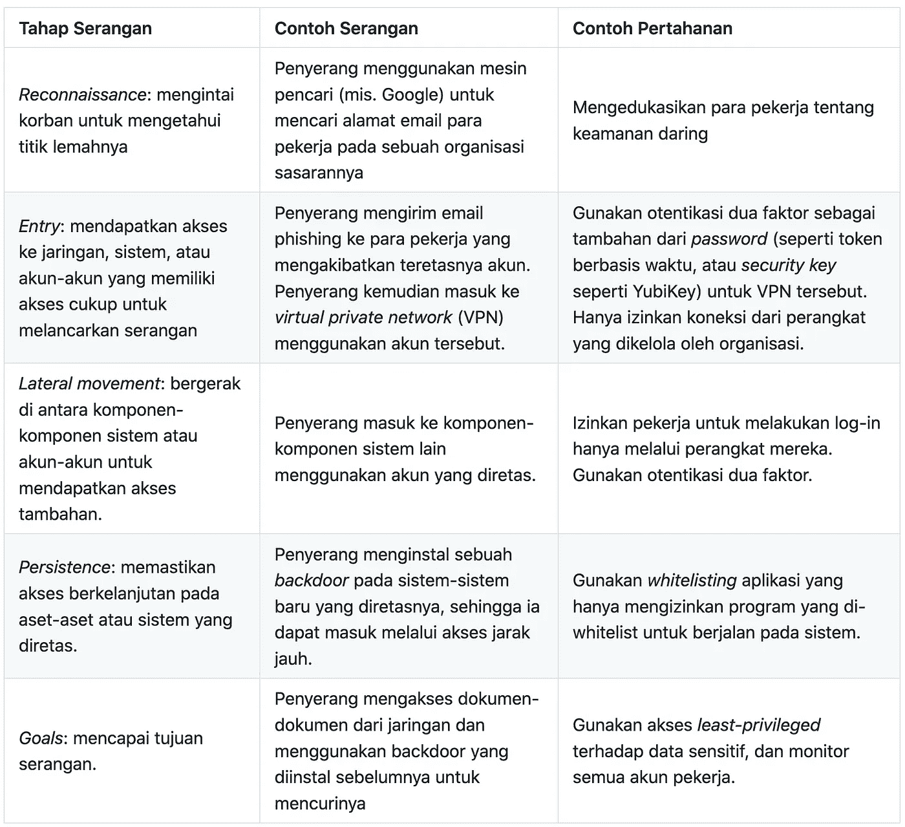

# Mengenal Lawan-Lawan dalam Membangun Sistem yang Aman dan Andal — Bagian 2

> 原文：<https://medium.easyread.co/mengenal-lawan-lawan-dalam-membangun-sistem-yang-aman-dan-andal-bagian-2-edf29bb74de0?source=collection_archive---------1----------------------->

## Building Secure and Reliable Systems Series — Part 2.2

Pada [bagian pertama](https://medium.com/easyread/mengenal-lawan-lawan-dalam-membangun-sistem-yang-aman-dan-andal-bagian-1-8d6fb8bb22b3) , kita telah membahas tentang lawan-lawan yang dihadapi oleh sistem yang aman dan andal yaitu motif-motif pelaku dan profil-profil pelaku. Pada bagian kedua ini, kita akan membahas *metode-metode yang digunakan oleh para pelaku* untuk menyerang sistem. Bagaimanakah para pelaku pada bagian pertama menjalankan aksinya? Mari kita pelajari bersama!

# Building Secure and Reliable Systems — Series List

[**1\. Pentingnya Membangun Sistem yang Aman dan Andal**](https://medium.com/easyread/pentingnya-membangun-sistem-yang-aman-dan-andal-a15f7a3f94eb)[**2.1\. Mengenal Lawan-Lawan dalam Membangun Sistem yang Aman dan Andal — Bagian 1**](https://medium.com/easyread/mengenal-lawan-lawan-dalam-membangun-sistem-yang-aman-dan-andal-bagian-1-8d6fb8bb22b3) **2.2\. Mengenal Lawan-Lawan dalam Membangun Sistem yang Aman dan Andal — Bagian 2 — You’re here** [**3\. Meningkatkan Keamanan dengan Proksi, Sebuah Studi Kasus di Google**](https://medium.com/easyread/meningkatkan-keamanan-dengan-proksi-sebuah-studi-kasus-di-google-ddfc5e24fd6a)[**4\. Mempertimbangkan Aspek Keamanan dan Keandalan Sedari Awal**](https://medium.com/easyread/mempertimbangkan-aspek-keamanan-dan-keandalan-sedari-awal-68465a8814da)

# Metode-Metode Pelaku

Jawaban pertanyaan di atas sangat penting sekali untuk mengetahui bagaimana seseorang dapat menyerang sistem, dan tentu saja cara mengamankan sistem. Mengetahui bagaimana para penyerang melancarkan aksi mereka bisa jadi sangat kompleks.
Kita tidak mungkin memprediksi apa yang dilakukan seorang penyerang setiap waktu, karena ada banyak sekali metode serangan (dan kombinasinya) terhadap sistem; kita bahkan tidak mungkin menyebutkan semua serangan yang mungkin terjadi!
Untungnya, ada beberapa framework yang dapat kita gunakan untuk dengan lebih mudah mempelajari metode-metode para pelaku. Pada bagian kedua ini, kita akan membahas beberapa framework tersebut: **Threat Intelligence, Cyber Kill Chains, dan TTP** .

## Threat Intelligence

Banyak perusahaan yang bergerak di bidang keamanan menyediakan database berisi deskripsi serangan-serangan yang sudah pernah terjadi, baik di lingkungan production maupun lingkungan eksperimen. *Threat Intelligence* ini dapat membantu kita mengetahui bagaimana penyerang beroperasi dan bagaimana memperkuat sistem kita terhadap serangan tersebut. Ada beberapa bentuk threat intelligence:

*   ***Laporan tertulis*** , yang mendeskripsikan bagaimana serangan terjadi dan berguna untuk mempelajari progresi dan maksud serangan.
*   ***Indicator of compromise (IoC)*** , biasanya berupa informasi ciri-ciri khusus pada sebuah serangan, seperti IP address penyerang, situs web phishing, atau checksum SHA256 dari berkas program yang berbahaya.
*   ***Malware Reports*** , yang memberikan informasi mengenai kemampuan dari peralatan-peralatan yang digunakan penyerang. Biasanya laporan ini dibuat secara otomatis oleh para ahli di bidang *reverse engineering* , misalnya menggunakan rogram seperti IDA Pro atau Ghidra.

Mengetahui jenis-jenis serangan spesifik terhadap organisasi-organisasi yang serupa dengan organisasi kita dapat memberikan peringatan dini atas apa yang mungkin kita hadapi di masa depan, dan tentunya membantu kita merancang sistem yang tahan terhadap mereka.

[Cyber Kill Chain](https://www.lockheedmartin.com/en-us/capabilities/cyber/cyber-kill-chain.html) diadopsi oleh Lockheed Martin dari konsep militer “kill chain”

## Cyber Kill Chains

Framework seperti Cyber Kill Chains memetakan semua langkah yang mungkin digunakan oleh seorang penyerang untuk mencapai tujuannya. Framework ini membantu menggambarkan progresi sebuah serangan bersama dengan langkah pertahanan yang dapat diambil. Berikut contoh sederhananya:

Contoh Framework Cyber Kill Chain

## Taktik, Teknik, dan Prosedur (TTP)

Mengategorikan penyerang dengan TTP adalah cara yang semakin sering digunakan untuk mengategorikan metode serangan. Baru-baru ini MITRE merilis [framework ATT & CK](https://attack.mitre.org/) yang menggunakan prinsip TTP ini.
Singkatnya, framework ini mendetail setiap tahap pada Cyber Kill Chains dan memberikan deskripsi masing-masing bagaimana cara penyerang melancarkan aksinya pada setiap tahap.
Misalnya: pada tahap *entry* , ATT & CK mendeskripsikan bagaimana berkas `.bash_history` seseorang bisa saja berisi password yang secara tidak sengaja atau dengan lalai diketik pada terminal, sehingga penyerang dapat dengan mudah mendapatkan password tersebut dengan hanca membaca berkas tersebut!

# Pertimbangan saat Risk Assessment

*Peninjauan resiko* atau *risk assessment* merupakan langkah awal yang penting untuk mengetahui resiko-resiko yang dihadapi oleh organisasimu, dan kemudian mengambil langkah yang tepat terhadap hasilnya.
Pada saat mempelajari pelaku yang mungkin menyerang, pertimbangan-pertimbangan berikut penting pada saat melakukan peninjauan resiko yang dibawa oleh berbagai jenis penyerang:

*   ***Kamu mungkin tidak sadar bahwa kamu adalah sasaran penyerangan*** Mungkin tidak kentara langsung terlihat bahwa organisasimu adalah sasaran yang potensial. Pikirkanlah apakah organisasimu memiliki aset-aset yang dapat menarik perhatian penyerang, baik secara langsung, atau secara tidak langsung sebagai bagian dari serangan lain yang lebih besar terhadap sasaran lain.
*   ***Kecanggihan serangan bukanlah penentu kesuksesan serangan*** Ingatlah bahwa penyerang cenderung untuk memilih serangan yang paling sederhana dan paling efektif secara biaya untuk mencapai tujuannya. Jangan berasumsi bahwa penyerang akan selalu memilih cara yang paling rumit untuk melancarkan serangan. Selalu pastikan untuk mengimplementasikan pertahanan terhadap serangan paling sederhana sekalipun (misalnya menggunakan otentikasi dua faktor) sebelum mengkhawatirkan serangan yang canggih (misalnya program backdoor).
*   ***Jangan remehkan penyerang*** Jangan berasumsi bahwa seorang pelaku tidak dapat memperoleh sumber daya yang cukup untuk melancarkan serangan yang sulit atau mahal. Pertimbangkanlah seberapa banyak biaya yang bersedia dikeluarkan oleh pelaku.
*   ***Mengidentifikasikan penyerang itu sulit***Para penyerang yang memiliki motivasi dan biaya yang cukup dapat menyembunyikan identitas mereka melalui cara-cara yang kreatif. Para periset mereka menemukan malware baru yang dinamai [NotPetya](https://www.wired.com/story/notpetya-cyberattack-ukraine-russia-code-crashed-the-world/) , yang menyebar dengan cepat ke seluruh dunia dan paling banyak ditemukan di Ukraina. Untuk menyebarkan NotPetya, para penyerang meretas sebuah perusahaan yang membuat produk secara khusus untuk dijual di Ukraina dan menggunakan mekanisme perilisan software mereka untuk menginfeksi para korban.
    Para periset percaya bahwa serangan ini dilancarkan oleh penyerang yang dibiayai oleh Rusia untuk menyerang Ukraina, namun hal tersebut sulit untuk dibuktikan.
    Karena identitas dan maksud pelaku belum tentu mudah dimengerti, **sebaiknya kamu berfokus pada *bagaimana* cara penyerang bekerja** (melalui TTP mereka), daripada lebih banyak mengkhawatirkan *siapa* mereka.
*   ***Para penyerang belum tentu takut tertangka* p**
    Bahkan bila kamu dapat melacak identitas dan lokasi penyerang, belum tentu sistem hukumnya mempermudah pendakwaan dan penangkapan (apalagi hukum internasional). Lebih lagi jika ada penyerang yang bekerja secara langsung dengan pemerintah suatu negara yang belum tentu mau bekerjasama untuk mengekstradisi penyerang.

**Semua serangan keamanan pasti ujung-ujungnya berasal dari seorang yang memiliki motif** . Periksalah kira-kira siapa yang mungkin dapat menyerangmu. Apa kira-kira yang dimiliki oleh organisasimu yang dapat menarik perhatian penyerang? Pelajarilah **bagaimana cara-cara penyerang dapat menyerang organisasimu** , dan **pertimbangkanlah pertahanan yang dapat digunakan pada saat merancang sistem** berdasarkan pembelajaran itu. Selain itu, jangan kesampingkan orang dalam. Orang dalam dapat mengakibatkan insiden keamanan dengan maksud jahat, maupun keandalan dengan tidak sengaja.

Stay secure and reliable!