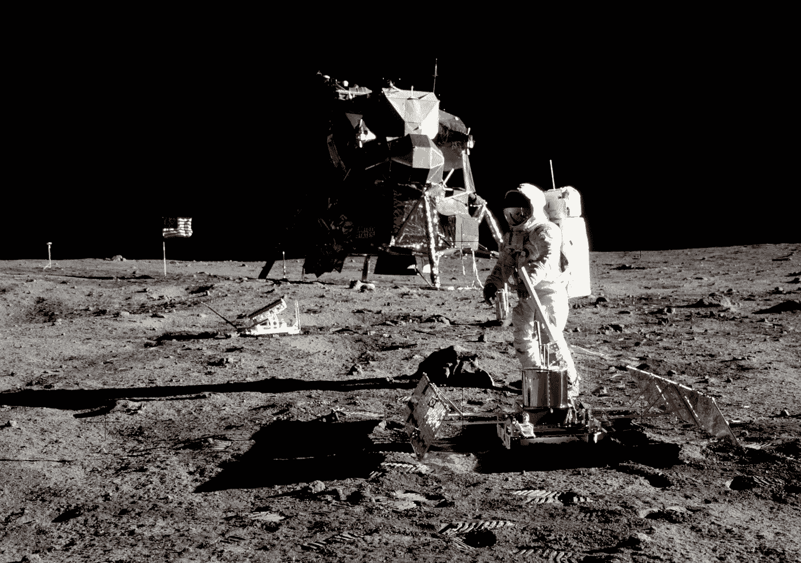
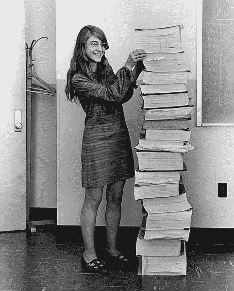
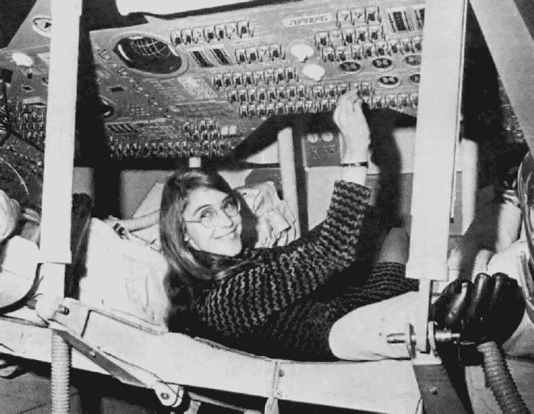

# Mengenal Margaret Hamilton

> 原文：<https://medium.easyread.co/mengenal-margaret-hamilton-bb3157703516?source=collection_archive---------0----------------------->

## Programmer wanita pertama di dunia yang membantu manusia mendarat di Bulan

Pendaratan manusia di bulan pada tahun 1969 di bawah armada *Neil Amstrong* dan tim merupakan peristiwa yang sangat bersejarah. Ditonton oleh sekitar 500 juta penduduk dunia, *Neil Amstrong* dan tim berhasil mendarat di bulan untuk pertama kalinya dengan selamat.

First landed on Moon from Google Image Search

Namun tidak banyak orang yang mengetahui siapa saja orang-orang yang terlibat dalam peristiwa bersejarah tersebut. Salah satu orang yang berperan penting dalam peristiwa itu adalah ***Margaret Hamilton*** , *programmer* wanita pertama yang dapat dikatakan spesial. Mengapa demikian?

Hamilton from Google Image

***Hamilton*** lahir pada tanggal 17 Agustus 1936 di [Paoli Indiana](https://en.wikipedia.org/wiki/Paoli,_Indiana) , Amerika Serikat. Beliau merupakan lulusan [Universitas Michigan](https://en.wikipedia.org/wiki/University_of_Michigan) jurusan Matematika pada tahun 1955\. Pada usia yang ke-24 beliau mendapatkan pekerjaan sebagai *programmer* di [MIT](https://en.wikipedia.org/wiki/Massachusetts_Institute_of_Technology) . Pada saat itu ilmu mengenai *programming* dan *computer science* masih terbilang tabu dan belum terlalu dikenal publik. ***Hamilton*** sendiri belajar mengenai pemograman dan *koding* secara [otodidak](https://id.wikipedia.org/wiki/Otodidak) dan tanpa panduan dari siapapun. Bahkan pada masa tersebut *Microsoft* dan bahasa pemograman *C* masih belum lahir.

Pada tahun 1961, Presiden Amerika, *John F Kennedy* meluncurkan program *Apollo* yaitu program pendaratan manusia di bulan. Adanya kolaborasi antara pemerintah dengan MIT, memberikan kesempatan pada ***Hamilton*** untuk bergabung dalam program tersebut. Dengan pengetahuan yang minim tentang penerbangan dan terbatasnya sumber mengenai *software* komputer, ***Hamilton*** sendiri malah di pilih menjadi *Lead of Software Engineering Team* dalam pembuatan *software* untuk misi tersebut.

Meskipun dalam perancangan program Apollo tersebut, tidak ada disebutkan dana pengembangan *software* yang akan dipakai, ***Hamilton*** masih tetap antusias dan semangat mengerjakan program tersebut. Dia sangat mencintai dunia *perkodingan* , bahkan kode yang dirinya dan tim kerjakan adalah kode yang ditulis untuk komputer *portable* pertama di dunia, sekaligus kode pertama di dunia yang berhasil mengantarkan manusia ke bulan.

Menjadi *lead of software engineering team* memberikan tekanan yang sangat besar bagi ***Hamilton*** . Dapat dibayangkan jika terjadi kesalahan kecil pada proses pengerjaan, maka yang akan terkena imbasnya terlebih dahulu adalah ***Hamilton*** sendiri. Hal ini membuat dirinya menjadi sangat intens ketika mengerjakan misi tersebut. Bahkan disaat semua orang berkumpul dengan keluarga, dan pergi berpesta, beliau malah memilih pergi ke kantor untuk melakukan *check* dan re- *check* pada *software* yang sedang mereka kerjakan.

Selain itu saat akhir pekan dia juga sering pergi ke kantor dan kerap kali membawa anak perempuannya yang masih berusia 4 tahun. Saat melakukan pekerjaan kantornya tersebut, ia bahkan seringkali menelantarkan anaknya sendirian sedangkan ia fokus pada pekerjaanya. Oleh karena sikapnya yang seperti ini, ia mendapatkan banyak kritik dari orang disekitarnya, akan tetapi karena kecintaannya pada dunia *perkodingan* tadi membuat ia tidak terlalu ambil pusing dengan tanggapan tersebut.

Hingga pada Juli 1969, kerja keras ***Hamilton*** dan tim dalam proses pembuatan *software* untuk misi tersebut terjawab dengan keberhasilan *Apollo 11* mendarat di bulan dan kembali ke bumi dengan selamat. Hal tersebut menjadi kebanggan besar bagi ***Hamilton*** bahwa apa yang sudah ia kerjakan selama ini tidak berakhir sia-sia.

***Hamilton*** adalah salah satu contoh dari sekian *programmer* yang belajar secara otodidak dan membawa perubahan besar dalam sejarah dunia. Ditambah dengan kenyataan bahwa ia adalah seorang wanita, dimana pada era tersebut wanita lebih diharapkan untuk menjadi ibu rumah tangga, namun ia memilih jalan hidup yang berbeda dari wanita lainnya pada era tersebut. Hal ini tentu memberikan kita pelajaran bahwa tidak ada yang dapat membatasi kita menjadi apapun yang kita mau termasuk yang tidak masuk akal sekalipun, selama kita bekerja keras dan memberi perhatian lebih kepada pekerjaan kita tersebut, bahkan gender sekalipun tidak akan membatasi kita.

*Nah* , lalu kira-kira siapakah *programmer* otodidak selanjutnya yang akan berperan penting pada sejarah dunia? Mungkin kamu yang sedang membaca tulisan ini. 😈 💪

Referensi :

*   [https://en.wikipedia.org/wiki/Margaret_Hamilton_(scientist)](https://en.wikipedia.org/wiki/Margaret_Hamilton_(scientist))
*   [https://www.wired.com/2015/10/margaret-hamilton-nasa-apollo/](https://www.wired.com/2015/10/margaret-hamilton-nasa-apollo/)