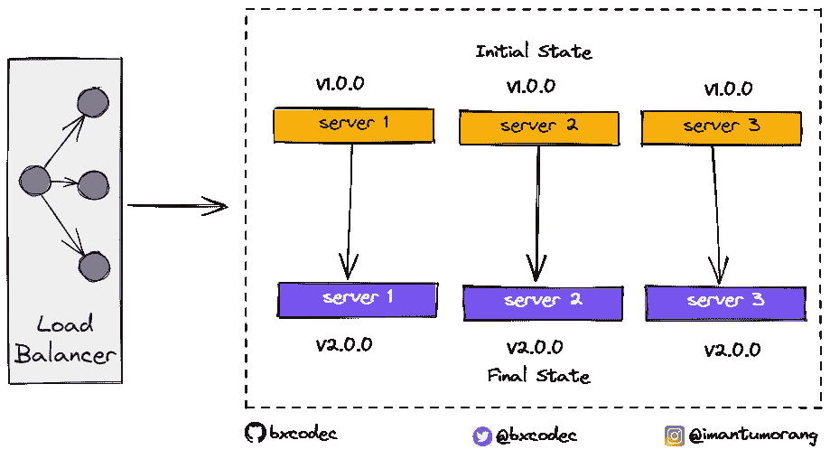
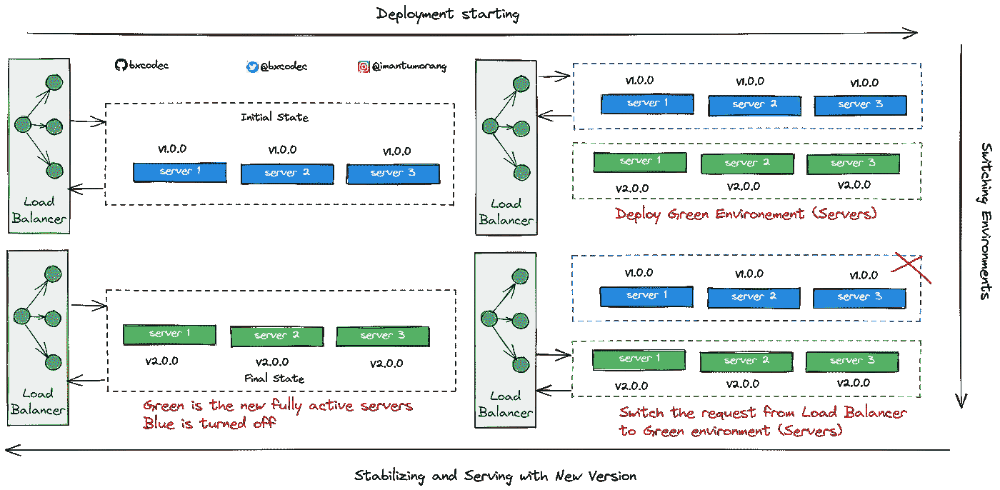
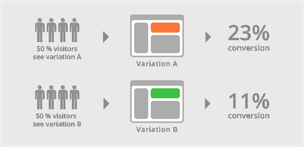
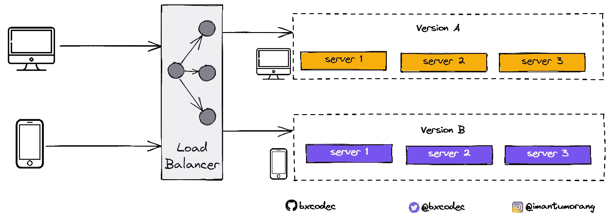
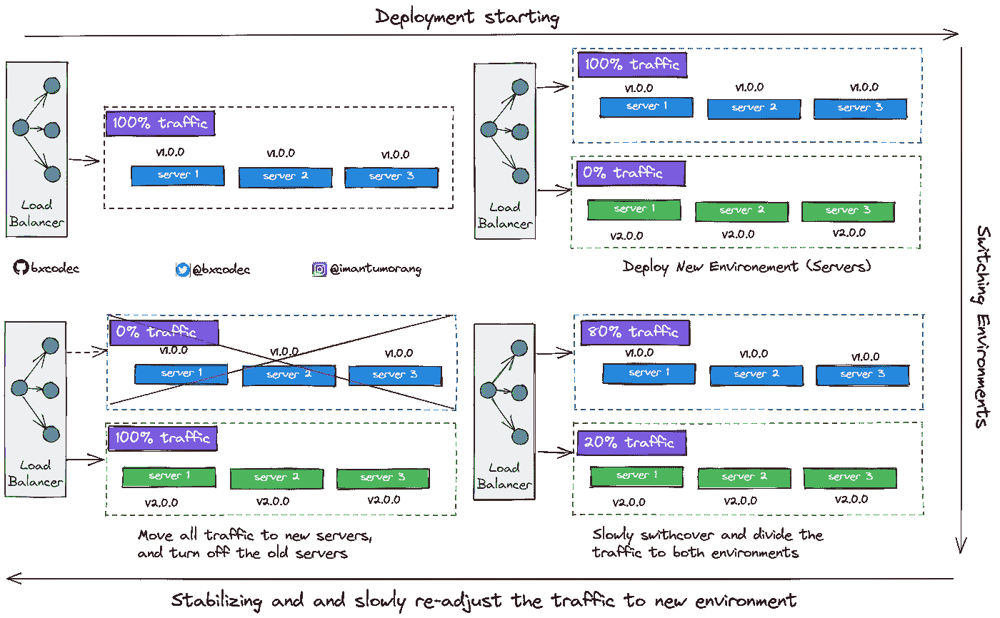

# Mengenal Strategi Deployment Aplikasi

> 原文：<https://medium.easyread.co/mengenal-strategi-deployment-aplikasi-23eef9f6f8dd?source=collection_archive---------0----------------------->

## Today I Learned: Jenis-Jenis Strategi Deployment di Dunia Software Engineering

Photo by [Paolo Nicolello](https://unsplash.com/@paul_nic?utm_source=medium&utm_medium=referral) on [Unsplash](https://unsplash.com?utm_source=medium&utm_medium=referral)

Dalam dunia *Software Engineering* , istilah “deployment” adalah sesuatu hal yang lumrah. *Deployment* adalah kegiatan yang bertujuan untuk menyebarkan aplikasi yang telah dikerjakan oleh para pengembang. Penyebarannya dapat melalui beragam cara tergantung dari jenis aplikasinya.

Jika aplikasi Web, maka dihosting pada server. Jika aplikasi Mobile, akan terdapat dua deployment, deployment untuk aplikasi ke Playstore/Appstore, serta deployment API(backend) ke server.

Pengalaman saya, *deployment* pertama kali yang saya lakukan adalah 2 tahun yang lalu, dikala ketika itu saya masih fresh-grad, dan masih i̶m̶u̶t̶-̶i̶m̶u̶t̶n̶y̶a belum ada pengalaman.

Kalau saya tidak salah ingat, sempat bermasalah, dan saya bingung, dan sempat menyebabkan *down* sampai beberapa menit. Untung saja, saat itu saya masih *under supervised* , sehingga keonaran yang saya buat langsung dibereskan.

Dan selama beberapa tahun kebelakang(sebelum kenal kubernetes), deployment itu adalah sesuatu yang sangat menakutkan buat saya. Karena berpotensi membuat aplikasi tidak dapat berjalan, jika aplikasi tidak berjalan, bisnis pun tidak berjalan. Kalau bisnis tidak berjalan, maka tidak ada gaji😈.

Lalu, bagaimana sih mekanisme *deployment* tersebut?

# Strategi Deployment Pada Software Engineering

Hari ini, berawal dari rasa penasaran saya, saya mencoba mengeksplore beberapa metode *deployment* sambil melakukan evaluasi terhadap apa yang sudah saya lakukan selama ini terkait *deployment* .

Jadi dalam sehari ini, sejauh yang saya ketahui dan pelajari ( *bisa saja kurang, atau salah mohon direview saja* 🙏), terdapat beberapa jenis *deployment* strategi yang sudah cukup sering digunakan oleh banyak orang.

Yaitu,

*   Big-Bang deployment strategy (atau sering disebut Replace/Recreate deployment strategy)
*   Rollout deployment strategy
*   Blue/Green deployment strategy
*   A/B deployment strategy
*   Canary deployment strategy

## Big-Bang Deployment Strategy

Yang pertama adalah, hal yang paling mudah dilakukan. Konsepnya sangat simple. Big-Bang strategy, atau sering juga disebut seperti Replace deployment, atau Recreate, dsb. Yang dimana sifatnya menimpa dan mengganti (mereplace) aplikasi yang aktif secara langsung.

Jika dianalogikan, konsep ini bisa saya buat kedalam contoh seperti ketika kita hendak mengganti ban sepeda motor.

Yang kita lakukan adalah, membukanya lalu langsung menggantinya. Sehingga jika terjadi kesalahan, baik ketika mengganti ban, atau setelah diganti bannya malah bocor, maka motor tersebut tidak akan bisa jalan. Karena sifatnya *all or nothing* , sehingga sangat beresiko membuat motor tidak dapat dijalankan.

Sama seperti ketika deployment aplikasi, konsep seperti ini juga sangat berbahaya. Dimana kita langsung mengganti( *replace)* aplikasi kita tanpa memikirkan kemungkinan gagal. Jika terjadi kegagalan *deployment* atau bugs sesudah *deployment* , maka selesai lah sudah, sistem kita akan *down* dalam waktu yang tidak ditentukan sampai kita berhasil *rollback,* yang juga makan waktu lama.

Ciri-ciri dari *deployment* ini adalah,

*   Aplikasi yang akan dideploy biasanya sudah dibuat dalam satu *package* , yang nantinya diupload ke server.
*   Package aplikasi yang diupload akan diekstrak dan dijalankan sesuai jenis aplikasi, jika *compiled* maka *binary* hasil *compiled* nya dijalankan diserver, jika *intrepreted* seperti PHP, Phyton, maka *source code* nya di *copy* dan dijalankan di Webserver.
*   Orang yang menggunakan metode ini, biasanya sangat optimis aplikasinya tidak akan *down/error* .
*   Dan jika terjadi down, biasanya terjadi *chaos* dan kepanikan luar biasa, sambil tangan gemetaran untuk re- *deploy* versi lama. Detak jantung kencang dan tak karuan. Dunia serasa gelap, muka pucat pasi, dan berusaha menenangkan diri demi menjauhkan kesalahan-kesalahan kecil. Dan berusaha membenarkan diri, saya udah percaya diri sama aplikasi ini tetapi kok masih bisa *down* ? 😈
*   Rata-rata *downtime* cukup lama.

Bigbang/Replace/Recreate Deployment

Kelebihan:

*   Mudah di-implementasikan. Cara klasik, tinggal replace.
*   Perubahan kepada sistem langsung 100% secara instan.

Kekurangan

*   Terlalu beresiko, rata-rata *downtime* cukup lama.

Karena hal tersebut, strategi *deployment* seperti ini baiknya dihindari. Hal ini bisa dilakukan untuk server-server staging dan server kebutuhan development. Yang tidak berpengaruh pada bisnis perusahaan.

## Rollout Deployment Strategy

Nah selanjutnya ada lagi yang biasa disebut Rollout deployment. Konsepnya berbeda dari Big Bang deployment. Konsep ini lebih aman dari Big Bang deployment.

Rollout deployment jika dianalogikan seperti sebuah bus besar yang memiliki 8 ban(roda) dibelakang. Kiri dan kanan masing-masing ada 4 roda.

Jika di suatu saat kita hendak mengganti ban, maka kita dapat menggantinya satu-persatu dahulu. Ganti 1 ban, lalu test berjalan, jika oke ganti lagi ban selanjutnya. Jika bannya ternyata kempes, mobil masih bisa berjalan, meski tidak optimal, tetapi tidak akan menyebabkan mobil tersebut berhenti total. Dan bisa di *rollback* kembali, diganti kembali ke ban yang lama.

Sama halnya ketika *deployment* aplikasi. Dengan metode ini, kita melakukan deployment secara bertahap per-server yang hidup. Dan jika satu server saja langsung error, kita dapat langsung *rollback* tanpa melanjut *deploy* kesemua server.

Rollout Deployment

Kelebihan:

*   Lebih aman dan less *downtime* dari versi sebelumnya

Kekurangan

*   Akan ada 2 versi aplikasi berjalan secara barengan sampai semua server terdeploy, dan bisa membuat bingung. Seperti kita ketahui, untuk *management* *versioning* itu sedikit susah dan cukup buat pusing kepala
*   Karena sifatnya perlahan satu persatu, untuk *deployment* dan *rollback* lebih lama dari yang Bigbang, karena prosesnya perlahan-lahan sampai semua server terkena efeknya.
*   Tidak ada kontrol *request* . Server yang baru ke- *deploy* dengan aplikasi versi baru, langsung mendapat *request* yang sama banyaknya dengan server yang lain. Sehingga jika terjadi *error* , juga dapat menyebabkan kerugian besar.

Kami di Kurio(tempat saya bekerja ketika menulis ini), beberapa *service* lama dan *legacy* masih menggunakan metode ini, sehingga untuk *deployment* cukup memakan waktu.

## Blue/Green Deployment Strategy

Selanjutnya adalah *Blue/Green* *Deployment* . *Deployment* jenis ini juga cukup sering digunakan dalam dunia *Software Engineering* .

Konsepnya cukup sederhana, pertama-tama, kita akan membuat satu environment yang serupa dengan yang sedang aktif/live, kemudian kita pun melakukan switching request ke environment baru tersebut.

Blue/Green Deployment

Kelebihan:

*   Perubahan sangat cepat, sekali *switch service* langsung berubah 100%.
*   Tidak ada issue beda versi pada *service* seperti yang terjadi pada Rollout Deployment.

Kekurangan:

*   *Resource* yang dibutuhkan lebih banyak. Karena untuk setiap *deployment* kita harus menyediakan *service* yang serupa *environment* nya dengan yang sedang berjalan di *production* .
*   Testing harus benar-benar sangat diprioritaskan sebelum di *switch* , aplikasi harus kita pastikan aman dari *request* yang tiba-tiba banyak.

Meski sedikit lebih mahal dari *resources* , strategi ini bisa disebut strategi yang paling cukup disarankan dan banyak digunakan oleh orang-orang saat ini, termasuk kami di Kurio(tempat saya bekerja)

## A/B Deployment Strategy

Selanjutnya adalah strategi A/B, atau biasa juga disebut A/B testing. Strategi ini biasanya lebih fokus pada user experience dan layout(UX/UI).

Biasanya A/B deployment lebih ke user sentris. Setengah user akan menerima fitur/layout A dan setengah lagi mendapat fitur/layout B, sehingga setiap user bisa mendapatkan tampilan yang beda.

ab testing from google search images

Pengelompokan fitur/layout tersebut biasanya dibuat berdasarkan spesifikasi yang ada pada user, seperti lokasi, gender, dsb.

Meski gambar berikut tidak terlalu menunjukkan bagaimana A/B test berjalan (karena A/B test biasanya dilakukan untuk device yang sejenis (desktop vs desktop, mobile vs mobile). Tetapi gambar dibawah menjelaskan bagaimana server melakukan strategi A/B deployment untuk mendukung proses A/B testing.

A/B Deployment

Kelebihan:

*   *Traffic request* terkontrol dan terarah pada masing-masing server

Kekurangan:

*   Susah di implementasikan, karena sangat user sentris.
*   *Troubleshooting* jika terjadi *error* sedikit susah jika *logging* nya terpusat pada satu tempat. Sehingga untuk kasus A/B testing, setiap server harus memiliki mekanisme dan *storage* *logging* tersendiri untuk mempermudah *tracing* dan *troubleshooting* jika terjadi error.

Tujuan dilakukannya A/B test adalah untuk evaluasi dan pengambilan data yang diperuntukan dalam *decision making* terhadap fitur yang akan direlease nantinya.

## Canary Deployment Strategy

Nah, berikutnya adalah strategi Canary Deployment. Strategi ini lebih *advance* dari semua metode release tersebut diatas. Prinsip kerjanya mirip seperti Rollout Deployment, tetapi bedanya, jika pada Rollout Deployment, ketika aplikasi di deploy pada satu server, maka server tersebut akan langsung kebagian *request* dari user sama rata dengan server lainnya.

Nah pada canary, aplikasi juga akan di *deploy* pada satu server, tetapi bedanya adalah, *request* yang masuk kedalamnya akan dikontrol dan ditahan berdasarkan kebutuhan.

Konsepnya juga mirip seperti A/B Deployment, bedanya A/B *deployment* *request* user langsung dibagi dua, 50% ke fitur A, 50% ke fitur B.

Namun di Canary Deployment, tetap menggunakan *percentage* *request* *user* , tetapi lebih dikontrol. Semisal ketika selesai dideploy kesalah satu server, pertama kali *request* yang diterima adalah sebanyak 10% dari total *request* yang diterima *load balancer* , sementara 90% lagi dialihkan ke server lain yang masih versi lama.

Jika ternyata cukup ok, naikkan lagi menjadi 20%, 30% sampai semua *request* yang diterima sama rata ke setiap server, sampai selanjutnya semua versi baru terdeploy dengan sempurna.

Nah jika terjadi kegagalan, *bug* atau *error* , semisal pada tahap 10%, maka semua request 100% akan diarahkan kembali ke server yang lama. Lalu yang versi baru akan diberhentikan.

Canary Deployment

Kelebihan:

*   Cukup aman
*   Mudah untuk *rollback* jika terjadi error/bug, tanpa berimbas kesemua user

Kekurangan:

*   Untuk mencapai 100% cukup lama dibanding dengan Blue/Green deployment. Dengan Blue/Green deployment, aplikasi langsung 100% ter *deploy* keseluruh user.

Konsep ini tentunya lebih aman dan *fast-rollback* jika terjadi kegagalan. Jika diibaratkan dalam kehidupan sehari-hari, konsep ini mirip seperti keran air, kita dapat secara perlahan membuka jumlah air yang akan dikeluarkan dari keran tersebut. Sama halnya pada Canary Deployment, kita juga dapat mengontrol jumlah request yang diterima aplikasi yang versi baru sampai aplikasi tersebut stabil berjalan.

# Kesimpulan

Dari sekian banyak jenis-jenis *deployment* , semua memiliki kekurangan dan kelebihan. Beberapa metode dapat di kombinasi sesuai kebutuhan. Dan perlu diketahui juga, tidak ada sistem yang tidak akan pernah *down* , sesempurna apapun aplikasi anda, akan ada saatnya sistem tersebut akan *down* .

> Everything can be Down at Anytime.

Sehingga yang kita lakukan adalah meminimalisir bencana yang terjadi tersebut dengan metode-metode yang tepat, termasuk ketika melakukan *deployment* .

Referensi:

*   [https://blog.christianposta.com/deploy/blue-green-deployments-a-b-testing-and-canary-releases/](https://blog.christianposta.com/deploy/blue-green-deployments-a-b-testing-and-canary-releases/)
*   [https://dev.to/mostlyjason/intro-to-deployment-strategies-blue-green-canary-and-more-3a3](https://dev.to/mostlyjason/intro-to-deployment-strategies-blue-green-canary-and-more-3a3)
*   [https://thenewstack.io/deployment-strategies/](https://thenewstack.io/deployment-strategies/)
*   Excalidraw [link](https://excalidraw.com/#json=Cb1oS3gOh9kPdl-FpFaic,bUdMa7etlMaeMNrgjB9hzw)