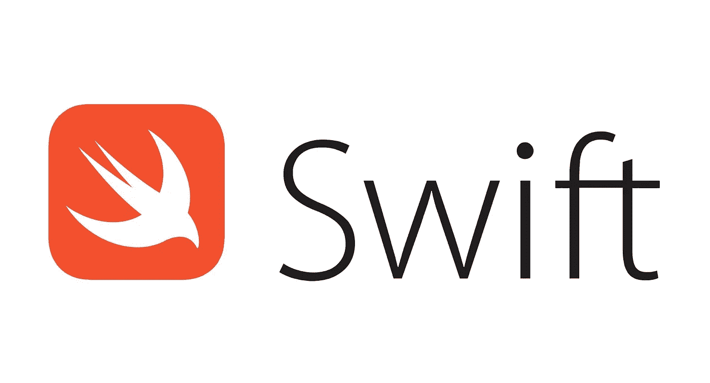

# Mengenal tipe data di Swift

> 原文：<https://medium.easyread.co/mengenal-tipe-data-di-swift-1a932a28d5bf?source=collection_archive---------2----------------------->



Tipe data merupakan salah satu hal yang penting sekali untuk di mengerti di luar kepala. Kenapa, karna semua berawal dari situ ketika kita memprogram. Kita harus benar-benar memahami apa tipe data itu, bagaimana mengolahnya, dan bagaimana menggunakannya.

Berikut tipe data built-in yang ada di Swift:

```
// Integer
var myInteger: Int = 1// Double
var myDouble: Double = 1.23456// Float
var myFloat: Float = 1.23// String
var myString: String = "Hello world!"// Character
var myCharacter: Character = "A"// Boolean
var myBoolean: Bool = true// Tuples
var myTuples = (firstName: "Wisnu", lastName: "Kurniawan")
```

Mungkin kamu baru menemukan keyword baru, yakni `Tuple` . `Tuple` adalah sekumpulan tipe data yang di digabungkan menjadi 1, tipe data penyusunnya bisa apa aja.

Di Swift kita dapat tidak menuliskan tipe data secara eksplisit, mirip seperti bahasa python, go, dan kotlin. Contohnya seperti dibawah ini:

```
var myInteger = 1       // Dianggap sebagai integer
var myDouble = 1.23456  // Dianggap sebagai double
var myFloat = 1.23      // Dianggap sebagai doublevar myString = "Hello world!" // Dianggap sebagai string
var myCharacter = "A"         // Dianggap sebagai stringvar myBoolean = true // Dianggap sebagai boolean
```

> Tips: untuk mengetahui sebuah tipe data dari suatu variabel kamu dapat menggunakan `type(of: variabelKamu)` .

Untuk mengassign beda value di Swift kamu harus secara eksplisit mengubah tipe data nya. Cara untuk mengubah tipe data satu ke tipe data lainnya di Swift caranya adalah dengan memasukan variabel yang ingin kamu ubah ke dalam konstruktor tipe data yang kamu inginkan. Contohnya seperti dibawah ini:

```
// Contoh Integer ke String
var a = "Hello "var b = 23var c = a + b // Ini akan error// Yang bener
var c = a + String(b) // Contoh String ke Integer
var a = "1"var b = 2var c = Int(a) + b
```

Swift juga memiliki pendeklarasian immutable variable atau pendeklarasian konstan yaitu menggunakan `let` .

> Tips: ketika membuat sebuah variabel gunakan lah `let` secara default, apabila kamu ingin mengubah nilai tipe data tersebut maka ubahlah menjadi `var`

*Artikel ini di tulis oleh* [*Wisnu Kurniawan*](https://medium.com/u/bf894addbcbc?source=post_page-----1a932a28d5bf--------------------------------) *beliau sering menulis artikel mengenai Software Engineering dan Programming. Follow profilnya untuk mendapatkan update-an terbaru artikel-artikel beliau.*

*Jika anda merasa artikel ini menarik dan bermanfaat, bagikan ke lingkaran pertemanan anda, agar mereka dapat membaca artikel ini.*