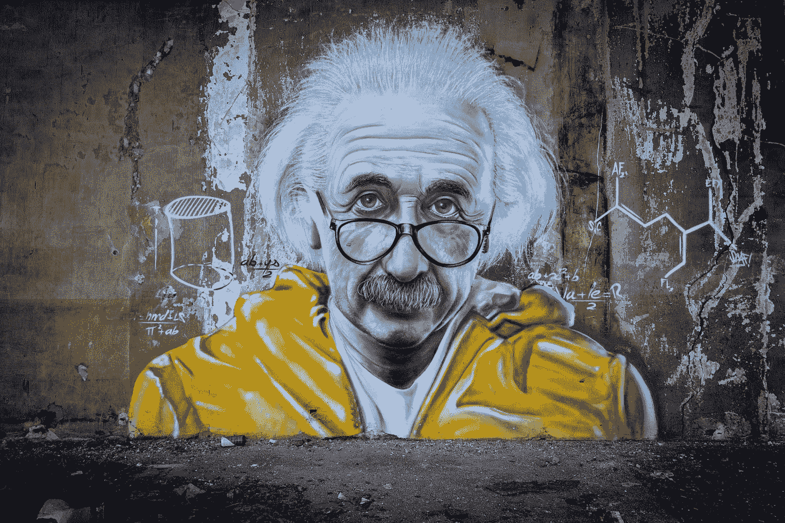
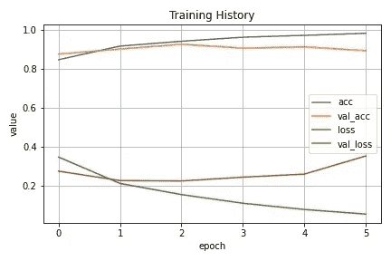
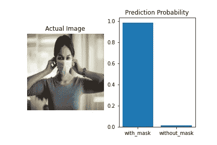
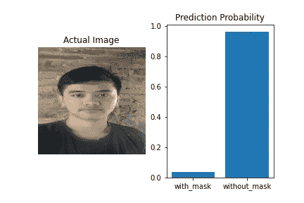

# Menggunakan Artificial Intelligence Untuk Mendeteksi Pemakaian Masker

> 原文：<https://medium.easyread.co/menggunakan-artificial-intelligence-untuk-mendeteksi-pemakaian-masker-b0564732c4ee?source=collection_archive---------2----------------------->

## Kupas tuntas implementasi Deep Learning untuk mendeteksi pemakaian masker dengan Python. Project yang relevan dengan situasi covid-19.


Photo by [Anastasiia Chepinska](https://unsplash.com/@anastasiiachepinska?utm_source=medium&utm_medium=referral) on [Unsplash](https://unsplash.com?utm_source=medium&utm_medium=referral)

> Catatan : Artikel ini bukan tutorial teknis. Saya akan membahas mengenai ide dan workflow dalam mengerjakan proyek dan membagikan pengalaman yang Saya dapatkan.

# Abstraksi

Kali ini saya ingin berbagi pengalaman dalam pembuatan proyek Deep Learning. Saya membuat *Neural Network Model* (NN Model) menggunakan Keras, Python. Tujuan dari project ini adalah untuk melakukan klasifikasi foto wajah, dimana kita akan membagi data menjadi dua kelas, sehingga kita dapat menjawab pertanyaan berikut.

> Apakah orang tersebut memakai masker atau tidak ?

Awalnya Saya tidak habis pikir mengenai ide tersebut. Saya langsung cari informasi di internet dan ternyata banyak juga yang membuatnya 😆. Mungkin ini adalah bukti perkataan Albert Einstein yang saya rasakan, yaitu :

> “Imagination is more important than knowledge”



Photo by [Taton Moïse](https://unsplash.com/@moyse?utm_source=medium&utm_medium=referral) on [Unsplash](https://unsplash.com?utm_source=medium&utm_medium=referral)

Saya akan menceritakan bagaimana cara Saya menyelesaikan proyek ini. Proyek ini sangat relevan pada tahun 2020 dimana memakai masker merupakan hal yang diwajibkan, dikarenakan pandemi covid-19\. Sehingga, jika Anda mengerjakannya dengan baik, *project* ini dapat menjadi portfolio yang berbobot.

# Urutan Langkah Mengerjakan Proyek (Project Workflow)

## Step 1: Mencari Dataset (Data Collection)

Anda dapat membuat dataset sendiri dengan merekam wajah keluarga atau teman kalian dirumah, kemudian diekstrak per frame menjadi gambar. Keunggulannya, Anda bisa mendapatkan data yang besar tanpa perlu mendownload, jika Anda tidak menggunakan wifi.

Namun untuk praktisnya, Anda dapat menemukan dataset dengan mudah di situs Kaggle. Saya mencari dataset yang ideal (Ukuran downloadnya tidak terlalu besar dan juga tidak terlalu kecil). Saya akhirnya memutuskan untuk menggunakan dataset berikut.

[](https://www.kaggle.com/omkargurav/face-mask-dataset) [## Face Mask Detection Dataset

### Face Mask Detection Dataset 7553 Images

www.kaggle.com](https://www.kaggle.com/omkargurav/face-mask-dataset) 

Dataset tersebut berukuran 160 MB yang berisi 7553 foto berekstensi jpg dengan 3 channel (RGB). Dataset terdiri dari 3725 foto wajah dengan masker dan 3828 foto wajah tanpa masker dengan ukuran foto yang beragam. Anda bisa mencari dataset yang besar dan menggunakan *Transfer Learning* untuk membuat model yang lebih akurat.

## Step 2: Setup Environment

Mempersiapkan *library* yang diperlukan. Saya menggunakan Keras dan Tensorflow, dimana Keras menggunakan Tensorflow sebagai backend. Sehingga Saya saya dapat membuat *Neural Network* dengan mudah.

## Step 3: Preprocessing

Disini saya tidak menggunakan Keras `flow_from_directory` dalam memuat dataset, melainkan Saya menggunakan Tensorflow *input output* ( `tf.io.read_file(path)` ) karena saya ingin membuat *batch* data sebelum *training,* agar prosesnya berjalan dapat lebih cepat.

Pada saat *preprocessing* Anda dapat menggunakan teknik *image augmentation* untuk memberikan variasi data, agar dapat meningkatkan performa model dan menghindari *overfitting* . Diantaranya dengan membalik, memutar, memotong, *zooming* , dan menggeser posisi gambar.

## Step 4: Membangun Neural Network

Setelah itu saya membuat *Convoutional Neural Network* (CNN) dengan Keras. Disini saya menggunakan *Dense layer 2 unit* dengan aktivasi *Softmax* sebagai output *node* karena Saya menginginkan *output 2 array* supaya lebih mudah dalam menerima informasi hasil prediksi. Karena, Saya juga telah mencoba dengan *1 unit Dense layer* menggunakan aktivasi *Sigmoid* dan hasilnya tidak begitu signifikan.

```
Model: "Mask Detector"
_________________________________________________________________
Layer (type)                 Output Shape              Param #   
=================================================================
conv2d_18 (Conv2D)           (None, 222, 222, 32)      896       
_________________________________________________________________
max_pooling2d_18 (MaxPooling (None, 111, 111, 32)      0         
_________________________________________________________________
conv2d_19 (Conv2D)           (None, 109, 109, 64)      18496     
_________________________________________________________________
max_pooling2d_19 (MaxPooling (None, 54, 54, 64)        0         
_________________________________________________________________
conv2d_20 (Conv2D)           (None, 52, 52, 128)       73856     
_________________________________________________________________
max_pooling2d_20 (MaxPooling (None, 26, 26, 128)       0         
_________________________________________________________________
flatten_6 (Flatten)          (None, 86528)             0         
_________________________________________________________________
dense_12 (Dense)             (None, 128)               11075712  
_________________________________________________________________
activation_6 (Activation)    (None, 128)               0         
_________________________________________________________________
dense_13 (Dense)             (None, 2)                 258       
_________________________________________________________________
activation_7 (Activation)    (None, 2)                 0         
=================================================================
Total params: 11,169,218
Trainable params: 11,169,218
Non-trainable params: 0
```

## Step 5: Training

Proses *training* hanya terjadi selama 5 *epochs* . Saya juga menggunakan *early stopping* supaya proses *training* dapat dihentikan secara otomatis jika model tidak mengalami peningkatan selama 3 *epcohs* . Ini bertujuan untuk menghindari *overfitting* .



Grafik proses training neural network selama 5 epochs

## Step 6: Demonstrasi

Saya melakukan demonstrasi menggunakan 4 foto yang belum pernah dilihat oleh model sebelumnya. Dan hasilnya cukup mengejutkan bagi Saya karena model dapat memprediksi semuanya dengan benar dengan nilai probabilitas prediksi yang besar.



Prediksi neural network dan probabilitas terhadap foto orang bermasker



Prediksi neural network dan probabilitas terhadap foto orang tidak bermasker

Saya menyimpan model ke dalam h5 file kemudian membuat *script* python menggunakan *library* opencv. Setelah itu Saya mencoba menggunakan model ini untuk melakukan prediksi dalam video. Saya menggunakan video karena komputer Saya tidak akan kuat jika dilakukan secara real time menggunakan kamera. Berikut beberapa kelemahan model yang Saya temukan saat melakukan eksperimen, beserta kemungkinan solusinya :

1.  Prediksi model akan kacau pada saat kita bergerak (Jika menggunakan video / *real time* ). Dapat diatasi dengan menggunakan *transfer learning* untuk menerapkan model yang kompleks.
2.  Masker berwarna coklat ( *blend)* dengan warna kulit tidak bisa terdeteksi oleh NN. Dapat diatasi dengan menambah variasi *dataset* dengan jumlah yang besar, serta menggunakan *transfer learning* untuk menerapkan model yang kompleks.
3.  Hanya dapat mendeteksi 1 wajah dalam 1 foto atau video. Dapat diatasi dengan mengkombinasikan dengan *face detection* sehingga dapat melakukan prediksi untuk setiap wajah yang ditemukan.

# Resolusi

Anda dapat melanjutkan pekerjaan hingga tahap *deployment* atau membuatnya sebagai API untuk digunakan dalam *project* yang lain. Untuk portofolio yang memuaskan, mungkin Anda dapat membuat aplikasi Mask Camrea pada perangkat mobile untuk mendeteksi pemakaian masker secara *real time* . Aplikasi berjalan online menggunakan API, sehingga tidak menguras *resource* smartphone.

Proyek yang Saya kerjakan merupakan *open source project* di Github, dibawah lisensi MIT. Anda dapat mengakses melalui link berikut ini [https://github.com/PhilipPurwoko/Face-Mask-Detection](https://github.com/PhilipPurwoko/Face-Mask-Detection) . Jika Anda baru belajar pemrograman dan ingin mempelajari tentang *machine learning,* dapat membaca artikel Saya yang sebelumnya.

[](https://medium.com/easyread/mari-berkenalan-dengan-machine-learning-b4778ff2914a) [## Mari Berkenalan Dengan Machine Learning

### Penjelasan urut mengenai Machine Learning dalam Bahasa Indonesia ramah untuk pemula

medium.com](https://medium.com/easyread/mari-berkenalan-dengan-machine-learning-b4778ff2914a) 

Photo by [Tim Mossholder](https://unsplash.com/@timmossholder?utm_source=medium&utm_medium=referral) on [Unsplash](https://unsplash.com?utm_source=medium&utm_medium=referral)

> “Jika kamu tidak sanggup menahan lelahnya belajar maka kamu harus sanggup menahan perihnya kebodohan” — Imam Syafi’i

Sertifikat berfungsi untuk membuktikan tingkatan kemampuan, sedangkan portofolio digunakan untuk menunjukan keterampilan yang kita miliki. Jika Anda memiliki waktu dan kesempatan, kenapa Anda tidak mencoba melakukannya ?

Sekian pengalaman yang dapat Saya sampaikan, semoga pengalaman tersebut dapat diambil dan menjadi dorongan serta motivasi untuk belajar, khususnya bagi programmer pemula di Indonesia. Saya akan terus membagikan pengalaman dalam proses belajar Saya di lain kesempatan. Mari kita berbagi pengalaman pada kolom komentar.

> Enjoy Learning !