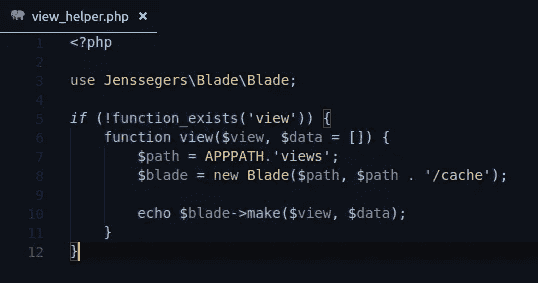
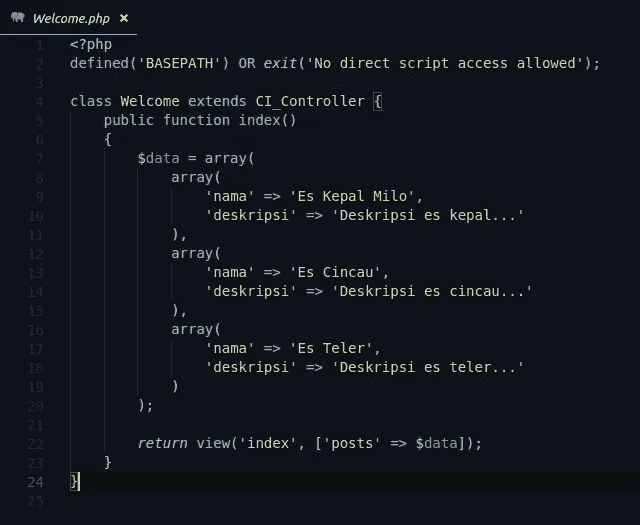
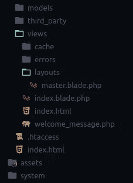
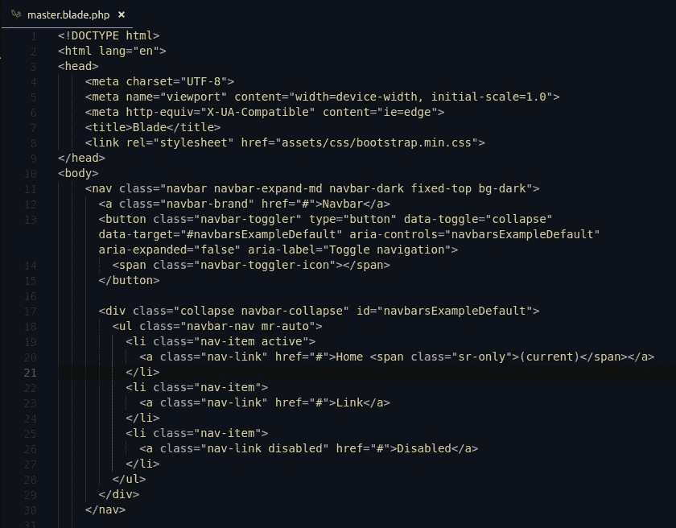
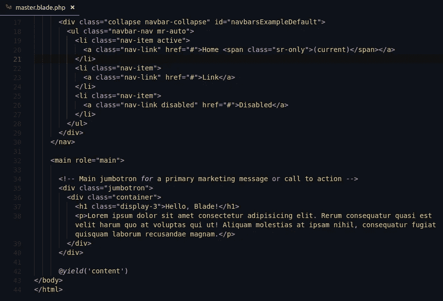
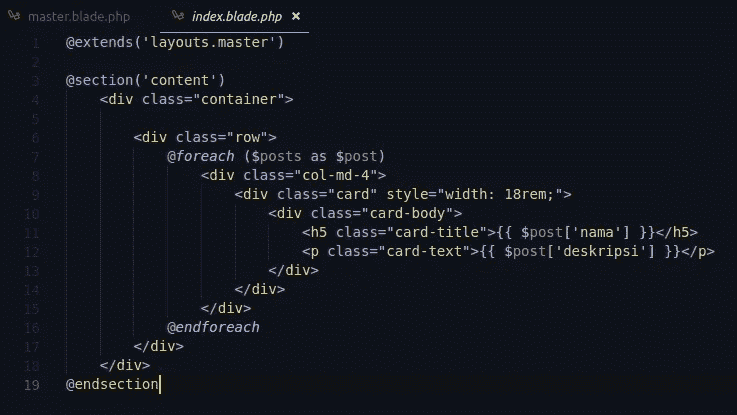
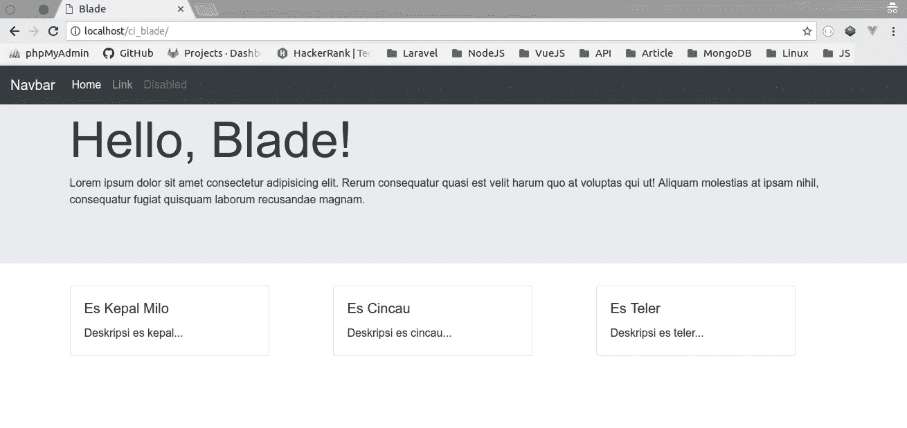
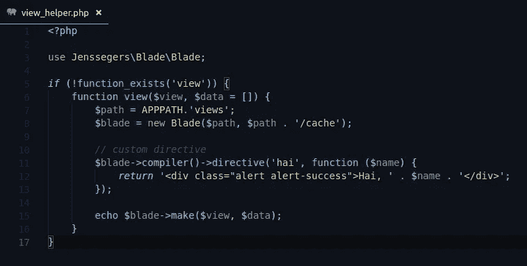
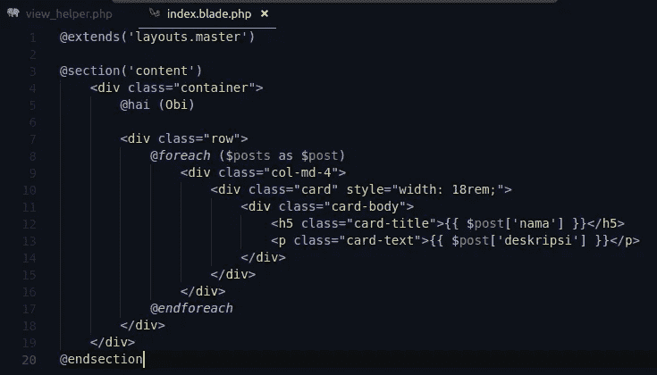
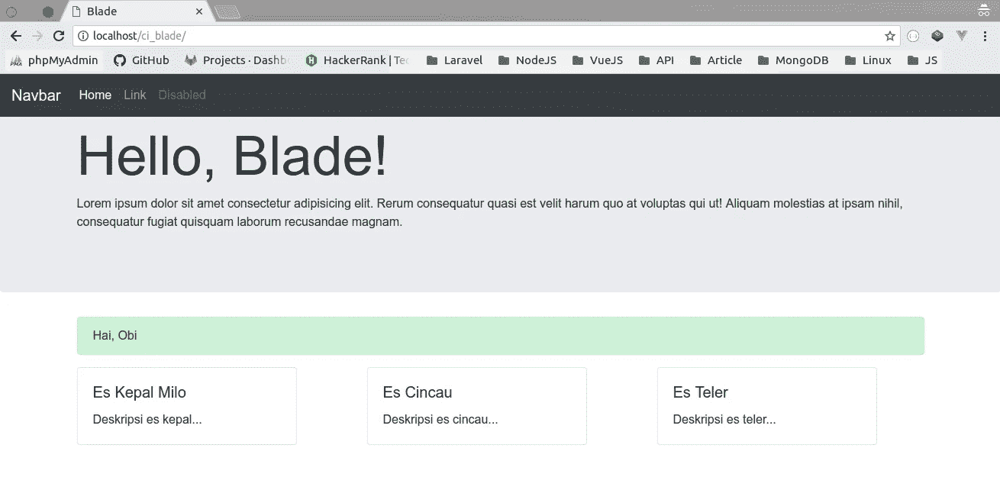

# Menggunakan Blade Template Engine pada Codeigniter

> 原文：<https://medium.easyread.co/menggunakan-blade-template-engine-pada-codeigniter-369b2eea024c?source=collection_archive---------0----------------------->

*Template engine* mempermudah pekerjaan *web developer* untuk mengelola *views* . Salah satu *template engine* PHP yang saya suka adalah **Blade** . Blade merupakan *template engine* yang datang bersama *framework* Laravel. Menurut saya menggunakan Blade sangat menyenangkan karena sintaksnya jelas, rapi dan bersih. Lalu mungkin akan timbul pertanyaan: bagaimana bila ingin menggunakan Blade tanpa menginstall Laravel? Misalnya untuk *native* PHP atau *framework* lain seperti Codeigniter? Melalui tulisan ini saya tertarik untuk memasangkan Blade dengan *framework* Codeigniter.

Saat tulisan ini dibuat, saya menggunakan Codeigniter versi 3.1.x yang masih belum dimodifikasi sama sekali ( *fresh install* ) dan *package* Blade yang akan digunakan adalah *jenssegers/blade* ( [https://github.com/jenssegers/blade](https://github.com/jenssegers/blade) ).

Sebelumnya teman-teman perlu mengubah pengaturan *config* *composer* *autoload* yang terletak pada direktori *application/config* .

```
// *application/config/config.php*$config[‘composer_autoload’] = FALSE;// ubah menjadi
$config[‘composer_autoload’] = ‘vendor/autoload.php’;
```

Selanjutnya instal *package* Blade dengan perintah: `**composer require jenssegers/blade**`

Rencananya saya ingin membuat fungsi *view helper* yang mirip seperti Laravel, yaitu parameter pertama untuk lokasi *view* dan parameter kedua untuk *passing* data. Untuk melakukannya, saya harus membuat *file* *custom helper* sendiri pada direktori *application/helpers* dengan nama *view_helper.php*

Di dalam fungsi *view* yang dibuat, saya membuat *instance* dari *class* Blade dengan dua parameter yang harus diberikan. Parameter pertama adalah *path* menuju *file views* yang akan dikelola. Parameter kedua adalah *path* untuk Blade *cache* .



view_helper.php

> For your information, APPPATH adalah konstanta dari Codeigniter untuk path ke direktori application. Jadi APPPATH . ‘views’ sama saja dengan application/views.

Setelah *helper view* untuk Blade selesai dibuat, jangan lupa tambahkan di *autoload* supaya *helper* bisa otomatis dipanggil.

```
// application/config/autoload.php$autoload[‘helper’] = array(‘view’);
```

Beralih ke bagian *controller* , pada *method index* saya sudah dapat menggunakan *helper view* dengan parameter pertama untuk lokasi *file view* dan parameter kedua untuk data. Karena sebagai latihan, asumsikan variabel data tersebut berasal dari model *database* .



Controller

Berikutnya pada folder *views* saya tidak lagi membuat *file* dengan ekstensi *.php* saja, tetapi dengan ekstensi *.blade.php* . Pada folder *views* saya membuat dua file: *index.blade.php* dan master *view* di dalam folder *layouts* . *View* master ini nantinya dapat di- *extends* melalui *index.blade.php.*



Struktur folder views



Master view



Lanjutan kode master view



index.blade.php

Sejauh ini bila dirasa tidak ada *error* , teman-teman bisa coba melihat hasilnya pada *web browser* .



Hasil view menggunakan Blade

# Opsional

Selain menggunakan *directive* yang sudah disediakan oleh Blade, membuat *custom directive* juga dapat dilakukan. Sebagai contoh saya ingin membuat *custom directive* dengan nama *hai (@hai)* untuk menyapa pengguna menggunakan *alert bootstrap.*

Modifikasi *helper view* yang telah dibuat sebagai berikut.



Membuat custom directive dengan nama hai

Untuk memanggil *directive hai* , tambahkan *@hai(Obi)* pada *index.blade.php*



Memanggil custom directive hai



Hasil custom directive hai

Selesai, sekarang teman-teman berhasil membuat *custom directive!*

Dengan menerapkan Blade sebagai *template engine* , saya yakin teman-teman akan terbantu dalam mengelola *views* . Struktur *file* dan kode dalam *views* juga semakin bersih dan mudah dibaca. Untuk dokumentasi lengkap dari Blade *template* dapat dibaca pada [dokumentasi resmi Laravel](https://laravel.com/docs/5.6/blade) . Sedikit saran sewaktu menggunakan Blade sebaiknya teman-teman menginstal *plugin* yang mendukung *syntax highlight* pada teks editor. Mudah-mudahan kita belajar hal baru hari ini. Semoga bermanfaat.

[*https://github.com/biobii/codeigniter-blade-starter*](https://github.com/biobii/codeigniter-blade-starter)

*Artikel ini di tulis oleh* [*Mohammad Robih T. Z*](https://medium.com/u/37ae403df215?source=post_page-----369b2eea024c--------------------------------) *ia sering menulis artikel menarik mengenai Software Engineering dan Programming. Ikuti profilnya untuk mendapatkan update-an terbaru artikel-artikel miliknya.*

*Jika kamu merasa artikel ini menarik dan bermanfaat, bagikan ke lingkaran pertemanan kamu, agar mereka dapat membaca artikel ini.*