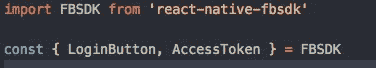

# Menggunakan FB-SDK pada React Native

> 原文：<https://medium.easyread.co/menggunakan-fb-sdk-pada-react-native-b9b8de40a261?source=collection_archive---------1----------------------->


[https://facebook.github.io/react-native/](https://facebook.github.io/react-native/)

Halo semua, sedang mencoba menuliskan kembali apa yang saya dapatkan pada Training [Facebook Masterclass Jakarta](http://fbmasterclass4devs.id/) . Pada intinya, training ini melatih pesertanya untuk dapat menggunakan stack technology yang dimiliki oleh Facebook.

Pada salah satu sesi training kali ini membahas tentag implementasi Facebook SDK pada React Native. React Native itu sendiri merupakan teknologi yang diperkenalkan Facebook, agar para developer dapat mengembangkan aplikasi mobile (Android dan iOS) menggunakan Javascript dan [React](https://facebook.github.io/react/) .

> Learn once, write anywhere: Build mobile apps with React

Pada bahasan kali ini akan fokus untuk implementasi Facebook SDK kedalam React Native ya, saya beranggapan teman-teman sudah berhasil melakukan setup environment pada komputer masing-masing ya, cara setup environmenya bisa dilihat [disini](https://facebook.github.io/react-native/docs/getting-started.html) .

Pada sharing kali ini, saya menggunakam environtment macOS, namun untuk Ubuntu seharusnya tidak terlalu berbeda, Bagaimana dengan Windows ? saya sarankan menggunakan Unix based sih 😜, sebenarnya bisa, namun akan banyak waktu yang dihabiskan hanya untuk setup environment pada Windows 😄

Jika kalian menggunakan `react-native init DemoApp` , maka kalian akan mendapatkan React Native versi terbaru, namun kali ini saya menggunakan versi `0.46.4` , karena saya diberitahu oleh trainer facebook masterclass, mas [Yogie](https://www.facebook.com/yogieputra8) , bahwa Facebook SDK ada bug jika menggunakan React Native yang terbaru. Jika kalian menggunakan versi diatas `0.46.4` maka kalian perlu melakukan downgrade versi, berikut langkahnya:

*   Buka file `package.json`
*   Cari `"react-native": 0.48.3` lalu ubah menjadi `"react-native": 0.46.4`
*   Hapus file `node_modules`
*   Hapus file `package-lock.json` dan `yarn.lock` jika ada
*   Lakukan `npm install` kembali

Sekarang kita lanjut untuk implementasi Facebook SDK nya ya, langkah yang harus dilakukan adalah dengan install package fbsdk ke dalam react-native kita, lalu setup pada dashboard developer facebook.

Untuk install package fbsdk ke dalam react-native, bisa menggunakan perintah berikut ini didalam terminal:

```
react-native install react-native-fbsdk
npm install react-native-fbsdk
react-native link react-native-fbsdk
npm link react-native-fbsdk 
```


Tampilan jika berhasil melakukan link ke react-native-fbssk

Langkah selanjutnya, buka Android studio kalian, lalu pilih `Open an existing Android Studio project`


Android Studio


Pilih folder `android` pada folder aplikasi react native kalian

Saat android studio terbuka, pastikan `react-native-fbsdk` sudah ada didalam project ya


react-native-fbsdk sudah terlink

Jika masih belum ada, coba ulangi langkah downgrade react-native ya, saya sebelumnya juga tidak muncul, karena belum downgrade versi react-native

Langkah selanjutnya, kita perlu melakukan configurasi pada halaman [developer facebook](https://developers.facebook.com/)


Tampilan halaman facebook developer

Lalu masukkan nama aplikasi kalian, jika berhasil. maka akan masuk ke dashboard developer facebook


Facebook Developer Dashboard

Pilih `Facebook Login` pada `Add Product` pilih platform untuk Android, untuk step 1 **Download the Facebook SDK for Android** sudah kita lakukan sebelumnya, step 2 pun kita tidak perlu, langsung ke step 3 **Tell Us about Your Android Project**


Step 3

Pada step 3, isikan `package name` aplikasi kalian, nilai in bisa ditemukan pada gradle script level app


package name pada android studio

Untuk default activity name, bisa ditemukan pada `AndroidManifest.xml`


AndroidManifest,xml

Untuk kasus saya, makan diisi dengan `com.carijakartasehat.MainActivity` Pada step 4, tolong diingat key hash yang terbentuk lalu masukkan kedalam form yang ada


Masukkan keyhash disini

Langkah berikutnya, pilih single sign on, lalu pada langkah berikutnya, masukkan `<string name="facebook_app_id">GANTI_DENGAN_APP_ID_ANDA</string>` pada file `/app/src/main/res/values/strings.xml` lalu jangan lupa masukkan

```
<meta-data android:name="com.facebook.sdk.ApplicationId" 
        android:value="@string/facebook_app_id"/>
```

kedalam file `AndroidManifest.xml`


Jika sudah, langsung `next` ke langkah terakhir ya (pada developer facebook). Nah sekarang kita tinggal melakukan perubahan pada code kita, pada halaman [react-native-fbsdk](https://github.com/facebook/react-native-fbsdk) sebenarnya sudah diberikan contoh yang cukup mudah untuk menerapkan facebook login. Kurang lebih seperti ini



Jika sudah memasang code diatas, ayo kita coba jalankan aplikasi React Native kita. Jika saat menjalankan ada error modules fbsdk not found, coba jalankan perintah berikut ini


Error modules not found

```
watchman watch-del-all
rm -rf node_modules
npm install
npm start — —reset-cache 
```

Jika berhasil tampilannya akan seperti ini


Untuk melihat code lengkapnya bisa dilihat di [Github](https://github.com/ihsansatriawan/jakarta-sehat-fbsdk) .

Terima Kasih, semoga membantu 🙂

NB: Jika ada yang kurang atau salah, mohon disampaikan :)