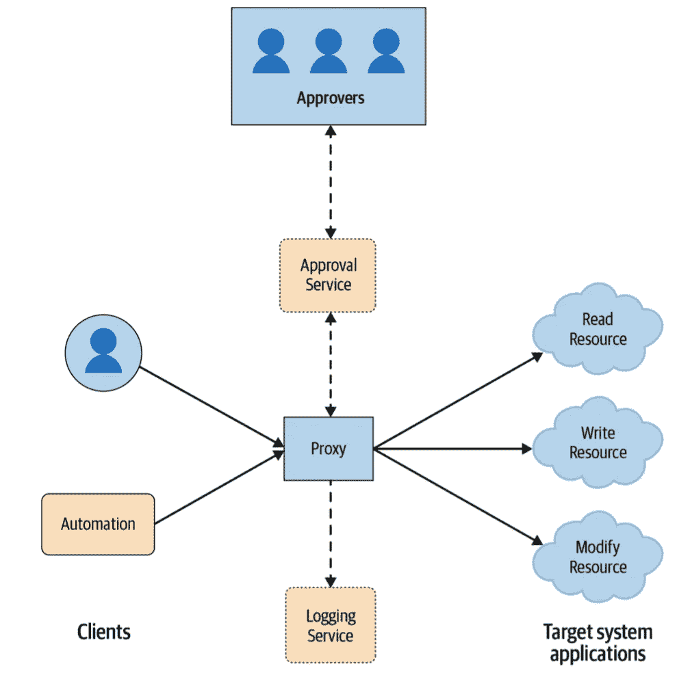
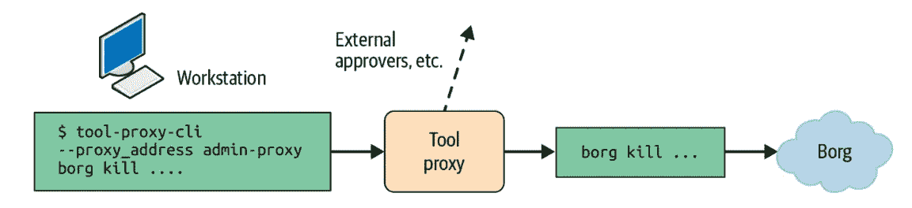

# Meningkatkan Keamanan dengan Proksi, Sebuah Studi Kasus di Google

> 原文：<https://medium.easyread.co/meningkatkan-keamanan-dengan-proksi-sebuah-studi-kasus-di-google-ddfc5e24fd6a?source=collection_archive---------0----------------------->

## Building Secure and Reliable Systems Series — Part 3

Pernah gak sih kamu ketemu dengan *engineer* yang memodifikasi sistem secara tidak sengaja, lalu terjadi kegagalan atau gangguan? Pernah juga menemukan ada peretas di dalam sistem kamu? Karena kamu adalah *engineer* yang paling mengerti soal sistem yang kamu bangun, dirancang dengan prinsip *least privilege,* kamu berhasil memulihkan kegagalan dengan cepat, sehingga dampak dari gangguan sangat kecil dan terbatas. Saat terjadi gangguan pun, kamu berhasil menemukan penyebab utamanya ( *root cause* ) dan membuat solusi supaya gangguan yang sama tidak terjadi lagi.

*Nah* , sayangnya tidak semua sistem dibangun seperti ini! Kalau begini, bagaimana caranya supaya kita bisa mengamankan sistem dengan mudah? Apalagi, kalau sistem itu sudah berjalan jauh sebelum kita mulai bekerja? **Proksi Keamanan** adalah salah satu jawabannya. Tulisan ini merupakan seri ketiga intisari buku “Membangun Sistem yang Aman dan Andal (Building Secure & Reliable Systems)” karya tim SRE Google. Untuk membaca seri lainnya:

## Building Secure and Reliable Systems — Series List

[**1\. Pentingnya Membangun Sistem yang Aman dan Andal**](https://medium.com/easyread/pentingnya-membangun-sistem-yang-aman-dan-andal-a15f7a3f94eb)[**2.1\. Mengenal Lawan-Lawan dalam Membangun Sistem yang Aman dan Andal — Bagian 1**](https://medium.com/easyread/mengenal-lawan-lawan-dalam-membangun-sistem-yang-aman-dan-andal-bagian-1-8d6fb8bb22b3)[**2.2\. Mengenal Lawan-Lawan dalam Membangun Sistem yang Aman dan Andal — Bagian 2**](https://medium.com/easyread/mengenal-lawan-lawan-dalam-membangun-sistem-yang-aman-dan-andal-bagian-2-edf29bb74de0) **3\. Meningkatkan Keamanan dengan Proksi, Sebuah Studi Kasus di Google —You’re here** [**4\. Mempertimbangkan Aspek Keamanan dan Keandalan Sedari Awal**](https://medium.com/easyread/mempertimbangkan-aspek-keamanan-dan-keandalan-sedari-awal-68465a8814da)


Amankan sistem dari peretas aktif dan pasif dengan Proksi Keamanan

# Apa itu *Proksi Keamanan* ?

Sebelum melompat ke pengertian Proksi Keamanan, *yuk* kita coba pahami dulu apa sih proksi itu. Pada umumnya, proksi menyediakan sebuah cara untuk membangun keandalan dan keamanan tanpa perlu melakukan perubahan pada sistem yang sudah berjalan. Tanpa perlu mengutak-atik sistem, proksi bisa kamu gunakan untuk mengalihkan koneksi yang bertujuan untuk mengakses sistem kamu.

Proksi juga bisa memiliki fungsi kontrol untuk memenuhi kebutuhan keandalan dan keamanan kamu. Artikel ini akan membahas sekumpulan Proksi Keamanan yang digunakan oleh Google, untuk membatasi kemampuan administrator *privileged* dengan akses luas, supaya tidak bisa membuat gangguan pada sistem *production* secara tidak sengaja.

**Proksi Keamanan** merupakan sebuah *framework* yang mengizinkan pengguna yang mempunyai otoritas, untuk mengakses atau memodifikasi *state* dari server fisik, mesin virtual, maupun aplikasi tertentu. Google menggunakan Proksi Keamanan untuk melakukan *review* , *approval* , dan menjalankan perintah tanpa perlu membuat koneksi SSH ke dalam sistem. Dengan menggunakan Proksi Keamanan, kita dapat memberikan akses secara *granular* yang diperlukan saja untuk melakukan *debugging* atau sekedar membatasi operasi terhadap suatu mesin.

Proksi Keamanan merepresentasikan pintu masuk ke dalam sistem satu-satunya ( *single entry point* ) antar jaringan, dan merupakan alat yang sangat krusial untuk melakukan tiga hal berikut:

*   **Mengaudit** setiap operasi di dalam sistem
*   **Mengontrol** akses terhadap sumber daya di dalam sistem
*   **Melindungi** sistem *production* terhadap kesalahan orang secara luas

# Zero Touch Prod

[**Zero Touch Prod**](https://www.usenix.org/conference/srecon19emea/presentation/czapinski) adalah sebuah proyek di Google yang mengharuskan setiap perubahan pada *production* harus dilakukan oleh sebuah robot atau otomasi (bukan orang), divalidasi sebelumnya oleh *software* , atau di- *trigger* melalui mekanisme *breakglass* yang dimonitor. *Breakglass* merupakan mekanisme yang bisa digunakan *engineer* untuk melakukan eskalasi akses di saat darurat untuk memperbaiki gangguan sistem. Proksi Keamanan merupakan komponen penting untuk merealisasikan prinsip Zero Touch Prod ini. Ada sekitar ~13% gangguan yang telah terjadi pada semua layanan Google yang sebenarnya bisa dihindari jika prinsip Zero Touch Prod telah diterapkan sebelumnya.



Model Proksi Keamanan untuk mengaudit, mengontrol, dan melindungi sistem

Pada model Proksi Keamanan di atas, klien tidak terhubung dengan sistem secara langsung. Klien terhubung dengan proksi *.* Proksi akan selalu memeriksa terlebih dahulu jika klien memiliki akses yang cukup untuk melakukan suatu operasi, sebelum diteruskan ke dalam sistem. Ada beberapa keuntungan yang didapat dengan mengaplikasikan proksi ke dalam pengelolaan sistem yang berinteraksi dengan klien, baik berupa klien orang, klien robot, maupun keduanya:

*   **Berfungsi sebagai titik sentral** untuk mengaplikasikan ***multi-party authorization* (MPA)** , dimana kita dapat menambahkan ***approval*** oleh orang lain sebelum memperbolehkan suatu operasi, misalnya saat ada permintaan untuk mengakses data yang sensitif.
*   **Mengaudit operasi admin** , dimana kita dapat melacak ***siapa*** yang melakuan operasi ***apa*** pada ***waktu*** tertentu.
*   **Membatasi jumlah operasi dalam satu waktu** ( *rate limitting* ). Misalnya, kita dapat membatas berapa operasi *restart* yang diperbolehkan setiap menitnya. Sistem yang sedang di- *restart* biasanya membutuhkan waktu untuk mulai, dengan membatasi seberapa sering kita boleh me- *restart* , maka potensi besarnya dampak dari kesalahan akibat *restart* akan bisa dibatasi. Hal ini biasa disebut juga sebagai ***blast radius*** *.*
*   **Kompatibilitas dengan sistem *third party* yang bukan open-source** , dimana kita dapat mengontrol perilaku komponen tersebut (tanpa perlu memodifikasinya) melalui fungsi tambahan pada proksi.
*   **Peningkatan yang berkelanjutan** ( *continuous improvement* ), dimana kita dapat meningkatkan keamanan dan keandalan sistem terus menerus melalui titik sentral proksi dengan lebih mudah.

Namun begitu, proksi juga memiliki beberapa kekurangan yang berpotensi melahirkan masalah baru:

*   **Peningkatan biaya** , dimana terjadi *overhead* pemeliharaan dan operasional pada sistem.
*   **Titik kegagalan tunggal** , atau biasa disebut SPOF ( *Single Point of Failure* ), jika komponen proksi ataupun salah satu dari dependensinya mengalami kegagalan. Tentu kita bisa meningkatkan keandalan proksi dengan menjalankan beberapa mesin proksi sekaligus.
*   Adanya **konfigurasi *policy* untuk mengontrol akses** , yang bisa jadi sumber dari kegagalan itu sendiri. Kita bisa meminimalisasi ini dengan menyediakan templat konfigurasi dan otomasi untuk men- *generate policy* yang aman secara bawaan.
*   **Menjadi mesin sentral yang bisa jadi sasaran peretas** . Cara meminimalisasi dampak yang terjadi jika mesin proksi diambil alih oleh peretas adalah dengan tidak memberikan akses apapun pada *role* proksi *.* Eksekusi operasi dilakukan dengan identitas klien itu sendiri (akses yang dimiliki oleh *role* dari klien *,* bukan proksi), proksi hanya bertugas untuk meneruskannya ke tujuan.
*   **Pengguna dari sistem tidak mau untuk berubah mengakses sistem melalui proksi** , karena sudah biasa mengakses sistem secara langsung. Untuk mengurangi friksi yang diakibatkan oleh adanya komponen baru ini, kita bisa mengkomunikasikan dengan *engineer* kalau dalam kondisi darurat, mereka tetap bisa mengakses sistem secara langsung melalui mekanisme *breakglass.* Mekanisme ini akan dijelaskan melalui tulisan-tulisan berikutnya.

Kasus utama untuk aplikasi Proksi Keamanan adalah meningkatkan keamanan dan keandalan yang berhubungan dengan kontrol akses. Karena itu, antar muka yang diekspos oleh proksi haruslah sama persis dengan API yang menjadi target di belakangnya.

# Proksi Tool Google

Para *engineer* Google melakukan operasi admin kebanyakan menggunakan alat baris perintah (CLI). Beberapa dapat melakukan perintah yang berbahaya, seperti menghidupkan dan mematikan server. Jika alat seperti ini memilih *scope* yang salah, bisa saja mengeksekusi perintah ini akan mematikan beberapa layanan frontend sekaligus yang bisa menyebabkan pemadaman ( *outage* ).

Untuk mengatasi masalah ini, Google membuat **Proksi Tool** , sebuah *binary* yang mengekspos metode RPC yang secara internal mengeksusi perintah melalui *fork* dan *exec* . Semua pemanggilan terhadap target di belakangnya dikontrol melalui *policy* , dicatat untuk audit, dan juga bisa ditambahkan MPA.

Mengaplikasikan Proksi Tool membuat Google berhasil mencapai tujuan dari Zero Touch Prod, membuat sistem *production* lebih aman dengan tidak memperbolehkan orang untuk mengaksesnya secara langsung. Google mengatur siapa saja yang boleh melakukan operasi apa, dengan menggunakan *policy* yang *granular* untuk melakukan otorisasi terhadap metode RPC yang dipanggil.

Contoh di bawah ini merupakan *policy* yang memperbolehkan member dari ***group:admin*** untuk menjalankan CLI borg (borg adalah nenek moyang dari [Kubernetes](http://kubernetes.io/id) , digunakan untuk sistem internal Google) dengan parameter apapun setelah seseorang dari ***group:admin-leads*** meng- *approve* perintah tersebut.

```
config = {
  proxy_role = 'admin-proxy'
  tools = {
    borg = {
      mpm = 'client@live'
      binary_in_mpm = 'borg'
      any_command = true
      allow = ['group:admin']
      require_mpa_approval_from = ['group:admin-leads']
      unit_tests = [{
        expected = 'ALLOW'
        command = 'file.borgcfg up'
      }]
    }
  }
}
```

*Policy* di atas memperbolehkan seorang *engineer* untuk menjalankan perintah untuk memberhentikan sebuah *job* di dalam *production* melalui laptopnya, dengan menjalankan:

```
**$ tool-proxy-cli --proxy_address admin-proxy borg kill ...**
```

Perintah ini mengirimkan RPC ke proksi pada alamat di atas, lalu *workflow* berikut akan dijalankan:

1.  Proksi mencatat semua pemanggilan RPC dan melakukan pemeriksaan, menyediakan cara yang mudah untuk mengaudit perintah admin yang dijalankan sebelumnya.
2.  Proksi memeriksa *policy* untuk memastikan pemanggil tergabung di dalam ***group:admin*** *.*
3.  Karena ini merupakan perintah yang sensitif, MPA di- *trigger* dan proksi menunggu otorisasi dari seseorang yang tergabung dalam ***group:admin-leads*** *.*
4.  Kalau telah di- *approve* , proksi menjalankan perintah, menunggu hasilnya, dan memasukkan kode kembalian, stdout, dan stderr ke dalam respons RPC.



Workflow dari Proksi Tool *Google*

Proksi Tool memerlukan perubahan kecil pada *development workflow,* dimana setiap *engineer* perlu menambahkan perintah di awal dengan **tool-proxy-cli -proxy_address** . Untuk memastikan pengguna yang punya akses tinggi dapat mengelabui proksi, Google mengubah semua sistemnya supaya hanya bisa menerima operasi admin yang berasal dari *admin-proxy* saja dan menolak semua koneksi langsung di luar kondisi *breakglass* .

Proksi Keamanan adalah salah satu cara untuk melakukan pencatatan (log) dan *multi-party authorization* (MPA) pada sistem. Proksi dapat membuat sistem kamu lebih aman dan andal. Namun, proksi akan lebih efektif lagi jika dipasangkan dengan prinsip perancangan yang akan dibahas pada tulisan-tulisan berikutnya, ditunggu ya :)

Penulis merupakan penggiat sistem Cloud, Kubernetes, dan Container di Indonesia. Ia seorang [CNCF ambassador](https://www.cncf.io/people/ambassadors/) , [Google Developer Expert](https://developers.google.com/community/experts) , dan [Kubernetes maintainer](https://k8s.devstats.cncf.io/d/66/developer-activity-counts-by-companies?orgId=1&var-period_name=Last%20quarter&var-metric=contributions&var-repogroup_name=All&var-country_name=All&var-companies=All) . Gabung dengan grup [telegram Kubernetes dan Cloud Native Indonesia](http://t.me/kubernetesindonesia) untuk diskusi berbagai hal menarik seputar perkembangan teknologi Cloud Native, atau bantu menerjemahkan [dokumentasi Kubernetes](http://kubernetes.io/id) ke [bahasa Indonesia](http://bit.ly/k8s-docs-id-m3) .