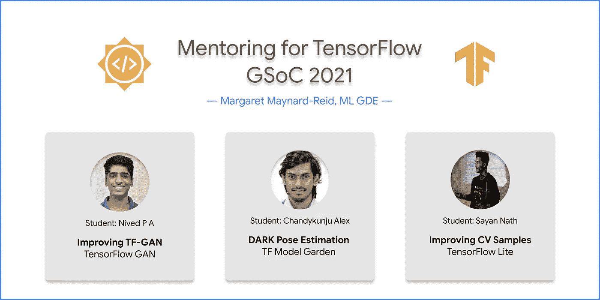

# TensorFlow GSoC 2021 辅导

> 原文：<https://medium.com/google-developer-experts/mentoring-for-gsoc-2021-tensorflow-eecaa9392102?source=collection_archive---------3----------------------->

## TF-GAN、TF Model Garden & Hub 和 TFLite

今年我受邀成为 TensorFlow 组织 [**谷歌代码之夏**](https://summerofcode.withgoogle.com/) (GSoC)的导师。在 GSoC 2021 期间，我在这些产品领域指导或共同指导了三名学生:**tensor flow-GAN**(TF-GAN)**tensor flow Model Garden&Hub**，以及 **TensorFlow Lite** (TFLite)。在这篇文章中，我想分享我作为 GSoC 导师的经验和我学生的 TensorFlow 项目。

Image by the author

# 谷歌代码之夏

GSoC 是一项全球性计划，通过与开源组织(例如 TensorFlow)合作进行为期 10 周的编程项目，将学生开发人员引入开源软件开发。TensorFlow 项目的导师大部分是谷歌人，由于我多年来对 TensorFlow 的贡献，我很荣幸被邀请。

# GSoC 导师责任

作为导师，我早期参与了学生提案的审查和选择过程。一旦方案选择得到组织的确认，每个学生都被通知他们的方案被接受，每个导师都被通知他们被分配的学生。来自 TensorFlow 团队的乔什·戈登帮助我们的导师加入该项目，并与学生配对。

> 如果你是学生，一定要写下你是谁，为什么解决一个特殊问题很重要，技术细节和可行的计划。

我每周会见我的每个学生，帮助他们了解项目范围、进度、技术问题和代码审查。导师还需要写两份评估:一份是项目中期评估，另一份是学生项目的期末评估。

> Protip:成为导师意味着指导和支持学生。作为一名导师，确保你实际上不是在为你的学生做工作；相反，如果他们陷入困境，帮助他们朝着正确的方向前进。学生们需要自己找出解决方案。

# 1.张量流 GAN (TF-GAN)项目

我指导了 [**尼维德·帕**](https://summerofcode.withgoogle.com/projects/#4563139045097472) ，他是*阿姆里塔工程学院*的本科生，负责 TensorFlow GAN (TF-GAN)项目。

TF-GAN 提供构建模块来帮助训练和评估 GAN 模型。Nived 写了他的建议，通过创建新的教程来展示如何使用 TF-GAN 库，并对库代码本身做出贡献，从而改进 TF-GAN 库。他写了一篇关于 ESRGAN 的 Colab 教程，我们也花了相当多的时间讨论和选择用于文本到图像生成的 GAN 模型。

虽然我在 GSoC 仪表板上被正式列为导师，但我要感谢来自日本谷歌人工智能的 Joel Shor，TF-GAN 图书馆的所有者。他在 Nived 的拉式请求(PRs)的项目范围讨论和代码审查方面提供了巨大的帮助。

在 [GSoC](https://summerofcode.withgoogle.com/projects/#4563139045097472) 和 [GitHub](https://github.com/nivedwho/GSoC-2021-TF-GAN) 上查看 Nived 的项目页面。

注:尼维德、乔尔和我正在写一篇关于 TF-GAN GSoC 2021 项目的博文。更多详情敬请关注！

# 2.TF 模型花园/中心:DARKpose 实现

我与 Jaeyoun Kim(来自 TensorFlow 模型花园团队)合作 DarkPose 项目，指导了丹麦技术大学的硕士生 Chandykunju Alex。

关键点(暗)姿态估计模型的分布感知坐标表示先前仅在 PyTorch 中实现，并且 Chandykunju 能够在 GSoC 期间在 TensorFlow 2.x / Keras 中实现具有暗姿态的基线。

有相当多的学生为 TensorFlow 模型园和枢纽。金在永、摩根·罗夫、萨亚克·保罗和我一起工作，分担所有学生的辅导责任。我们写了一个详细的指南，关于如何对 TF 模型花园及其编码风格做出贡献，如何开始 GCP，学生和导师的期望等。这有助于让学生更容易接受。我们，所有的导师和学员，也每两周见一次面。

在 [GSoC](https://summerofcode.withgoogle.com/projects/#6367695945072640) 和 [GitHub](https://github.com/chandyalex/GSoC-2021-TF-DarkPose) 上查看 Chandyhunju 的项目页面。

# 3.TensorFlow Lite 计算机视觉示例

我和曼梯·GDE·乔治·索洛比斯一起，共同指导[萨扬·纳特](https://summerofcode.withgoogle.com/projects/#4931401570320384)，他是*卡林加工业技术学院*的三年级本科生。他的任务是改进 TensorFlow Lite 的计算机视觉示例应用程序。

TensorFlow Lite (TFLite)是在设备上实现模型的设备上解决方案。关于如何在 Android 和 iOS 上实现 TFLite 模型，已经添加了相当多的计算机视觉(和 NLP)示例。保持这些样本的精简性是一项不小的任务:Java 对 Kotlin，Camera 2 对 CameraX。我们使用 TensorFlow 支持库还是任务库？

我与 TensorFlow Lite 团队合作:Meghna Natraj、王陆、Khanh LeViet 和田林。梅格娜和卢各自指导了一名学生。Khanh 帮助计算出样本应用程序改进的范围。Khanh 和 Tian 帮助 PRs 进行代码审查。

在 GSoC 、 [GitHub](https://github.com/sayannath/GSoC-Project-2021) 和 Medium 上的[博客](/geekculture/google-summer-of-code-21-project-tensorflow-project-110461f697af)上查看 Sayan 的项目页面。

# 下一步是什么？

虽然 GSoC 2021 已经结束，但大多数 GSoC 学生表示有兴趣在 GSoC 项目结束后继续他们的项目。我期待着看到我的学生继续他们的项目，并得到任何悬而未决的 PRs 合并。我们将通过非正式的指导或开源项目的合作，在 GSoC 之外保持联系。

# 承认

辅导 GSoC 2021TensorFlow、辅导学生开发人员以及与其他导师合作，这是一次令人难以置信的充实经历！

我要感谢我的学生**妮维德·帕娜**、**昌迪昆朱·亚历克斯**和**萨彦·纳特**、TensorFlow 团队:**乔什·戈登、** **乔尔·肖尔**、**金在永**、**摩根·罗夫、** **梅格娜·纳特拉杰**、**王陆**、**坎汉还有 ML GDEs **Sayak Paul** 和 **George Soloupis** 。**

非常感谢 **ML GDE** 计划、**谷歌云**和 **TensorFlow 研究云** (TFRC)的支持。