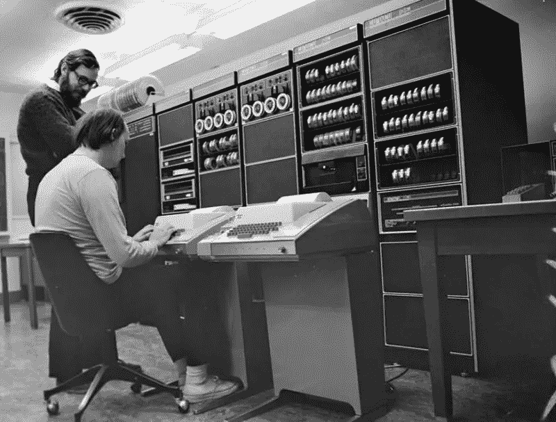
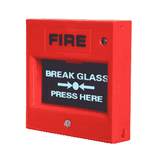

# Merancang Sistem dengan Kontrol Akses Least Privilege Supaya Bebas Dari Peretas

> 原文：<https://medium.easyread.co/merancang-sistem-dengan-kontrol-akses-least-privilege-supaya-bebas-dari-peretas-81f60dd23f3c?source=collection_archive---------1----------------------->

## Building Secure and Reliable Systems Series — Part 5

Apakah kamu seorang *engineer* yang bekerja di perusahaan digital? Pernah gak sih kantor kamu menganggap dirimu bukan orang baik-baik, yang sewaktu-waktu bakal merusak bisnis perusahaan? Tentu jawabannya tidak, mana ada sih perusahaan yang menganggap karyawan-karyawannya penjahat. Tapi coba bayangkan, jika kamu punya niat jahat, kira-kira apa yang bisa kamu lakukan untuk membuat kantor kamu bangkrut? Serangan apa yang bakal kamu lakukan? Gimana cara kamu meretas melalui sistem internal? Caranya supaya tidak terdeteksi? Bagaimana supaya jejak retasan kamu bisa bersih?

*Source: pixabay.com*

Atau, kalaupun kamu tidak punya niat jahat, apa kesalahan terbesar yang bisa kamu lakukan untuk membuat kegagalan pada sistem? Saat melakukan *debugging* untuk mengatasi gangguan pada sistem *production* , berapa perintah manual yang kamu ataupun teman kerjamu lakukan untuk memperbaiki sistem? Dari sekian banyak perintah manual tersebut, berapa jumlah perintah yang kamu beruntung jika ada typo atau salah *copy-paste* , sistem akan semakin parah gangguannya?

Manusia tidak mungkin bebas dari kesalahan. Sesuatu yang buruk bisa saja terjadi, dan pasti terjadi, kapanpun dan dimanapun. Entah itu kesalahan akibat dari mengetik dengan jari gemuk ( [fat-finger commands](https://en.wikipedia.org/wiki/Fat-finger_error#:~:text=A%20fat%2Dfinger%20error%20is,number%20of%20other%20input%20errors.) ), akun berhasil diretas, ataupun terkena [phishing](https://id.wikipedia.org/wiki/Pengelabuan) . Maka dari itu, kita harus bisa mendesain sistem untuk meminimalisasi atau menghilangkan dampak dari keburukan yang terjadi.

Source: pxfuel.com

Yuk kita bahas cara-cara terbaik untuk merancang dan mengoperasikan sistem dengan kontrol akses terbatas. Tulisan ini merupakan seri kelima intisari buku “Membangun Sistem yang Aman dan Andal (Building Secure & Reliable Systems)” karya tim SRE Google. Untuk membaca seri lainnya:

# Building Secure and Reliable Systems — Series List

[**1\. Pentingnya Membangun Sistem yang Aman dan Andal**](https://medium.com/easyread/pentingnya-membangun-sistem-yang-aman-dan-andal-a15f7a3f94eb)[**2.1\. Mengenal Lawan-Lawan dalam Membangun Sistem yang Aman dan Andal — Bagian 1**](https://medium.com/easyread/mengenal-lawan-lawan-dalam-membangun-sistem-yang-aman-dan-andal-bagian-1-8d6fb8bb22b3)[**2.2\. Mengenal Lawan-Lawan dalam Membangun Sistem yang Aman dan Andal — Bagian 2**](https://medium.com/easyread/mengenal-lawan-lawan-dalam-membangun-sistem-yang-aman-dan-andal-bagian-2-edf29bb74de0)[**3\. Meningkatkan Keamanan dengan Proksi, Sebuah Studi Kasus di Google**](https://medium.com/easyread/meningkatkan-keamanan-dengan-proksi-sebuah-studi-kasus-di-google-ddfc5e24fd6a)[**4\. Mempertimbangkan Aspek Keamanan dan Keandalan Sedari Awal**](https://medium.com/easyread/mempertimbangkan-aspek-keamanan-dan-keandalan-sedari-awal-68465a8814da) **5\. Merancang Sistem dengan Kontrol Akses Least Privilege Supaya Bebas Dari Peretas — You’re here**

Source: picpedia.org

# Konsep dan Terminologi

Sebelum kita lanjut ke pembahasan, yuk kita kenali dulu istilah-istilah yang banyak digunakan di industri, terutama yang berkaitan dengan sistem keamanan.

## Least Privilege

**Least privilege** , atau batasan hak akses yang paling rendah, adalah konsep yang mengharuskan pengguna untuk memiliki akses minimal yang diperlukan saja dalam menyelesaikan suatu operasi atau pekerjaan. Pengguna bisa berupa manusia ataupun bot.

## Zero Trust Networking

**Zero trust networking** *,* atau jaringan yang tidak terpercaya, adalah konsep yang mengatakan bahwa lokasi jaringan dimana pengguna berasal, baik di luar maupun di dalam jaringan internal perusahaan, tidak memiliki akses khusus. Misalnya, mengakses sistem dari portal jaringan di ruangan meeting kantor tidak membuat pengguna bisa mengakses sistem *production* secara bebas, namun sama saja seperti mengakses sistem dari internet publik. Seharusnya, sistem memberikan akses berdasarkan dari kredensial dan identitas pengguna saja.

## Zero Touch

**Zero touch** , atau menghindari sentuhan, merupakan inisiatif untuk meningkatkan keamanan sistem dan menghindari gangguan sistem dengan melarang sentuhan pengguna secara langsung pada mesin-mesin *production* . Seharusnya, pengguna mengakses *production* secara tidak langsung melalui peralatan dan automasi yang terkontrol.

# Cara-Cara Terbaik untuk Implementasi Model Least Privilege

Berikut ini cara-cara terbaik yang bisa kita lakukan untuk mengaplikasikan model *least privilege* untuk mengontrol akses sistem kamu:

## API dengan Fungsi Tertentu Saja

> Program harus dibuat untuk mengerjakan satu hal dengan baik. Kalau kita ingin mengerjakan hal yang baru, lebih baik membuat program yang baru daripada membuat program lama lebih kompleks lagi dengan menambahkan “fitur” baru **— Penemu sistem operasi** [**Unix**](https://id.wikipedia.org/wiki/Unix) **: McIlroy, Pinson, dan Tague**

Para pengembang sistem operasi Unix (source: wikipedia.org)

Menurut kutipan tersebut, sistem operasi Unix dikembangkan dengan sekumpulan alat-alat kecil dan sederhana yang dapat dikombinasikan. Misalnya: perintah [ls](https://id.wikipedia.org/wiki/Ls) , hanya berfungsi untuk navigasi direktori.

Lalu, apa yang dimaksud dengan API di sini? Maksudnya adalah: setiap sistem memiliki sebuah API, yang tidak lain merupakan *user interface* dari sistem di belakangnya. Beberapa API sistem sangat besar (seperti [POSIX API](https://id.wikipedia.org/wiki/POSIX) ), beberapa API relatif kecil (seperti [memcached](https://memcached.org/) dan [NATS](https://docs.nats.io/) ), dan beberapa sangat kecil (seperti [TinyURL](https://tinyurl.com/) dan [Google Fonts API](https://developers.google.com/fonts/docs/developer_api) ).

Terus, hubungannya API dengan akses dan keamanan sistem apa? Semakin luas kemampuan API, semakin besar pula risiko keamanannya. Kita ambil contoh POSIX API pada sistem operasi. Para pengguna UNIX biasa melakukan pengaturan dan administrasi sistem melalui *session* OpenSSH atau alat dengan skrip yang memanggil POSIX API. Karena seluruh fungsi POSIX API terekspos, cukup sulit untuk membatasi dan mengaudit operasi-operasi yang dilakukan pengguna selama *session* aktif. Kemudian, ini akan sangat berbahaya jika komputer yang memulai *session* tersebut diretas.

Solusinya adalah memperkecil dan memecah-mecah API besar menjadi bagian yang kecil-kecil. Setelah API berhasil dipecah, kita bisa mengaplikasikan prinsip *least privilege* untuk memberikan akses terbatas hanya yang diperlukan saja oleh pemanggil tertentu.

## Breakglass

**Breakglass** , atau yang berarti pecahkan kaca, adalah instruksi yang biasa ditemukan pada tombol alarm kebakaran untuk keadaan darurat. Dalam konteks sistem, *breakglass* merupakan sebuah mekanisme yang memberikan akses ke sistem saat keadaan darurat tanpa melalui otorisasi sama sekali.

Source: patigeni.com

## Audit

Audit biasanya dilakukan untuk mendeteksi kesalahan pada saat otorisasi. Hal ini bisa terjadi pada beberapa hal: operator sistem menyalahgunakan hak aksesnya, peretas eksternal berhasil meretas kredensial pengguna, ataupun *software* penipu mengeksekusi operasi terlarang pada sistem. Kemampuan kita untuk mengaudit dan mendeteksi anomali sangat bergantung pada sistem yang kita desain:

*   Seberapa granular kontrol akses diberikan untuk memutuskan seseorang boleh mengakses atau tidak? (Kapan? Dimana?)
*   Seberapa jelas kita dapat menangkap metadata yang berhubungan dengan *request* ? (Siapa? Kapan? Kenapa?)

## Pengujian Least Privilege

Pengujian atau *testing* merupakan properti dasar dari sistem yang didesain dengan baik. Ada dua dimensi penting soal pengujian yang berhubungan dengan prinsip *least privilege* :

*   **Menguji definisi *least privilege* :** memastikan bahwa akses benar-benar diberikan hanya untuk sumber daya yang diperlukan saja. Dalam konteks ini, kita harus bisa menguji bahwa sebuah profil pengguna yang terdefinisikan dengan baik (misalnya, *data analyst, customer support, sysadmin* ) memiliki akses yang cukup untuk melakukan *role* mereka di dalam pekerjaan, tapi tidak lebih. Untuk melakukannya, *test framework* kita harus bisa melakukan 3 hal: [1] deskripsikan spesifik akses yang diperlukan (API dan data mana, akses *read/write* ); [2] deskripsikan skenario testing apa yang ingin dioperasikan pada sistem ( *delete, administer, bulk read* ) beserta dampak yang dihasilkan; [3] jalankan semua skenario dan bandingkan dampak yang terjadi dengan yang diinginkan.
*   **Menguji dengan *least privilege* :** memastikan bahwa infrastruktur pengujian hanya memiliki akses yang diperlukan saja. Tidak ada artinya kalau kita menguji definisi *least privilege* tapi infrastruktur pengujian tidak melakukannya. Kita bisa memulai membuat infrastruktur pengujian dari 3 hal kecil: [1] pisahkan *environment* dan kredensial; [2] batasi tipe akses yang dimiliki infrastruktur; [3] batasi luasnya data yang bisa diakses.

## Menganalisis Alasan Akses tidak terotorisasi

Dalam sistem kompleks, dimana *least privilege* sudah diaplikasikan dan *trust* harus didapat melalui pihak ketiga ( *multi-party authorization* ), *policy* diimplementasikan secara granular pada berbagai *layer* di sistem. Akibatnya, penolakan *policy* dapat terjadi secara kompleks juga.

Supaya lebih mudah menjelaskannya, kita lihat sebuah contoh kasus. Misalnya, kita sudah memiliki sistem yang telah mengimplementasikan *policy* keamanan dengan baik. Lalu, sistem ini menolak akses pengguna karena tidak terotorisasi. Satu dari tiga kasus di bawah ini mungkin saja terjadi:

*   Akses pengguna memang ditolak secara benar dan sistem berfungsi sesuai harapan. *Least privilege* telah diterapkan dan semuanya berjalan dengan baik.
*   Akses pengguna memang ditolak secara benar tapi akses bisa didapat dengan kontrol akses ( *multi party authorization* ) untuk mendapatkan akses sementara.
*   Pengguna merasa aksesnya ditolak karena kesalahan sistem. Dalam hal ini, pengguna akan melapor dan membuat *support ticket* untuk tim keamanan. Ini bisa saja terjadi jika pengguna telah dikeluarkan dari grup yang terotorisasi, atau *policy* telah berubah.

Untuk semua kasus di atas, pengguna tidak mengetahui alasannya sama sekali aksesnya ditolak. Bolehkah sistem memberikan informasi yang lebih detail soal hal ini? Jawabannya tergantung pada tingkatan hak akses yang dimiliki pengguna. Untuk pengguna dengan hak akses yang sangat terbatas, alasan penolakan harus tetap tersembunyi. Namun, untuk pengguna yang memiliki hak akses lebih, sistem dapat memberikan *token* yang berkaitan dengan penolakan. Pengguna dapat menggunakan *token* ini untuk memanggil *multi party authorization* , ataupun memberikan *token* ini ke tim keamanan untuk dianalisis lebih lanjut.

## *Graceful Failure* dan Mekanisme Breakglass

Pada situasi ideal, kita tidak perlu berurusan dengan sistem otorisasi yang sudah berjalan baik dengan *policy* yang masuk akal. Namun, pada kenyataannya bisa saja terjadi kesalahan pada sistem, misalnya, menolak akses semua pengguna tanpa sebab, karena kesalahan saat pembaruan sistem. Dalam hal ini, kita perlu sebuah mekanisme yang bisa melangkah sistem otorisasi untuk memperbaikinya. Ini yang dinamakan dengan mekanisme *breakglass* .

Untuk mengimplementasikan mekanisme *breakglass* , kita perlu mengikuti aturan-aturan ini dengan seksama:

*   Menggunakan mekanisme *breakglass* harus menjadi langkah terakhir yang dilarang pada situasi normal. Hanya boleh digunakan oleh tim SRE yang bertanggung jawab terhadap SLA sistem.
*   Mekanisme *breakglass* untuk *zero trust networking* hanya boleh digunakan dari lokasi tertentu saja. Lokasi ini merupakan ruang darurat, dengan kontrol akses fisik tambahan.
*   Semua penggunaan mekanisme *breakglass* harus dimonitor secara seksama.
*   Mekanisme *breakglass* harus diuji secara berkala oleh tim yang bertanggung jawab terhadap *production* , sehingga betul-betul bisa digunakan saat diperlukan.

Saat mendesain sistem yang kompleks, model *least privilege* merupakan cara yang paling aman untuk memastikan pengguna memiliki akses untuk bisa melakukan pekerjaan mereka, tapi tidak lebih. Mengimplementasikan semua cara terbaik untuk *least privilege* yang mudah diadopsi dan tidak berdampak pada produktivitas secara drastis, memerlukan komitmen perusahaan. Komitmen ini terdiri dari adanya tim keamanan khusus yang bertanggung jawab terhadap semua pengguna, memastikan praktik-praktik ini dilakukan, dengan adanya konsultasi keamanan, definisi *policy* , deteksi ancaman, dan dukungan untuk menyelesaikan berbagai macam isu keamanan.

Penulis merupakan penggiat sistem Cloud, Kubernetes, dan Container di Indonesia. Silahkan ikuti dan bertanya melalui akun [Twitternya](https://twitter.com/girikuncoro) . Ia seorang [CNCF ambassador](https://www.cncf.io/people/ambassadors/) , [Google Developer Expert](https://developers.google.com/community/experts) , dan [Kubernetes maintainer](https://k8s.devstats.cncf.io/d/66/developer-activity-counts-by-companies?orgId=1&var-period_name=Last%20quarter&var-metric=contributions&var-repogroup_name=All&var-country_name=All&var-companies=All) . Gabung dengan grup [telegram Kubernetes dan Cloud Native Indonesia](http://t.me/kubernetesindonesia) untuk diskusi berbagai hal menarik seputar perkembangan teknologi Cloud Native, atau bantu menerjemahkan [dokumentasi Kubernetes](http://kubernetes.io/id) ke [bahasa Indonesia](http://bit.ly/k8s-docs-id-m4) .