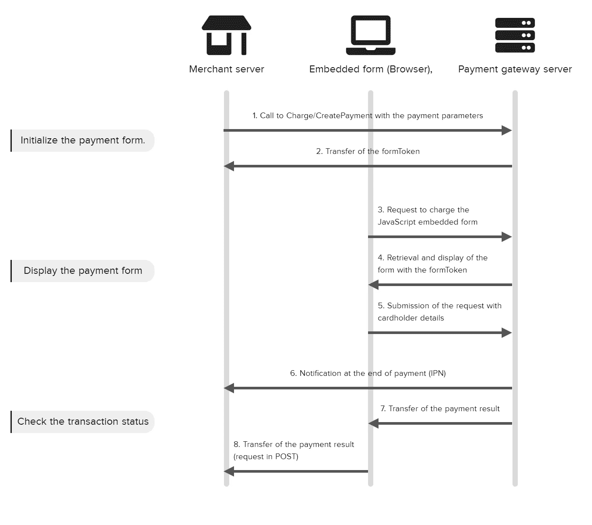
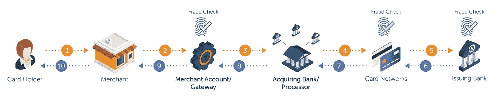
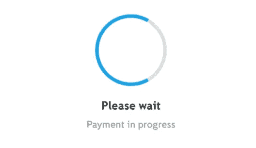

# 商户-支付网关集成原则

> 原文：<https://medium.com/globant/merchant-payment-gateway-integration-principles-6eef4bb81a16?source=collection_archive---------2----------------------->

本文将有助于理解支付网关集成基础的原理。该设计方法可扩展至任何平台，仅限于支付网关提供的功能和解决方案。`
尽管支付集成中涉及许多其他实体，但以下是无论我们选择何种平台或方法都需要且存在的实体:

**商人**
1。web/前端平台:供客户下单和管理订单
2。商户服务器:用于客户订单、预订、支付记录、*认证等订单相关管理* **支付网关**
1。web/前端:供客户输入他们的支付卡信息。下面例子中的嵌入式表单(浏览器)2
。支付网关服务器:用于处理&支付验证

Merchant Payment Gateway Integration

# 商家服务器

出于与支付相关的安全原因，商家服务器起着至关重要的作用，并且为了避免欺诈操作，支付网关依赖于必须总是由商家提供的商家服务器。

这个商业服务器响应几个需求:

1.  **验证必须传输到支付网关的交易**，该支付网关对应于商家网站上的购买，并且交易的金额和货币匹配。
2.  **通过支付网关安全存储通信密钥**
3.  在每次支付事件(接受、拒绝、失败、取消等)时，从支付网关接收即时**通知**。).

# 支付网关

一旦客户开始为订单付款，交易数据就会通过加密的 SSL 通道传递到支付网关。支付网关进一步使用交易信息进行支付处理。如果支付网关需要存储任何数据，这些数据将被存储在特定类型的安全存储中。通常，网关不存储实际的信用卡号码，而是保存令牌。

Customer Card Payment Processing

1.  支付处理员- 信息传递给支付处理员。这些公司作为第三方提供支付处理服务。支付处理器与商家账户和支付网关相连，来回传输数据。在那个阶段，支付处理器将交易传递给卡网络(Visa、Mastercard、American Express 等)。).
2.  **卡处理器-** 卡网络(Visa/Mastercard/Amex)的作用是验证交易数据，并将其传递给发卡行(制作持卡人信用卡/借记卡的银行)。
3.  **发卡行-** 发卡行也接受或拒绝授权请求。作为响应，银行向支付处理器发回一个代码，其中包含交易状态或错误详细信息。

# 安全最佳实践

商户与支付网关的集成可能会给平台带来许多安全漏洞。如果没有针对任何潜在的安全后果审查和分析设计、方法、解决方案和实施，可能会产生严重的影响。所有这些都需要小心处理，以防可能导致的任何泄漏和损坏。

1.  敏感客户信息的存储和检索，
2.  法律要求、客户数据保护、
3.  客户权利、偏好和选择，
4.  财务数据从一个平台到另一个平台的透明移动

1.  **安全数据共享&验证-*商户&支付网关之间的数据通信需要非常安全。对于大多数支付网关集成，从商家发送到网关的请求数据包含每个订单的唯一验证码。这个唯一的验证码是用加密算法(如 DES、AES 等)生成的..)获取所有与订单&支付相关的输入和一个额外的秘密散列密钥。该秘密散列密钥与需要它来验证交易的所有各方共享。***
2.  ***安全通信-** 大多数情况下，商家和支付网关会在自己的终端维护安全网站。但是当我们将支付网关与商家集成时，我们将在商家和支付网关之间有多个中继&跳。如果通信通道不够安全，我们可能会在从一台服务器到另一台服务器的传输过程中丢失数据。确保服务器之间的正确握手并拥有所需的协议、证书、SSL 或 TLS 层将有助于最小化任何种类的损失和安全风险。*
3.  ***保护客户数据-** 在保护敏感客户数据时，需要采取足够的措施和步骤。对客户数据泄露应该零容忍。通常，应用程序的设计会使用正确的 SSL、TLS、协议或正确的签名证书来保护数据共享网络的安全。但与此同时，还有各种其他领域，如代码、日志、缓存、API 跟踪和其他后端服务器脚本，我们需要保护。*

# *交易鸟瞰*

*最后，一旦商家和支付网关的集成上线，就需要额外的监督和跟踪*

**

1.  ***监控-** 工具&仪表板将在识别客户在平台上下单和付款时可能面临的任何问题方面发挥明智的作用。应针对任何突发事件的错误和潜在行程设置警报，以便及时采取行动。*
2.  ***分析-** 工具&显示趋势和客户导向的仪表板有助于企业了解产品的价值和投资，也有助于他们认识客户行为和模式，最终引导他们成熟产品。*

# *结论*

*当你在寻找这样一个集成的解决方案和设计时，所有这些关于商户和支付网关集成的信息将会是你的启动工具。*

*我们都知道选择合适的支付合作伙伴至关重要，但如何选择也很重要。当我们寻找安全性、身份验证、数据交换机制、处理时间、通信和支付灵活性的正确指标时，本文将帮助您了解所有基础知识，并帮助您选择正确的合作伙伴。*