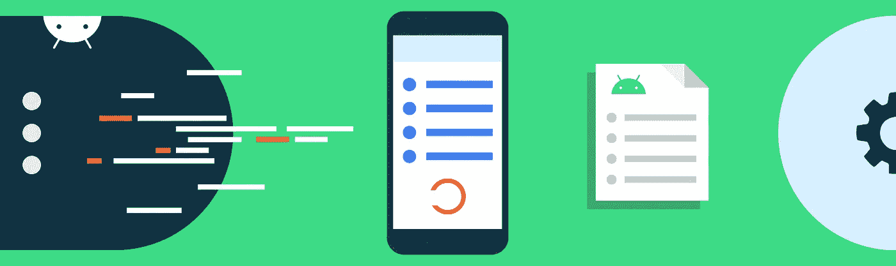
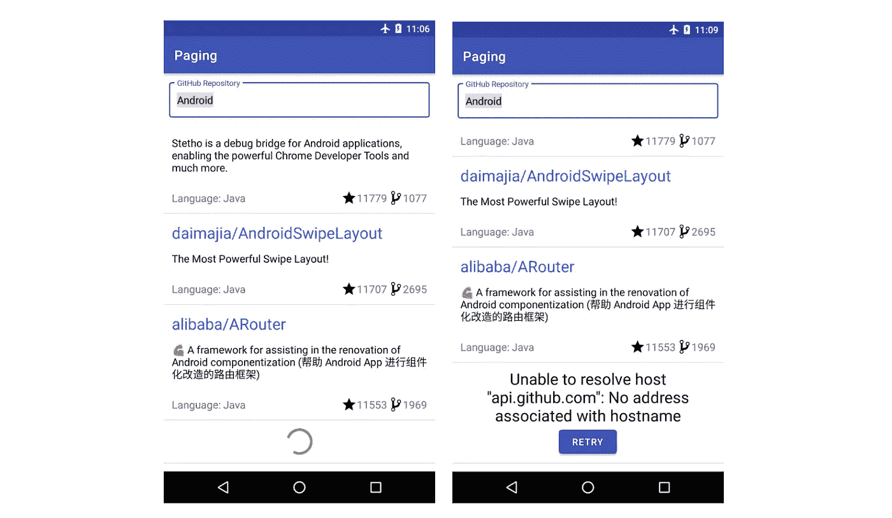
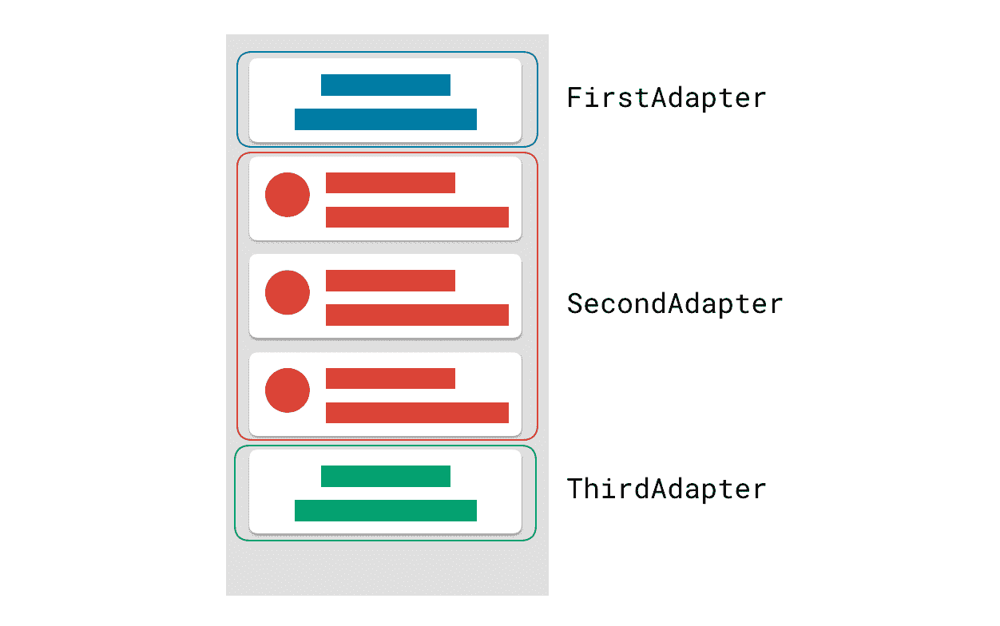

# 用 ConcatAdapter 按顺序连接适配器

> 原文：<https://medium.com/androiddevelopers/merge-adapters-sequentially-with-mergeadapter-294d2942127a?source=collection_archive---------0----------------------->



Illustration by [Virginia Poltrack](https://twitter.com/vpoltrack)

## 用例示例:显示列表页眉和页脚

`[ConcatAdapter](https://developer.android.com/reference/androidx/recyclerview/widget/ConcatAdapter)`是`[recyclerview:1.2.0-alpha02](https://developer.android.com/jetpack/androidx/releases/recyclerview)`中的一个新类，它可以让你连续组合多个`[adapters](https://developer.android.com/reference/androidx/recyclerview/widget/RecyclerView.Adapter)`显示在一个`[RecyclerView](https://developer.android.com/reference/androidx/recyclerview/widget/RecyclerView)`中。这使您能够更好地封装适配器，而不是将许多数据源组合到一个适配器中，从而保持它们的集中性和可重用性。

这方面的一个用例是在页眉或页脚中显示列表加载状态:当列表从网络检索数据时，我们希望显示一个进度微调器；如果出现错误，我们希望显示错误和一个重试按钮。



A RecyclerView with a footer displaying the loading state: progress or error

# 介绍 Concat `Adapter`

`ConcatAdapter`允许我们按顺序显示多个适配器的内容。例如，假设我们有以下 3 个适配器:

```
val firstAdapter: FirstAdapter = …
val secondAdapter: SecondAdapter = …
val thirdAdapter: ThirdAdapter = …val concatAdapter = ConcatAdapter(firstAdapter, secondAdapter, 
     thirdAdapter)recyclerView.adapter = concatAdapter
```

`recyclerView`将依次显示来自每个适配器的项目。

拥有不同的适配器允许您更好地分离列表中每个连续部分的关注点。例如，如果您想要显示一个标题，您不需要将与标题显示相关的逻辑放在处理列表显示的同一个适配器中，而是可以将它封装在它自己的适配器中。



RecyclerView and Adapter data

# 在页眉和页脚中显示加载状态

我们的页眉/页脚要么显示进度指示器，要么报告错误。当列表成功完成加载时，页眉/页脚不应该显示任何内容。因此，它们可以被表示为具有 0 或 1 个项目的列表，并且具有它们自己的适配器:

```
val concatAdapter = ConcatAdapter(headerAdapter, listAdapter, 
    footerAdapter)recyclerView.adapter = concatAdapter
```

如果页眉和页脚使用相同的布局、`ViewHolder`和 UI 逻辑(例如，何时显示进度以及如何显示)，你可以只实现一个`Adapter`类并创建它的两个实例:一个用于页眉，一个用于页脚。

要获得完整的实现，请查看这个[拉请求](https://github.com/googlecodelabs/android-paging/pull/46/files)，它增加了:

*   一个`[LoadState](https://github.com/googlecodelabs/android-paging/blob/step1_mergeadapter/app/src/main/java/com/example/android/codelabs/paging/ui/LoadState.kt)`，从`[ViewModel](https://github.com/googlecodelabs/android-paging/blob/step1_mergeadapter/app/src/main/java/com/example/android/codelabs/paging/ui/SearchRepositoriesViewModel.kt)`中暴露出来
*   加载状态页眉和页脚布局
*   一个用于页眉和页脚的`[ViewHolder](https://github.com/googlecodelabs/android-paging/blob/step1_mergeadapter/app/src/main/java/com/example/android/codelabs/paging/ui/ReposLoadStateViewHolder.kt)`对象
*   根据`LoadState`显示 0 或 1 项的`[ListAdapter](https://github.com/googlecodelabs/android-paging/blob/step1_mergeadapter/app/src/main/java/com/example/android/codelabs/paging/ui/ReposLoadStateAdapter.kt)`。每次`LoadState`改变时，我们通知该项目需要改变、插入或移除(见[代码](https://github.com/googlecodelabs/android-paging/blob/step1_mergeadapter/app/src/main/java/com/example/android/codelabs/paging/ui/ReposLoadStateAdapter.kt#L30))。

# 🔎关于 ConcatAdapter 的更多信息

## 观众

默认情况下，每个适配器维护自己的`[ViewHolder](https://developer.android.com/reference/androidx/recyclerview/widget/RecyclerView.ViewHolder)`池，适配器之间没有重用。如果多个适配器显示相同的`ViewHolder`，我们可能希望在它们之间重用实例。我们可以通过用一个`[ConcatAdapter.Config](https://developer.android.com/reference/androidx/recyclerview/widget/ConcatAdapter.Config)`对象构造我们的`ConcatAdapter`来实现这一点，其中`[isolateViewTypes](https://developer.android.com/reference/androidx/recyclerview/widget/ConcatAdapter.Config#isolateViewTypes) = false`。像这样，所有合并的适配器将使用相同的视图池。在加载状态页眉和页脚示例中，两个`ViewHolders`实际上将显示相同的内容，因此我们可以重用它们。

⚠️要支持不同的`ViewHolder`类型，就应该实现`Adapter.[getItemViewType](https://developer.android.com/reference/androidx/recyclerview/widget/RecyclerView.Adapter#getItemViewType(int))`。当你重用`ViewHolders`时，确保相同的视图类型不会指向不同的`ViewHolders`！这方面的一个最佳实践是返回布局 ID 作为视图类型。

## 使用稳定的 id

不要将稳定的 id 与`[notifyDataSetChanged](https://developer.android.com/reference/androidx/recyclerview/widget/RecyclerView.Adapter#notifyDataSetChanged())`一起使用，建议使用适配器的特定 notify 事件，这些事件给`RecyclerView`更多关于数据集中变化的信息。这使得`RecyclerView`可以更有效地更新 UI，并有更好的动画效果。如果您使用的是`[ListAdapter](https://developer.android.com/reference/kotlin/android/widget/ListAdapter)`，那么在`[DiffUtil](https://developer.android.com/reference/androidx/recyclerview/widget/DiffUtil)`回调的帮助下，通知事件会在幕后为您处理。但是如果你确实需要使用稳定 id，`ConcatAdapter.Config`为稳定 id 提供了 3 种不同的配置:`[NO_STABLE_IDS](https://developer.android.com/reference/androidx/recyclerview/widget/ConcatAdapter.Config.StableIdMode#NO_STABLE_IDS)`、`[ISOLATED_STABLE_IDS](https://developer.android.com/reference/androidx/recyclerview/widget/ConcatAdapter.Config.StableIdMode#ISOLATED_STABLE_IDS)`和`[SHARED_STABLE_IDS](https://developer.android.com/reference/androidx/recyclerview/widget/ConcatAdapter.Config.StableIdMode#SHARED_STABLE_IDS)`。最后两个要求您在适配器中处理稳定的 id。查看`[StableIdMode](https://developer.android.com/reference/androidx/recyclerview/widget/ConcatAdapter.Config.StableIdMode)`文档，了解它们如何工作的更多信息。

## 数据更改通知

当`ConcatAdapter`的适配器部分调用一个通知函数时，`ConcatAdapter`在更新`RecyclerView`之前计算新的项目位置。

从`RecyclerView`的角度来看，`[notifyItemRangeChanged](https://developer.android.com/reference/androidx/recyclerview/widget/RecyclerView.Adapter#notifyItemRangeChanged(int,%20int))`的意思是物品是一样的，只是内容变了。`[notifyDataSetChanged](https://developer.android.com/reference/androidx/recyclerview/widget/RecyclerView.Adapter#notifyDataSetChanged())`表示前后没有关系。因此，我们不能将`notifyDataSetChanged`映射到`notifyItemRangeChanged`。

如果一个适配器调用`Adapter.notifyDataSetChanged`，那么`ConcatAdapter`也会调用`Adapter.notifyDataSetChanged`，而不是`Adapter.notifyItemRangeChanged`。像往常一样，使用`RecyclerViews`避免调用`Adapter.notifyDataSetChanged()`，更喜欢更细粒度的更新，或者使用自动完成此任务的`Adapter`实现，如`[ListAdapter](https://developer.android.com/reference/kotlin/androidx/recyclerview/widget/ListAdapter)`或`[SortedList](https://developer.android.com/reference/androidx/recyclerview/widget/SortedList)`。

## 寻找取景框位置

您过去可能使用过`[ViewHolder.getAdapterPosition](https://developer.android.com/reference/androidx/recyclerview/widget/RecyclerView.ViewHolder#getAdapterPosition())`来获得适配器中`ViewHolder`的位置。现在，因为我们正在合并多个适配器，所以使用`[ViewHolder.getBindingAdapterPosition()](https://developer.android.com/reference/androidx/recyclerview/widget/RecyclerView.ViewHolder#getBindingAdapterPosition())`。如果你想得到最后绑定一个`ViewHolder`的适配器，在你共享`ViewHolders`的情况下，使用`[ViewHolder.getBindingAdapter()](https://developer.android.com/reference/androidx/recyclerview/widget/RecyclerView.ViewHolder#getBindingAdapter())`。

仅此而已！如果您想要顺序显示不同类型的数据，这些数据将受益于封装在它们自己的适配器中，那么开始使用`ConcatAdapter`。对于`ViewHolder`池和稳定 ids 的高级控制，使用`ConcatAdapter.Config`。