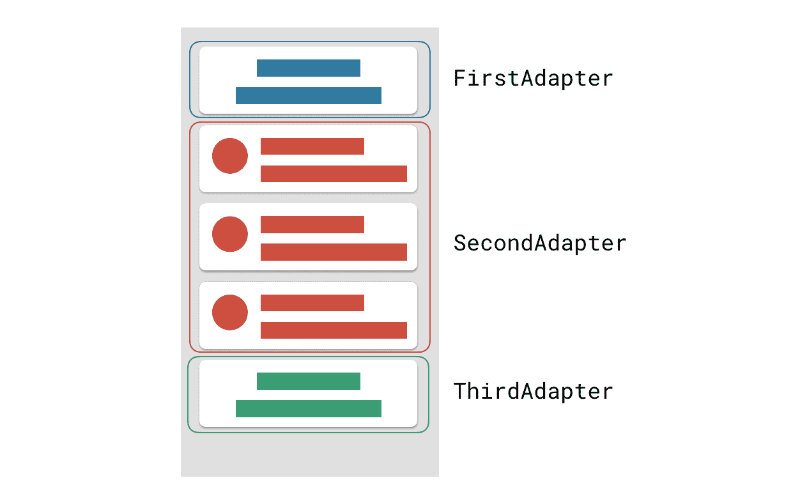
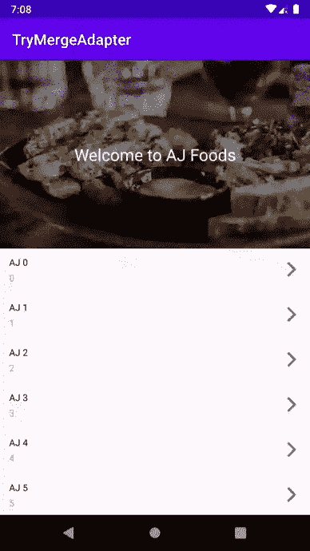

# ConcatAdapter:将多个适配器合并或组合成一个 ConcatAdapter

> 原文：<https://medium.com/globant/merge-multiple-adapters-into-single-mergeadapter-c778b15a6020?source=collection_archive---------7----------------------->

Photo by [Max Duzij](https://unsplash.com/@max_duz?utm_source=medium&utm_medium=referral) on [Unsplash](https://unsplash.com?utm_source=medium&utm_medium=referral)

当在 RecyclerView 中处理复杂的 UI 或多视图类型场景时，我们通常将许多数据源合并到一个适配器中，然后根据业务逻辑在适配器中区分它们，并相应地设置 UI。很多时候，即使对于一个简单的页眉页脚逻辑，我们也需要将它合并到一个源代码中，然后编写另一个逻辑来分离它。编写分离逻辑是一项重复的工作，我想几乎所有的开发人员都做过。

现在[d.android.com](https://developer.android.com/)已经引入了`[ConcatAdapter](https://developer.android.com/reference/androidx/recyclerview/widget/ConcatAdapter)`，在这种情况下，我们可以将多视图类型 ui 分离到不同的适配器中，这些适配器随后可以顺序合并到单个适配器中(称为 ConcatAdapter)。实现这一点将有助于将适配器逻辑拆分成它自己的适配器，这将使代码**更具可重用性**和**更少的错误。**

下面是带有多个适配器的列表的结构

RecyclerView and Adapter data

`[ConcatAdapter](https://developer.android.com/reference/androidx/recyclerview/widget/ConcatAdapter)`是`[recyclerview:1.2.0-alpha02](https://developer.android.com/jetpack/androidx/releases/recyclerview)`中新增的一个类，可以让你将多个`[adapters](https://developer.android.com/reference/androidx/recyclerview/widget/RecyclerView.Adapter)`依次组合在一个`[RecyclerView](https://developer.android.com/reference/androidx/recyclerview/widget/RecyclerView)`中显示。实现这一点非常简单。我们将采取一个例子，我们将有一个带有页眉和页脚的列表。

如果我们以现有的方式实现上面的例子，那么我们将把页眉和页脚逻辑添加到一个适配器中，然后在适配器内部，我们将借助 **getItemViewType** 来区分它。

上述内容不需要在新的 ConcatAdapter 中完成。下面是它的例子。

## 标题适配器

HeaderAdapter

标题适配器仅包含标题的业务逻辑。以现有的方式，这个逻辑应该在具有处理列表项的逻辑的适配器中。下面是适配器，除了页眉和页脚之外还有列表项。

## 列表适配器

ListAdapter

上面的列表适配器非常简洁，只包含处理列表数据的逻辑。现在继续看页脚适配器。

## 页脚适配器

在这个例子中，我使用了相同的页眉适配器，所以页脚没有不同的适配器。唯一的事情是我正在为页脚创建页眉适配器的另一个实例。现在转到活动，我们将把适配器设置到**回收视图**

## 活动

这是编译和执行时的演示。

Demo

谢谢，下面是上面用 Concat Adapter 实现的例子的代码。

 [## ajinkyasaswade 09/ExampleMergeAdapter

### 一个 MergeAdapter 的演示程序，由弗洛里纳·蒙特内斯库描述，MergeAdapter 是一个新的类，在…

github.com](https://github.com/ajinkyasaswade09/ExampleMergeAdapter.git) 

## 关于 ConcatAdapter 的更多信息

关于这个话题的更多信息，你可以访问下面的链接

 [## 用 MergeAdapter 按顺序合并适配器

### 用例示例:显示列表页眉和页脚

medium.com](/androiddevelopers/merge-adapters-sequentially-with-mergeadapter-294d2942127a) 

我要感谢[弗洛里纳·蒙特纳斯库](https://medium.com/u/d5885adb1ddf?source=post_page-----c778b15a6020--------------------------------)🙏为我们提供了关于 **ConcatAdapter** 主题的更新。我希望上面的例子有助于您理解 ConcatAdapter。如果上面有任何需要改正的地方，请让我知道，以便我可以改正。

另外如果你在这篇文章中发现了一些有用的东西，别忘了给个*👏🏼如果你想联系，请通过下面的任何社交链接打招呼。*

 [## 阿金克亚·萨斯韦德

### Ajinkya Saswade 的最新推文(@ajusaswade)。# Android | # kot Lin | # Flutter | # Dart | # Java |移动开发者…

twitter.com](https://twitter.com/ajusaswade)  [## Ajinkya Saswade -软件工程师- Globant | LinkedIn

### 查看 Ajinkya Saswade 在全球最大的职业社区 LinkedIn 上的个人资料。阿金克亚有一个工作列在…

www.linkedin.com](https://www.linkedin.com/in/ajinkya-saswade)