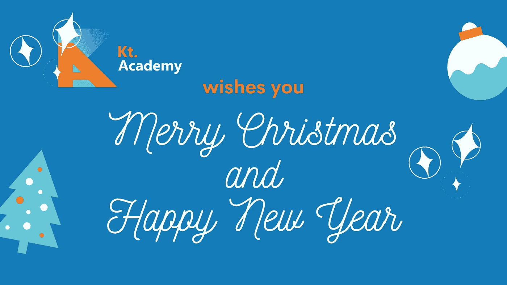
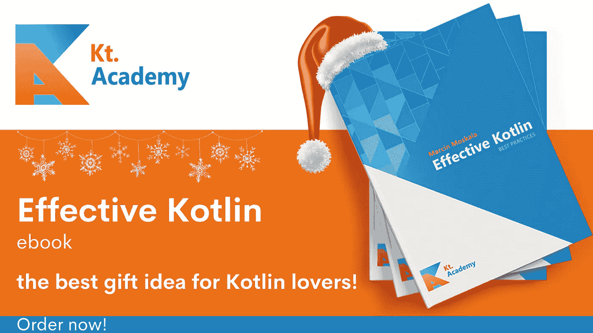
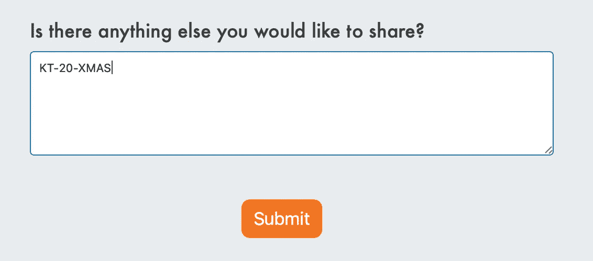

# 圣诞快乐！🎅

> 原文：<https://blog.kotlin-academy.com/merry-christmas-kotliners-6648d926303?source=collection_archive---------0----------------------->

> 这是疯狂而奇怪的一年，但我们希望这些圣诞节充满和平、欢乐和休息。当然，还有食物！*🤤*

为了让这次更特别，我们为你准备了一些礼物🎁

**有效的科特林电子书折扣**

我们知道发展自己和拓宽视野是多么重要，所以我们想给你一个**特别折扣**购买有效的科特林电子书🎄这是 Kotlin 开发人员如何成为优秀 Kotlin 开发人员的指南——绝对是送给所有 Kotlin 爱好者的最佳礼物！

只需点击[此链接](https://leanpub.com/effectivekotlin/c/XMAS_discount)并以折扣价订购您的电子书！

[有效的科特林电子书—圣诞节 _ 折扣](https://leanpub.com/effectivekotlin/c/XMAS_discount)

**车间折扣💰**

你最近有没有想过学习一些新的东西或者提高你现有的知识？如果是这样的话，给你——我们所有的车间都有 20%的折扣！

❄️选择了一条路线。❄️填写表格。
❄️write❗**kt-20-xmas**❗in“附加信息”栏，获得正常价格的 20%折扣！

不要错过它！🤩 [Kt。学院研讨会](https://kt.academy/workshop)

如果你还需要什么，请告诉我们！

**圣诞快乐，编码快乐！**
*Kt。学院队*