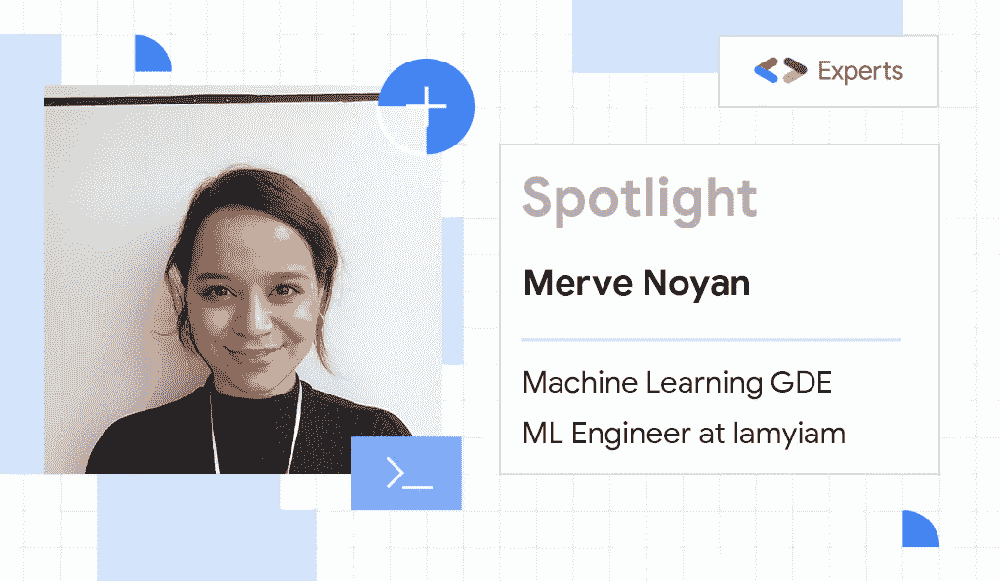
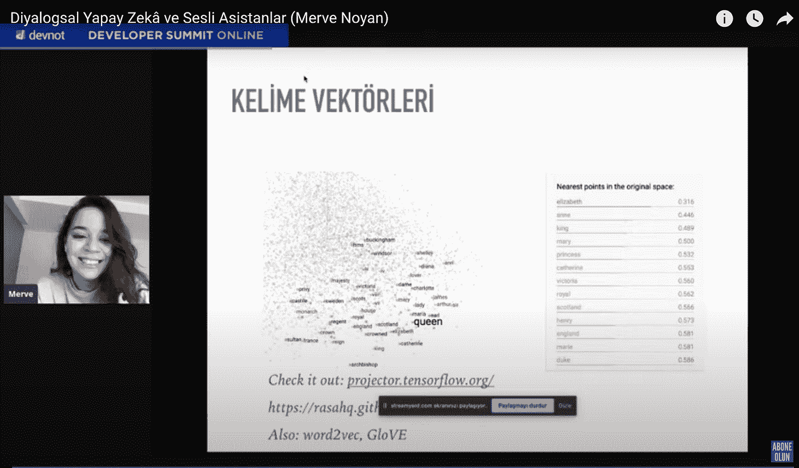
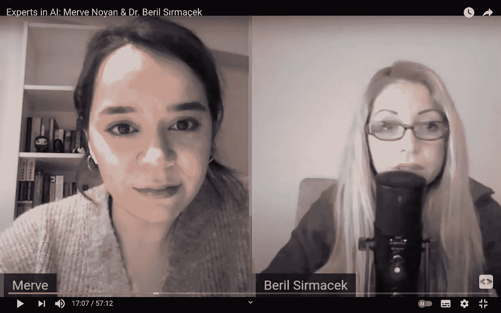

# Merve Noyan:给机器学习领域的女性一个声音

> 原文：<https://medium.com/google-developer-experts/merve-noyan-giving-women-in-machine-learning-a-voice-8ae3577f63de?source=collection_archive---------1----------------------->

[*谷歌开发者专家*](https://developers.google.com/community/experts) *是一个充满激情的开发者社区，他们喜欢与他人分享他们的知识。有 150 多名妇女。****# WomenAreExperts****是一个以她们的故事和成就为特色的系列，旨在激励更多的女性追随她们的道路。*

*今天来认识一下*[*Merve Noyan*](https://merveenoyan.medium.com/)*——机器学习领域的 Google 开发者专家，机器学习工程师。*

你是何时、如何成为一名 ML 工程师的？

我在本科期间选修了一门数据科学课程，了解了数据科学和机器学习，我非常喜欢它！毕业后，我花了六个月的时间参加训练营，学习更多知识，准备作品集，参加面试，然后我得到了我的第一份工作，成为一名 ML 工程师。

电影《她》给我留下了非常深刻的印象。这是关于乔阿金·菲尼克斯爱上一个由斯嘉丽·约翰逊配音的虚拟助理。今天，我正在制作一个虚拟伴侣，名为[“Syd”](https://youtu.be/EOItnWvl_4I)，它也能提高你的生活质量。我喜欢会说话的机器。我也举办关于如何制作你自己的聊天机器人，以及一般自然语言处理的研讨会。目前，我是一名 ML 工程师，正在攻读数据科学硕士学位，同时也在努力寻找时间活跃于开发者社区。

**在 ML 世界里做女人是怎样一种体验？**

我不认为这和做人有什么不同。我们做的基本是一样的。我觉得成功就是和善解人意的善良的人一起做自己热爱的事情，我这样定义自己是成功的。我喜欢我现在的位置，但我也知道不是每个女人都像我一样幸运地在友好的环境中工作。

你是如何回馈开发者社区的，为什么？

我喜欢出去。进入社区真的很容易，尤其是现在一切都在网上进行。我从社区中学到了很多，另一种学习方式是教其他人你想学的东西。到目前为止，我在谷歌开发者生态系统和其他社区和峰会上举办了关于自然语言处理、语言模型和数据科学的研讨会。

My workshop on NLP and virtual assistants in devnot developer summit

2020 年，我们组织了一场名为 [ML days](https://www.youtube.com/watch?v=spvNr8bRm78&t=3754s&ab_channel=GoogleDeveloperCommunitiesTurkey) 的活动，在活动中，我们教人们如何建立从探索性数据分析到 tensorflow 部署的端到端机器学习管道。

去年年底，我在土耳其 GDG 制作了一个名为[【人工智能专家】](https://www.youtube.com/watch?v=kvDOMd7Cbew&feature=youtu.be)的视频系列，在那里我接待了人工智能工程师、研究人员和人工智能教授。

My Experts in AI talk with Dr. Beril Sırmaçek, Asst. Prof. of Computer Vision in Johnkoping University

到目前为止，我已经做了四集，和一些了不起的女性交谈，比如科大学的助理教授 Fatma Güney 博士。她之前在牛津大学视觉几何小组工作。她的最新工作是自动驾驶中的计算机视觉，我们谈到了她的工作和自动驾驶汽车中视觉鲁棒性的挑战。

我最近的客人是[Beril srma ek](https://www.youtube.com/watch?v=Vh6Z6wSVBVI&t=2s)博士，在 Jonkoping 大学工作的计算机视觉助理教授。她之前在德国航空航天中心工作，开发了一个人群监控项目，防止人们在大型活动中因踩踏而死亡。2010 年德国爱情大游行就发生过这样的事故。舍马克博士还谈到了人群监控技术的潜在恶意使用。

她的主要研究方向是医学成像中的三维重建和移动机器人导航。我们谈到了由于发展中国家的医院缺乏足够的成像设备而导致的数据稀缺和数据质量方面的挑战，以及医学成像如何能够大大节省医生的时间。

我与人工智能专家项目的主要目的是给在这一领域工作的女性一个平台来讲述她们的故事，分享她们工作中的挑战，她们专业领域的范式以及她们作为女性在人工智能工作中所忍受的一切。我真的很喜欢每一次谈话。下个月，我将开始和业内我真正钦佩的人一起主持我自己的播客。

**如果你能许一个与科技行业女性相关的愿望，你会许什么？**

他们应该更加勇敢。有一种认知偏见，女人认为她们在编码方面不如男人，当阿达·洛芙莱斯是第一个程序员，玛格丽特·哈米尔顿用她的代码把我们带到了月球，格蕾丝·赫柏发明了第一个编译器(有趣的事实:她是第一个在电脑里发现真正的虫子，一只飞蛾的人，所以我调试的时候会想到她！).我遇到了在我的领域工作的了不起的女性，她们做着令人难以置信的工作，我希望她们的话能被传播出去，激励各地的女孩停止怀疑自己。

**感谢您的聊天！**

*如果你有兴趣加入* [*谷歌开发者专家*](https://developers.google.com/community/experts) *计划，* [*填写此兴趣表*](https://docs.google.com/forms/d/e/1FAIpQLSf_erRFX8n2Vh_Nv23W0g7807HV01l0H8cZlh9eII190oIPSA/viewform) ***。***

*从我们的节目上查看最新的*[*Twitter*](https://twitter.com/GoogleDevExpert)*和*[*Linkedin*](https://www.linkedin.com/showcase/experts-program/posts/?feedView=all)*。*