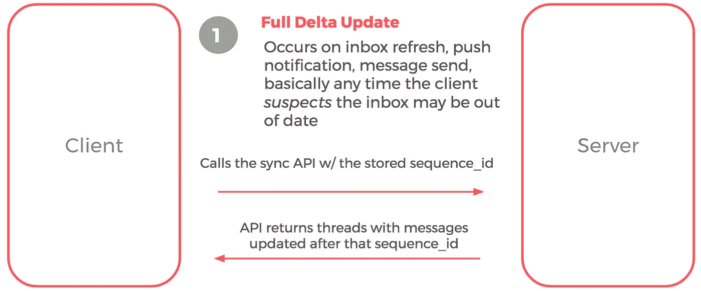
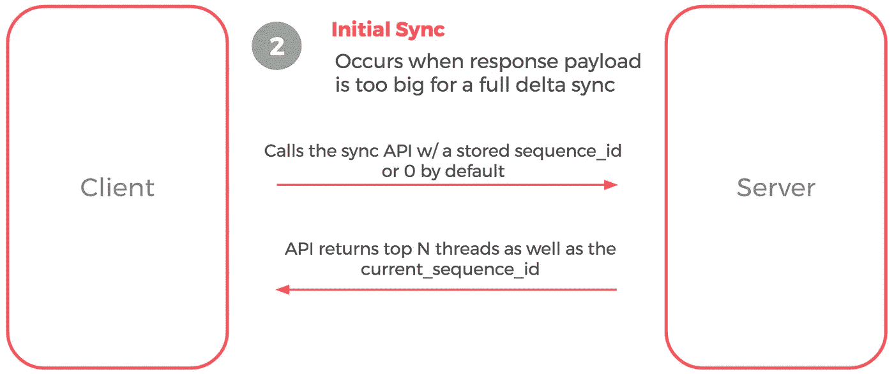
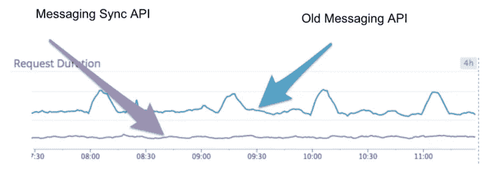

# 信息同步——在 Airbnb 扩展移动信息

> 原文：<https://medium.com/airbnb-engineering/messaging-sync-scaling-mobile-messaging-at-airbnb-659142036f06?source=collection_archive---------0----------------------->

由[王志耀](https://medium.com/u/8e2cd429e3bb?source=post_page-----659142036f06--------------------------------)、[米歇尔·莱昂](https://medium.com/u/c011f676a10c?source=post_page-----659142036f06--------------------------------)、[杰森·古德曼](https://medium.com/u/1f36b16d073e?source=post_page-----659142036f06--------------------------------)、[尼克·雷诺兹](https://medium.com/u/ff1003fda70b?source=post_page-----659142036f06--------------------------------)、[朱丽亚·傅](https://medium.com/u/cbe8bf79ca00?source=post_page-----659142036f06--------------------------------)、[杰夫·霍德内特](http://www.jeffhodnett.com/)、[曼努埃尔·德尚](https://medium.com/u/fe785ba6ac78?source=post_page-----659142036f06--------------------------------)、[约翰·波特鲍姆](https://medium.com/u/de6bbe853874?source=post_page-----659142036f06--------------------------------)、查理·江

Old Inbox vs New Inbox with slow network

每小时在手机上发送超过 10 万条消息，消息是 Airbnb 应用程序上最受关注的功能。然而，在移动设备上使用旧的收件箱获取方法，收件箱加载缓慢，数据不一致，并且需要网络连接来读取邮件。所有这些导致主人和客人使用移动收件箱的体验很差。为了让收件箱更快、更可靠、更一致，Airbnb 的 Hosts and Homes 团队建立了 Messaging Sync。

旧的收件箱获取的实现类似于世纪之交的网络邮件客户端，在每次用户点击时从网络获取满屏的信息。有了消息同步，新消息和线程更新只有在数据改变时才被提取，这大大减少了网络请求的数量。这意味着收件箱和消息线程屏幕之间的导航要快得多，大部分时间都在本地移动存储上，而不是在每次屏幕改变时发出网络请求。消息传递同步还减少了每次网络获取的响应大小，从而使 API 延迟提高了 2 倍。在网速较慢的地区，这些用户体验的提升会被放大。

以下是消息同步的工作原理，分为三种情况:

**场景 1:完整增量更新**

这是最常见的情况:

1.  移动客户端使用本地存储的 sequence_id(例如 1490000000)调用同步 API，sequence _ id 表示客户端与服务器的最后一次同步。
2.  API 服务器仅返回该 sequence_id 之后的所有修改的线程对象和新消息，以及新的 sequence_id(例如 1491111111)。
3.  移动客户端将这些更新的线程和消息与其本地数据存储合并。
4.  移动客户端还存储新的 sequenced_id 以供下次使用。

**场景 2:初始同步**

这是因为有太多的线程和/或消息更新需要返回。例如，当用户第一次下载应用程序时，服务器需要发送 10 个线程对象和 30 条消息来进行完整的增量同步。完整的增量同步响应负载将非常大，这将导致更长的加载时间和较差的用户体验。相反，我们只返回满屏的线程。

1.  移动客户端使用本地存储的 sequence_id 调用同步 API
2.  API 服务器估计完整增量同步的响应大小，并认为它太大。
3.  API 服务器仅发送 N 个最近的线程对象，而不发送任何消息，以使客户端在收件箱视图中至少全屏呈现线程。
4.  客户端清除其本地数据存储。
5.  客户端存储最新的线程对象和 sequence_id。
6.  当用户打开一个线程时，客户端向服务器请求该线程中的所有消息。
7.  当用户在收件箱中滚动历史记录时，客户端发送分页请求来获取线程。

**场景 3:线程移除**

线程有时需要从移动应用中移除。例如，当共同主机不再管理主机的列表时，服务器移除共同主机和访客之间的线程。在这种情况下，API 发送上次同步后删除的线程 id 数组。

# 捕捉回归

在迁移到新的消息传递同步 API 时，有几个注意事项:

1.  Airbnb 的消息系统与其核心预订流程和其他产品逻辑紧密结合。服务器需要监听影响收件箱屏幕上显示的数据的所有更改。例如，在一次旅行结束后，应用程序需要在线程中呈现一个“离开查看”按钮。对此有两种解决方案。一种是在读取时检查 review 对象，看它是否被修改过。另一种解决方案是订阅查看对象更改，并更新相应线程对象上次被修改的时间。我们选择了第二种解决方案，因为它在读取时间上要便宜得多。然而，挑战在于捕捉所有对象的相关变化，这些变化会影响 UI 上呈现的内容。
2.  更新的线程可能与本地存储的线程顺序不同。我们需要确保在合并数据后，UI 被正确刷新。

为了捕捉旧的消息传递 API 和消息传递同步 API 返回的数据之间的任何差异，一小部分移动应用程序同时运行旧的和新的 API 进行抽查。它记录所有属性值和从两个 API 返回的线程顺序。这允许我们用新的 API 捕捉回归并快速迭代。每当捕获到 bug 时，服务器会将相应的线程对象标记为已修改，以便在下一次同步时纠正差异。

# 结论

1.  消息同步 API 将 API 请求延迟降低了 2 倍。它还导致了比旧的消息传递 API 更稳定的请求持续时间(下面的蓝色尖线)。

2.信息同步使用户可以在飞行模式和恶劣的网络条件下阅读信息。

在推出消息同步和其他消息改进后，我们看到更多的消息是从移动设备发送的(Android 和 iOS 分别增加 3.8%和 5.3%)，从网络发送的消息减少了(-4.6%和-4.2%)。收件箱的日访问量大幅上升(+200%和+96%)，因为它现在是托管模式的主屏幕。此次发布是我们的主机社区的一大胜利，因为消息是 Airbnb 上主机使用最多的功能。

*最后但并非最不重要的一点是，如果你有兴趣创建一个充满热情的东道主社区，在世界各地提供令人惊叹的款待，东道主和家园工程团队总是在寻找有才华的人加入***！**

**