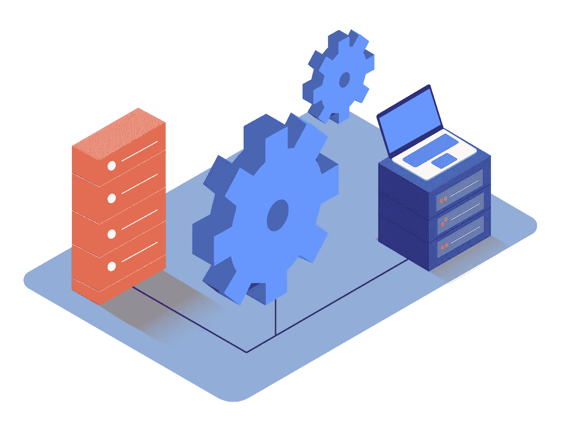
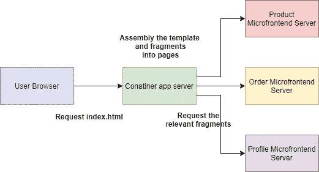
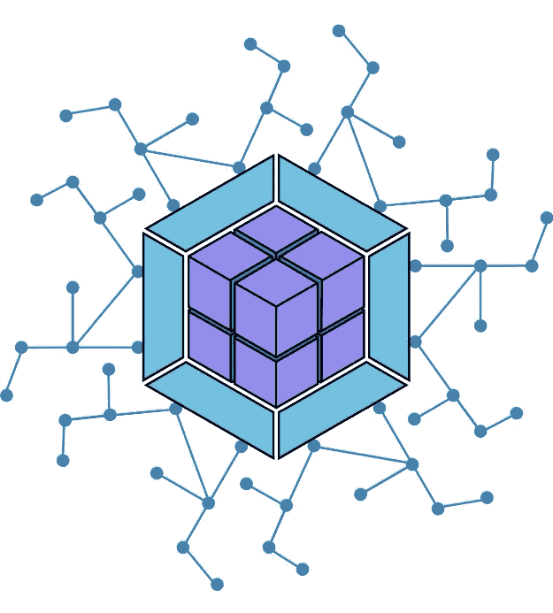
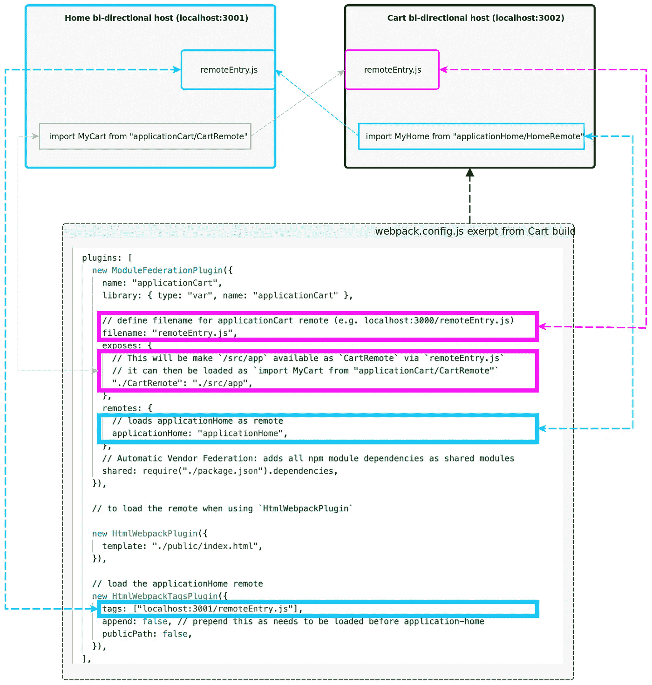

# 微前端——从传统到模块联盟！！！

> 原文：<https://medium.com/globant/microfrontend-from-tradition-to-module-federation-8ed50710904b?source=collection_archive---------0----------------------->

微服务一直是一个需要了解和实施的奇特概念，许多组织一直在使用这种架构风格来避免大型整体后端的限制。

*在这种情况下，frontend 也开始遵循这一足迹，将 monoliths frontend 分解为更小、更简单的块，这些块可以独立开发、测试和部署，同时仍然作为单一的内聚产品出现在客户面前。我们称这种技术为* ***微前端***

> ***“将可独立交付的前端应用组合成一个更大整体的架构风格”***

微前端有什么好处？

*   **增量升级**
*   **解耦代码库**
*   **独立部署**
*   **自主团队**

简而言之，microfrontend 将大而可怕的东西分割成更小、更易管理的部分。

在您的项目中实现微前端有多种方法，我们可以把这称为**集成方法，**让我们逐一探讨。

# 服务器端模板合成

这里，我们在服务器上呈现 HTML，我们有 index.html，它包含任何常见的页面元素，然后使用服务器端从片段 HTML 文件中插入特定于页面的内容。

我们使用 Nginx 提供这个文件，通过匹配被请求的 URL 来配置$PAGE 变量:

这里我们称之为微前端，因为它以这样一种方式分割代码，每一部分代表一个独立团队可以交付的自包含领域概念。

ssr microfrontend approch

# 构建时集成

这种方法将每个微前端应用程序发布为一个包，并拥有容器应用程序，该容器应用程序将它们作为库依赖项包含在内。下面是 package.json 的样子

因此，它产生了单个可部署的 JavaScript 包，允许我们从各种应用程序中消除常见的依赖关系，但是这种方法使得重新编译和发布每个微前端，以便获得产品发布，这意味着我们再次**锁定发布过程**，这违反了 microfrotnend 的准则。因此，在运行时集成微前端总是比在构建时集成好

# 通过 iframes 进行运行时集成

在浏览器中将微应用程序组合在一起的最简单的方法之一是简单的 iframe。Iframe 使得从独立的子页面构建页面变得容易，它确保全局变量和样式不会相互干扰。

这种基于 iframe 的方法并不是一种新技术，也许看起来并不令人兴奋。这项技术有其自身的成本。很难在应用程序的不同部分之间进行集成，因此它们使路由、历史和深度链接变得更加复杂，也为页面的全面响应带来了额外的挑战。

# 通过 JavaScript 进行运行时集成

另一种方法最灵活，也经常被采用。这里，每个微应用程序都使用一个

这是一种运行时集成方法，我们可以独立地部署每个构建文件。与 iframe 不同，我们有充分的灵活性来构建我们的微应用程序之间的集成，我们还可以对 bundle.js 文件进行 lazyload，并可以在增强性能方面做出一些贡献。

# 通过 Web 组件进行运行时集成

每个微前端定义一个 HTML 自定义元素供容器实例化的方法之一，而不是定义要调用的容器的全局函数。

这是使用浏览器提供的功能的方式，可能是一个好的选择。

因此，这是以自己的方式和自己的成本集成各种微前端的常用方法。

接下来让我们看看微前端面临的主要挑战之一，即**通信**。

# 跨应用程序通信

脑海中出现的一个主要问题是，这些微型应用程序如何相互通信，因为我们已经将它们分离为微型应用程序，但现在通信是主要关注的问题。

一种可能的方式是[自定义事件](https://developer.mozilla.org/en-US/docs/Web/Guide/Events/Creating_and_triggering_events)，它允许微应用程序之间间接通信，这是一种最小化直接耦合的好方法，但它也使得确定和执行微前端之间存在的契约变得更加困难。

> 第二种方法是，如果您正在使用 **redux** ，那么没有什么比这更好的了，因为通常的方法是为整个应用程序提供一个单一的、全局的和共享的存储。然而，如果每个微前端都应该是自己的独立应用程序，那么每个微前端都有自己的 redux 存储是有意义的。

第三种替代方法是使用地址栏作为通信机制。

基本上，有几种不同的方法可以在微前端应用程序中进行通信，因此每种方法都有正反两面。

所以 ***这都是关于传统的方法，这些方法已经被业界采用来实现微前端架构模式，但是现在让我们来看看游戏改变者，webpack 如何加快步伐来解决微前端的挑战，并使事情变得更加简单和流畅。***

# Webpack 5 模块联盟来救援！！！

[https://giphy.com/](https://giphy.com/)

> 模块联合允许 JavaScript 应用程序在客户机和服务器上动态运行来自另一个包/构建的代码。

## 什么是模块联合？

Zack Jackson 发明并解释得非常好，这是一个发明的 javascript 架构，成为 Webpack 5 core 最令人兴奋的特性之一。

> 它允许 javascript 应用程序从另一个应用程序动态加载代码，其突出的特性就好像一个应用程序正在使用联邦模块，并且没有联邦代码所需的依赖关系，那么 webpack 将从该联邦构建源下载缺少的依赖关系。神奇的东西…

**一些术语……**

Borrowed from [webpack-5-module-federation](/swlh/webpack-5-module-federation-a-game-changer-to-javascript-architecture-bcdd30e02669)

**模块联合:**从另一个应用程序加载代码

**主机:**在页面加载过程中首先初始化的 webpack 构建(当 onLoad 事件被触发时)

**远程**:另一个 Webpack 构建，其中一部分被一个“**主机**使用

**双向主机**:当 bundle 或 Webpack 构建可以作为主机或远程工作时。要么消费其他应用程序，要么被消费

> 需要注意的是，该系统的设计使得每个完全独立的构建/应用程序都可以位于自己的存储库中，独立部署，并作为自己独立的 SPA 运行。

模块联合具有增值特性，基于模块联合的应用都是双向主机。因此，任何首先加载的应用程序都将成为主机，这意味着如果您移动并更改应用程序的路由，那么联邦模块将以与您实施动态加载相同的方式加载，并且如果您刷新页面，那么在该加载中首先启动的任何应用程序都将成为主机。**终极！！！**

# 信息丰富的文字已经足够了！！现在让我们用代码弄脏我们的手吧！！

模块联盟的 Webpack 设置(双向主机)。

Image borrowed from [https://rangle.io/blog/module-federation-federated-application-architectures/](https://rangle.io/blog/module-federation-federated-application-architectures/)

*   **文件名**:定义当前应用程序的文件名，使其远程化(如 localhost:3000/remoteEntry.js)
*   **暴露**:这将使“小部件”组件通过“remoteEntry.js”作为共享组件可用，然后它可以作为“从应用程序/小部件导入小部件”加载
*   **remotes** :远程加载应用程序主页
*   **共享**:将所有 npm 模块依赖关系添加为共享模块

# 下面是动态远程的例子——在构建时在主机未知的远程之间动态加载和共享代码的能力！！

我们如何处理这个例子？

1.  ***主机 app 的 Webpack 设置***

3.  *****远程应用的 Webpack 设置*****
4.  *****在远程应用程序中创建组件，该组件将远程加载到主机应用程序中*****

**让我们为主机应用程序设置 webpack，在这里您可以找到应用程序名称和共享的 react 供应商模块。**

**现在是时候定义动态联盟挂钩了，这个挂钩将延迟加载注册到主机应用程序的远程子应用程序。**

**让我们一个接一个地看看动态集成远程子应用程序的方法。**

**动态脚本函数将获取远程子应用程序的 url，并在运行时将该 url 注入现有 HTML 的脚本元素，以便脚本将动态加载远程子应用程序。**

**现在已经加载了子应用程序，是时候初始化可以提供共享模块的容器了，加载组件函数将为我们做必要的更改，它接受范围和模块，**

*   ****范围**:远程子 app 名称**
*   ****模块**:从远程子 app 导出的模块的名称。**

**在这个参数的帮助下，load component 函数将用共享模块初始化容器。**

**现在让我们把这些放在一起，形成动态联邦的 react 钩子。**

**useDynamicRouteMFE()将从父应用程序获取系统对象，并将其传递给组件<system>以呈现子应用程序。</system>**

****问题出现了，如何使用钩子 useDynamicFederation()？****

**下面是 Microfrontend 组件的代码片段，这个组件借助 useDynamicFederation()渲染了 subApp。**

**接下来，我们将了解如何准备好远程子应用程序，以便主机应用程序可以动态集成它。**

**这是子应用程序中的小部件组件，现在我们希望将其导出，并应导入到目标主机应用程序中，易于配置。**

**为了让这一切发生，我们的英雄登场了，那不是别人，正是**模块联盟****

**这样，我们将配置子应用程序的 webpack，在此设置的帮助下，我们可以使子应用程序对主机应用程序远程可用。**

*   ****文件名:**这里我们可以看到，我们已经添加了文件名为 remoteEntry.js 这个文件应该注入到目标主机 app index.html。**
*   ****Exposes:** 在这里，我们导出我们的 widget.js 组件，并使它可以远程使用。**
*   ****共享:**这将共享远程子应用程序所需的所有供应商依赖关系**

# **演示时间！！！！！**

**这个演示程序演示了如何使用模块联合来动态加载和共享在构建时主机未知的远程代码。**

> **这是前端架构的发展和游戏改变者，如果你看到我们在编译时不需要知道微前端。相反，我们可以在运行时加载配置，说明有多少微锋可用以及在哪里可以找到它们。**

**对于更多令人兴奋的特性，请关注模块联盟的进一步发展。**

**即将推出的主题…**

*****“微前端—子 app 间通信，由模块联邦提供动力”*****

*****“微前端—具有模块联邦的 Rock 多框架”*****

*****“微前端 Next.js 的模块联邦”*****

**参考**

** [## Webpack 5 联盟:JavaScript 架构的游戏改变者

### 多个 Webpack 构建一起工作，就像一个整体。运行时轻松、可扩展的编排，在两个客户端上…

medium.com](/swlh/webpack-5-module-federation-a-game-changer-to-javascript-architecture-bcdd30e02669)**