# Web 开发的微服务方法——微前端

> 原文：<https://medium.com/oracledevs/microservice-approach-for-web-development-micro-frontends-1cba93d85021?source=collection_archive---------2----------------------->

这篇文章基于我的甲骨文代码 2018 华沙会谈。查看幻灯片共享上的[演示文稿](https://www.slideshare.net/andrejusb/microservice-approach-for-web-development-with-micro-frontends):

想知道微前端是什么意思吗？查看微前端描述[此处](https://micro-frontends.org/)。简单地说，微前端必须在隔离的环境中实现自顶向下的业务逻辑(数据库、中间件和 UI)，它应该是可重用的，并可插入到主应用程序 UI 外壳中。微前端之间不能有共享变量。优势——分布式团队可以在独立的微前端上工作，这改进了大型和模块化系统的开发。还有运行时优势——如果一个前端停止工作，主应用程序应该继续工作。

我已经用 Oracle JET 实现了微前端架构。源代码可以在 [GitHub](https://github.com/abaranovskis-redsamurai/warsaw) 库获得。有三个应用程序，两个具有微前端，一个是主 UI shell。两个微前端都被实现为 JET 复合组件。首先是托管在 WebLogic 上，它在后端调用 ADF BC REST 服务。第二个托管在节点上。JS 并返回静态数据。第一个微前端实现监听器，它允许处理来自外部的动作。

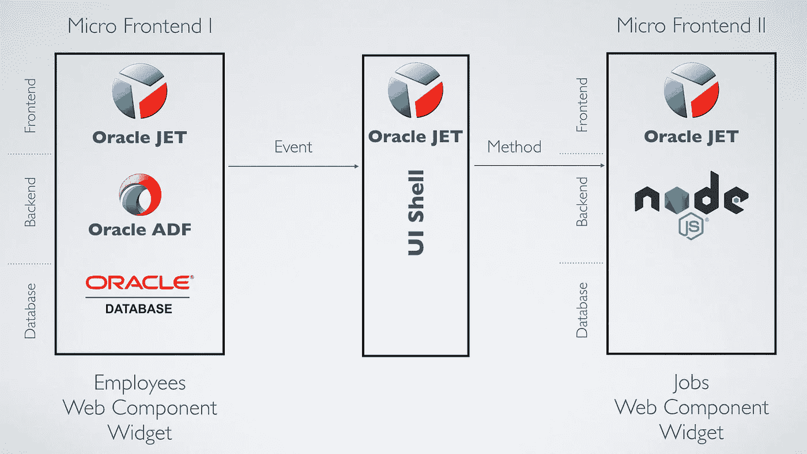

当在浏览器中访问 JET 应用程序时，会从服务器下载大量的 HTML、JS 和 CSS 文件。微前端的核心思想——不是从与主应用程序相同的主机加载 HTML、JS 和 CSS，而是从不同的主机加载。主应用程序中呈现的 JET 复合组件将从不同的主机下载。不仅仅是下载，所有后端调用也应该到那个主机，而不是主主机。JET 复合组件集成到主应用程序架构中:

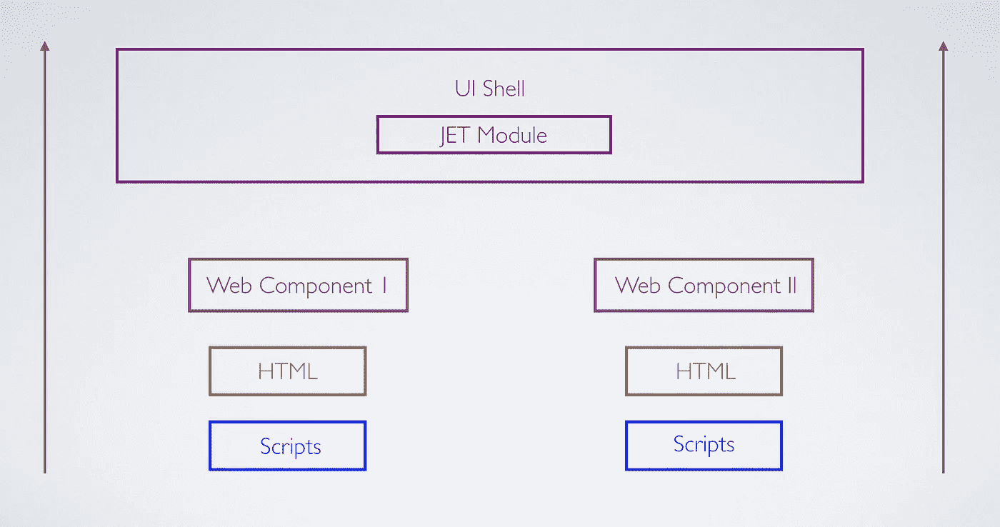

这就是它在实践中的工作方式。这些图表中的每一个都是单独的 JET 复合组件，作为微前端从不同的主机加载到主应用程序中。我们可以在网络监视器中看到这一点。两个微前端的 Loader.js 脚本从不同的主机下载:

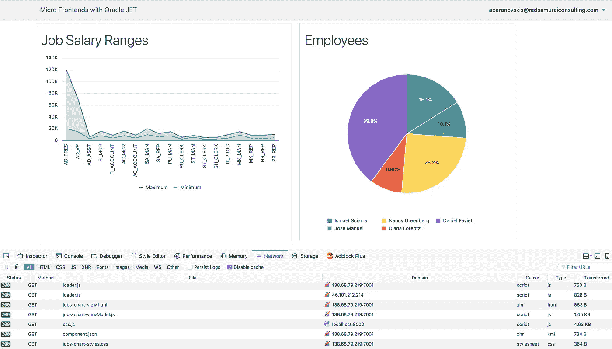

运行时优势—如果一个或多个微前端关闭，应用程序将继续运行:

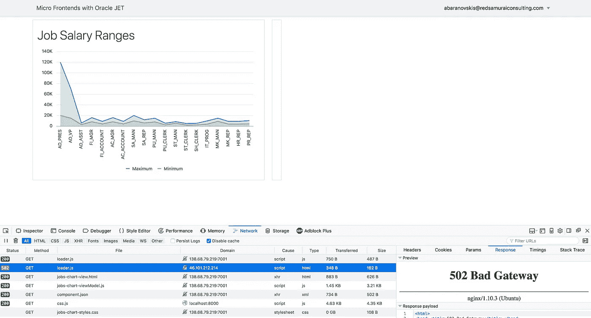

JET Composite 组件运行在客户端，即使它托管在自己的微前端。这使得在主应用中订阅组件中发生的事件并将该事件路由到另一个微前端成为可能。在本例中，一旦在“职务图表-员工图表”(另一个微前端)中选择了项目，就会被过滤:

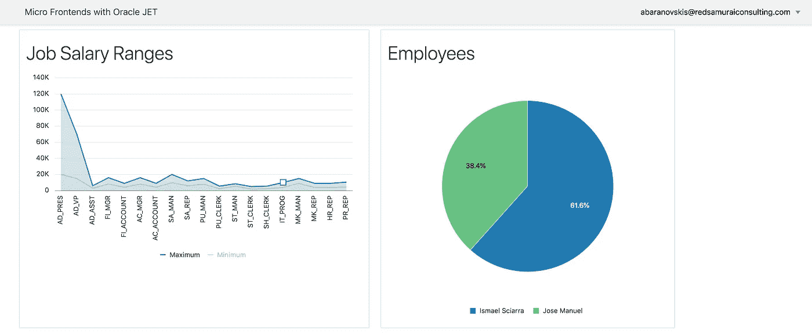

技术实现

主应用程序必须配置为支持 JET 复合组件的远程模块加载。在 Duncan Mills 的博客文章— [JET Custom Components XII —重温加载程序脚本](https://blogs.oracle.com/groundside/jet-composite-components-xii-revisiting-the-loader-script)中了解更多信息。简而言之，应该在 JET 应用程序 main.js 中添加 Xhr config:

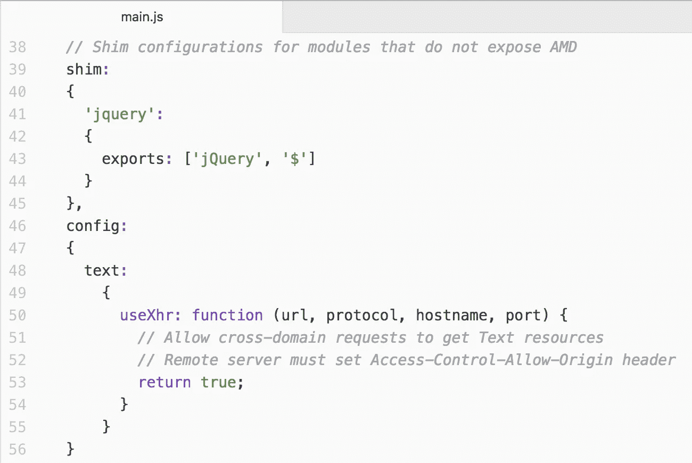

微前端所在的服务器必须设置 Access-Control-Allow-Origin 头。集成了两个微前端的主模块使用 JET 模块组件。主 UI 外壳中的每个微前端都被包装到 JET 模块中。这允许主应用程序运行，即使模块中的微前端停止:

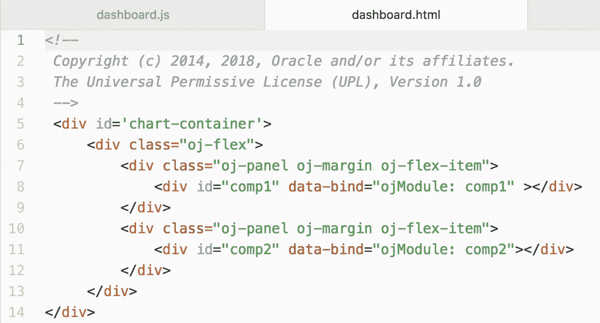

JET 模块从变量初始化，该变量返回模块名称:

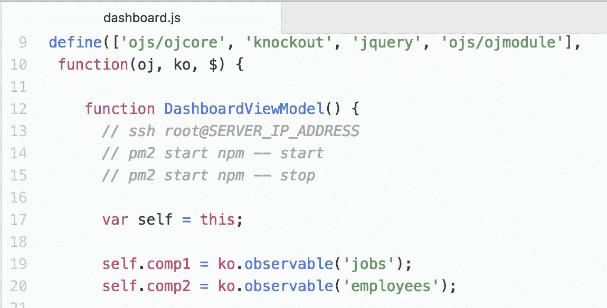

作业模块包含作业微前端— JET 复合组件。它由 WebLogic 托管，并在后端调用 ADF BC REST。组件分配有监听程序:

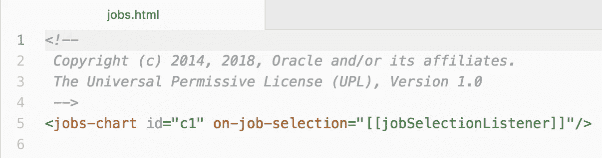

最重要的部分在 JS 脚本中。这里，我们从远程主机加载 JET 复合组件，而不是在本地引用它。这允许自行开发和托管微前端 JET 复合组件:

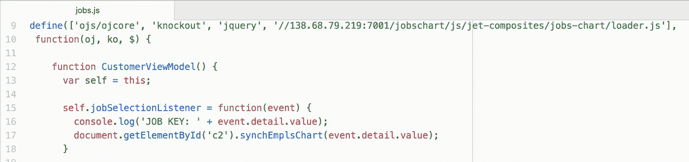

监听器引用 *c2* 元素并调用方法。主 app 中的 *c2* 元素与第二微前端相关:

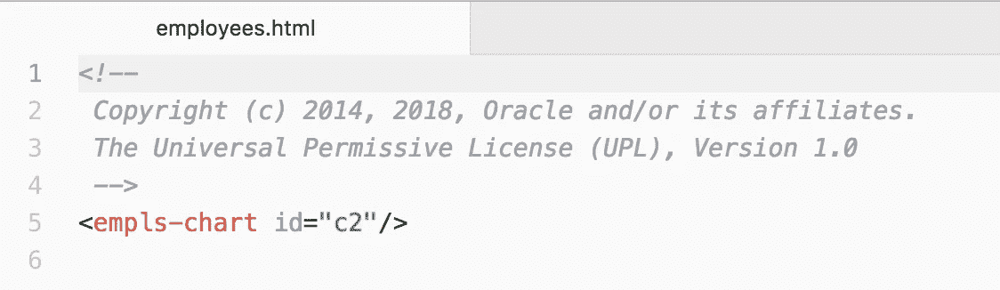

此组件是从另一个主机的节点加载的。JS:

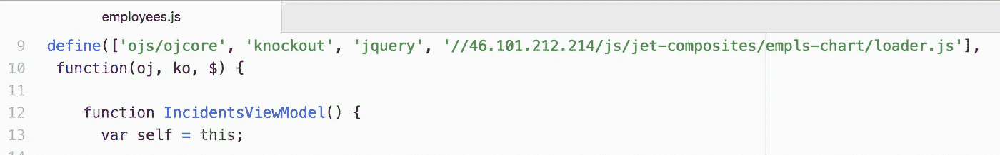

重要提示—对于要从远程主机加载的 JET 复合组件，请确保添加。突出显示的 JET 复合组件脚本的 js(参考源代码):

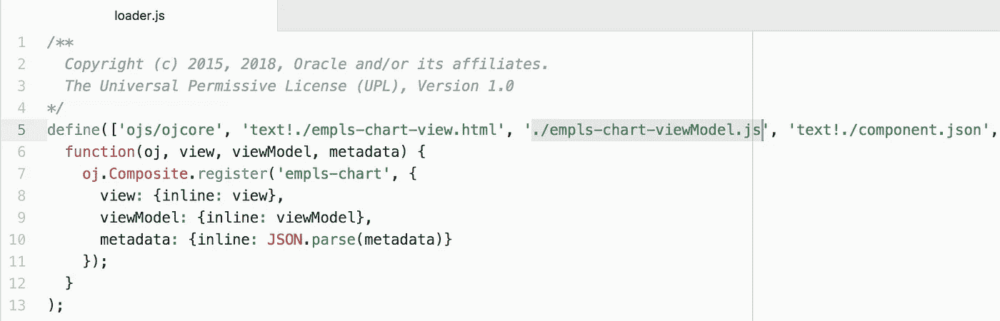

*原载于 2018 年 5 月 17 日*[*andrejusb.blogspot.com*](https://andrejusb.blogspot.lt/2018/05/microservice-approach-for-web.html)*。*