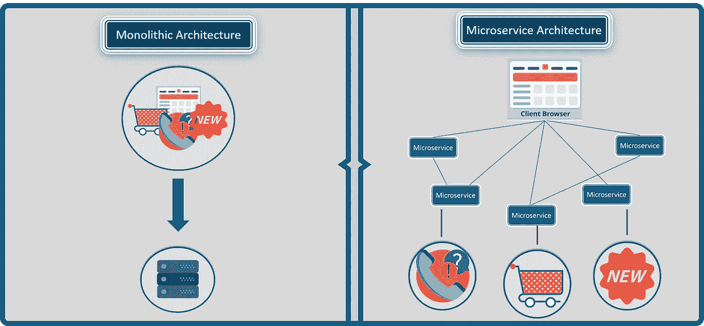

# 微服务架构—探索优步的微服务架构

> 原文：<https://medium.com/edureka/microservice-architecture-5e7f056b90f1?source=collection_archive---------0----------------------->

Microservice Architecture — Edureka

*从我之前的文章中，你一定对微服务架构有了基本的了解。在这篇博客中，您将深入了解架构概念，并通过一个超级案例研究来实现它们。*

**在这篇文章中，你将了解到以下内容:**

1.  微服务架构的定义
2.  微服务架构的关键概念
3.  微服务架构的利弊
4.  优步—案例研究

在我谈论优步的微服务架构之前，只有我给你微服务的定义才会公平。

# 微服务的定义

因此， ***微服务*** 又名 ***微服务架构*** 没有合适的定义，但你可以说它是一个框架，由执行不同操作的小型、可单独部署的服务组成。

微服务专注于单个业务领域，可以作为完全独立的可部署服务来实现，并在不同的技术堆栈上实现。

Difference Between Monolithic and Microservice Architecture — Microservice Architecture

参考上图，了解整体架构和微服务架构之间的区别。为了更好地理解这两种架构之间的差异，你可以参考我之前的博客*什么是微服务。*

为了让你更好的理解，我来告诉你一些微服务架构的关键概念。

# 微服务架构的关键概念

在开始使用微服务构建自己的应用程序之前，您需要清楚应用程序的范围和功能。

以下是讨论微服务时需要遵循的一些准则。

## **设计微服务的指导方针**

> 作为一名开发人员，当您决定构建一个应用程序时，请将领域分开，并明确功能。
> 
> 你设计的每个微服务应该只专注于应用程序的一个服务。
> 
> 确保您已经以每项服务都可以单独部署的方式设计了应用程序。
> 
> 确保微服务之间的通信是通过无状态服务器完成的。
> 
> 每个服务都可以进一步重构为更小的服务，拥有自己的微服务。

现在，您已经通读了设计微服务时的基本指南，让我们了解微服务的架构。

# 微服务架构是如何工作的？

典型的微服务架构(MSA)应包括以下组件:

1.  客户
2.  身份提供者
3.  API 网关
4.  消息格式
5.  数据库
6.  静态内容
7.  管理
8.  服务发现

请参考下图。

Architecture Of Microservices - Microservice Architecture

我知道架构看起来有点复杂，但让我为你简化一下。

## **1。客户**

该架构从不同类型的客户端开始，来自不同的设备，尝试执行各种管理功能，如搜索、构建、配置等。

## **2。身份提供者**

然后，来自客户端的这些请求被传递给身份提供者，身份提供者对客户端的请求进行身份验证，并将请求传递给 API 网关。然后，请求通过定义良好的 API 网关传递给内部服务。

## **3。API 网关**

由于客户端不直接调用服务，API Gateway 充当客户端将请求转发到适当的微服务的入口点。

***使用 API 网关的优势包括:***

*   所有的服务都可以在客户不知情的情况下更新。
*   服务也可以使用对 web 不友好的消息协议。
*   API 网关可以执行交叉功能，例如提供安全性、负载平衡等。

在接收到客户端的请求后，内部架构由微服务组成，微服务通过消息相互通信来处理客户端请求。

## **4。消息格式**

它们通过两种类型的消息进行通信:

*   **同步消息:**在客户端等待服务响应的情况下，微服务通常倾向于使用 **REST(表述性状态转移)**，因为它依赖于无状态的客户端-服务器和 **HTTP 协议**。使用该协议是因为它是一个分布式环境，每个功能都用资源来表示以执行操作
*   **异步消息:**在客户端不等待服务响应的情况下，微服务通常倾向于使用 **AMQP、STOMP、MQTT** 等协议。在这种类型的通信中使用这些协议，因为消息的性质是被定义的，并且这些消息在实现之间必须是可互操作的。

你可能想到的下一个问题是，使用微服务的应用程序如何处理它们的数据？

## **5。数据处理**

每个微服务都拥有一个私有数据库来捕获它们的数据并实现各自的业务功能。此外，微服务的数据库仅通过其服务 API 进行更新。请参考下图:

Representation Of Microservices Handling Data — Microservice Architecture

微服务提供的服务可以被带到任何支持不同技术栈的进程间通信的远程服务中。

## 6。静态内容

在微服务内部通信之后，它们将静态内容部署到基于云的存储服务，该存储服务可以通过**内容交付网络(CDNs)** 将它们直接交付给客户端。

除了上述组件，还有一些其他组件出现在典型的微服务架构中:

## **7。管理层**

该组件负责平衡节点上的服务并识别故障。

## **8。服务发现**

充当微服务的向导，以找到它们之间的通信路由，因为它维护节点所在的服务列表。

现在，让我们来看看这种架构的优缺点，以便更好地理解何时使用这种架构。

# 微服务架构的利弊

请参考下表。

Pros and Cons of Microservice Architecture — Microservice Architecture

通过对比 UBER 之前的架构和现在的架构，让我们对微服务有更多的了解。

# 优步案例研究

## **优步之前的架构**

像许多创业公司一样，优步开始了它的旅程，它是为一个城市的单一产品构建的整体架构。拥有一个代码库在当时似乎是干净的，解决了 UBER 的核心业务问题。然而，随着优步开始在全球扩张，他们在可扩展性和持续集成方面面临着各种问题。

上图描绘了优步之前的架构。

*   乘客和司机通过 REST API 进行连接。
*   三个不同的适配器与其中的 API 一起使用，以执行我们在预订出租车时看到的操作，如计费、支付、发送电子邮件/消息。
*   一个 MySQL 数据库来存储他们所有的数据。

因此，如果您注意到这里的所有功能，如乘客管理、计费、通知功能、支付、行程管理和司机管理，都是在一个框架内完成的。

## **问题陈述**

虽然优步开始在全球扩张，但这种框架带来了各种挑战。以下是一些突出的挑战

*   所有的功能都必须一次又一次地重新构建、部署和测试，以更新单个功能。
*   由于开发人员不得不一次又一次地修改代码，在单个存储库中修复 bug 变得极其困难。
*   在全球范围内同时扩展功能和引入新功能是非常困难的。

## **解决方案**

为了避免这样的问题，优步决定改变其架构，效仿亚马逊、网飞、Twitter 和其他许多高速增长的公司。于是，UBER 决定将其单片架构拆分成多个代码库，形成微服务架构。

参考下图来看看优步的微服务架构。

Microservice Architecture Of UBER — Microservice Architecture

*   我们在这里观察到的主要变化是引入了 API Gateway，所有的司机和乘客都通过它连接起来。从 API 网关，所有的内部点都被连接起来，比如乘客管理、司机管理、行程管理等等。
*   这些单元是执行单独功能的单独的可部署单元。

例如:如果您想要更改计费微服务中的任何内容，那么您只需部署计费微服务，而不必部署其他服务。

*   所有的特征现在都被单独缩放，即每个特征之间的相互依赖性被去除。

例如，我们都知道搜索出租车的人数相对多于实际预订出租车并付款的人数。这使我们得到一个推论，即处理乘客管理微服务的进程数量多于处理支付的进程数量。

通过这种方式，优步受益于将其架构从单片转移到微服务。

我希望你喜欢阅读这篇关于微服务架构的文章。如果你想查看更多关于人工智能、DevOps、道德黑客等市场最热门技术的文章，你可以参考 Edureka 的官方网站。

请留意本系列中的其他文章，它们将解释微服务的各个方面。

> *1。* [*什么是微服务？*](/edureka/what-is-microservices-86144b17b836)
> 
> *2。* [*微服务设计模式*](/edureka/microservices-design-patterns-50640c7bf4a9)
> 
> *3。* [*微服务 vs SOA*](/edureka/microservices-vs-soa-4d71c5590fc6)
> 
> *4。* [*微服务教程*](/edureka/microservices-tutorial-with-example-a230413dfa13)
> 
> *5。* [*微服务设计模式*](/edureka/microservices-design-patterns-50640c7bf4a9)
> 
> *6。* [*微服务安全*](/edureka/microservices-security-b01b8f2a9215)

*原载于 2018 年 2 月 27 日 www.edureka.co***。**