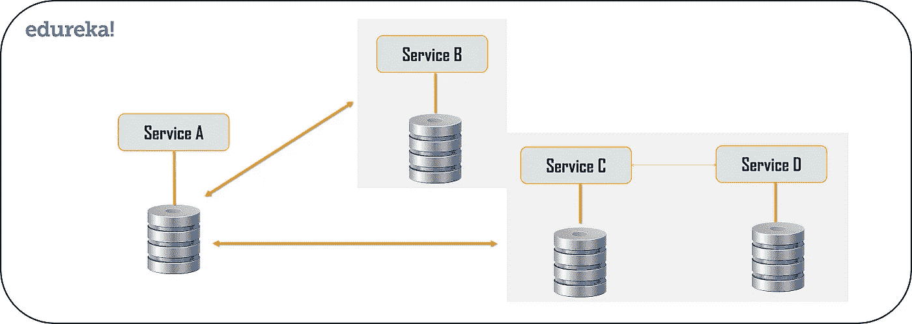

# 顶级微服务设计模式构建您的应用

> 原文：<https://medium.com/edureka/microservices-design-patterns-50640c7bf4a9?source=collection_archive---------0----------------------->

Microservices Design Patterns — Edureka

在当今的市场上，微服务已经成为构建应用程序的首选解决方案。众所周知，它们可以解决各种挑战，但是熟练的专业人员在使用这种架构时经常会面临挑战。因此，开发人员可以探索这些问题中的共同模式，并可以创建可重用的解决方案来提高应用程序的性能。因此，在这篇关于微服务设计模式的文章中，我将讨论构建成功的微服务所必需的顶级模式。

本文将涵盖以下主题:

*   什么是微服务？
*   用于设计微服务架构的原则
*   微服务的设计模式

# **什么是微服务？**

**微服务**，又名 ***微服务架构*** ，是一种架构风格，将应用程序构建为小型自治服务的集合，围绕**业务领域建模。**在微服务架构中，每个服务都是独立的，并且实现单一的业务功能。如果想详细了解微服务，[可以参考我关于微服务架构的文章。](/edureka/what-is-microservices-86144b17b836)

# **用于设计微服务架构的原则**

用于设计微服务的原则如下:

1.  独立和自主服务
2.  可量测性
3.  分散
4.  弹性服务
5.  实时负载平衡
6.  有效性
7.  通过 DevOps 集成持续交付
8.  无缝 API 集成和持续监控
9.  故障隔离
10.  自动供应

# **微服务的设计模式**

1.  集合商
2.  API 网关
3.  连锁或责任链
4.  异步消息传递
5.  数据库或共享数据
6.  活动采购
7.  树枝
8.  命令查询责任分离器
9.  断路器
10.  分解

## 聚合器模式

计算世界中的聚合器指的是收集相关数据项并显示它们的网站或程序。因此，即使在微服务模式中，聚合器也是一个调用各种服务来获取所需信息或实现所需功能的基本网页。

此外，由于输出源在将整体架构分解为微服务时会被分割，当您需要通过组合来自多个服务的数据来输出时，这种模式被证明是有益的。因此，如果我们有两个服务，每个服务都有自己的数据库，那么一个具有唯一事务 ID 的聚合器将从每个单独的微服务收集数据，应用业务逻辑，并最终将其作为 REST 端点发布。稍后，收集的数据可以由需要收集的数据的相应服务使用。

骨料设计模式基于干燥原则。基于这一原则，您可以将逻辑抽象成一个复合的微服务，并将特定的业务逻辑聚合成一个服务。

例如，如果您考虑两个服务:服务 A 和 B，那么您可以通过向复合微服务提供数据来同时单独扩展这些服务。

## API 网关设计模式

微服务的构建方式是每个服务都有自己的功能。但是，当应用程序被分解成小的自治服务时，开发人员可能面临的问题就很少了。这些问题可能如下:

1.  如何从多个微服务请求信息？
2.  不同的 UI 需要不同的数据来响应相同的后端数据库服务
3.  如何根据消费者需求从可重用的微服务转换数据
4.  如何处理多个协议请求？

这类问题的解决方案可能是 API 网关设计模式。API 网关设计模式不仅解决了上面提到的问题，还解决了许多其他问题。这种微服务设计模式也可以被认为是将请求路由到相关微服务的代理服务。作为聚合器服务的变体，它可以将请求发送到多个服务，并类似地将结果聚合回组合服务或消费者服务。API Gateway 还充当所有微服务的入口点，并为不同类型的客户端创建细粒度的 API。

借助 API 网关设计模式，API 网关可以将协议请求从一种类型转换为另一种类型。同样，它也可以卸载微服务的身份验证/授权责任。

因此，一旦客户端发送请求，这些请求将被传递到 API 网关，该网关充当一个入口点，将客户端的请求转发到适当的微服务。然后，在负载平衡器的帮助下，处理请求的负载，并将请求发送到相应的服务。微服务使用服务发现，服务发现作为一个向导来寻找它们之间的通信路由。然后，微服务通过无状态服务器相互通信，即通过 HTTP 请求/消息总线。

## 链式或责任链模式

链式或责任链设计模式产生单个输出，它是多个链式输出的组合。因此，如果您有三个服务排成一个链，那么，来自客户端的请求首先由服务 a 接收，然后，该服务与下一个服务 B 通信并收集数据。最后，第二个服务与第三个服务通信以生成合并的输出。所有这些服务都使用同步 HTTP 请求或响应进行消息传递。此外，在请求通过所有服务并生成相应的响应之前，客户端不会得到任何输出。所以，它总是建议不要做一个长链，因为客户会等到链完成

您需要理解的一个更重要的方面是，从服务 A 到服务 B 的请求可能与服务 B 到服务 C 的请求不同。同样，从服务 C 到服务 B 的响应可能与服务 B 到服务 A 的响应完全不同。

## 异步消息传递设计模式

从上面的模式来看，很明显，在同步消息传递中，客户端被阻塞或者必须等待很长时间。但是，如果您不希望消费者等待很长时间，那么您可以选择异步消息传递。在这种类型的微服务设计模式中，所有服务都可以相互通信，但它们不必按顺序相互通信。因此，如果您考虑 3 个服务:服务 A、服务 B 和服务 C。来自客户端的请求可以同时直接发送到服务 C 和服务 B。这些请求将在一个队列中。除此之外，请求还可以发送给服务 A，服务 A 的响应不必发送给请求所来自的服务。

## 数据库或共享数据模式

对于每个应用程序来说，都存在海量数据。因此，当我们将应用从整体架构分解为微服务时，注意到每个微服务都有足够的数据量来处理请求是非常重要的。因此，系统可以为每个服务提供一个数据库，也可以为每个服务提供一个共享数据库。您可以使用每个服务一个数据库和每个服务一个共享数据库来解决各种问题。这些问题可能如下:

*   数据重复和不一致
*   不同的服务有不同的存储要求
*   很少的业务事务可以查询数据，提供多种服务
*   数据的去规范化

好吧，为了解决前三个问题，我认为您可以选择每个服务的数据库，因为它将被微服务 API 本身访问。因此，每个微服务都有自己的数据库标识，这将阻止系统中的其他服务使用该特定数据库。除此之外，为了解决去规范化问题，您可以为每个服务选择共享数据库，以便为每个微服务对齐多个数据库。这将有助于您为细分为微服务的单片应用程序收集数据。但是，您必须记住，您必须将这些数据库限制为 2-3 个微服务；否则，扩展这些服务将是一个问题。

## 事件源设计模式

事件源设计模式创建关于应用程序状态变化的事件。此外，这些事件被存储为一系列事件，以帮助开发人员跟踪在何时进行了哪些更改。因此，在此帮助下，您可以随时调整应用程序状态，以应对过去的变化。您还可以针对任何数据更改查询这些事件，并同时从事件存储中发布这些事件。事件发布后，您可以在表示层看到应用程序状态的变化。

## 分支模式

分支微服务设计模式是一种可以同时处理来自两个或多个独立微服务的请求和响应的设计模式。因此，与链式设计模式不同，请求不是按顺序传递的，而是传递给两个或多个互斥的微服务链。这种设计模式扩展了聚合器设计模式，并提供了从多个链或单个链产生响应的灵活性。例如，如果您考虑一个电子商务应用程序，那么您可能需要从多个来源检索数据，这些数据可能是来自各种服务的数据的协作输出。所以，您可以使用分支模式，从多个来源检索数据。

## 命令查询责任分离器(CQRS)设计模式

每个微服务设计都有每个服务的数据库模型或每个服务的共享数据库。但是，在每个服务的数据库模型中，我们不能实现查询，因为数据访问仅限于一个数据库。所以，在这种情况下，你可以使用 CQRS 模式。根据这种模式，应用程序将分为两部分:命令和查询。命令部分将处理所有与创建、更新、删除相关的请求，而查询部分将处理物化视图。物化视图通过使用上述事件源模式创建的一系列事件进行更新。

## 断路器模式

顾名思义，断路器设计模式用于在服务不工作时停止请求和响应过程。例如，假设一个客户端正在发送一个请求，请求从多个服务中检索数据。但是，由于一些问题，其中一个服务关闭了。现在，您将面临两个主要问题:第一，由于客户端不知道某个特定的服务正在关闭，因此请求将不断地发送到该服务。第二个问题是网络资源会耗尽，性能低，用户体验差。

因此，为了避免这样的问题，您可以使用断路器设计模式。在这种模式的帮助下，客户端将通过代理调用远程服务。这个代理基本上相当于一个电路屏障。因此，当故障数量超过阈值数量时，断路器会在特定时间段内跳闸。然后，所有调用远程服务的尝试都将在这个超时周期内失败。一旦该时间段结束，断路器将允许有限数量的测试通过，并且如果这些请求成功，断路器恢复到正常操作。否则，如果失败，则超时周期再次开始。

## 分解设计模式

开发微服务时，开发人员的想法是创建小型服务，每个服务都有自己的功能。但是，将应用程序分解成小的自治单元必须符合逻辑。因此，要将一个或大或小的应用程序分解成小的服务，您可以使用分解模式。

在这种模式的帮助下，您可以基于业务能力或者基于子域来分解应用程序。例如，如果您考虑一个电子商务应用程序，那么如果您按业务功能分解，您可以为订单、支付、客户、产品提供单独的服务。

但是，在相同的场景中，如果您通过分解子域来设计应用程序，那么您可以为每个类提供服务。这里，在这个例子中，如果你把客户看作一个类，那么这个类将用于客户管理、客户支持等。因此，为了进行分解，您可以使用领域驱动的设计，通过这种设计，整个领域模型被分解成子领域。然后，这些子域中的每一个都将有它们自己特定的模型和范围(有界上下文)。现在，当开发人员设计微服务时，他/她将围绕范围或有限的上下文来设计这些服务。

虽然这些模式对您来说可能听起来可行，但对于大型的整体应用程序来说并不可行。这是因为对于大型应用程序来说，确定子域和业务能力并不是一件容易的事情。因此，分解大型单片应用程序的唯一方法是遵循 Vine 模式或 Strangler 模式。

***扼杀者图案或者藤蔓图案***

扼杀者模式或藤蔓模式是基于对藤蔓的类比，藤蔓基本上扼死了它所缠绕的树。因此，当这种模式应用于 web 应用程序时，每个 URI 调用都会来回调用，服务会被分解到不同的域中。这些域将作为单独的服务托管。

根据扼杀者模式，两个独立的应用程序将在同一个 URI 空间中并排存在，一个域将在某个时刻被考虑在内。因此，最终，新的重构应用程序会包围或扼杀或替换原始应用程序，直到您可以关闭整体应用程序

如果你想查看更多关于人工智能、DevOps、道德黑客等市场最热门技术的文章，你可以参考 Edureka 的官方网站。

请留意本系列中的其他文章，它们将解释微服务的各个方面。

> *1。* [*什么是微服务？*](/edureka/what-is-microservices-86144b17b836)
> 
> *2。* [*微服务架构*](/edureka/microservice-architecture-5e7f056b90f1)
> 
> *3。* [*微服务 vs SOA*](/edureka/microservices-vs-soa-4d71c5590fc6)
> 
> *4。* [*微服务教程*](/edureka/microservices-tutorial-with-example-a230413dfa13)
> 
> *5。* [*构建微服务应用使用 Spring Boot*](/edureka/microservices-with-spring-boot-ffab2ce8ac34)
> 
> *5。* [*微服务安全*](/edureka/microservices-security-b01b8f2a9215)

*原载于 2019 年 8 月 2 日 https://www.edureka.co***。**