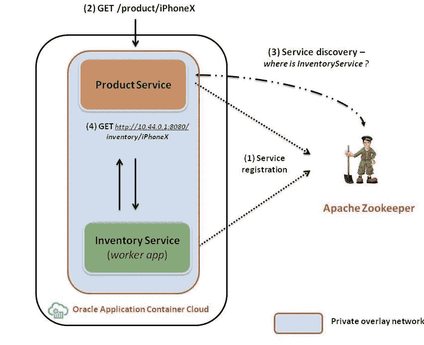
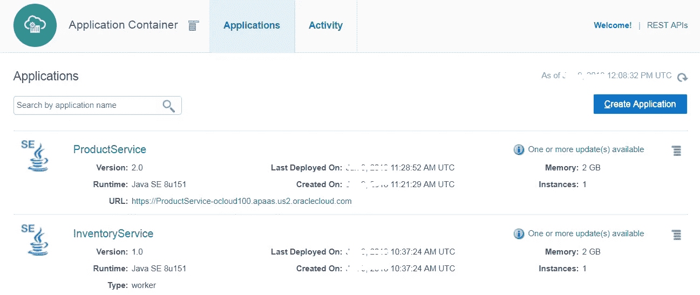
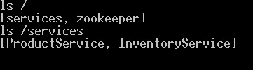
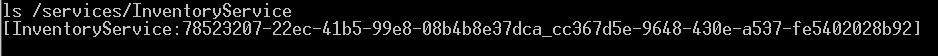
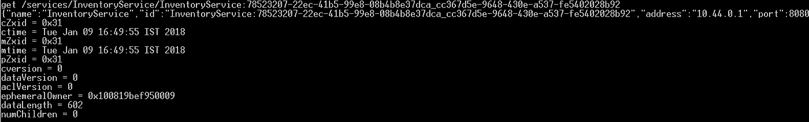
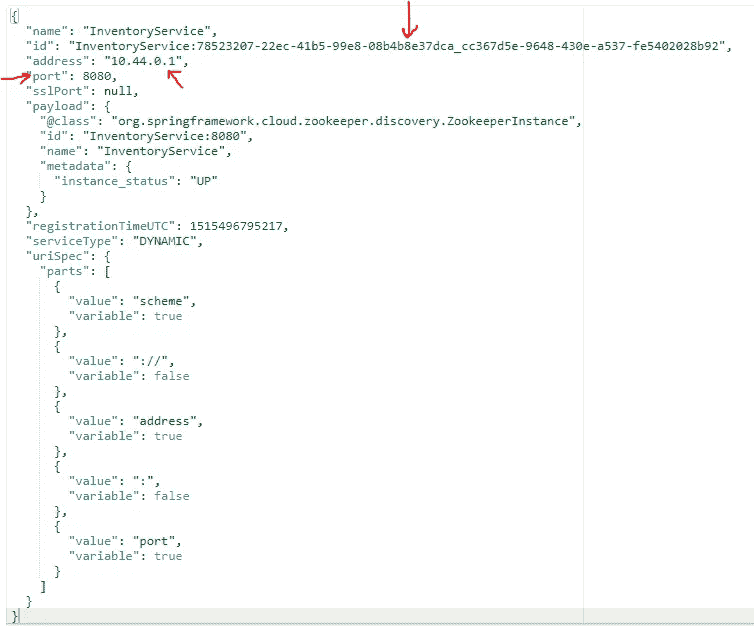
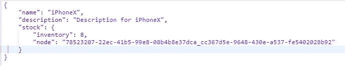
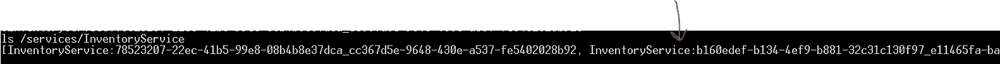
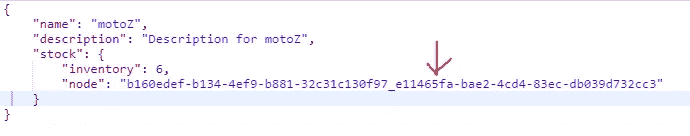

# 基于 Spring Cloud 和 Zookeeper 的 Oracle Cloud 微服务服务发现

> 原文：<https://medium.com/oracledevs/microservices-service-discovery-on-oracle-cloud-with-spring-cloud-and-zookeeper-627e6bb59ea2?source=collection_archive---------5----------------------->

> 有关微服务主题的博客帖子的主目录，请参考—[https://medium . com/Oracle devs/bunch-of-microservice-related-blogs-57 b5 f1f 062 e 5](/oracledevs/bunch-of-microservices-related-blogs-57b5f1f062e5)

本博客借助基于 Oracle 云构建的示例应用程序演示了以下技术(通常用于微服务)

*   服务*注册表*和*发现*
*   *同步*服务间*通信*(基于 REST)与*客户端负载均衡*

无论是单片还是微服务，应用程序很少孤立工作。他们需要与其他服务协作来满足业务需求。为此，从属服务需要知道其他服务的坐标，即主机和端口详细信息(大多数情况下)

静态配置是最简单的选项(如属性文件、环境变量等)。)但是它不能很好地适应分布式的、基于云的架构，因为由于这些服务的*弹性* & *短暂*的本质，坐标不是固定的/可预测的

出现了许多问题，但这里有一些常见的/明显的

*   系统停机时间:更改服务 URIs 以计入添加/删除的实例
*   复杂性:有多个这样的服务(和依赖项)需要处理。

解决这些问题的一个广泛使用的模式/解决方案是*服务注册*和*发现*

*   服务注册中心:应用程序向这个集中的注册中心注册，它们的生命周期(取消注册等)也受到管理
*   **服务发现**:依赖的应用程序(客户端应用程序)查询注册表，以获得它们想要调用的服务的实例

博客中的示例应用程序使用了流行的[春云](http://projects.spring.io/spring-cloud/)伞中的项目，具体来说就是[春云网飞](https://cloud.spring.io/spring-cloud-netflix/)

*   **动物园管理员—** 中央*服务注册中心*组件
*   **网飞假装**——用于*同步服务间通信* (RPC)的声明式 REST 客户端，它是
*   通过 Spring Cloud 注解进一步丰富激活 **Ribbon** 客户端(另一个网飞项目)。这使得无缝*服务发现*以及*客户端负载平衡*成为可能
*   有几个(微)服务(简单的 **Spring Boot** 应用程序)来演示服务发现

> Spring Boot 应用运行在 Oracle 应用容器云上，Oracle 应用容器云是一种云原生的多语言 aPaaS(应用平台即服务)

[](https://cloud.oracle.com/application-container-cloud) [## 应用容器云| ACC | Oracle 云

### 云中的 Java 标准版和 Node.js。

cloud.oracle.com](https://cloud.oracle.com/application-container-cloud) 

# 架构和解决方案深度探讨

> *Github 上有示例应用*

[](https://github.com/abhirockzz/accs-microservices-service-discovery) [## abhirockzz/accs-微服务-服务-发现

### 通过在 GitHub 上创建帐户，为 accs-微服务-服务发现开发做出贡献。

github.com](https://github.com/abhirockzz/accs-microservices-service-discovery) 

这是一个高级图表



*   库存服务向 Zookeeper 注册
*   产品服务从 Zookeeper 获取库存服务坐标
*   所有通信都通过内部/私有覆盖网络进行，即所有应用都使用`manifest.json`中的`“isClustered” : “true”`设置

> 在[文档](https://docs.oracle.com/en/cloud/paas/app-container-cloud/dvcjv/preparing-clustered-application-deployment.html) — TL 中有更多关于“集群”魔法的细节；灾难恢复是指它为应用程序之间的内部通信建立一个专用网络

## 库存

如上所述，这是一个普通的 Spring Boot web 应用程序(`@RestController`)，它公开了一个 REST 端点来获取商品的库存/存货(*)这个实现本身有点做作，但它足够简单来演示这个概念*

以下是这项服务最重要的几点

*   确保它自动向 Zookeeper 注册
*   这是一个 **Worker** 应用程序，也就是说，它没有公共 URL。这是一个*内部*服务，只需要被其他(可能是面向公众的)应用程序访问

> 这里是一个关于工人应用的介绍性博客

*   它使用一个定制的`ZookeeperDiscoveryProperties` bean 来配置与 Zookeeper 的交互
*   该服务被配置为[向 Zookeeper 通告其 IP 地址](https://github.com/abhirockzz/accs-microservices-service-discovery/blob/master/inventory/src/main/java/com/oracle/cloud/accs/inventory/InventoryApplication.java#L35)，并使用应用程序名称(在本例中为其`InventoryService`)获取 IP 信息

```
InetAddress **inetAddress** = Address.getByName( System.getenv(“**ORA_APP_NAME**”));**hostIP** = inetAddress.getHostAddress();
```

## 产品

这是另一个 Spring Boot 网络应用程序。它充当库存服务的客户端

*   使用一个`[@FeignClient](https://github.com/abhirockzz/accs-microservices-service-discovery/blob/master/product/src/main/java/com/oracle/cloud/product/InventoryClient.java)` [带注释的接口](https://github.com/abhirockzz/accs-microservices-service-discovery/blob/master/product/src/main/java/com/oracle/cloud/product/InventoryClient.java)，它定义了库存服务 REST 端点的接口
*   使用`@EnableFeignClients`来激活基于 Ribbon 的特性，该特性自动使 feign 客户端能够从 Zookeeper 中发现应用实例(基于名称),并在所有实例之间平衡调用负载

## 动物园管理员

如上所述，Zookeeper 是中央服务注册中心，作为一个独立的基础设施组件部署，可以从运行在应用程序容器云上的上述服务中访问

# 构建和部署

首先从 Github 获取项目— `git clone [https://github.com/abhirockzz/accs-microservices-service-discovery](https://github.com/abhirockzz/accs-microservices-service-discovery)`

## 建设

**库存服务**

*   `cd inventory`
*   `mvn clean install`

构建过程将在`target` 目录中创建`inventory-dist.zip`

**产品服务**

*   `cd product`
*   `mvn clean install`

构建过程将在`target` 目录中创建`product-dist.zip`

## 部署也称为向云推进

借助 Oracle Application Container Cloud，您在部署应用程序方面有多种选择。本博客将利用 **PSM CLI** ，这是一个用于管理 Oracle 云服务的强大命令行界面

> 其他部署选项包括 [REST API](https://docs.oracle.com/en/cloud/paas/app-container-cloud/apcsr/index.html) 、 [Oracle 开发者云](https://docs.oracle.com/en/cloud/paas/developer-cloud/csdcs/deploying-application-oracle-developer-cloud-service.html#GUID-6FE6D850-65DC-471D-A249-F7CCA9CAB56F)，当然还有[控制台/UI](https://docs.oracle.com/en/cloud/paas/app-container-cloud/csjse/creating-application.html)

您可以在您的机器上下载并设置 PSM CLI(使用`psm setup` ) — [详情请点击](https://docs.oracle.com/en/cloud/paas/java-cloud/pscli/using-command-line-interface-1.html)

部署这两个应用程序

> 一旦执行，异步进程就会启动，CLI 会返回其作业 ID，以便您跟踪应用程序的创建

在开始部署服务之前，您需要确保

*   您已经运行了 Zookeeper，并且可以从 Oracle 应用程序容器云中访问它
*   更新`deployment.json`(用于两个应用程序)以输入动物园管理员信息

```
{
 “memory”: “2G”,
 “instances”: 1,
 “environment”: {
 “ZOOKEEPER”: “<as per your setup>”
 }
}
```

*   **库存服务**——`psm accs push -n InventoryService -r java -s hourly -m manifest.json -d deployment.json -p target/inventory-dist.zip`
*   **产品服务** — `psm accs push -n ProductService -r java -s hourly -m manifest.json -d deployment.json -p target/product-dist.zip`

您应该在应用程序容器云应用程序页面上看到这两种服务



Spring Boot apps deployed to App Container Cloud

## 确认服务注册

在我们继续之前，让我们检查 Zookeeper 以确认库存和产品服务已经注册，并查看相关的细节

> 你可以从这里下载[Zookeeper](https://zookeeper.apache.org/releases.html)然后使用它的 CLI — `bin/zkCli.cmd`

默认情况下，信息存储在`/services`路径中— `ls /services`将显示两个服务确实都已注册



ACCS service registration in Zookeeper

让我们来看看库存服务的细节，因为这是最终将由产品服务*发现*(并*调用*)的细节——使用`ls /services/InventoryService`进一步深入库存服务，您将看到一个唯一的实例已经被注册



ACCS Inventory service instance in Zookeeper

> 使用应用程序名称(通过`*ORA_APP_NAME*` 环境变量获得)和应用程序容器云中的运行时(Docker)容器名称(`*APAAS_CONTAINER_NAME*` 变量)的组合格式来创建唯一实例 ID

我们可以获取已经注册的确切信息— `get /services/InventoryService/<instance_id>`



Instance information in Zookeeper

JSON 代码片段(从上面的代码片段裁剪而来)包含所需的信息——我们特别感兴趣的是主机(IP)和端口。这里是 JSON 有效负载供您参考(*注意突出显示的部分*)



Service registration (JSON) payload

> 另一件需要注意的重要事情是`address` 的值(在本例中为 10 . 44 . 0 . 1)—它是库存服务的内部 IP。因为我们已经配置了服务之间的私有覆盖网络通信，所以产品服务将能够使用这个 IP 来调用库存服务

# 试车

好了，一切都准备好了——我们现在可以开始玩了

## 健全测验

让我们通过调用产品服务端点从一个简单的测试开始

例如`curl -X [https://ProductService-ocloud100.apaas.us2.oraclecloud.com/product/iPhone](https://ProductService-ocloud100.apaas.us2.oraclecloud.com/product/iphone2)X`

您应该会得到一个 JSON 响应。请注意`node`属性(有点奇怪),它是为了显示哪个应用程序实例(容器)处理了请求而特意添加的*——每次调用服务时，您都会得到不同的(随机生成的)库存计数*

> 如果您仔细观察，您应该会注意到,`node` 属性的值实际上是 Zookeeper 中库存服务的服务实例 ID 的一部分(请参考上图再次检查这一点)



Product service response

## 超过尺寸范围

让我们将我们的库存服务提升到两个实例，然后再看看整个流程(*服务注册、服务发现和客户端负载平衡*)是如何进行的——这一次使用了目标服务的多个实例


Scale out the Inventory service

让我们再检查一下动物园管理员— `ls /services/InventoryService`



New ACCS app instance added to Zookeeper service registry

请注意，由于向外扩展，我们刚刚添加了额外的/新的实例(ID 被裁剪)

现在我们可以再次访问产品服务(几次)，例如`curl -X [https://ProductService-ocloud100.apaas.us2.oraclecloud.com/product/](https://ProductService-ocloud100.apaas.us2.oraclecloud.com/product/iphone2)motoZ`



Response from Product service

再次注意突出显示的部分——`node` 属性的值指向我们生成的新实例(gt 在 Zookeeper 中注册了该实例)。如果您一直调用产品服务，您将会看到它在库存服务的两个实例之间保持平衡

## 按比例减少

一旦你缩小了库存服务应用程序，你将在 Zookeeper 中留下一个条目

# 快速回顾

*   我们部署了几个 Spring Boot 应用程序，它们将自己注册到 Zookeeper — **服务注册表**中
*   当产品服务能够通过从 Zookeeper 中计算出其坐标来调用库存服务时，我们能够看到**服务发现**在起作用
*   来自产品服务的调用在库存服务的多个实例之间进行了负载平衡

# 其他注意事项

这些没有在这个博客中涉及，但是值得一提

*   多语言支持——Spring Cloud Zookeeper 仅限于 Java 应用程序(如果不是只有 Spring 的话)。通常，多语言支持是通过 sidecar(通常基于 REST)或特定于语言的绑定获得的
*   Spring Cloud 还支持其他服务发现后端，如 Consul、网飞尤里卡等。

好了，这篇博文到此为止！

# 不要忘记…

*   查看 Oracle Application Container Cloud 教程—每个运行时都有适合的内容！

 [## Oracle 应用容器云服务—创建您的第一批应用

### Oracle 应用容器云服务教程。学习创建你的第一个应用程序。

docs.oracle.com](https://docs.oracle.com/en/cloud/paas/app-container-cloud/create-first-applications.html) 

*   关于应用容器云的其他博客

[](/tag/app-container-cloud/latest) [## 关于应用容器云的最新故事和新闻—中型

### 阅读关于应用容器云的最新文章。每天，成千上万的声音阅读、书写和分享重要的…

medium.com](/tag/app-container-cloud/latest) 

干杯！

> 本文表达的观点是我个人的观点，不一定代表甲骨文的观点。