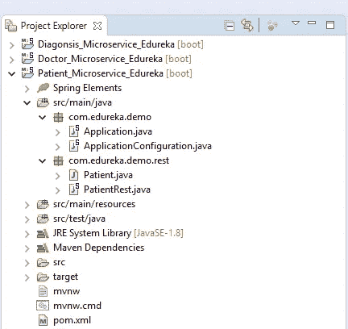

# 通过一个例子了解微服务是如何工作的

> 原文：<https://medium.com/edureka/microservices-tutorial-with-example-a230413dfa13?source=collection_archive---------0----------------------->

Microservices Tutorial - Edureka

组织正在迅速转向微服务架构&寻找具有微服务知识的专业人员。我希望您已经阅读了我之前的文章 ***什么是微服务*** ，该文章解释了架构，将微服务与 monolithic 和 SOA 进行了比较，并借助用例探讨了何时使用微服务。

在本微服务教程中，将涵盖以下主题:

1.  整体建筑
2.  单片架构的挑战
3.  什么是微服务
4.  微服务架构
5.  微服务示例—演示

让我们通过 Mediamore.com 的一个用例来探索微服务的概念。

Mediamore 是一家提供流媒体和在线视频的娱乐公司。它由不同语言的各种类型的电视节目组成。像许多其他公司一样，mediamore 以整体架构开始了它的旅程。

现在让我们来探索 mediamore 的整体框架。

# 整体建筑

Monolithic Architecture of Mediamore — Microservices Tutorial

参考上图。我们可以推断，所有的功能，如搜索，用户信息，推荐，视频播放列表和其他放在一个单一的数据库使用单一的代码。

现在，让我通过一些场景告诉你开发人员在使用单一框架时所面临的挑战。

# 单片架构的挑战

## **场景 1:可伸缩性:**

> *让我们假设开发人员想要根据最受欢迎的电视节目更新播放列表，同时还想要将所有视频更新为高清质量。*
> 
> 开发人员不能同时扩展应用程序。每次开发或部署新功能时，都必须创建同一应用程序的新实例。

## **场景 2:敏捷性:**

> *假设开发人员想要在应用程序中立即进行更改。*
> 
> 单片应用程序肯定可以适应这些变化。但是，这里的问题是，开发人员必须为每一个小的变化重新构建代码。

## **情景 3:混合技术:**

> *假设这个应用程序的开发人员熟悉各种技术，如 JAVA、C++、。NET，C#。*
> 
> 即使他们熟悉各种技术，他们仍然不得不在单一技术上构建大型复杂的应用程序。

## **场景 4:容错:**

> *让我们假设一个特定的特性在应用程序中不起作用。*
> 
> 整个系统因为这个问题而瘫痪。为了解决这个问题，必须重新构建、重新测试和重新部署应用程序。

那么，mediamore 的开发者是如何克服这些复杂性的呢？

因此，开发人员决定将他们的整体应用程序重新架构成多个单独的可部署组件，称为微服务。

> 这是一个百万美元的问题！

# 什么是微服务？

***微服务*** *是一种架构，其中系统的所有组件都放入单独的组件中，这些组件可以单独构建、部署和扩展。*

我用一个简单的类比来给你解释一下。

你一定见过蜜蜂如何通过排列六角形的蜡细胞来建造它们的蜂巢。他们最初使用各种材料从一小部分开始，然后继续用它建造一个大蜂巢。这些细胞形成一种模式，从而形成一种牢固的结构，将蜂窝的特定部分结合在一起。在这里，每个细胞都独立于其他细胞，但也与其他细胞相关。这意味着对一个细胞的损害不会损害其他细胞，因此，蜜蜂可以重建这些细胞，而不会影响整个蜂巢。

Beehive Representation of Microservices — Microservices Tutorial

参考上图。这里，每个六边形代表一个单独的服务组件。类似于 bees 的工作，每个敏捷团队用可用的框架和选择的技术栈构建一个单独的服务组件。就像在蜂窝中一样，每个服务组件形成一个强大的微服务架构，以提供更好的可伸缩性。此外，每个服务组件的问题都可以由敏捷团队单独处理，对整个应用程序没有影响或影响很小。

您可能想到的下一个问题是微服务架构的不同组件如何协同工作。

但是，在此之前，让我列出微服务架构的组件。

请参考下图。

Microservices Architecture — Microservices Tutorial

> **客户端** —来自不同设备的不同用户发送请求。
> 
> **身份提供者** —验证用户或客户端身份并颁发安全令牌。
> 
> **API 网关** —处理客户端请求。
> 
> **静态内容** —包含系统的所有内容。
> 
> **管理** —平衡节点上的服务并识别故障。
> 
> **服务发现** —寻找微服务间通信路径的指南。
> 
> **内容交付网络** —代理服务器及其数据中心的分布式网络。
> 
> **远程服务** —支持远程访问驻留在 IT 设备网络上的信息。

现在，让我通过考虑一个场景，向您简要介绍这些组件如何在 mediamore 上协同工作。

# 微服务架构

## 场景:

爱丽丝是 mediamore 的忠实用户。她经常使用 mediamore 在线观看她最喜欢的连续剧。她最近错过了一集她最喜欢的电视节目。

当 Alice 登录该应用程序时，她会在自己的主页上看到最受推荐的内容。经过一番寻找，她终于找到了她的电视节目。

但是，如果爱丽丝想通过一次点击获得她的电视节目。

开发人员将如何合作来满足爱丽丝的要求？

爱丽丝的请求被传递给**身份提供者**。因此，身份提供者通过将 Alice 识别为 mediamore 上的普通用户来验证她的请求。

这些请求被传递给 **API 网关**，它充当 Alice 将她的请求转发给适当的微服务的入口点。

每个功能都有自己的工作微服务，处理自己的数据。这些微服务也有自己的**负载平衡器**和**执行环境**来正常运行。

Microservices Architecture of Mediamore — Microservices Tutorial

请参考下图。每个微服务由一个小的敏捷团队处理，例如内容团队、视频上传团队、最流行团队、搜索团队等。

Division of Teams of Mediamore — Microservices Tutorial

> 内容团队由应用程序提供的数百万个电视节目组成。
> 
> 视频上传团队负责将所有内容上传到应用程序中
> 
> 最受欢迎团队根据用户的地理位置等来存放最受欢迎的节目。

这些小型开发团队将每一条内容与描述搜索内容的元数据相关联。然后，元数据被提供给另一个微服务，即搜索功能，该功能确保 Alice 的搜索结果被捕获到内容目录中。

然后，第三个微服务，即最有趋势的微服务，根据所有 mediamore 用户的地理位置捕获他们的趋势内容。

这个微服务的内容就是 Alice 第一次登录 mediamore 时看到的内容。

这些可单独部署的微服务被放在特定的**容器**中，以加入应用程序。容器用于将代码交付给需要部署的部门。

但在他们加入应用程序一起工作之前，他们必须找到对方来满足爱丽丝的要求。

***这些微服务是如何找到对方的？***

***微服务*** 使用**服务发现**作为向导来寻找它们之间的通信路径。微服务然后通过无状态服务器相互通信，即通过 **HTTP 请求/消息总线**。

Communication Between Microservices — Microservices Tutorial

这些微服务使用**应用程序接口(API)** 相互通信。在微服务内部通信之后，它们将**静态内容**部署到基于云的存储服务，该存储服务可以通过**内容交付网络(CDNs)** 将它们直接交付给客户端。

因此，当 Alice 搜索她的电视节目时，搜索微服务与 API 中的内容目录服务进行通信，了解 Alice 在搜索什么，然后这些微服务将键入的单词与他们已经拥有的元数据进行比较。

Representation of how to search operation is performed with the help of API — Microservices Tutorial

一旦开发团队捕捉到 Alice 键入最多的单词，分析团队就会更新推荐微服务中的代码，并将 Alice 的最常观看的内容和偏好与同一地理区域内其他用户的热门内容进行比较。

这意味着 Alice 下次登录该应用程序时，她不仅可以看到最受欢迎的内容，还可以找到包含她以前观看过的节目的个性化播放列表。

通过这种方式，开发团队可以快速满足 Alice 的请求，因为他们不必再次构建完整的应用程序，只需更新代码即可部署这一新功能。

因此，微服务通过这种方式调用并行环境来满足数百万兴趣各异的客户。

现在，在这个微服务教程中，我的下一部分将重点放在实践上。

# 微服务示例—演示

为了演示微服务的概念，我使用 Spring Boot 创建了 3 个 Maven 项目，分别名为 Doctor_Microservice_Edureka、Diagnosis_Microservice_Edureka 和 Patient_Microservice_Edureka。

请参考下面的快照。

在您理解这三个项目如何相互作用之前。让我给你简单介绍一下这些项目的档案。

为了解释这一点，我将考虑项目**Patient _ Microservice _ edu reka**并列出其基本文件。

请参考下面的快照。

**Pom.xml** —为 REST 服务的创建添加了依赖关系。

Application.java**——三个项目中相同的班级。充当 Spring Boot 的发起者。**

**ApplicationConfiguration.java**—研究配置类，负责向应用用户公开 REST 服务。

**Patient.java**—一个简单的类，包含输入，如患者的姓名、id、电子邮件。

**PatientRest.java**—开始实施项目中的其余服务。

通过这种方式，在 Doctor_Microservice 中为其他 2 个项目创建了类似的文件和一些附加文件。

因此创建了 REST 服务来搜索患者和诊断。患者和诊断的键作为参数传递给 Doctor_Microservice 中的方法(PatientDetails)。这种方法获取病人和疾病的数据。

参考上面的快照。在这里，我们观察到病人和诊断类包含在 Doctor_Microservice_Edureka 中。这些类是从它们的原始项目中克隆出来的。

然后启动 REST 服务，我已经初始化了

> **端口 **8081** 上的 Patient _ Microservice _ edu reka**
> 
> **在 **8082** 上的诊断 _ 微维修 _ 维修卡**
> 
> **端口 **8083** 上的 Doctor_Microservice_Edureka** 。

使用上面的配置，当我同时运行每个服务时，3 个不同的控制台窗口在 Eclipse 控制台窗口中运行。

正如你在下面看到的，在我们运行项目之后，Spring Boot 生成了一个引导日志。该日志包含关于初始化 tomcat 及其相关资源的信息。日志的最后一行告诉我们应用程序是否已经启动。

要测试患者和诊断服务是否正常运行，请使用浏览器(Mozilla Firefox)并转至[**http://localhost:8081/**](http://localhost:8081/)和**[**http://localhost:8082/**](http://localhost:8082/)URL。您应该得到如下所示的输出:**

****

**最后，为了测试**Doctor _ Microservice _ edu reka**的功能性，我模拟了 id 为 2 的患者，患有 id 为 3 的疾病，咨询了咨询 4 的医生的信息。**

**使用的网址如下:**http://localhost:8083/doctor？id patient = 2&id diagnosis = 3&consulting = 4****

**请参考下面的输出快照。**

****

**通过这种方式，3 个微服务相互作用以产生期望的结果。**

**希望你已经喜欢阅读这个**微服务教程**。我们已经看到了一个简单的例子来理解不同的微服务是如何相互通信的。如果你想查看更多关于人工智能、DevOps、道德黑客等市场最热门技术的文章，你可以参考 Edureka 的官方网站。**

**请留意本系列中的其他文章，它们将解释微服务的各个方面。**

> ***1。* [*什么是微服务？*](/edureka/what-is-microservices-86144b17b836)**
> 
> ***2。**[*微服务架构*](/edureka/microservice-architecture-5e7f056b90f1)***
> 
> ****3。* [*微服务 vs SOA*](/edureka/microservices-vs-soa-4d71c5590fc6)***
> 
> ****4。* [*微服务设计模式*](/edureka/microservices-design-patterns-50640c7bf4a9)***
> 
> ****5。* [*构建微服务应用使用 Spring Boot*](/edureka/microservices-with-spring-boot-ffab2ce8ac34)***
> 
> ****6。* [*微服务安全*](/edureka/microservices-security-b01b8f2a9215)***

****原载于 2018 年 3 月 28 日 www.edureka.co**T21*[。](https://www.edureka.co/blog/microservices-tutorial-with-example)***