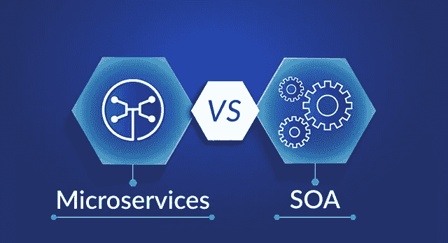
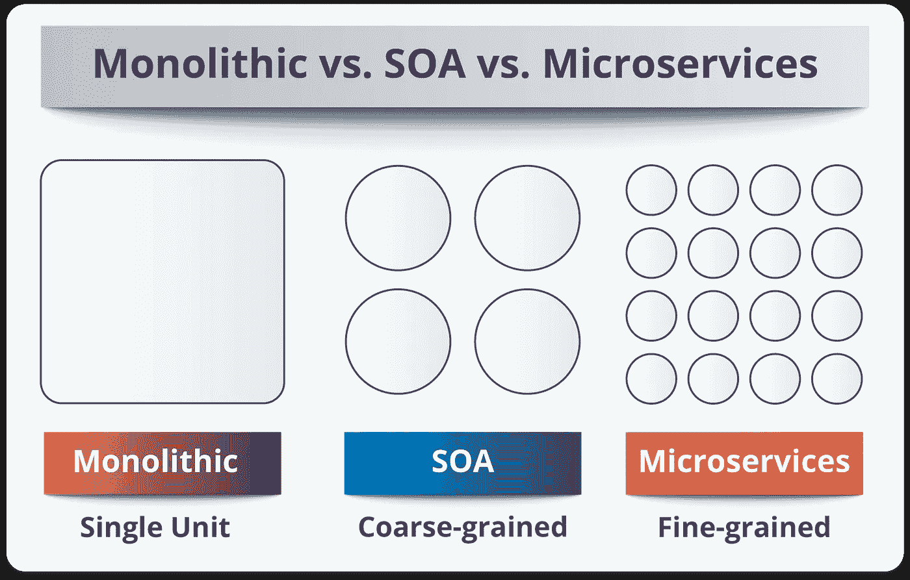
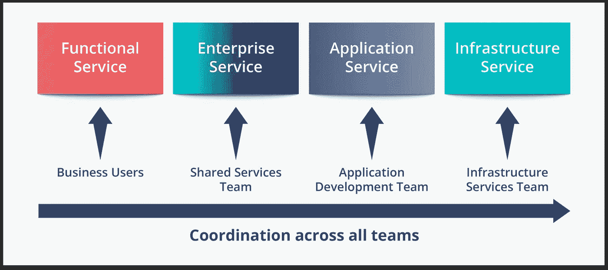
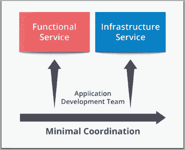
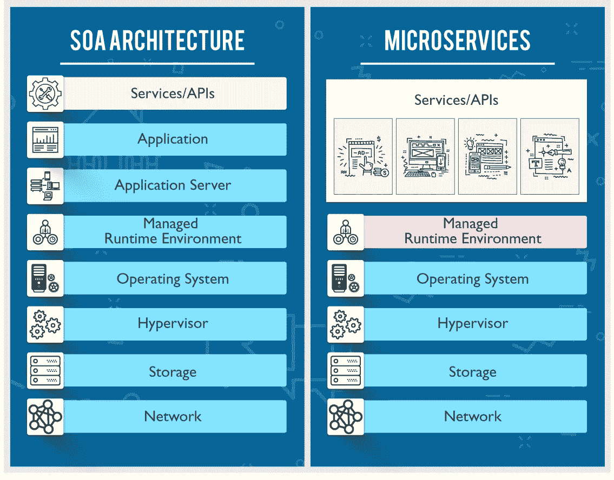
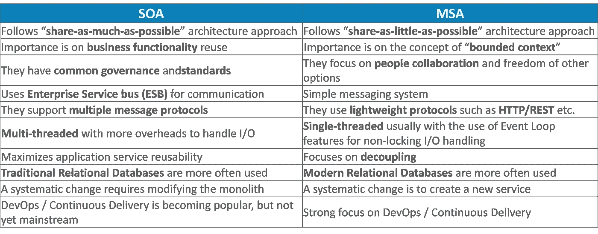

# 微服务 vs SOA——顶级架构之间的战争

> 原文：<https://medium.com/edureka/microservices-vs-soa-4d71c5590fc6?source=collection_archive---------3----------------------->

Microservices vs SOA — Edureka

在本文中，我将向您解释基于分层的架构，并告诉您微服务与 SOA 架构的区别是什么？

因此，在我们深入探究微服务与 SOA 之间的区别之前，让我告诉你整体架构、SOA 和微服务之间的基本区别。

Monolithic vs SOA vs Microservices — Microservices vs SOA

通俗地说， **Monolithic** 类似于一个大容器，其中应用程序的所有软件组件被组装在一起并紧密打包。

一个**面向服务的架构**本质上是服务的集合。这些服务相互通信。通信可以包括简单的数据传递，也可以包括两个或多个协调某些活动的服务。需要一些将服务相互连接的方法。

**微服务**，又名 ***微服务架构*** ，是一种架构风格，将应用程序构建为小型自治服务的集合，围绕**业务领域建模。**

现在，让我们看看微服务与 SOA 之间的主要区别:

# 微服务与 SOA

当比较微服务和 SOA 时，它们都依赖服务作为主要组件，但是它们在服务特征方面有很大的不同。

## 面向服务的架构

它定义了如下所示的 4 种基本服务类型:

Basic Service Types — Microservices vs SOA

## **商业服务:**

*   它们是定义核心业务操作的粗粒度服务。
*   通过 XML、业务流程执行语言(BPEL)等表示。

## **企业服务:**

*   实现由业务服务定义的功能。
*   他们主要依靠应用服务和基础设施服务来满足业务需求。

## **应用服务**

*   局限于特定应用程序上下文的细粒度服务。
*   专用用户界面可以直接调用服务。

## **基础设施服务**

*   实现非功能性任务，如身份验证、审核、安全性和日志记录。
*   可以从应用程序服务或企业服务中调用它们。

**微服务**的服务分类有限。它们由两种服务类型组成，如下所示。

Services of Microservices — Microservices vs SOA

## **功能服务:**

*   它们支持特定的业务操作。
*   对服务的访问是在外部完成的，并且这些服务不与其他服务共享。
*   与 SOA 一样，基础设施服务实现审计、安全和日志记录等任务。
*   在这种情况下，服务不会对外公开。

# SOA 和 MSA 之间的主要区别

Differences between Microservice Architecture and SOA — Edureka

# 微服务和 SOA 的主要区别如下:

## **服务粒度**:

> 微服务架构中的服务组件通常是单一用途的服务，能够非常非常好地完成一件事情。使用 SOA，服务组件的规模可以从小型应用程序服务到非常大的企业服务不等。事实上，SOA 中的服务组件通常由大型产品甚至子系统来表示。

## **组件共享**:

> 组件共享是 SOA 的核心原则之一。事实上，组件共享就是企业服务的全部。SOA 增强了组件共享，而 MSA 试图通过“有界上下文”最小化共享。有界上下文指的是组件及其数据作为一个单元的耦合，具有最小的依赖性。由于 SOA 依赖于多种服务来满足业务请求，因此基于 SOA 构建的系统很可能比 MSA 慢。

## **中间件 vs API 层**:

> 微服务架构模式通常有一个 API 层，而 SOA 有一个消息中间件组件。SOA 中的消息中间件提供了许多 MSA 中没有的附加功能，包括中介和路由、消息增强、消息和协议转换。MSA 在服务和服务消费者之间有一个 API 层。

## **远程服务**:

> SOA 架构依赖消息传递(AMQP，MSMQ)和 SOAP 作为主要的远程访问协议。大多数 MSA 依赖于两种协议——REST 和简单消息传递(JMS，MSMQ ), MSA 中的协议通常是同构的。

## **异构互操作性**:

> SOA 通过其消息中间件组件促进多种异构协议的传播。MSA 试图通过减少集成选择的数量来简化架构模式。如果您想在异构环境中集成几个使用不同协议的系统，您需要考虑 SOA。如果您的所有服务都可以通过相同的远程访问协议公开和访问，那么 MSA 是一个更好的选择。

最后，我要说的是，要判断哪个架构比其他架构好并不是那么简单。这主要取决于您构建应用程序的目的。 **SOA** 更适合需要与许多异构应用程序集成的大型复杂业务应用程序环境，即较小的应用程序不太适合 SOA，因为它们不需要消息中间件组件。**另一方面，微服务**更适合于较小的、划分良好的、基于 web 的系统，在这些系统中，微服务给了开发人员更大的控制权。结论是，因为它们都有不同的体系结构特征，但这主要取决于您正在构建的应用程序的目的。

这就把我们带到了关于微服务与 SOA 的文章的结尾。我希望这篇文章对你有所帮助，并增加了你的知识价值。如果你想查看更多关于人工智能、DevOps、道德黑客等市场最热门技术的文章，你可以参考 Edureka 的官方网站。

请留意本系列中的其他文章，它们将解释微服务的各个方面。

> *1。* [*什么是微服务？*](/edureka/what-is-microservices-86144b17b836)
> 
> *2。* [*微服务架构*](/edureka/microservice-architecture-5e7f056b90f1)
> 
> *3。* [*微服务设计模式*](/edureka/microservices-design-patterns-50640c7bf4a9)
> 
> *4。* [*微服务教程*](/edureka/microservices-tutorial-with-example-a230413dfa13)
> 
> *5。* [*构建微服务应用使用 Spring Boot*](/edureka/microservices-with-spring-boot-ffab2ce8ac34)
> 
> *6。* [*微服务安全*](/edureka/microservices-security-b01b8f2a9215)

*原载于 2018 年 5 月 10 日 www.edureka.co***。**