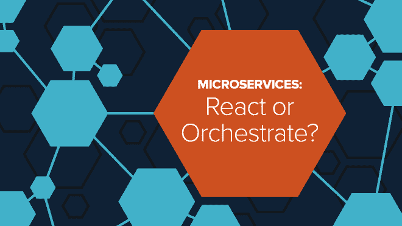
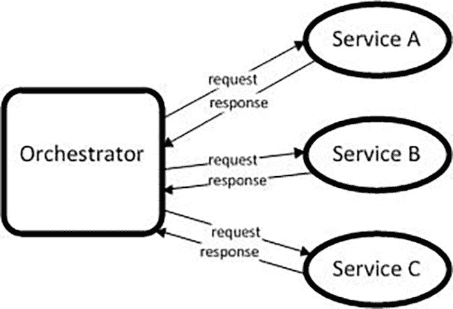
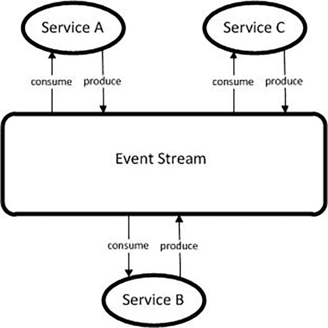
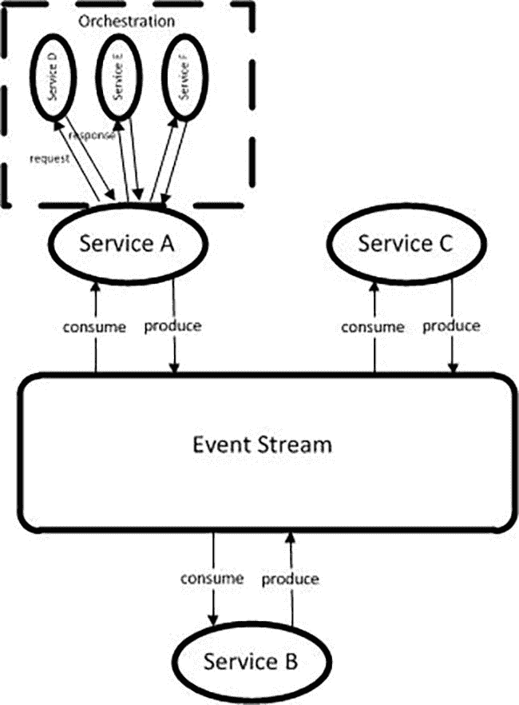
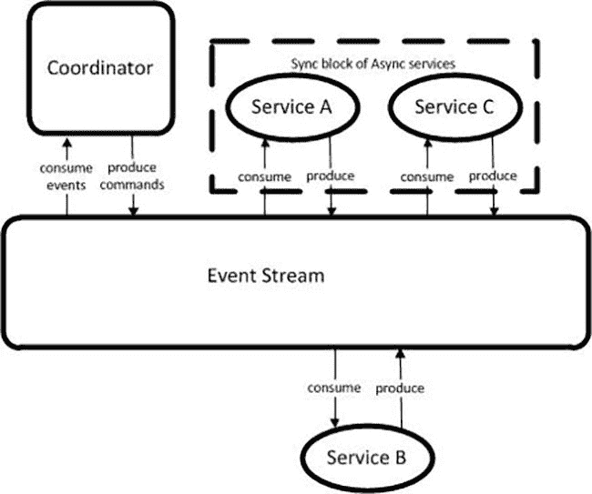

# 微服务—何时应对，何时协调

> 原文：<https://medium.com/capital-one-tech/microservices-when-to-react-vs-orchestrate-c6b18308a14c?source=collection_archive---------1----------------------->

我们大多数人都熟悉微服务的[主要概念及其好处；然而，对于如何正确实施这些措施，人们的共识往往较少。当您构建使用微服务的应用程序时，您需要决定微服务如何交互。在这些讨论中出现的一个常见问题是，****我应该在应用程序中使用编排还是反应式方法？有可能两者都用吗？”****](https://developer.capitalone.com/blog-post/delivering-microservices-for-enterprise-with-devops/)

*与任何技术决策一样，每种方法都有利弊，需要根据您的具体项目进行评估。在本文中，我们将详细讨论这些模式中的每一个，以及一些何时最好使用它们的例子。*

## *编排的优势和权衡*

*编排是处理面向服务架构(SOA)中不同服务之间交互的传统方式。对于编排，通常有一个控制器充当整个服务交互的“编排者”。这通常遵循请求/响应类型模式。*

**

*例如，如果需要以特定的顺序调用三个服务，orchestrator 会对每个服务进行调用，在调用下一个服务之前等待响应。*

****好处****

*   *当存在同步处理时，提供了一种控制应用程序流的好方法。例如，如果服务 A 需要在服务 B 被调用之前成功完成。*

****权衡****

*   *将服务耦合在一起，创建依赖关系。如果服务 A 关闭，服务 B 和 C 将永远不会被调用。*
*   *如果所有请求都有一个 orchestrator 的中央共享实例，那么 orchestrator 就是一个单点故障。如果出现故障，所有处理都会停止。*
*   *利用阻止请求的同步处理。在这个例子中，总的端到端处理时间是调用服务 A +服务 B +服务 C 所花费的时间的总和。*

## *被动的好处和权衡*

*在构建微服务架构时，我们希望避免在每个微服务内部创建依赖关系；这意味着每个服务都应该能够独立存在。反应式架构模式解决了上面列出的一些编排挑战。*

**我倾向于将反应式架构视为应用于微服务的事件驱动架构模式。没有一个中央协调器来控制什么步骤何时发生的逻辑，而是提前将该逻辑构建到每个服务中。**

*就当是协调或者编舞吧。各军种提前知道应对什么，如何应对，就像一个行进乐队在几个月的练习后表演他们的大型曲目一样。服务使用事件流进行事件的异步通信。多个服务可以同时消费相同的事件，进行一些处理，然后将它们自己的事件生成回事件流。事件流没有任何逻辑，旨在成为哑管道。*

*反应式架构的异步特性消除了流程编排(请求/响应)类型处理中发生的阻塞或等待。服务可以产生事件并保持处理。为此使用事件流可以使生产者和消费者之间的通信分离——生产者不需要知道消费者在产生事件之前是否已经启动并运行，或者消费者是否收到了所产生的事件。*

**

*此外，在某些情况下，生产者可能希望将命令指向特定的服务，并接收消费者收到命令的确认。此外，消费者/生产者可能希望从/向事件流消费/产生事件。这是一种有效的模式，并且您经常会发现这两种方法在一个反应式架构中一起使用。*

****好处****

*   *支持更快的端到端处理，因为服务可以并行/异步执行。*
*   *更容易添加/更新服务，因为它们可以很容易地插入/退出事件流。*
*   *与[敏捷交付模型](http://www.scaledagileframework.com/)保持一致，因为团队可以专注于特定的服务，而不是整个应用程序。*
*   *控制是分布式的，因此不再有单一的协调器作为故障的中心点。*
*   *一些模式可以与反应式架构一起使用，以提供额外的好处。例如，[事件源](https://martinfowler.com/eaaDev/EventSourcing.html)是事件流存储所有事件并启用事件重放的时候。这样，如果一个服务在事件仍在生成的时候关闭，当它重新联机时，它可以重放那些事件以赶上备份。此外，[命令查询责任分离(CQRS](https://martinfowler.com/bliki/CQRS.html#:~:text=CQRS%20stands%20for%20Command%20Query,you%20use%20to%20read%20information.) )可用于分离读写活动。这使得它们中的每一个都可以独立扩展。如果您的应用程序读得多，写得少，这就很方便了，反之亦然。*

****权衡****

*   *异步编程通常是开发人员的一个重大思维转变。我倾向于认为它类似于[递归](https://en.wikipedia.org/wiki/Recursion_(computer_science))，在这里你不能仅仅通过查看代码来判断代码将如何执行，你必须考虑在特定时间点所有可能为真的可能性。*
*   *复杂性被转移了。流控制不再集中在 orchestrator 中，而是分散在各个服务中。每个服务都有自己的流逻辑，这个逻辑将根据事件流中的特定数据确定何时以及如何做出反应。*

## *杂种*

*许多开发人员发现，一刀切的方法在软件应用程序架构中并不适用。我相信对于反应式和编排模式来说尤其如此。如果您的用例处于灰色地带，具有反应式和编排模式的一些特征，您会怎么做？例如，也许您混合了同步和异步处理；异步活动的同步块，反之亦然。在这些情况下，我相信有一种或多种混合模式可以增加价值，并且应该在您的项目中加以考虑。*

*使用混合方法时要考虑的一个设计原则是保持服务之间的主要交互是反应性的，以实现更高级别的异步处理。做相反的事情(在服务之间使用编排模式，在服务内部使用异步模式)会限制异步处理的总量。下面，我们将介绍两种不同的混合模式，它们将反应模式与编排一起使用。*

## *混合#1 —之间的反应和内部的编排*

*第一种混合模式使用服务之间的反应和服务内的编排。在这个例子中，服务 A、B 和 C 相互反应。服务 A 使用一个事件，该事件触发它编排对附加服务 D、E 和 f 的调用。这些附加服务调用可以是异步的，也可以是同步的。然后，服务 A 用这三个服务调用的结果生成一个事件。*

**

****好处****

*   *服务是分离的(但不是服务 A 中的服务)。*
*   *异步处理是通过利用服务之间的事件来实现的。*
*   *总流量是分布式的。每个服务都包含自己的流程逻辑。*

****权衡****

*   *在服务 A 中，存在与服务 D、E 和 f 的耦合。*
*   *根据设计，在服务 A 中可能会有阻塞请求的同步处理。*

## *混合#2 —在和协调者之间进行反应，以推动流程*

*第二种混合模式使用服务和协调器之间的反应来驱动流程。在这个例子中，协调者就像一个反应式的指挥者。它使用命令和事件的概念——命令是需要做的事情，事件是已经完成的事情。协调器向事件流产生命令，为命令预编程的各个微服务消费该命令，执行一些处理，然后向事件流产生事件。在本例中，服务 A 和 C 同时启动。协调器使用事件流中的事件，并在必要时对其关心的事件做出反应。*

**

****好处****

*   *服务是解耦的(但是服务和协调器之间存在一定程度的耦合)。*
*   *异步处理是通过利用服务之间的事件来实现的。*
*   *可以在反应式协调器的一个地方看到整个流程。*

****权衡****

*   *协调器确实与服务有耦合——特别是需要知道服务需要什么命令才能做出反应。*
*   *如果协调器出现故障，整个反应系统都会受到影响。*

## *何时使用流程编排，何时使用反应式，何时使用混合型*

*那么，未来一切都应该是被动的吗？配器是过去的事情吗？通过研究不同的用例，我发现在一些有效的场景中，每个模式都是有意义的。在这里，我们将介绍一些假设的情况，在这些情况下，可以应用纯反应、纯编排或混合模式。*

***纯反应用例***

*   *如果您的所有或大部分处理可以异步完成。反应式架构模式非常适合需要并行发生的处理。如果最小到零的处理可以异步完成，那么反应模式可能会过多。*
*   *如果将流程分散到每个服务中是可管理的。关联 id 可用于重新创建监控和审计的集中视图。*
*   *如果上市速度是重中之重。将微服务与反应式方法相结合，有助于最大限度地分离和最小化依赖性，从而使产品更快上市。*

***纯编排用例***

*   *如果您的所有或大部分步骤都必须按顺序完成，并行处理的机会微乎其微。*
*   *如果希望保持整体流量控制集中。这可能很棘手，但是我可以看到一个场景，在这个场景中集中流程是有意义的。特别是，在设计时和运行时，在一个地方查看端到端流的能力都是高优先级的。这种情况可能发生的一个条件是，如果您有数百个服务，每个服务都有基于正在处理的内容的多个不同的流。在这种情况下，在一个中心位置管理流量可能比分布它更容易。*
*   *脱钩不是当务之急。*

## ***混合使用案例***

**何时在服务和服务内的编排之间使用反应式**

*   *如果您的所有或大部分处理可以异步完成。*
*   *如果将流程分散到每个服务中是可管理的。*
*   *如果上市速度是重中之重。*
*   *如果有连续的步骤只适用于一个服务，而不适用于跨服务。*

**何时在服务和协调者之间使用反应来驱动流程**

*   *如果有异步处理的同步块。*
*   *如果整个流程可以根据正在处理的数据而改变，并且该流程可能涉及数百个微服务。*
*   *如果需要在设计时和运行时查看整个端到端流程。*
*   *如果需要尽可能的解耦，消除依赖。*

## *结论*

*总的来说，所有三类模式——编排、反应式和混合式——都可以应用于不同的场景和用例。因此，没有一种方法一定比其他方法更好或适用于所有需求。如果你问， ***“我应该在应用程序中使用编排还是反应式方法？有可能两者都用吗？”*** 我的建议是首先使用反应式架构进行评估，如果它不适合您的用例，那么从那里开始向后工作。这将有助于保证您选择满足您需求的最佳架构，并针对您的项目正确评估一组利弊。*

**

**声明:以上观点仅代表作者个人观点。除非本帖中另有说明，否则 Capital One 不属于所提及的任何公司，也不被其认可。使用或展示的所有商标和其他知识产权都是其各自所有者的所有权。本文为 2018 首都一。**