# Oracle ADF 远程区域的微服务

> 原文：<https://medium.com/oracledevs/microservices-with-oracle-adf-remote-regions-73dcb89939?source=collection_archive---------0----------------------->

ADF 远程区域—最新 ADF 12c 版本中提供的功能。ADF 远程区域运行在不同的服务器上，内容通过 ADF 远程区域 servlet 传送到消费模块。这允许将大型企业系统分离成单独的模块，每个模块在单独的服务器上独立运行。获得优势—系统变得更加可扩展和可靠，即使几个模块停机，系统仍将继续运行。

ADF 远程区域的概念，让我联想到微服务架构。*微服务——也称为微服务架构——是一种架构风格，它将应用程序构建为一组松散耦合的服务，这些服务实现业务功能。微服务架构支持大型复杂应用的持续交付/部署。它也使一个组织能够发展它的技术栈*(如这里描述的)。

让我们看看 ADF 远程区域是如何配置和使用的。示例应用程序(可以从 [GitHub](https://github.com/abaranovskis-redsamurai/remoteregions) 资源库下载)基于雇员和工作模块。每个模块部署在不同的服务器上，雇员模块在作业中使用。这里是微服务—员工表。此表来自松散耦合的服务，在作业模块中使用:

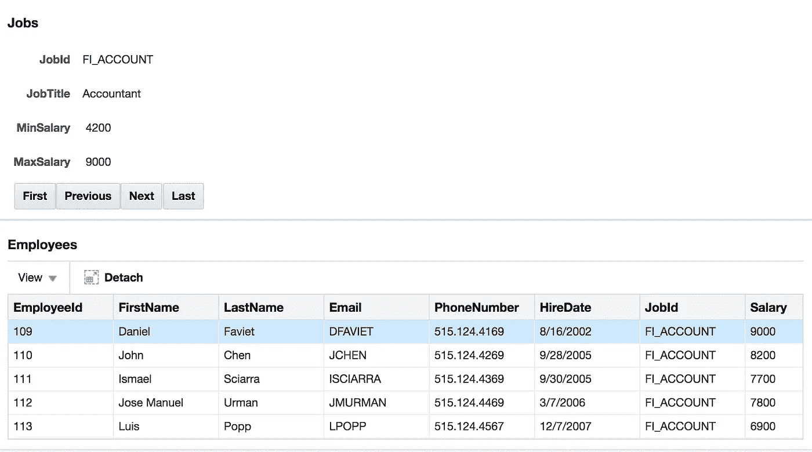

Employees 模块在 Docker 容器中的 ADF 服务器上运行(了解更多:[在 Docker 上运行并避免 OOM 的基本 WebLogic 调整](http://andrejusb.blogspot.lt/2017/11/essential-weblogic-tuning-to-run-on.html)):

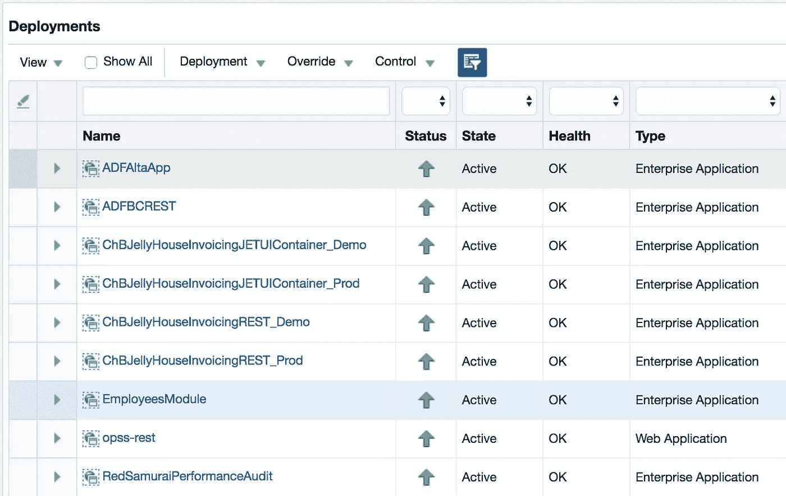

我将停止此模块:

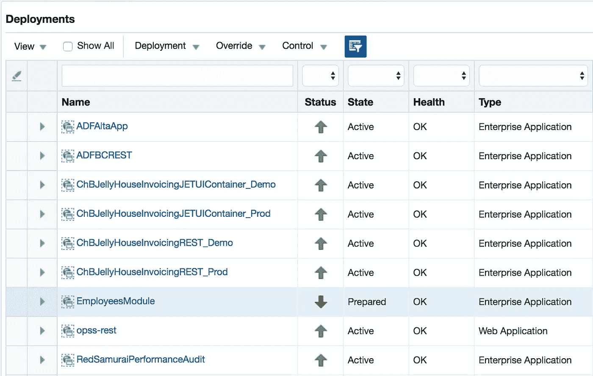

Jobs 模块仍然工作，即使 Employees 模块不再可用——它被停止了。否则，如果两个模块都作为单个应用程序部署，如果应用程序关闭，系统将完全不可用。但是现在用户可以访问部分功能:

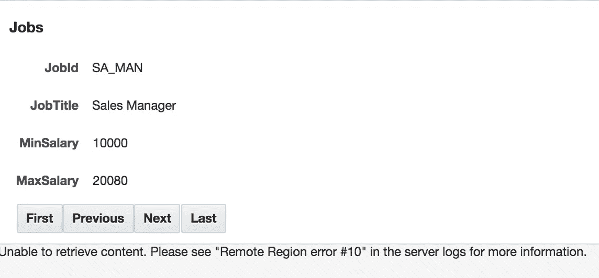

将深入到技术部分。ADF 远程区域与常规 ADF 区域的消耗方式并无不同。您仍然必须使用 ADF 区域标签来定义区域:

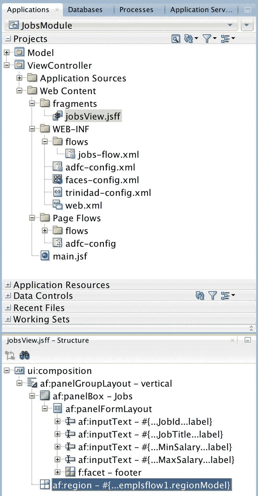

关键区别在于区域绑定——有一个称为远程连接的额外属性。此连接定义了传输远程区域内容的来源。所有其他属性都是一样的，我们也可以传递参数:

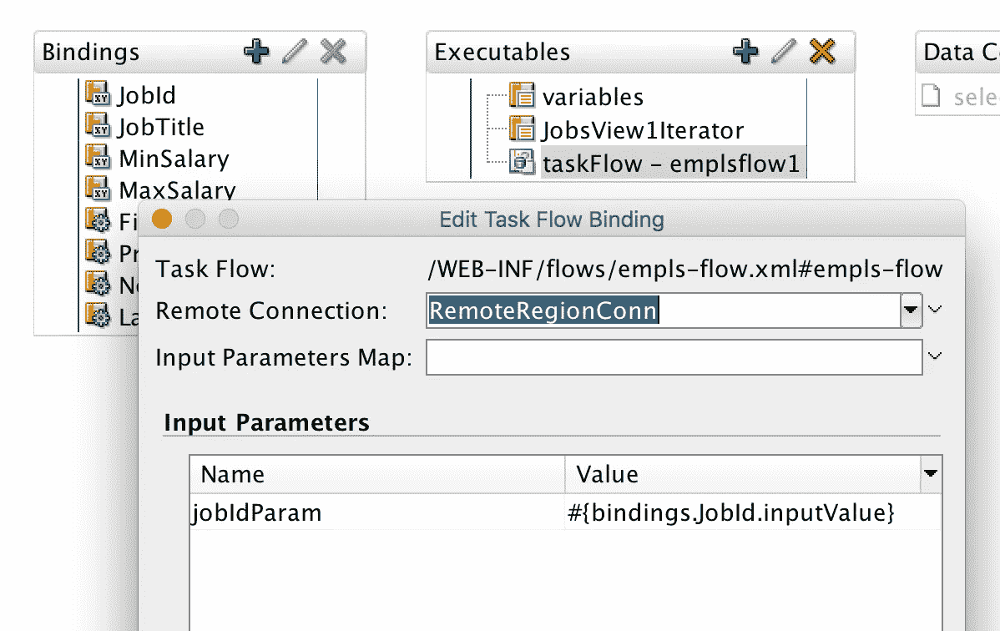

消费模块必须定义 ADF 远程区域连接。如果连接详细信息是正确的，您应该看到列出了远程访问的 ADF 任务流:

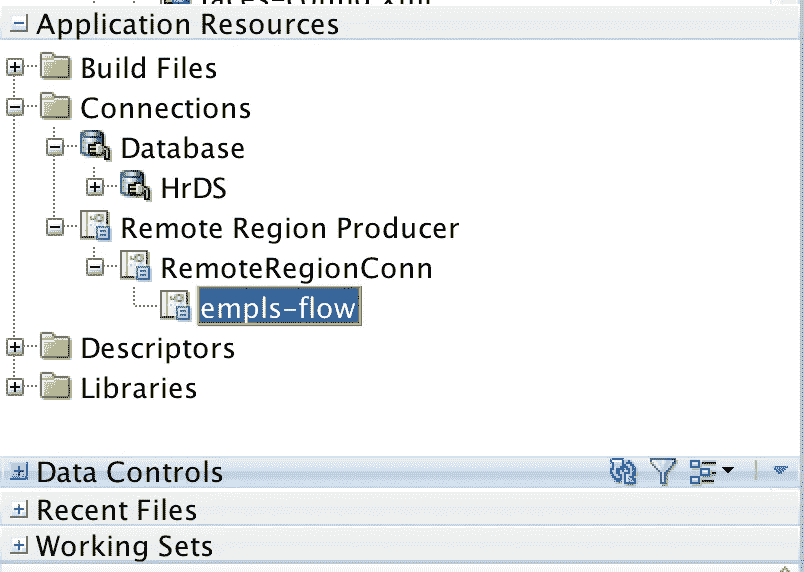

远程区域连接向导。您应该使用模块上下文根并指向 ADF 远程区域 servlet*rtf query*和 *rr* :

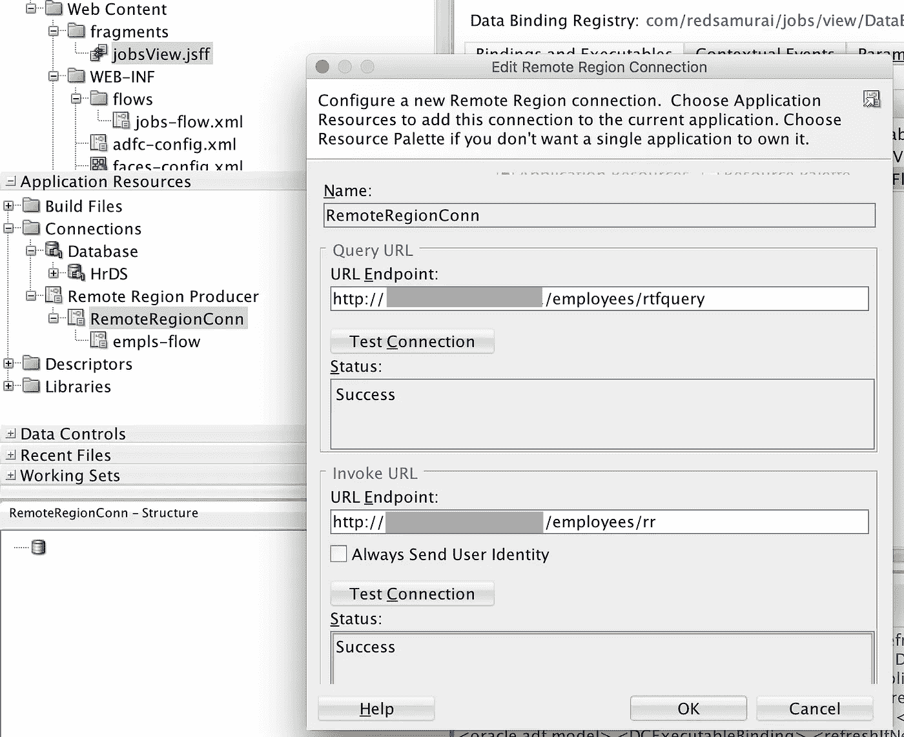

右键单击“连接”文件夹并转到“新建连接”部分，可以打开此向导:

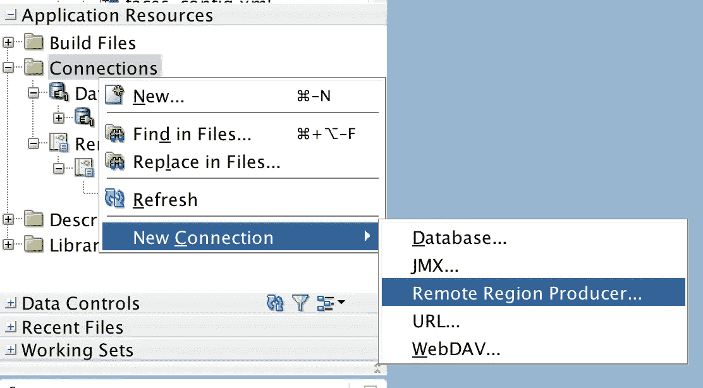

消费者模块应启用远程区域消费者支持:

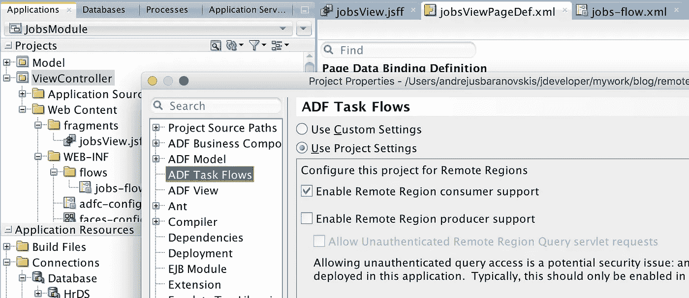

生成器模块应启用远程区域生成器支持:

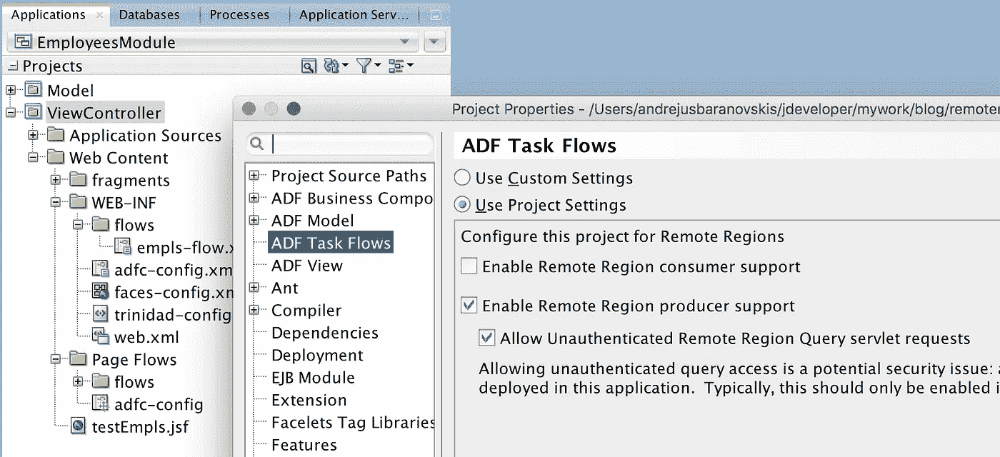

一旦启用远程区域生成器支持，生成器模块就会自动配置所需的 servlets:

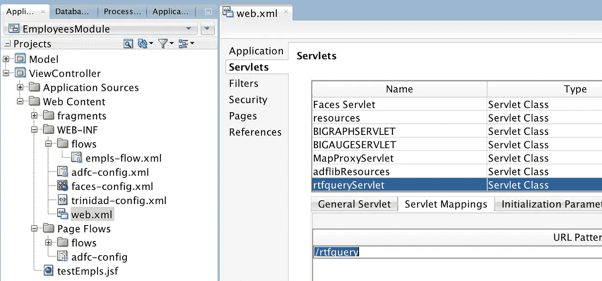

阅读 ADF 开发人员指南中有关 ADF 远程区域的更多信息— [26.13 在融合 Web 应用程序中创建远程区域](https://docs.oracle.com/middleware/12213/adf/develop/using-task-flows-regions.htm#ADFFD23491)。

*原载于 2018 年 2 月 24 日*[*【andrejusb.blogspot.com*](https://andrejusb.blogspot.lt/2018/02/microservices-with-oracle-adf-remote.html)*。*