# 使用 Spring Boot 构建微服务应用程序

> 原文：<https://medium.com/edureka/microservices-with-spring-boot-ffab2ce8ac34?source=collection_archive---------0----------------------->

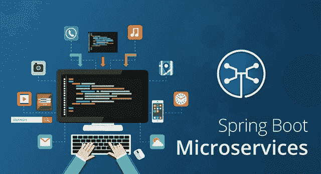

Building Microservices using Spring Boot — Edureka

随着云计算和容器化的出现，微服务席卷了整个世界。组织正在寻找具有 ***微服务架构培训*** 的专业人员。在本文中，让我详细展示我们如何使用 Spring Boot 和网飞尤里卡服务器为**顶级运动品牌**创建**微服务应用**。

所以，让我们开始吧，伙计们。

# 为什么需要 Spring Boot？

Spring Boot 支持快速构建生产就绪型应用程序，并提供非功能性特性:

*   易于与容器一起部署的嵌入式服务器
*   它有助于监控多个组件
*   它有助于在外部配置组件

现在，让我们看看微服务架构面临哪些挑战

# 微服务架构面临的挑战

虽然开发许多较小的微服务看起来很容易，但是微服务架构有许多固有的复杂性。让我们来看一些挑战:

> **自动化组件**:自动化一切变得很困难，因为有许多更小的组件而不是一个整体，即构建、部署、监控等。
> 
> **可感知性**:有许多小组件需要部署和维护，有时很难监控和识别问题。它需要对所有组件都有很强的感知能力。
> 
> **配置管理**:非常需要维护跨各种环境的组件配置。
> 
> **调试**:探测每个服务的错误变得很困难。集中式日志记录和仪表板对于简化问题调试至关重要。
> 
> **一致性**:你不可能有多种工具来解决同一个问题。虽然促进创新很重要，但围绕用于实现/部署/监控微服务的语言、平台、技术和工具进行一些去中心化的治理也很重要。

# Spring Boot 微服务:与 Spring Boot 共建顶级运动品牌架构

在这个 spring boot 微服务示例中，我们将创建顶级运动品牌应用程序，该应用程序将提供 3 项服务

## **尤里卡服务**

该服务将注册每个微服务，然后客户端微服务将查找 Eureka 服务器，以获得相关的微服务来完成工作。这个 Eureka 服务器归网飞所有，在这里，Spring Cloud 提供了一种声明式的方法，通过 Java 注释来注册和调用服务。

## **物品目录服务**

该服务将生成市场上受欢迎的运动品牌列表。

## **边缘服务**

它类似于 Spring Boot 和 Angular 在 Bootiful 开发中创建的独立项目服务。但是，它将具有回退功能，防止客户端在服务不可用时收到 HTTP 错误。

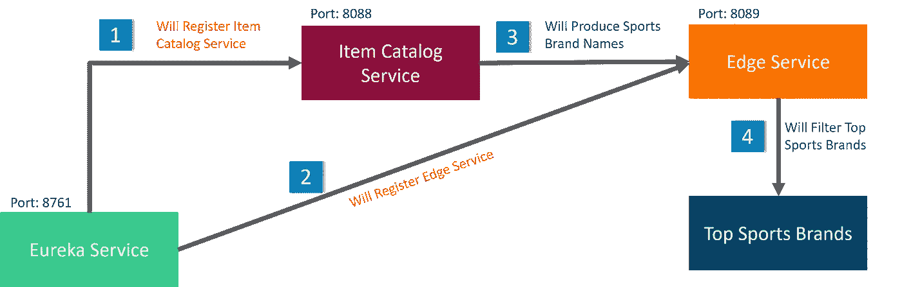

让我们看看创建这个 spring boot 微服务示例应用程序需要以下哪些工具。

## 所需工具

*   Java 8
*   Eclipse IDE 氧气
*   弹簧刀

如果您在安装和运行上述工具时遇到任何困难，请参考关于[安装弹簧工具套件](https://www.edureka.co/blog/spring-boot-setup-helloworld-microservices-example?utm_source=medium&utm_medium=content-link&utm_campaign=microservices-with-spring-boot)的文章。

## Spring Boot 微服务:创造尤里卡服务

首先，在 Eclipse IDE 中创建一个`EurekaServer` Spring Starter 项目。点击 **Spring Starter 项目**并点击 **Next。**

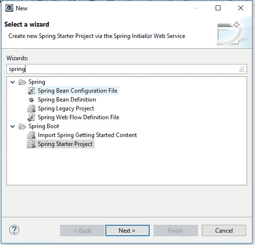

将您的 Spring Starter 项目命名为 **EurekaServer** ，其他信息将自动填充**。**

> **注意:-** 确保你的互联网连接，否则它会显示一个错误。

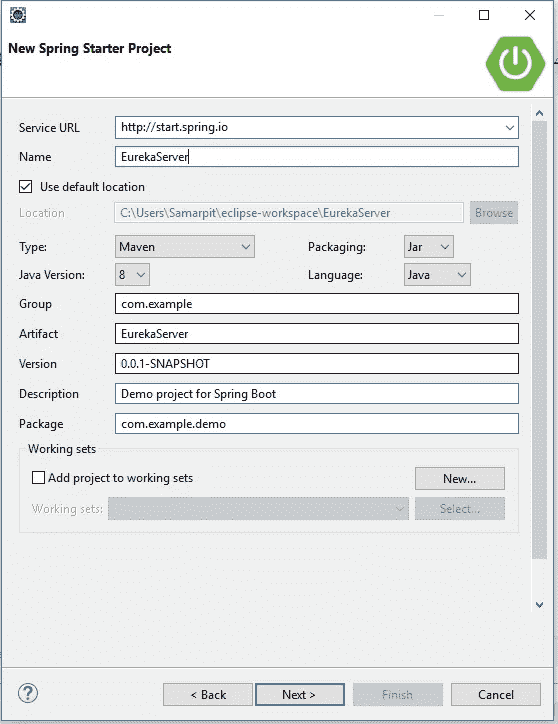

现在，选择`**Eureka Server**` 作为依赖项，点击**完成。**

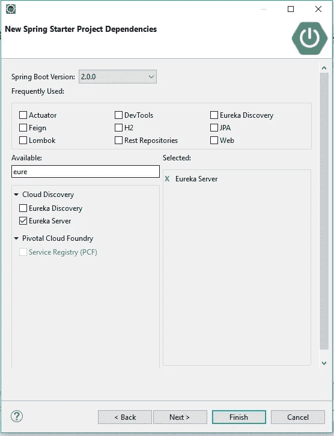

现在，修改`EurekaServer/src/main/resources/application.properties`文件，添加一个端口号并禁用注册。

`server.port=8761
eureka.client.register-with-eureka=false`

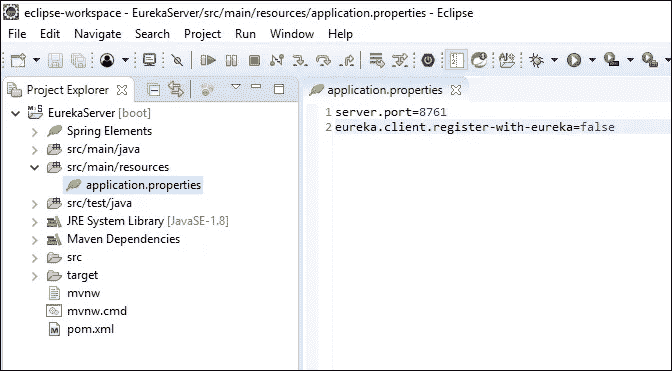

现在，打开下面的目录，

`EurekaServer/src/main/java/com/example/EurekaServiceApplication.java`并在`@SpringBootApplication`上方加上`@EnableEurekaServer`。

```
import org.springframework.cloud.netflix.eureka.server.EnableEurekaServer;@EnableEurekaServer
@SpringBootApplication
```

该注释将配置一个允许其他应用程序通信的注册表。

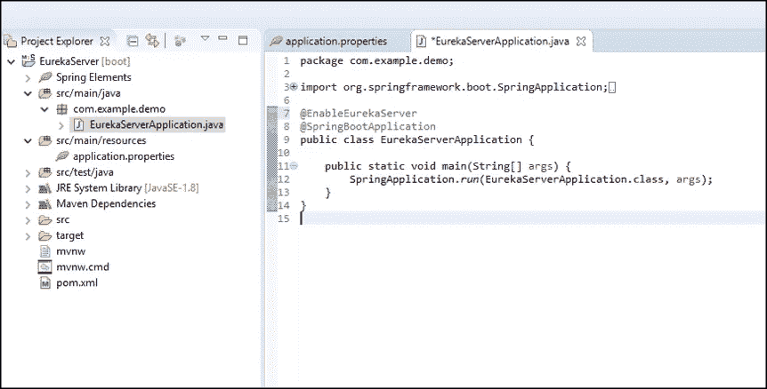

启动应用程序:右击**项目**–>–**运行为**–>点击 **Spring Boot App** 。

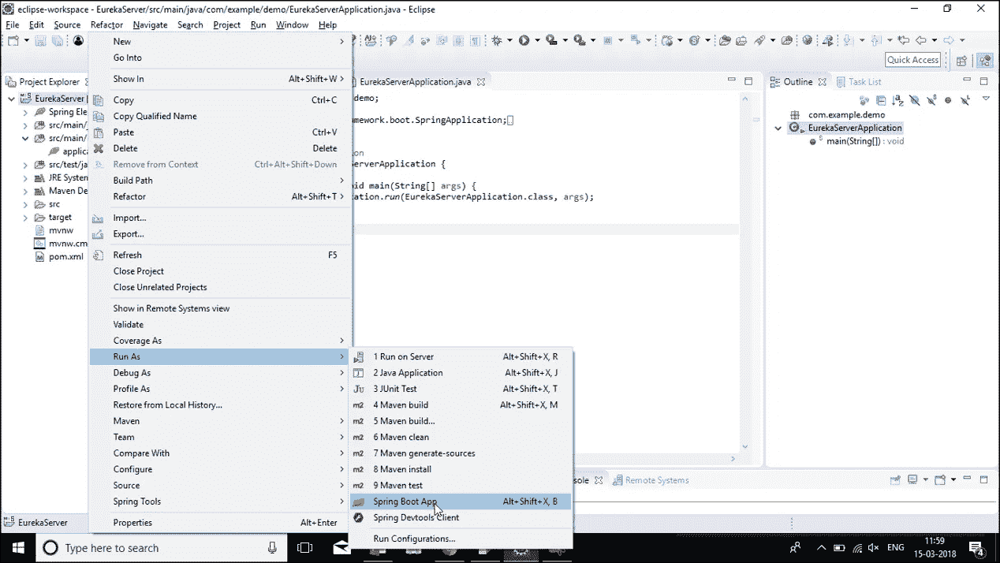

现在打开`http://localhost:8761`。这里，Spring Eureka 服务器将打开，并显示没有服务将运行。

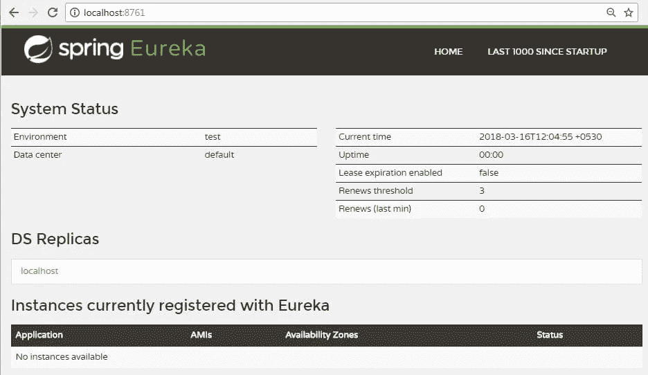

## Spring Boot 微服务:创建项目目录服务

再次创建一个新项目。使用`Item-catalog-service`作为工件名称，并点击下一个的**。**

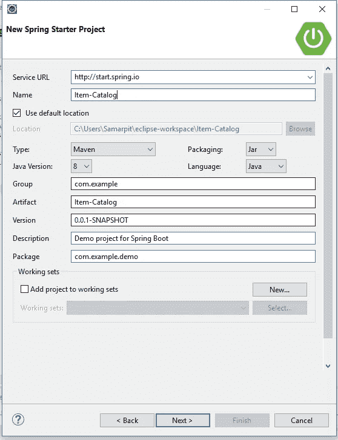

添加以下依赖项:

> **致动器**:帮助您监控和管理应用的功能
> 
> **尤里卡**发现:用于服务注册
> 
> **JPA** :保存/检索数据
> 
> **H2** :内存数据库
> 
> **Rest** **存储库**:将 JPA 存储库公开为 Rest 端点
> 
> **Web** : Spring MVC 和嵌入式 Tomcat
> 
> **DevTools** :当文件改变时自动重新加载应用程序
> 
> 龙目岛:减少样板代码

点击**完成。**

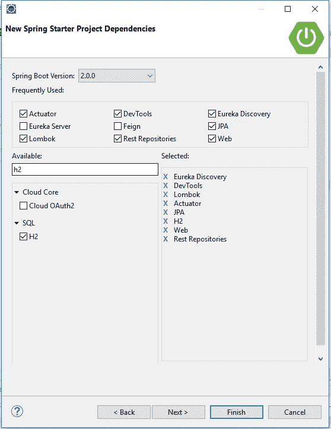

现在，创建一个条目实体，到`ItemCatalogServiceApplication.java`。下面的代码假设您将所有的类放在同一个文件中。

```
@Data
@AllArgsConstructor
@NoArgsConstructor
@ToString
@Entity
class Item {public Item(String name) {
        this.name = name;
    }@Id
    @GeneratedValue
    private Long id;private String name;
}@RepositoryRestResource
interface ItemRepository extends JpaRepository<Item, Long> {}@Component
class ItemInitializer implements CommandLineRunner {private final ItemRepository ItemRepository;ItemInitializer(ItemRepository itemRepository) {
        this.itemRepository = itemRepository;
    }@Override
    public void run(String... args) throws Exception {
        Stream.of(""Lining", "PUMA", "Bad Boy", "Air Jordan", "Nike", "Adidas", "Reebok")
                .forEach(item -> itemRepository.save(new Item(item)));itemRepository.findAll().forEach(System.out::println);
    }
}
```

如果您使用的是不自动导入类的编辑器，这里是在`ItemCatalogServiceApplication.java`顶部需要导入的列表。

```
import lombok.AllArgsConstructor;
import lombok.Data;
import lombok.NoArgsConstructor;
import lombok.ToString;
import org.springframework.boot.CommandLineRunner;
import org.springframework.boot.SpringApplication;
import org.springframework.boot.autoconfigure.SpringBootApplication;
import org.springframework.cloud.client.discovery.EnableDiscoveryClient;
import org.springframework.data.jpa.repository.JpaRepository;
import org.springframework.data.rest.core.annotation.RepositoryRestResource;
import org.springframework.stereotype.Component;import javax.persistence.Entity;
import javax.persistence.GeneratedValue;
import javax.persistence.Id;
import java.util.stream.Stream;
```

在`item-catalog-service/src/main/resources/application.properties`文件中添加一个应用程序名称以显示在 Eureka 服务中，并将端口设置为 8088。

`server.port=8088`

`spring.application.name=item-catalog-service`

现在，创建云属性文件

点击**文件->新建->其他->文件**，在该文件中添加以下代码并保存。

```
eureka.instance.hostname=${vcap.application.uris[0]:localhost}
eureka.instance.nonSecurePort=80
eureka.instance.metadataMap.instanceId=${vcap.application.instance_id:${spring.application.name}:${spring.application.instance_id:${server.port}}}
eureka.instance.leaseRenewalIntervalInSeconds = 5eureka.client.region = default
eureka.client.registryFetchIntervalSeconds = 5
eureka.client.serviceUrl.defaultZone=${vcap.services.pwa-eureka-service.credentials.uri}/eureka/
```

现在，要启动应用程序:

右键点击项目->**运行方式**->点击“ **Spring Boot App** ”。

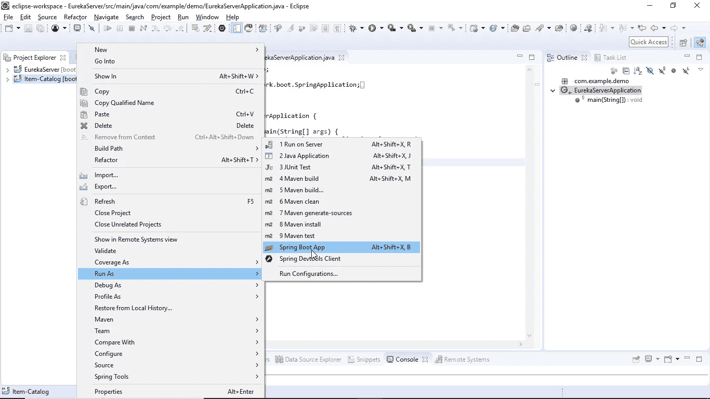

> **注意:**如果出现错误，请尝试此步骤:右键单击**项目**–>–**运行为**–>单击“ **Maven 构建**”

现在打开`http://localhost:8761`。在这里，您将看到项目目录服务正在运行。

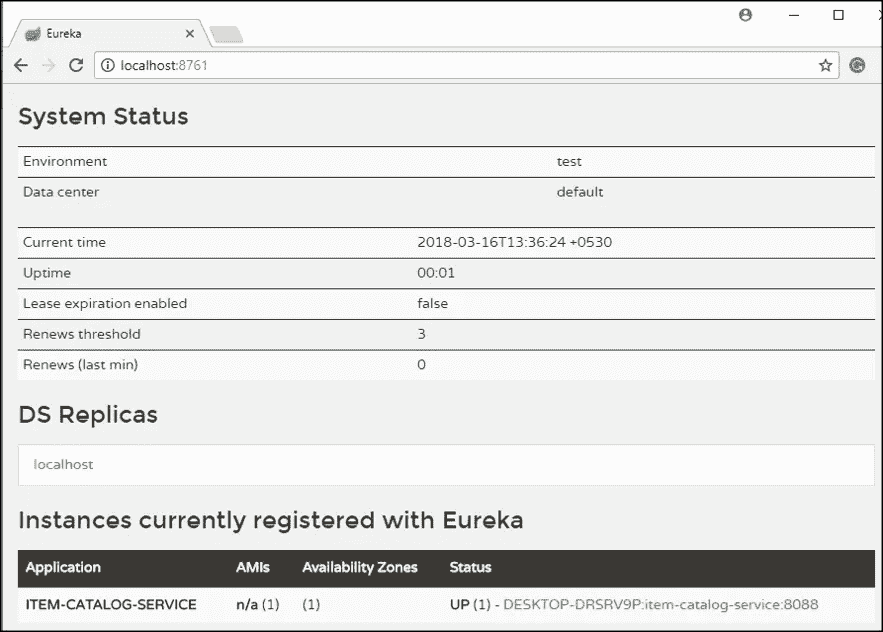

您将看到目录服务中的项目列表。

`Open [http://localhost:8088/items](http://localhost:8088/items)`

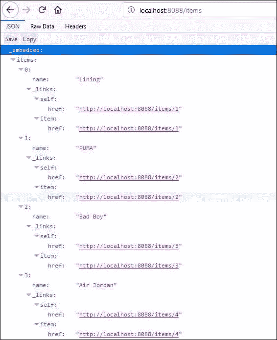

现在让我们继续前进，创建边缘服务。

## **Spring Boot 微服务:创建边缘服务**

它类似于 Spring Boot 和 Angular 在 **Bootiful 开发中创建的独立项目服务。但是，它将具有回退功能，防止客户端在服务不可用时收到 HTTP 错误。**

再次创建一个新项目。使用`edge-service`作为工件名称。

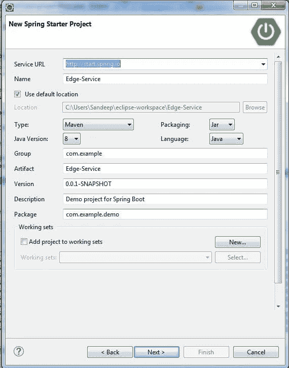

> **尤里卡发现**:用于服务注册
> 
> **假装**:一个声明性的 web 服务客户端
> 
> **Zuul** :提供智能路由
> 
> **Rest 存储库**:将 JPA 存储库公开为 Rest 端点
> 
> **Web** : Spring MVC 和嵌入式 Tomcat
> 
> **Hystrix** :一个断路器，用于停止连锁故障并启用弹性
> 
> **Lombok** :减少样板代码

点击**完成。**

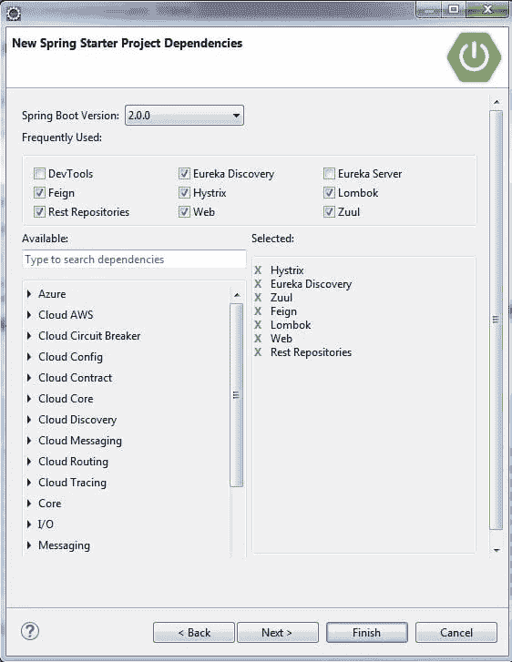

由于`item-catalog-service`在端口 8088 上运行，您需要配置这个应用程序在不同的端口上运行。修改`edge-service/src/main/resources/application.properties`将端口设置为 8089，并设置一个应用名称。

```
server.port=8089 
spring.application.name=edge-service
```

**现在，创建云属性文件**

点击**文件->新建->其他->文件**，在该文件中添加以下代码并保存。

```
eureka.instance.hostname=${vcap.application.uris[0]:localhost}
eureka.instance.nonSecurePort=80
eureka.instance.metadataMap.instanceId=${vcap.application.instance_id:${spring.application.name}:${spring.application.instance_id:${server.port}}}
eureka.instance.leaseRenewalIntervalInSeconds = 5eureka.client.region = default
eureka.client.registryFetchIntervalSeconds = 5
eureka.client.serviceUrl.defaultZone=${vcap.services.pwa-eureka-service.credentials.uri}/eureka/package com.example.edgeservice;import com.netflix.hystrix.contrib.javanica.annotation.HystrixCommand;
import lombok.Data;
import org.springframework.boot.SpringApplication;
import org.springframework.boot.autoconfigure.SpringBootApplication;
import org.springframework.cloud.client.circuitbreaker.EnableCircuitBreaker;
import org.springframework.cloud.client.discovery.EnableDiscoveryClient;
import org.springframework.cloud.netflix.feign.EnableFeignClients;
import org.springframework.cloud.netflix.feign.FeignClient;
import org.springframework.cloud.netflix.zuul.EnableZuulProxy;
import org.springframework.hateoas.Resources;
import org.springframework.web.bind.annotation.*;import java.util.ArrayList;
import java.util.Collection;
import java.util.stream.Collectors;[@EnableFeignClients](http://twitter.com/EnableFeignClients)
[@EnableCircuitBreaker](http://twitter.com/EnableCircuitBreaker)
[@EnableDiscoveryClien](http://twitter.com/EnableDiscoveryClien)t
[@EnableZuulProxy](http://twitter.com/EnableZuulProxy)
[@SpringBootApplicatio](http://twitter.com/SpringBootApplicatio)n
public class EdgeServiceApplication {public static void main(String[] args) {
        SpringApplication.run(EdgeServiceApplication.class, args);
    }
}
```

在这个文件中创建一个`Item` DTO(数据传输对象)。Lombok 的`[@Data](https://projectlombok.org/features/Data.html)`将生成一个`toString()`方法、getters、setters 和适当的构造函数。

```
[@Data](http://twitter.com/Data)
class Item {
    private String name;
}
```

创建一个使用 Feign 与`Item-catalog-service`通信的`ItemClient`接口。

```
public class EdgeServiceApplication {public static void main(String[] args) {
        SpringApplication.run(EdgeServiceApplication.class, args);
    }
}[@Data](http://twitter.com/Data)
class Item {
    private String name;
}public String getName() {
             return name; 
}

public void setName(String name) { 
                      this.name = name;
          }
[@FeignClient](http://twitter.com/FeignClient)("item-catalog-service")
interface ItemClient {[@GetMapping](http://twitter.com/GetMapping)("/items")
    Resources<Item> readItems();
}
```

在`ItemClient`下面创建一个`RestController`，它将过滤掉不太热门的品牌，并显示一个`/top-brands`端点。

```
[@RestController](http://twitter.com/RestController)
class GoodItemApiAdapterRestController {private final ItemClient itemClient;public GoodItemApiAdapterRestController(ItemClient ItemClient) {
        this.itemClient = itemClient;
    }[@GetMapping](http://twitter.com/GetMapping)("/top-brands")
    public Collection<Item> goodItems() {
        return itemClient.readItems()
                .getContent()
                .stream()
                .filter(this::isGreat)
                .collect(Collectors.toList());
    }private boolean isGreat(Item item) {
        return !item.getName().equals("Nike") &&
                !item.getName().equals("Adidas") &&
                !item.getName().equals("Reebok");
    }
}
```

用 Maven 或您的 IDE 启动`edge-service`应用程序，并验证它是否成功注册到 Eureka 服务器。

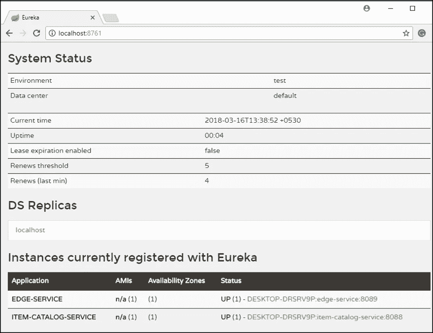

现在调用 localhost:8089/top-brands，您将看到来自目录服务的顶级品牌列表。

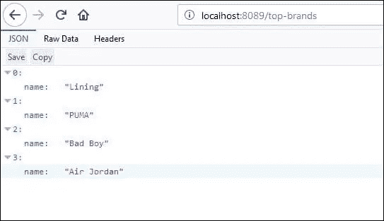

> **注意:**如果您关闭`item-catalog-service`应用程序，您将得到一个 500 内部服务器错误。

```
$ http localhost:8089/top-brands
HTTP/1.1 500
Connection: close
Content-Type: application/json;charset=UTF-8
Date: Fri, 16 Mar 2018 12:51:22 GMT
Transfer-Encoding: chunked
X-Application-Context: edge-service:8089{
    "error": "Internal Server Error",
    "exception": "feign.RetryableException",
    "message": "connect timed out executing GET [http://item-catalog-service/items](http://item-catalog-service/items)",
    "path": "/top-brands",
    "status": 500,
    "timestamp": 1328088897672
}
```

要解决这个问题，您可以使用 Hystrix 创建一个回退方法，并告诉`goodItems()`方法使用它。

```
public Collection<Item> fallback() {
    return new ArrayList<>();
}[@HystrixCommand](http://twitter.com/HystrixCommand)(fallbackMethod = "fallback")
[@GetMapping](http://twitter.com/GetMapping)("/top-brands")
public Collection<Item> goodItems() {
    return … 
}
```

重启`edge-service`，您应该会看到一个空列表返回。

```
$ http localhost:8089/top-brands
HTTP/1.1 200
Content-Type: application/json;charset=UTF-8
Date: Fri, 16 Mar 2018 12:59:02 GMT
Transfer-Encoding: chunked
X-Application-Context: edge-service:8089
[]
```

再次启动`item-catalog-service`，该列表最终将返回顶级品牌名称的完整列表。

这就把我们带到了关于使用 Spring Boot 构建微服务的文章的结尾。我希望这篇文章对你有所帮助，并增加了你的知识价值。

如果你想查看更多关于人工智能、DevOps、道德黑客等市场最热门技术的文章，你可以参考 Edureka 的官方网站。

请留意本系列中的其他文章，它们将解释微服务的各个方面。

> *1。* [*什么是微服务？*](/edureka/what-is-microservices-86144b17b836)
> 
> *2。* [](https://www.edureka.co/blog/object-oriented-programming/?utm_source=medium&utm_medium=content-link&utm_campaign=java-exception-handling)[*微服务架构*](/edureka/microservice-architecture-5e7f056b90f1)
> 
> *3。* [*微服务 vs SOA*](/edureka/microservices-vs-soa-4d71c5590fc6)
> 
> *4。* [*微服务教程*](/edureka/microservices-tutorial-with-example-a230413dfa13)
> 
> *5。* [*微服务设计模式*](/edureka/microservices-design-patterns-50640c7bf4a9)
> 
> *6。* [*微服务安全*](/edureka/microservices-security-b01b8f2a9215)

*原载于 2018 年 5 月 10 日 www.edureka.co*[](https://www.edureka.co/blog/microservices-with-spring-boot)**。**