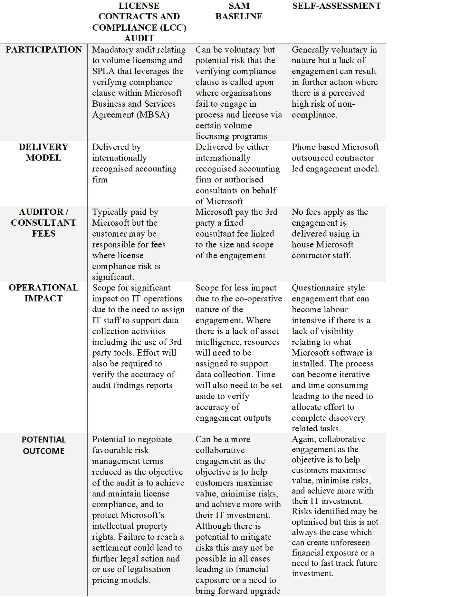

# Microsoft 审计类型解释

> 原文：<https://medium.com/version-1/microsoft-audit-types-explained-ac5dd785be99?source=collection_archive---------2----------------------->

Photo by [Ashkan Forouzani](https://unsplash.com/@ashkfor121?utm_source=medium&utm_medium=referral) on [Unsplash](https://unsplash.com?utm_source=medium&utm_medium=referral)

微软拥有多种机制来审计他们的客户，并确保他们的知识产权得到保护。微软使用的审核机制的类型取决于各种因素，包括组织规模、位置和使用的许可计划的类型。

组织必须了解他们的义务是什么，以及 Microsoft 许可证合规性合约的潜在结果可能是什么。下表概述了 Microsoft 通常用来验证许可证合规性的审核机制的类型。

当微软软件许可合同的解释性与软件资产管理“SAM”政策、流程和程序的缺乏相结合时，就不足为奇了，微软需要采取措施保护其知识产权，让客户验证他们的许可地位。

无论使用何种审核机制来验证有效的许可证状况，组织都必须采取必要的步骤来规划一个成功控制的审核流程，以最大限度地减少运营影响并避免不必要的财务风险。

版本 1 在帮助跨国企业通过采用微软软件资产管理(SAM)的主动方法来主动评估其许可证合规性状况和规划未来方面拥有丰富的经验。所以，无论你是在审计的威胁下，还是在努力在内部建立一个新的标准，请联系我们寻求建议和指导。

**关于作者**

*Karl 是 Version 1 的首席许可顾问，为全球客户提供微软许可专业知识，并确保客户从他们的微软资产中获得最大价值。如果您想了解有关降低许可证审核成本和风险的更多信息，请立即联系第 1 版的独立许可专家。*