# 什么是 Azure？—微软 Azure 云简介

> 原文：<https://medium.com/edureka/microsoft-azure-cloud-9ffeed031a44?source=collection_archive---------3----------------------->

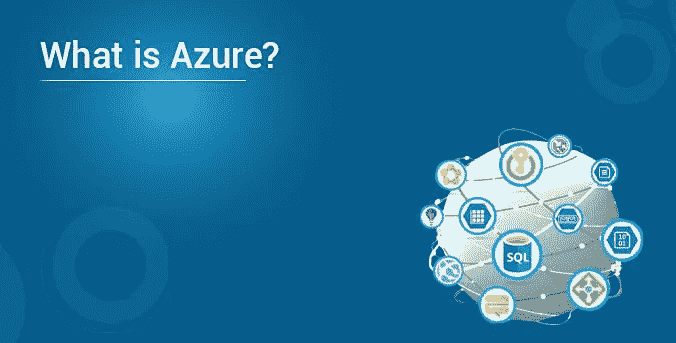

你是听到“蔚蓝色的云”这个流行语并在这里着陆的人之一吗？不要担心，你已经到达正确的地方。在这个*什么是 Azure* 博客结束时，你将拥有开始使用微软 Azure 的一切。

这是 Azure 教程博客系列的第一篇博客。在这篇博客中，我将讨论以下话题:

1.  云服务提供商
2.  Azure 市场份额
3.  什么是 Azure？
4.  Azure 中的服务域
5.  在 Azure 中构建应用
6.  如何在 Azure 上注册？

# 云服务提供商

云服务由一些公司提供。这些公司被称为云提供商。在下图中，我们列出了一些顶级的云提供商。AWS 是最大的云提供商，您一定想知道为什么要了解其他云提供商，对吗？

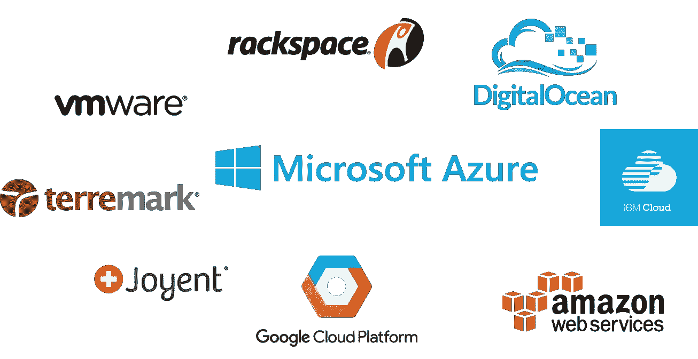

好问题！但是，如果您心爱的 AWS 出现故障怎么办？想过吗？您的业务不能只依赖一种服务。在这种情况下，你需要一个后备人选。因此，也有必要了解其他云提供商。话虽如此，Azure 是第二大云提供商！

# Azure 市场份额

下图显示了采用各自的云提供商作为其“主要”IaaS 合作伙伴的公司的百分比。

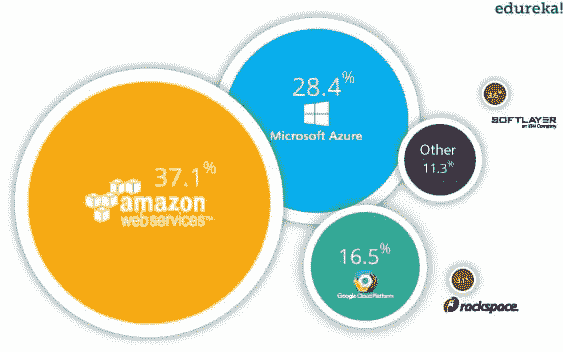

从上图可以清楚的看到，在 AWS 之后，人们都在采用微软 Azure。

让我们在这个博客中继续前进，了解什么是 Azure。

# 什么是 Azure？

***微软 Azure*** 是由**微软**创建的云计算平台，开发人员和 IT 专业人员通过其全球数据中心网络来构建、部署和管理应用程序。

你可能想知道 Azure Dashboard 实际上是什么样子，这里有一个截图:

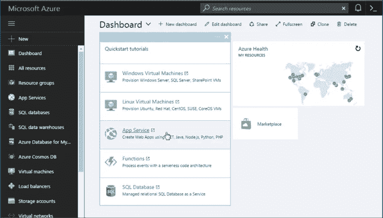

在左侧，列出了所有的资源。这些资源可以大致分为以下几类:

# Azure 中的服务域

**Compute** 它通过利用一次服务多个实例的强大处理器来处理云上的数据。

*   虚拟机
*   虚拟机规模集
*   天蓝色容器
*   集装箱登记处
*   功能
*   一批
*   服务结构
*   云服务

**存储服务** 顾名思义，存储用于在云中存储数据，能够根据需要进行扩展。这些数据可以存储在任何地方。

*   Blob 存储
*   队列存储
*   文件存储器
*   表格存储

**数据库** 数据库域用于提供由 Azure 管理的可靠的关系和非关系数据库实例。

*   SQL 数据库
*   DocumentDB
*   Redis 缓存

**联网** 它包括提供各种联网功能的服务，如安全性、更快的访问等。

*   虚拟网络
*   负载平衡器
*   应用网关
*   Azure DNS
*   内容交付网络
*   VPN 网关
*   营业主任
*   快速路线

开发人员工具
它包括一些服务，这些服务提供了简化组织编码能力的服务。例如，它简化了团队共享代码、跟踪工作和发布软件。

*   Visual Studio 团队服务
*   应用洞察
*   API 管理

**管理和监控工具** 它包括可以用来管理和监控你的 Azure 实例的服务。

*   微软 Azure 门户网站
*   Azure 资源管理器
*   自动化

**企业集成** 提供无缝集成企业和云等功能的服务。

*   服务总线
*   SQL Server 伸展数据库

安全和身份认证
它包括用户认证服务或限制对 Azure 资源上某一组受众的访问。

*   钥匙库
*   Azure 活动目录
*   Azure 广告 B2C
*   Azure AD 域服务
*   多因素认证

**Web 和移动应用** 这些主要用于为任何平台和任何设备创建 Web 应用或移动应用。

*   网络应用
*   移动应用
*   API 应用程序
*   逻辑应用
*   通知中心
*   活动中心
*   Azure 搜索

# 在 Azure 中构建应用

有时候要先跑，才会走！

首先，你应该分析，你的应用程序是关于什么的？它是否需要您担心底层基础架构？是需要数据库的东西吗？这是否需要监控？

因此，一旦您知道了应用程序的所有需求，您就可以选择一个域，从而选择一个服务。

比如，你想在 Azure 上部署一个应用程序，这不需要你担心底层架构，你会选择哪个服务？

嗯，在计算部分有一种叫做 Web App 的服务。你只需上传你的应用程序，Azure 会帮你完成剩下的工作。就这么简单！

当然，如果不使用这些服务，你就不会知道它们，对吗？这就是为什么 Azure 提出了一个惊人的免费层选项。

**谁有资格享受这一免费等级？**

每个客户从他/她在 Azure 上注册的时候就收到了免费层选项，并且有资格获得同样的服务。

这有什么帮助？

你可以尝试在 Azure 上启动一个应用程序并学习！你练习得越多，你就越了解 Azure 是什么。

也就是你免费学！免费层包括什么？你可以参考我们在 Azure 教程博客中的 Azure 定价部分。

让我为您设置注册部分，如果您是新客户，它将为您提供免费积分。

# 如何在 Azure 中注册？

**第一步:**转到这个特定的链接:【https://azure.microsoft.com/en-in/free/】T21

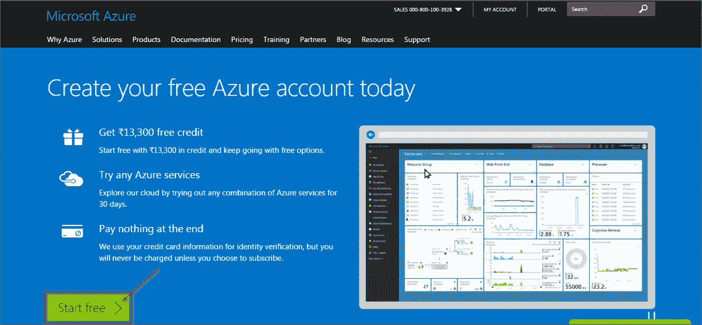

**第二步:**点击创建新的微软账户。

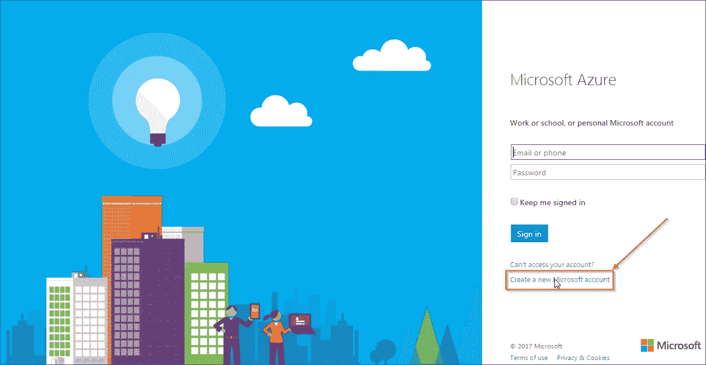

**步骤 3:** 执行以下步骤:

1.  输入您的电子邮件地址
2.  输入合适的密码
3.  点击创建账户

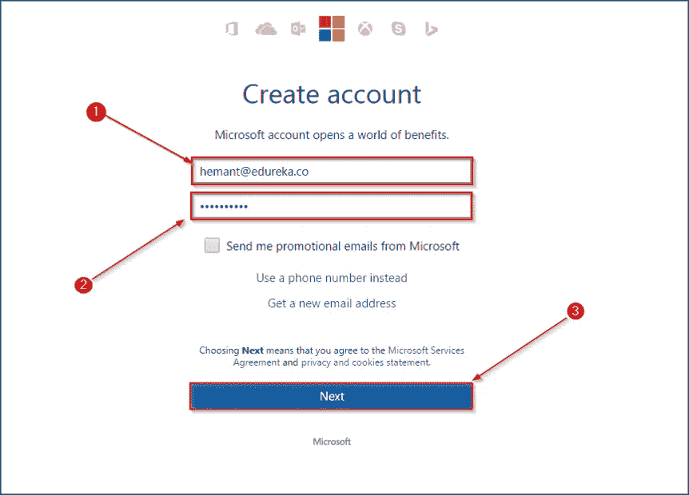

**第四步:**在下一页，做以下事情:

1.  输入发送到电子邮件地址的验证码
2.  点击验证

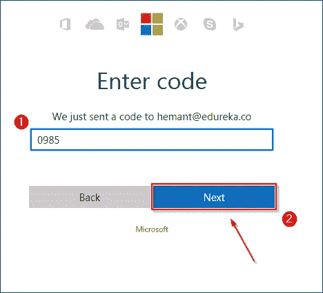

**第五步:**在下一页，执行以下步骤:

1.  输入您的手机号码
2.  输入你手机上的密码，空白 2
3.  最后，单击下一步

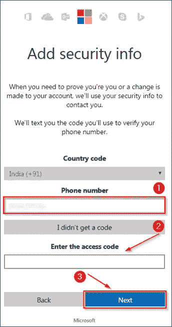

**第 6 步:**在下一页，执行以下操作:

1.  如你所见，作为新用户，你获得了 13，300 卢比的免费使用积分
2.  输入您的姓名
3.  您的电子邮件地址
4.  电话号码
5.  组织名称
6.  最后，单击下一步

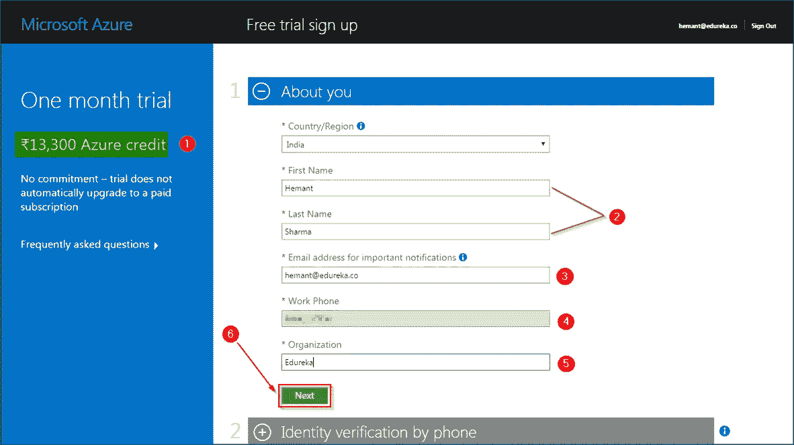

**第 7 步:**在下一页，您将验证您的手机

1.  输入手机号码
2.  点击发送短信，或者任何你喜欢的方式。

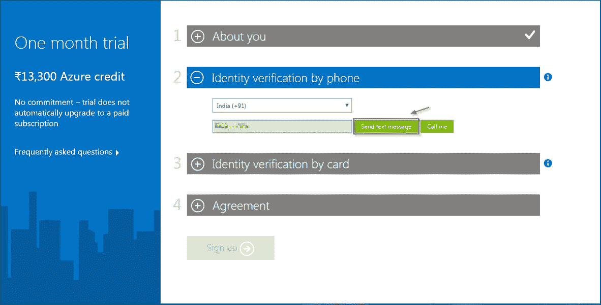

**第 8 步:**在此页面上，您将输入您的信用卡详细信息。输入后，单击

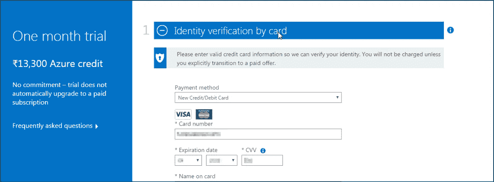

**第 9 步:**点击同意条件，最后点击注册。

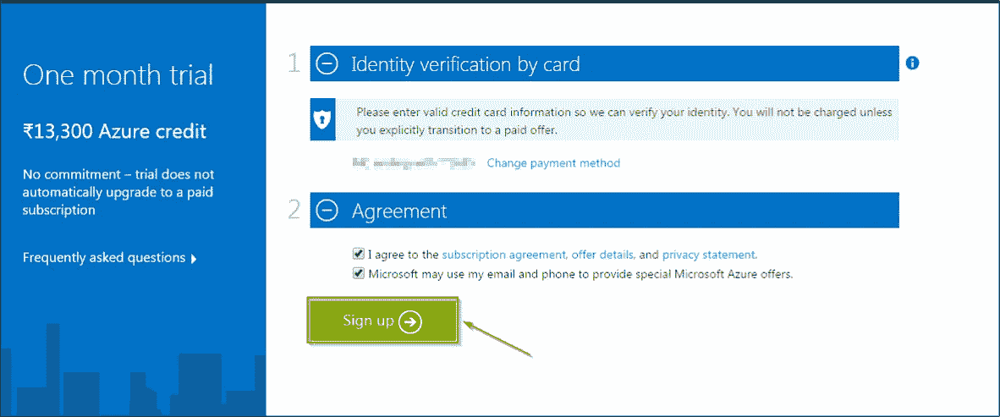

**第十步:**瞧！你准备好了。点击 Azure 订阅入门。

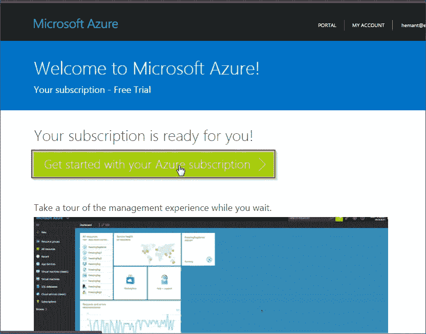

给你，你自己的微软仪表板！

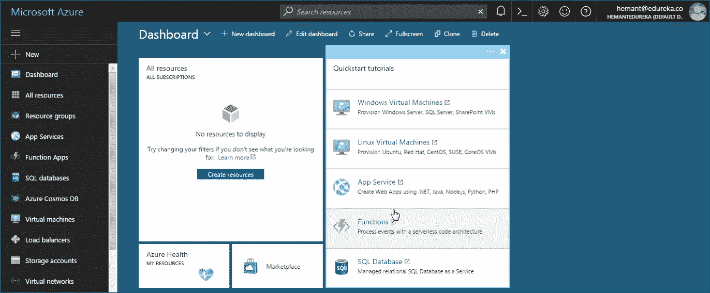

这让我们结束了这个什么是 Azure 博客的注册过程。注册完成后，你就可以用你的*免费点数*玩 Azure 了。

就这样了，伙计们！我希望你喜欢这个什么是 Azure 博客。如果你正在读这篇文章，那么恭喜你！你不再是 Azure 的新手了！你练习得越多，你学得就越多。

就是这样，伙计们，这就把我们带到了这篇文章的结尾。如果你想查看更多关于人工智能、DevOps、道德黑客等市场最热门技术的文章，那么你可以参考 [Edureka 的官方网站。](https://www.edureka.co/blog/?utm_source=medium&utm_medium=content-link&utm_campaign=what-is-azure)

请留意本系列中解释 AWS 各个方面的其他文章。

> *1。*T22*AWS 教程*
> 
> *2。* [*AWS EC2*](/edureka/aws-ec2-tutorial-16583cc7798e)
> 
> *3。*[*AWS Lambda*](/edureka/aws-lambda-tutorial-cadd47fbd39b)
> 
> *4。* [*AWS 弹性豆茎*](/edureka/aws-elastic-beanstalk-647ae1d35e2)
> 
> *5。*[*S3*](/edureka/s3-aws-amazon-simple-storage-service-aa71c664b465)
> 
> *6。* [*AWS 控制台*](/edureka/aws-console-fd768626c7d4)
> 
> *7。* [*AWS RDS*](/edureka/rds-aws-tutorial-for-aws-solution-architects-eec7217774dd)
> 
> *8。* [*AWS 迁移*](/edureka/aws-migration-e701057f48fe)
> 
> *9。*[*AWS Fargate*](/edureka/aws-fargate-85a0e256cb03)
> 
> *10。* [*亚马逊 Lex*](/edureka/how-to-develop-a-chat-bot-using-amazon-lex-a570beac969e)
> 
> 11。 [*亚马逊光帆*](/edureka/amazon-lightsail-tutorial-c2ccc800c4b7)
> 
> *12。* [*AWS 定价*](/edureka/aws-pricing-91e1137280a9)
> 
> *13。* [*亚马逊雅典娜*](/edureka/amazon-athena-tutorial-c7583053495f)
> 
> *14。* [*AWS CLI*](/edureka/aws-cli-9614bf69292d)
> 
> *15。* [*亚马逊 VPC 教程*](/edureka/amazon-vpc-tutorial-45b7467bcf1d)
> 
> 15。T56*AWS vs Azure*
> 
> *17。* [*内部部署 vs 云计算*](/edureka/on-premise-vs-cloud-computing-f9aee3b05f50)
> 
> *18。* [*亚马逊迪纳摩 DB 教程*](/edureka/amazon-dynamodb-tutorial-74d032bde759)
> 
> *19。* [*如何从快照恢复 EC2？*](/edureka/restore-ec2-from-snapshot-ddf36f396a6e)
> 
> *20。* [*AWS 代码提交*](/edureka/aws-codecommit-31ef5a801fcf)
> 
> *21。* [*顶级 AWS 架构师面试问题*](/edureka/aws-architect-interview-questions-5bb705c6b660)
> 
> *22。* [*如何从快照恢复 EC2？*](/edureka/restore-ec2-from-snapshot-ddf36f396a6e)
> 
> *23。* [*使用 AWS 创建网站*](/edureka/create-websites-using-aws-1577a255ea36)
> 
> *24。* [*亚马逊路线 53*](/edureka/amazon-route-53-c22c470c22f1)
> 
> *25。* [*AWS 简历*](/edureka/aws-resume-7453d9477c74)

*原载于 2017 年 6 月 30 日*[*【https://www.edureka.co】*](https://www.edureka.co/blog/what-is-azure/)*。*