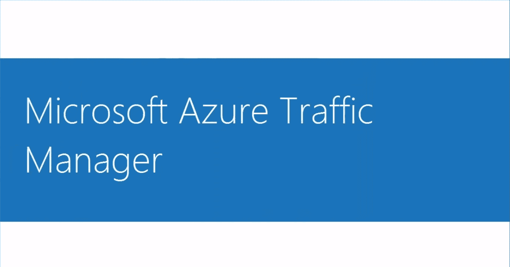
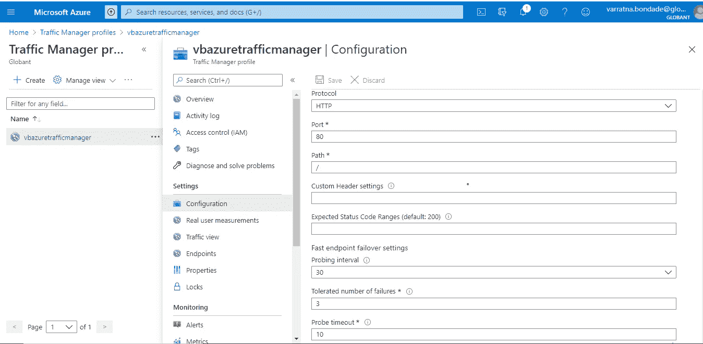
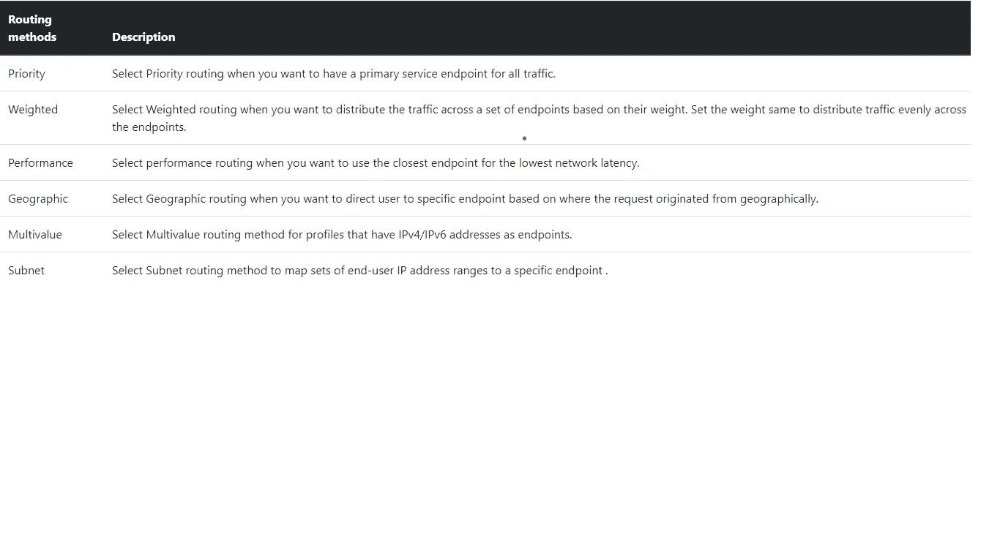
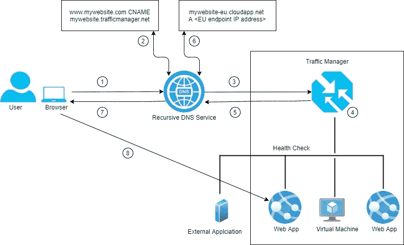

# Microsoft Azure 流量管理器

> 原文：<https://medium.com/globant/microsoft-azure-traffic-manager-1e9f1302e8db?source=collection_archive---------0----------------------->

**什么是 Azure 流量管理器:**

*   将流量(请求)从客户端路由到适当的端点。
*   端点只不过是运行在 Azure 内部或外部的服务或应用程序。
*   可以跟踪端点的状态(正在运行、已停止、已删除)，这只是端点的运行状况监控。
*   Azure Traffic Manager 使用 DNS 根据各种流量路由方法将请求定向到适当的服务端点。

# 流量管理器功能

**应用程序的高可用性**，通过监控端点并在端点关闭时提供自动故障转移。

**通过将请求重定向到延迟最低的端点，提高了性能**。

**无停机时间**，在维护过程中，流量管理器可以将请求重定向到备用端点。

# Azure 流量管理器配置文件

流量管理器配置文件使用流量路由方法来控制到您的网站端点的流量分配。您可以使用任何方法创建流量管理器配置文件—门户、PowerShell、Azure CLI、ARM 模板。

# **流量管理器端点**

Azure traffic manager 允许您控制如何将网络流量分配给在不同数据中心运行的应用程序部署。您可以在 traffic manager 中将每个应用程序部署配置为“端点”。当 traffic manager 收到 DNS 请求时，它会根据运行状况检查或状态选择可用端点，并在 DNS 响应中返回路由方法。

流量管理器支持 3 种类型的端点

**Azure 端点**——用于 Azure 中托管的服务。

**外部端点** -这些服务位于内部或由不同的托管提供商提供。

**嵌套端点** -这些端点用于创建更灵活的流量路由方案，以支持大型和更复杂的部署需求。

**配置端点监控:**

要配置端点监控，您必须在流量管理器配置文件中指定以下设置:

*   **协议-** 选择 HTTP、HTTPS 或 TCP 作为 Traffic Manager 在探测端点以检查其健康状况时使用的协议
*   **Port-** 选择用于请求的端口。
*   **路径-** 此配置设置仅对 HTTP 和 HTTPS 协议有效，对于这些协议，需要指定路径设置。为 TCP 监控协议提供此设置会导致错误。对于 HTTP 和 HTTPS 协议，给出监控访问的网页或文件的相对路径和名称。正斜杠(/)是相对路径的有效条目。这个值意味着文件在根目录中(默认)。
*   **探测间隔-** 该值指定从流量管理器探测代理检查端点健康状况的频率。您可以在这里指定两个值:30 秒(正常探测)和 10 秒(快速探测)。如果没有提供值，该配置文件将设置为默认值 30 秒。访问[流量管理器定价](https://azure.microsoft.com/pricing/details/traffic-manager)页面，了解有关快速探测定价的更多信息。
*   **容许失败次数-** 该值指定在将端点标记为不健康之前，流量管理器探测代理可以容许的失败次数。它的值可以在 0 到 9 之间。值为 0 表示单次监控失败会导致该端点被标记为不健康。如果没有指定值，则使用默认值 3。
*   **监控超时-** 此属性指定当健康检查探测发送到端点时，流量管理器探测代理在认为检查失败之前应等待的时间。如果探测间隔设置为 30 秒，那么您可以将超时值设置在 5 到 10 秒之间。如果没有指定值，则使用默认值 10 秒。如果探测间隔设置为 10 秒，那么您可以将超时值设置在 5 到 9 秒之间。如果没有指定超时值，它将使用默认值 9 秒。

# 端点监控的工作原理:

如果监控协议设置为 HTTP 或 HTTPS，Traffic Manager 探测代理将使用给定的协议、端口和相对路径向端点发出 GET 请求。如果它返回 200-OK 响应，则该端点被认为是健康的。

如果监控协议是 TCP，Traffic Manager 探测代理将使用指定的端口发起 TCP 连接请求。如果端点用建立连接的响应来响应请求，则健康检查被标记为成功，并且 Traffic Manager 探测代理重置 TCP 连接。

如果响应是 HTTP/HTTPS 或 TCP 的不同值，或者如果在指定的超时期限内未收到响应，则 Traffic Manager 探测代理将根据允许的失败次数设置进行重试(如果此设置为 0，则不会进行重试)。如果连续失败的次数高于允许的失败次数设置，则该端点被标记为不健康。

**流量管理器路由方法**

支持六种路由方法

路由方法决定了如何将流量路由到各种服务端点，以及哪个端点将作为 DNS 响应返回。

Traffic Manager 中提供了以下流量路由方法

**Routing Methods**

# **Azure 流量管理器如何工作:**

1.  客户要求网站名称 portal.mywebsite.com。此请求被发送到配置的递归 DNS 服务以解析名称。
2.  为了解析 DNS 名称，递归 DNS 服务查找 mywebsite.com 域的名称服务器。然后，它联系这些域名服务器，请求 portal.mywesite.com 的 DNS 记录。“my website . com”DNS 服务器返回指向 mywebsite.trafficmanager.net 的 CName
3.  递归 DNS 服务查找由 Azure 流量管理器服务提供的“trafficmanager.net”域的名称服务器。它向这些 DNS 服务器请求 mywebsite.trafficmanager.net DNS 记录
4.  流量管理器名称服务器接收请求，并根据每个端点的状态、每个端点的当前健康状况以及所选的流量路由方法来选择端点。
5.  返回选定的端点 mywebsite-eu.cloudapp.net。
6.  递归 DNS 服务查找“cloudapp.net”域的名称服务器。它联系那些名称服务器以请求“my website-eu . cloud app . net”DNS 记录，返回包含基于 EU 的服务端点的 IP 地址的记录。
7.  递归 DNS 服务合并结果，并向客户端返回单个 DNS 响应。
8.  客户端接收 DNS 结果并连接到给定的 IP 地址。