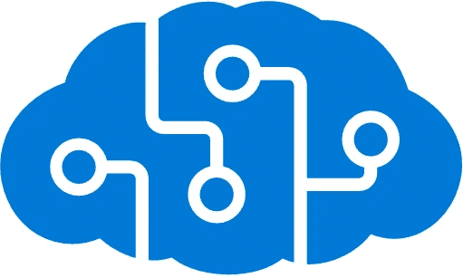
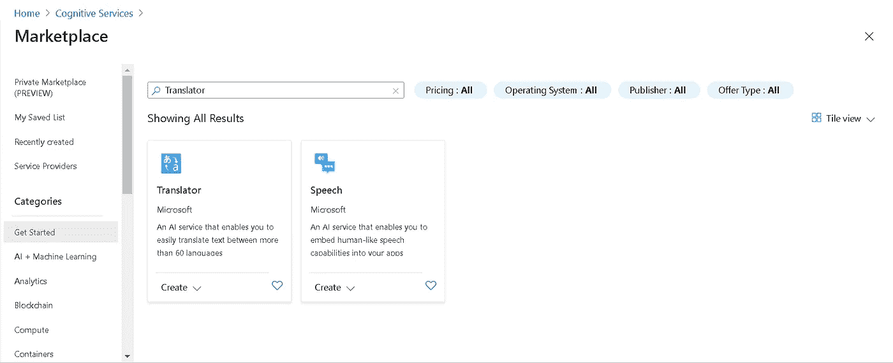
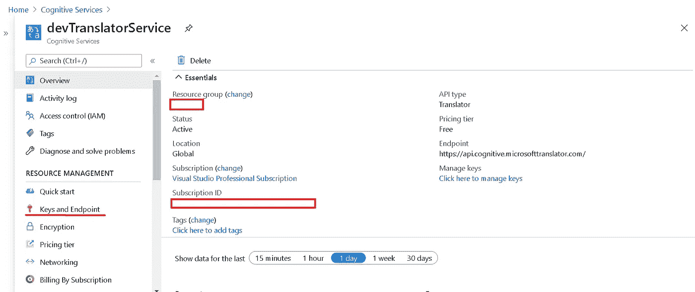
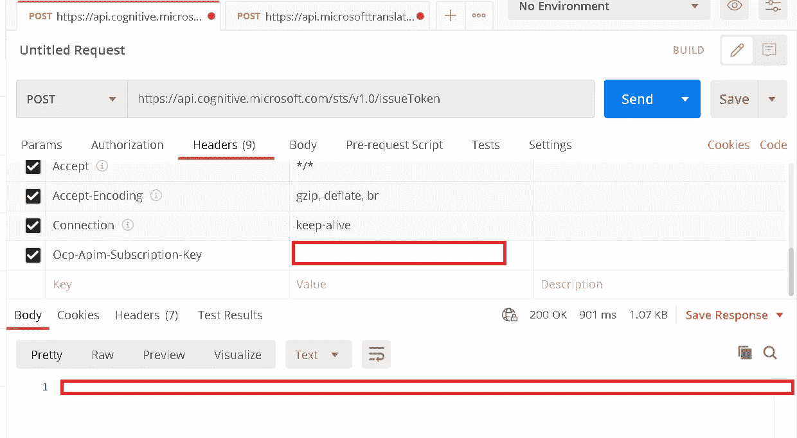
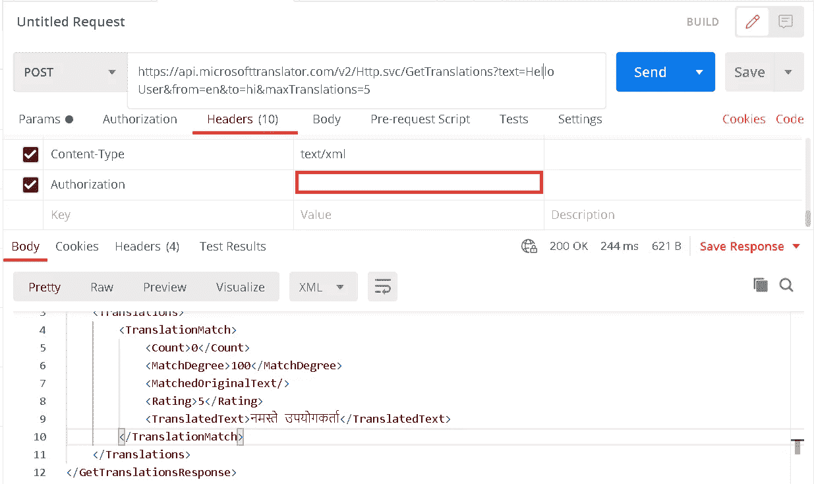
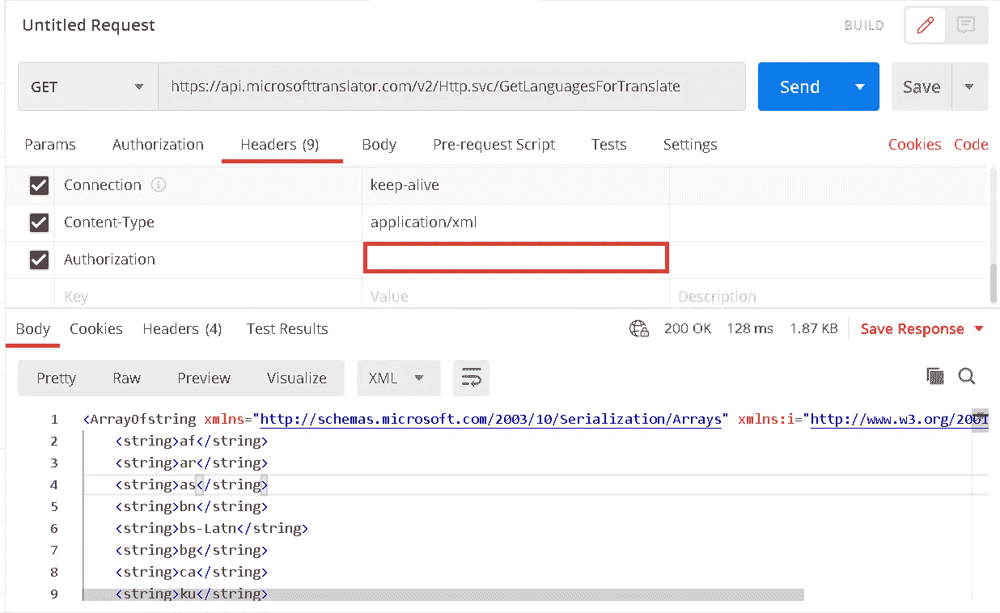
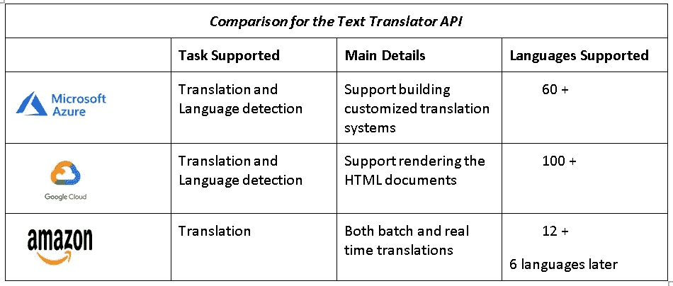

# 微软智能 Azure 认知服务数据-文本翻译服务

> 原文：<https://medium.com/globant/microsoft-intelligent-azure-cognitive-services-data-text-translation-service-a32c3445c74c?source=collection_archive---------1----------------------->

Azure Cognitive Services

# 概观

微软在 Azure 云平台上为开发者引入了新的人工智能功能。决策是 Azure 认知服务的增强功能之一，它为更好的决策提供特定于用户的建议。

Azure Cognitive Services 是一个智能算法 API 的集合，开发人员可以利用它来执行语言翻译、图像识别、语音识别、自然语言处理、异常检测和其他智能任务。该决定增加了一项名为 Personalizer 的服务，该服务利用强化学习为用户提供具体的建议，以协助决策。Azure 在内部使用人工智能算法来做出这些决定。

> **认知服务 API 分为五类……**

*视觉——分析图像和视频的内容和其他有用信息。*

*语音——改善语音识别和识别说话者的工具。*

语言——理解句子和意图，而不仅仅是单词。

*Knowledge——为您追踪科学期刊上的研究。*

*搜索——将机器学习应用于网络搜索。*

## 让我们从作为认知服务一部分的翻译服务开始。

> **Azure 认知服务—文本翻译服务**

# 介绍

不久前，我使用 Bing Translator API 来帮助我们的一些产品进行本地化。因为微软最近退出了过去提供这项服务的数据市场，转而使用 Azure 托管的认知服务 API。

Azure Translator Text API 是一个基于云的机器翻译服务，支持多种语言。翻译器用于构建应用程序、网站、工具或任何需要多语言支持的解决方案。

在本文中，我们将看到翻译服务的注册和使用。

转到 Azure 门户>打开认知服务>点击添加按钮。因此，它会向您显示市场上所有可用的服务。点击翻译并创建服务。

Creating Translator Service

2.创建后，你会发现 2 个键和端点。您可以使用任一密钥进行身份验证。

Text Translator Service Create View

3.与许多其他 API 不同，这包括两步过程。步骤如下

a.使用 STS URL 从 Azure 获取令牌，该 URL 当前为[https://api.cognitive.microsoft.com/sts/v1.0/issueToken](https://api.cognitive.microsoft.com/sts/v1.0/issueToken)。使用 POST 方法，并在标题中使用“Ocp-Apim-Subscription-Key ”,使用来自**键的值和来自翻译服务的端点**。

下面您将在 API 调用的主体中获得令牌，这个令牌我们可以用于所有进一步的请求。

Postman — Authentication Token Request For Translator API

b.现在使用这个令牌，我们可以调用位于 URL 下面的真正的 web 服务[https://api.microsofttranslator.com/v2/Http.sv](https://api.microsofttranslator.com/v2/Http.sv)c

Postman — Calling API using the Authentication Token

API:[https://API . Microsoft translator . com/v2/http . SVC/get translations？text = Hello User&from = en&to = hi&max translations = 5](https://api.microsofttranslator.com/v2/Http.svc/GetTranslations?text=Hello User&from=en&to=hi&maxTranslations=5)

> 参数:
> 
> **文本**是要翻译的文本。
> 
> 中的**是我们传递文本的格式。**
> 
> **到**是我们希望翻译的表单文本的格式值。
> 
> **maxTranslations** 是匹配此翻译的最大级别，最小值应为 1。

调用这个 API 后将在主体中得到预期的结果。

> 同样在这里，我们可以通过访问下面的 get API 来获得这个翻译器目前支持多少种语言
> 
> [https://API . Microsoft translator . com/v2/http . SVC/GetLanguagesForTranslate](https://api.microsofttranslator.com/v2/Http.svc/GetLanguagesForTranslate)

Postman API Call To Get Languages

Azure 在设计文本翻译器 API 时牢记以下优势:

***安全、可扩展、可定制。***

> 我们有另一个文本翻译器，下表显示了比较。

Comparison for the Text Translator API

# 外卖食品

这是一个简单的概念验证，但需要理解的关键是，智能 AI/ML 驱动的应用程序只是一堆 API 调用，这要归功于 Azure Cognitive Services，它提供了大量的功能，如决策、语言、搜索、语音和视觉！

这就是本文的全部内容，请继续关注更多内容！如果你觉得有用，请点赞并关注😊