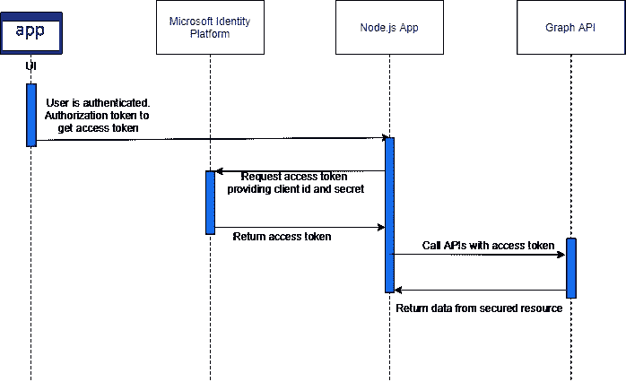
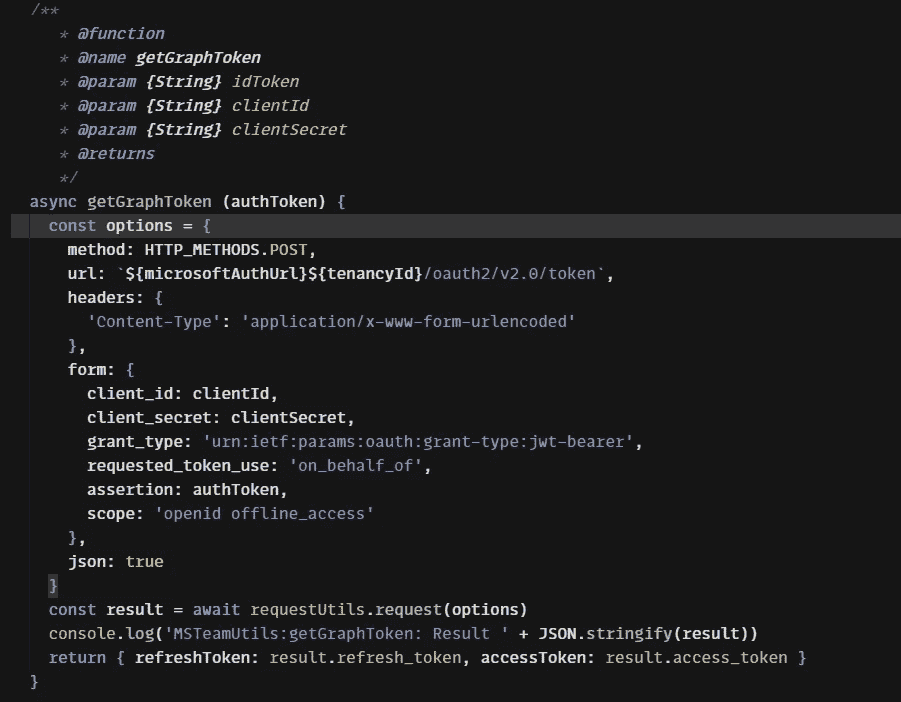
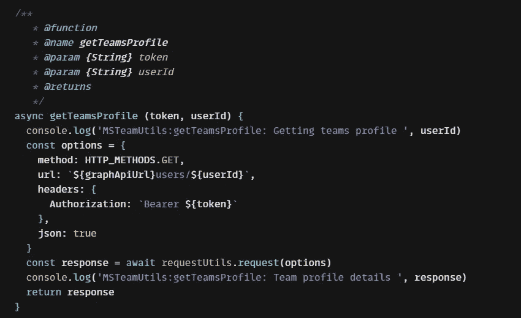
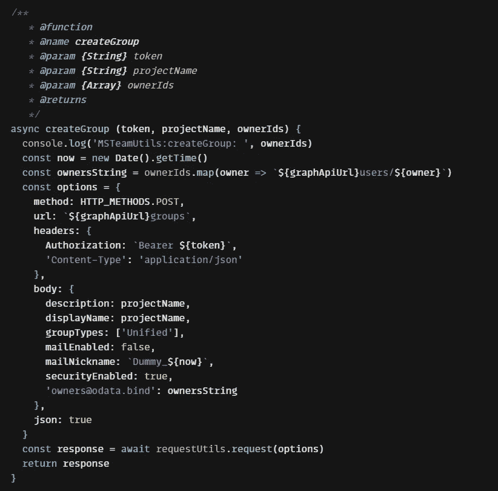
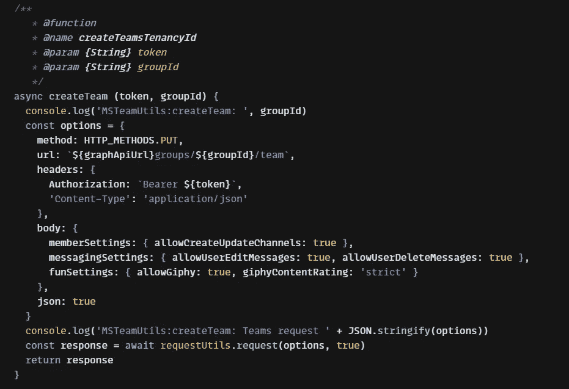
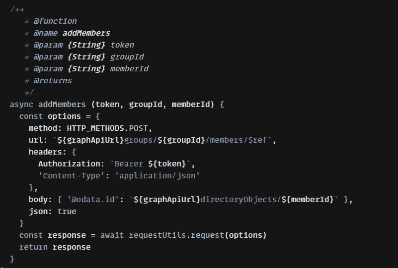

# 微软团队使用 MS Graph API 和微软身份平台与 Node.js 集成

> 原文：<https://medium.com/globant/microsoft-teams-integration-with-node-js-using-ms-graph-api-and-microsoft-identity-platform-d7c53f1541ad?source=collection_archive---------0----------------------->

本文的目标是使用 Microsoft graph APIs 和 Microsoft Identity Platform，通过 Node.js 为 MS 团队集成构建现成的解决方案。我们将介绍组、团队的创建以及向团队添加成员(所有者和团队成员)。

本文将有助于自动化 MS Teams 集成过程，包括创建组、创建团队、使用 graph APIs 和 Node.js 添加成员

**示例:**团队正在开发流程管理应用程序，需要执行以下任务

1.  在应用程序中创建项目
2.  添加项目成员
3.  创建团队并在 MS 团队中添加成员，以发送更新/警报/项目相关信息

要执行上述操作，创建项目的用户需要执行团队创建，手动添加成员。但是，如果我们能够在项目创建过程中实现自动化，那会怎么样呢！

**先决条件**

1.  来自平台团队的[客户 Id、机密](https://docs.microsoft.com/en-us/samples/officedev/microsoft-teams-sample-auth-node/microsoft-teams-auth/)和租赁 Id
2.  拥有以下权限的用户授权令牌:团队。创建，分组。ReadWrite.All，目录。读写。全部

## **步骤**

**获取访问令牌**
使用来自以下 url 的租赁 id 为 teams 应用程序请求访问令牌[https://log in . Microsoft online . com/$ { tenancyId }/oauth 2/v 2.0/token](https://login.microsoftonline.com/${tenancyId}/oauth2/v2.0/token)。请参见下面的代码片段。([更多详情](https://docs.microsoft.com/en-us/azure/active-directory/develop/v2-oauth2-on-behalf-of-flow#middle-tier-access-token-request))



Get access token

**获取团队配置文件**
这是需要进行的 API 调用，以获取要添加到组和团队中的用户配置文件([更多详细信息](https://docs.microsoft.com/en-us/graph/api/user-get?view=graph-rest-1.0&tabs=http#http-request))。
**API**:[https://graph.microsoft.com/v1.0/users/${userId](https://graph.microsoft.com/v1.0/users/${userId)}
**方法**:获取
**响应**:成功后，该方法返回`200 OK`响应代码和[用户](https://docs.microsoft.com/en-us/graph/api/resources/user?view=graph-rest-1.0)对象，除非`$select`被显式用于选择属性。

用户对象代表 AD 用户对象。返回的用户的默认属性如下

```
{
  "**id**": "The unique identifier for the user",
  "**displayName**": "The name displayed in the address book for the user",
  "**givenName**": "The first name of user",
  "**surname**": "The user's surname (family name or last name)",
  "**mail**": "The SMTP address of user",
  "**preferredLanguage**": "The preferred language for the user",
  "**businessPhones**": "The telephone numbers for the user",
  "**mobilePhone**": "The primary cellular telephone number for the user",
  "**jobTitle**": "The user's job title",
  "**officeLocation**": "The office location in the user's place of business",
  "**userPrincipalName**": "The User Principal Name is an Internet-style login name for the user based on the Internet standard RFC 822\. he general format is alias@domain"
}
```



**创建团队** 团队创建是团队创建不可或缺的一部分。
API:[https://graph.microsoft.com/v1.0/groups](https://graph.microsoft.com/v1.0/groups)
方法:POST
响应:如果成功，该方法在响应体中返回一个`201 Created`响应代码和一个[组](https://docs.microsoft.com/en-us/graph/api/resources/group?view=graph-rest-1.0)对象，只有组的默认属性。group 对象代表 active directory 组，可以是 O365 或安全组。返回的默认属性在这里标注为。
[更多详情](https://docs.microsoft.com/en-us/graph/api/group-post-groups?view=graph-rest-1.0&tabs=http#example-2-create-a-group-with-owners-and-members)



Create group

**创建团队** 获取上面创建的组 id 以在该组中创建团队
API:[https://graph.microsoft.com/v1.0/groups/${groupId}/team](https://graph.microsoft.com/v1.0/groups/${groupId}/team)
方法:PUT
响应:如果成功，该 API 返回一个`202 Accepted`响应。



Create Team

**添加成员** API:[https://graph . Microsoft . com/v 1.0/groups/$ { groupId }/members/$ ref](https://graph.microsoft.com/v1.0/groups/${groupId}/members/$ref)
方法:POST
响应:该 API 成功返回一个`204 No Content`响应代码，在响应体中不返回任何内容。

> **错误代码**
> 404 未找到-当添加的对象不存在时
> 400 错误请求当添加的对象已经是组的成员时



Add members

**总结**

MS Teams automation 可以减少大量的手动工作，例如创建团队、添加成员、定义角色，并且在我们有许多项目成员的情况下，引入的错误会减少。此外，我们还可以自动化其他流程，如在频道上发送通知、添加/列出/更新托管内容等。

与 node.js 项目的完整集成可以在这里找到。

*   [代码沙箱](https://codesandbox.io/s/us2u9)
*   [位桶](https://bitbucket.org/vikaskeskar11/ms-teams-integration)

> **注意:示例项目设置将作为 docker 容器运行，作为独立的应用程序运行，相应地更新配置。**