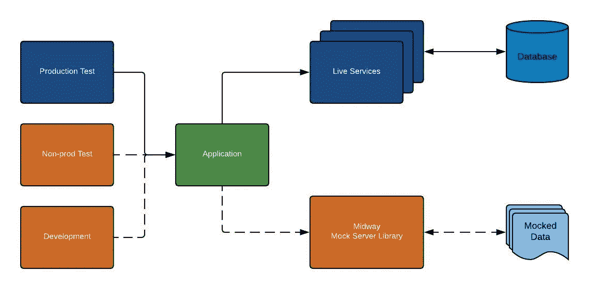

# 中途:沃尔玛的嘲讽之旅…

> 原文：<https://medium.com/walmartglobaltech/midway-walmarts-mocking-journey-84c34fcc4593?source=collection_archive---------5----------------------->

[https://anothersideofsandiegotours.com/wp-content/uploads/2015/02/USS-Midway-Sunset-Reflection.jpg](https://anothersideofsandiegotours.com/wp-content/uploads/2015/02/USS-Midway-Sunset-Reflection.jpg)

大多数应用程序依赖于一个或多个后端服务。为了成功的测试执行和快速的开发，所有依赖的后端服务都应该是 100%可靠的。然而，让服务跟上开发和测试的一致数据非常具有挑战性，这使得针对非生产服务的测试/开发效率低下且耗时。

在沃尔玛，数百个工程团队面临着同样的挑战，因为沃尔玛规模的依赖关系树非常庞大，对于一个端到端的功能流，可能很容易涉及 100 多个团队，从而导致开发缓慢、测试执行缓慢并影响测试可靠性，特别是在由于依赖服务间歇性超时、不可用等导致应用程序测试结果出现假阴性的情况下。，因为调试和评估根本原因变得非常具有挑战性和耗时，因为这些问题不容易重现。

# 前进的道路…

为了保持整个沃尔玛的测试自动化速度，通过减少假阴性来建立对测试结果的信心是很重要的，这使得我们非常明显地需要一个模拟解决方案，它可以通过消除对后端服务的测试和开发依赖来满足沃尔玛的需求，并且可以在沃尔玛规模上运行。

回到 2015 年，在我们的头脑风暴会议和可用工具的初步评估期间，我们非常清楚地知道，工具的 ***DNA*** 应该具有以下内容:

*   **简单的设置** : *第一次使用的用户应该能够设置一个模拟服务器，并且应该能够在 10 分钟内模拟至少两个 APIs 这将加速应用程序的采用，团队也不必为他们的日常工作感到学习一个新的复杂工具的负担。*
*   **Library not a server** : *该解决方案应该提供一种模拟 REST APIss 的方式，而无需集中托管，这样就可以根据个人或团队的需要，在本地或 CI/CD 中启动和停止 REST API，以进行开发和/或测试，从而消除任何网络依赖性，并且可以在任何地方工作。*
*   **大规模并行** : *能够并行运行测试用例(沃尔玛仅前端每天就运行超过 300，000+测试用例)，节省时间和资源。*
*   **解耦:** *不与用户代码耦合——开发或测试代码应该独立于 mock 实现，这样集成 mock 服务器就不需要对现有的设置或过程进行彻底检查。*
*   **多平台** : *解决方案应该能够支持 Web、mWeb、本地和服务开发和测试。*
*   **文档** : *获得一个被数百个团队采用的工具意味着大量的支持时间，因此文档应该是顶级的，这样我们就可以花更多的时间在特性开发上，而不是支持上。*

# **解决方案**

以中途岛号命名的[测试舰队的](http://testarmada.io)开源模拟舰队[中途岛](https://www.npmjs.com/package/testarmada-midway)提供了一套强大的工具来大规模解决上述挑战。支持的一些功能包括:

*   **UI 界面** : *用于人工测试/调试的模拟服务 UI。*
*   **拖放响应** : *通过将响应文件放入文件夹，根据路由路径自动响应一个 JSON 文件。*
*   **变体** : *切换到 REST API 的不同数据集。*
*   **测试重用** : *针对模拟或实时服务执行相同的测试用例。*
*   **Swagger 集成** : *使用 Swagger 定义的 web 服务的自动模拟创建器。*
*   **公共实用程序** : *公共实用程序方法是作为 mocking 服务的一部分提供的，它允许更快的测试开发。*
*   **模仿来自容器** : *模仿来自特定目录的数据响应，与 Rest APIs 无关*
*   **并行会话** : *支持并行进程的单实例模拟服务器。*
*   **共享模拟数据** : *允许从多个 Git 存储库中获取模拟数据和路径——允许团队共享他们的模拟响应。*
*   **模拟数据的动态转置(JSON)** : *动态修改响应的能力。*
*   **支持所有文件类型** : *自动评估响应文件扩展名和 mime 类型*
*   **平台无关模仿** : *模仿任何服务，不管它是用什么语言编写的。*
*   **服务器状态** : *模拟服务器状态的能力。*
*   **手动测试** : *针对模拟服务手动运行测试的能力*
*   **服务故障** : *团队可以确定性地模拟服务故障。*

三年前，当我们开始的时候，没有多少开源模拟工具可以满足我们的需求，然而，从那时起，模拟功能测试自动化和开发*(不是单元测试用例)*已经获得了很大的动力。其他一些值得注意的开源嘲讽工具是 [Polly。JS](https://netflix.github.io/pollyjs/#/) ，[兴农。JS](https://sinonjs.org/) 、[模仿](https://mimic.js.org/)等。每个解决一个或多个不同的用例。

# **案例分析**

> *销售点手册/自动化测试用例及软件开发。*

*挑战*:

*   外部服务中断对开发的影响为 ***10 小时/周***
*   测试的外部服务中断影响为 ***12 小时/周***
*   外部服务变更影响事件每周 **2 起**
*   20%时的测试片状剥落为
*   **阴性测试场景为 ***零。*****

***中途冲击:***

*   **外部服务中断对开发的影响减少到 ***0 小时/周*****
*   **测试的外部服务中断影响减少到 ***0 小时/周*****
*   **外部服务变更影响减少到每周 **0 次****
*   **测试碎片减少到 ***5%*** *(一旦所有服务都被嘲笑，预计将减少到 0%)***
*   **在概念验证的第一周，添加了***【10+】***负面测试场景 ***。*****

> **Walmart.com 前端的自动测试周期。**

***挑战*:**

*   **完整的测试周期太长，在某些情况下需要几天才能完成。**
*   **由于测试周期较长，PR 和主验证是在有限的浏览器上进行的。**
*   **由于启动多个应用程序和模拟服务器导致的 CPU 限制，只有 32 个测试用例可以并行运行，导致需要更多硬件来执行测试— ***使用 4 台服务器，每台服务器执行 400 个测试用例需要 25 分钟以上。*****

***中途撞击:***

*   **单个团队的测试执行时间减少了 40%到 60%。**
*   **由于测试执行速度的提高，PR 和 Master verify 可以在所有顶级浏览器上运行。**
*   **可以并行运行 120 多个测试案例，将硬件成本降低了近 10 倍***—用 1 台服务器执行 400 个测试案例花费了不到 10 分钟的时间。*****

**在沃尔玛，所有前端测试自动化团队都使用 Midway 来模仿他们测试自动化的后端服务。使用 Midway 作为模拟解决方案可以加快测试执行，减少假阴性，帮助优化资源使用，从而降低成本，提高整体效率。在不到一年的时间里，中途已经嘲讽了超过 ***185+百万*** 的 REST APIs。**

*****敬请关注未来博客对架构和特性的深入解释。与此同时，请随意浏览中途的*** [***文档***](http://testarmada.io/documentation/Mocking/rWeb/JAVASCRIPT/Introduction) ***或者尝试从*** [***这里***](https://www.npmjs.com/package/testarmada-midway) ***下载。*****