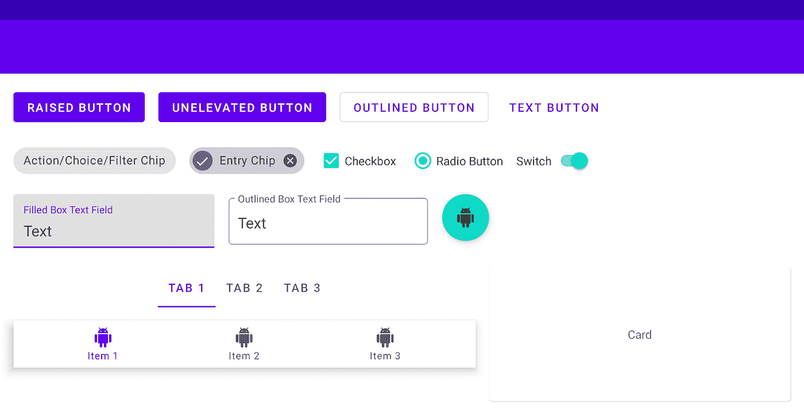
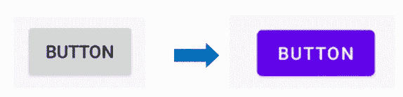
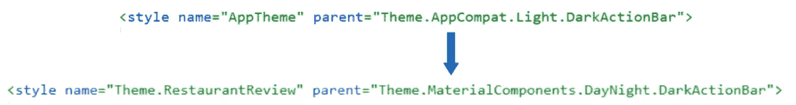
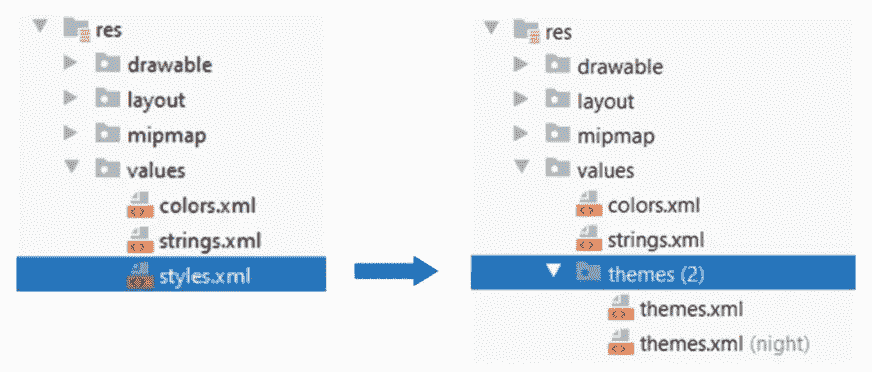
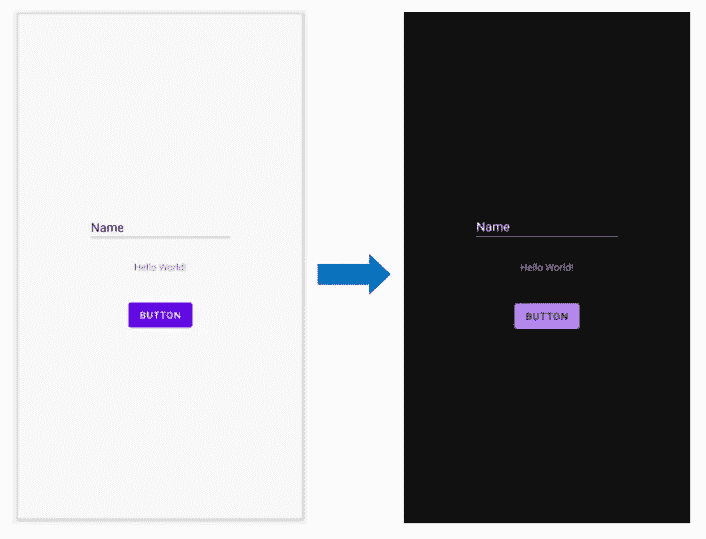
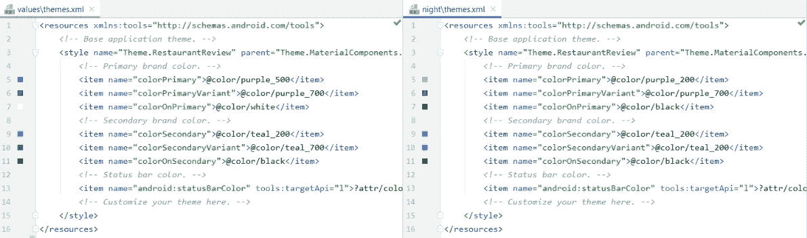
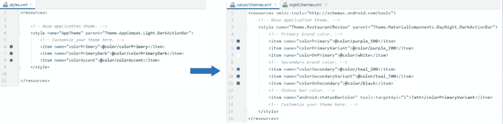
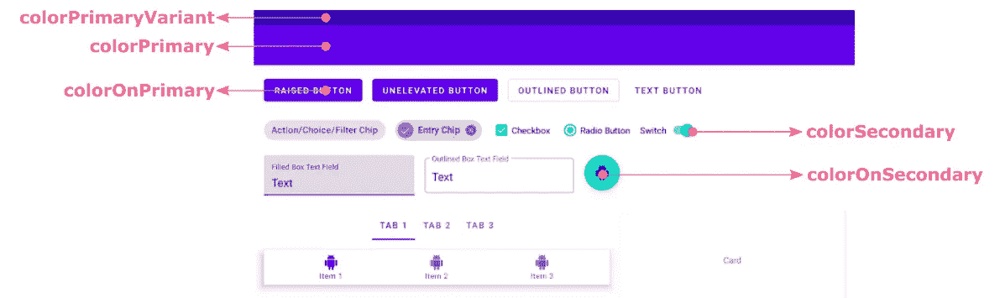
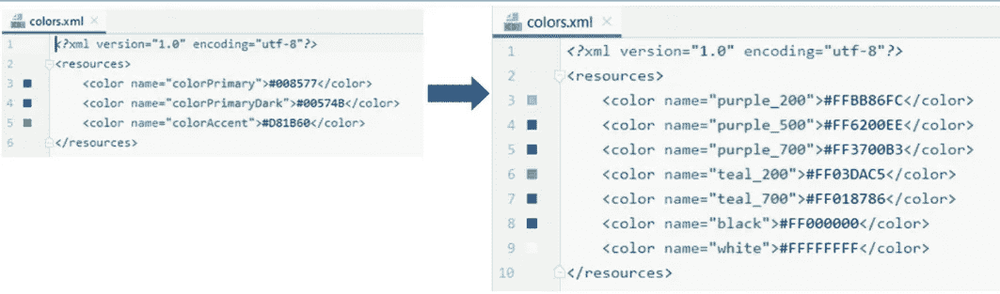
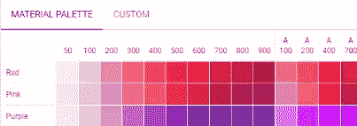

# Migrasi AppCompat ke Material Design Component (MDC) | New in Android Studio 4.1 Part #1

> 原文：<https://medium.easyread.co/migrasi-appcompat-ke-material-design-component-mdc-new-in-android-studio-4-1-part-1-87af7ef30ad4?source=collection_archive---------0----------------------->

Hai gaes.. beberapa minggi kemarin ada update yang cukup menggemparkan untuk kami pembuat course Android. Mengapa? Hal ini karena ada beberapa perubahan fundamental yang cukup signifikan ketika membuat project baru.

Hal yang pertama yang akan kita bahas pada blog ini yaitu berkaitan dengan **theme** .

Saat Anda membuat project baru pada Android Studio 4.1, tema default yang digunakan yaitu Material Design Component (MDC), berbeda dengan AS versi sebelumnya yang menggunakan AppCompat.

Untuk Anda yang belum tahu Material Design Component Anda bisa melihatnya di sini:

 [## We Recommend Material Design Components

### Here’s why

medium.com](https://medium.com/androiddevelopers/we-recommend-material-design-components-81e6d165c2dd)  [## MAD Skills Material Design Components: Wrap-Up

### We hope you liked our material

medium.com](https://medium.com/androiddevelopers/mad-skills-material-design-components-wrap-up-d22a2df069c8) 

Secara seklias perbedaan antara MDC dan AppCompat dapat dilihat pada gambar berikut:

Pada MDC sudah terdapat tema bawaan mulai dari font, bentuk tombol, dsb yg lebih cerah daripada pendahulunya yang terkesan biasa aja.

Kalau dari sisi kode kalian bisa lihat perbedaannya seperti berikut:

Hal lain yang cukup unik yaitu dalam hal penamaan, sebelumnya kita menggunakan style dan sekarang menggunakan theme.xml (walaupun untuk memanggil style yang di dalamnya tetap menggunakan @styles, cukup aneh memang, wkwk)

Nah, kalau dilihat di sini ada 2 file yang langsung disediakan ketika membuat project baru, dari namanya saja pasti sudah bikin Anda tertarik, yaitu themes.xml (night) yang lain dan tak bukan digunakan untuk membuat DARK MODE.

Dengan thema di atas, kamu tidak perlu menambahkan kode apapun untuk membuat dark mode! Cukup mengubah setting pada handphone yang sudah support dan wuuush, aplikasi Anda akan otomatis menjadi dark mode. Mantap!

Nah kalau dari sisi kodenya akan terlihat seperti ini:

Anda hanya perlu menyesuaikan warna yang ingin Anda terapkan pada masing-masing tema.

Jika dilihat lebih jelas ada sedikit perbedaan attribute pada theme dengan versi AppCompat. Untuk lebih jelasnya lihatlah gambar berikut:

Attribute yang sebelumnya hanya ada 3 (colorPrimary, colorPrimaryDark, colorAccent) sekarang menjadi lebih banyak dan fleksibel.

Berikut adalah gambaran dari masing-masing attribute tersebut

Selanjutnya yaitu tentang **warna** . Jika Anda perhatikan pada colors.xml yang baru terdapat perbedaan pada penamaan warna seperti berikut:

Nama warna yang sebelumnya colorPrimary, colorPrimaryDark, & colorAccent kini menjadi lebih literal dan jelas sesuai dengan isi warnanya. Misal purple, teal, black, white.

Jika Anda perhatikan ada purple 200, 500, 700\. Apa maksudnya? Ini merupakan standar warna yang dibuat oleh Matarial Design. Urutan angkan menunjukkan dari warna yang muda sampai tua.Contohnya seperti ini:

Untuk lebih lengkapnya Anda bisa melihatnya di sini:

 [## Color Tool - Material Design

### Create and share color palettes for your UI, and measure the accessibility of any color combination.

material.io](https://material.io/resources/color) 

Mantap! Banyak sekali perubahan yang terjadi pada Android Studio 4.1\. ini. Semoga artikel ini bisa memberikan pencerahan dan membantu Anda dalam bermigrasi. Yang jelas supaya nggak bingung ketika membuat project baru. Hehe.

Yang penasaran series selanjutnya:

 [## Kotlin Android Extension Deprecated?

### Hai gaess.. kali ini kita akan melanjutkan series blog yang sebelumnya, yaitu yang berhubungan dengan update yang cukup…

arifaizin.medium.com](https://arifaizin.medium.com/kotlin-android-extension-deprecated-cad3b698d163) 

Sekian dari saya dan sampai jumpa!

> change is difficult, but it will be more difficult if it does not change immediately