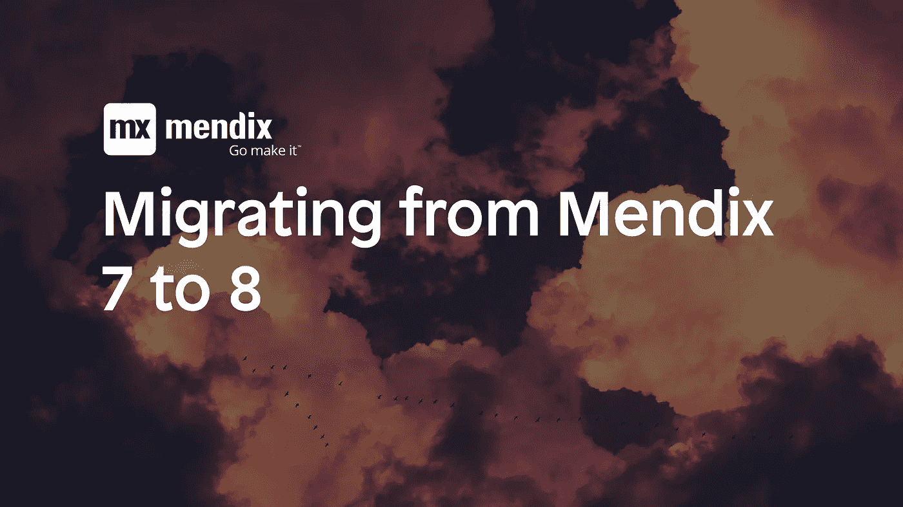
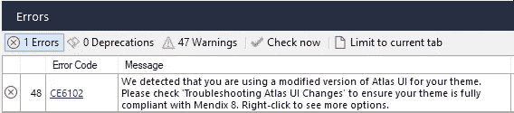

# 如何将 Mendix 7 迁移到 8

> 原文：<https://medium.com/mendix/migrate-from-mendix-7-to-8-5426167c15c1?source=collection_archive---------1----------------------->

从 Mendix 7 迁移到 8 并不困难，但是有一些事情值得一提。这篇博文是对文档页面的补充:[从 Desktop Modeler 版本 7 迁移到 Studio Pro 8](https://docs.mendix.com/refguide8/moving-from-7-to-8) 。在这篇博客中，我指出了在将你的 Mendix 应用从 Mendix 7 迁移到 Mendix 8 时要记住的一些主题和自己的经历。

**保留一份 Mx7 项目的副本**

有时，让原始的 Mx7 项目可用也会有所帮助，所以一定要创建一个导出并打开它，以便在转换后进行比较。对于检查用户库/ Java JAR 问题来说也是非常好的。

**Appstore 模块—用户库内容**

许多 Appstore 模块已经更新，支持 Mendix 8。通常这些模块还带有它们的依赖项的更新版本。

如果您只是下载所有的 Appstore 模块，那么您最终会得到具有相同功能但版本号不同的 Java JARS。因此，您应该首先清理项目的 userlib 文件夹。

如果您没有包含任何自己的 Java 功能，您可以在再次下载所有 Appstore 模块之前清理 userlib。这将确保您拥有最新且唯一的依赖项版本。

如果您有定制的 Java 功能，那么您需要检查哪些 jar 是那些 Java 动作正确工作所必需的。必要时与您的 Mx7 副本进行比较。

**主题迁移**

主题迁移已经被很好地记录了。如果您当前的主题已经基于 Atlas，那么迁移并不困难，但是请密切关注 Mendix 8 中的[迁移指令](https://docs.mendix.com/refguide/migration-atlas)和对 DOM 的[更改。](https://docs.mendix.com/refguide/migration-dom-issues)

对于比 Atlas 更早的自定义主题，您需要使您的主题基于 Atlas 2.0.0 或更高版本，以防止 Mendix 8 中的主题问题。这可能需要大量的返工，尤其是如果当前主题具有复杂的公司风格。

Mendix 8 中的 DOM 变化确实是一个很大的改进，使定制变得更容易，所以这是值得努力的。

**主题错误**

将项目迁移到 Studio Pro 8 后，您将会看到一个错误，提示您正在使用修改过的 Atlas 主题。即使在您迁移了您的主题之后，错误也不会消失。只需右键单击它，然后就可以删除它。(这是新的，通常情况下，当您进行更改时，错误会消失，但 Studio Pro 没有办法检测到您已经完成，因此您将对此进行判断。)

Modified theme error message

**缺少手机布局**

从 Atlas UI 2.0.0 开始，电话布局已经被重命名，如果您引用该布局，会在您的项目中导致许多错误。对此有一个简单的解决方法，例如 Phone_Default:

查找 HybridPhone _ 默认

将其重命名为 Phone_Default。Mendix 将显示一个弹出窗口，提示存在现有用法。确认对话框

将其重命名回 HybridPhone_Default。不要撤消更改，这不会起作用。

**关于设计属性的错误**

(此部分已于 2020 年 2 月 10 日进行了编辑，以反映 Mendix 针对迁移期间的设计属性问题所做的修复)

在 Mendix 8.6 之前，您可能会收到如下错误之一:

*   CE6083，您的主题不支持属性 Align Self。检查 theme\settings.json。
*   CE6085，未知选项 Center align 作为属性 Align content 的列。

从 Mendix 8.6 开始，使用 Atlas UI 2.4.1，Studio Pro 将转换已重命名或其值已重命名的设计属性。您将看到以下一条或多条消息:

CE6087 设计属性已在您的主题中重命名，需要更新。右键单击查看更多选项。

您可以右键单击其中一条消息，并立即转换所有设计属性值。

如果你已经创建了你自己的设计属性，要小心，在你这样做之前，确保这些属性都在原来的位置，否则它们可能会被误认为是不存在的东西。虽然这是一个真正不同的错误，但我建议首先应用您的设计属性。

**结论**

不要让迁移拖了你的后腿。我已经做了一些，没有太多的麻烦。主题迁移也非常值得努力。总而言之，Mendix 8 是一个很棒的发布。