# 将 PostgreSQL 从 AWS RDS 迁移到 Oracle 云基础架构

> 原文：<https://medium.com/oracledevs/migrate-postgresql-from-aws-rds-to-oracle-cloud-infrastructure-2c5fdff50135?source=collection_archive---------0----------------------->

## 第 1 条— **将 PostgreSQL 从 AWS RDS 迁移到 OCI PostgreSQL**

OCI 提供了一种经济高效的超大规模云，可用于构建企业应用和云原生应用。PostgreSQL 是商业 RDS 引擎的流行开源替代方案。

在本文中，我们将使用 pgAdmin4 工具将数据库从 AWS RDS PostgreSQL 迁移到 OCI PostgreSQL。Oracle 云基础设施(OCI)目前没有针对 PostgreSQL 的完全托管服务，但是您可以使用 [Oracle OCI 快速入门指南](https://github.com/oracle-quickstart/oci-postgresql)构建高度可用的 PostgreSQL 堆栈

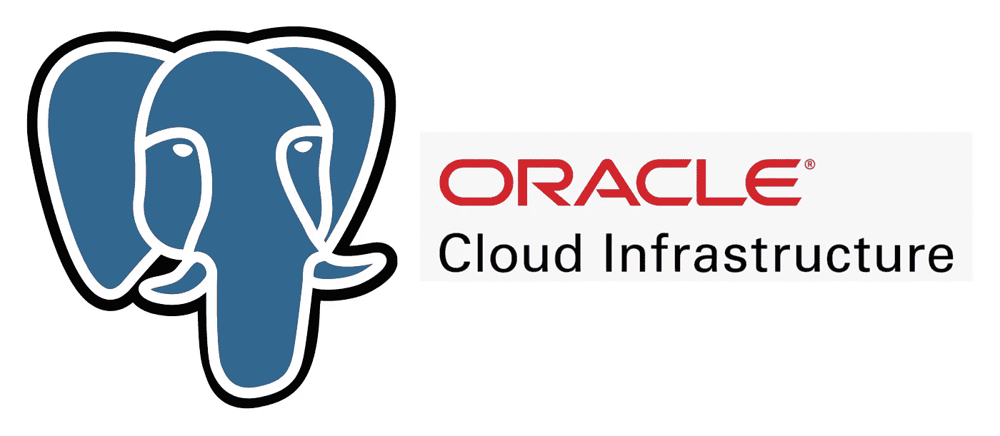

OCI PostgreSQL

PostgreSQL 的构建和部署可以通过 5 个简单的步骤完成。

**入门需要什么**

*   AWS RDS 实例，其数据库包含模式中的对象
*   OCI 帐户访问
*   PostgreSQL 平台的 OCI 快速入门指南
*   在你的客户端机器上安装 pgAdmin 4 工具，或者作为 Docker 容器，连接 AWS 和 OCI

**第一步:**

[在您的客户端机器上安装 pgAdmin4](https://www.pgadmin.org/download/) 。从 PgAdmin4 连接到 AWS RDS 实例并备份数据库。从 RDS 实例中复制端点以及端口号

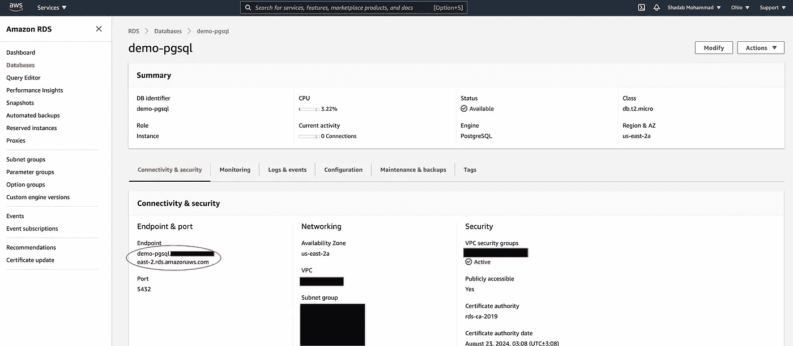

在我的例子中，我使用了 RDS 中著名的 DVDRental 示例数据库来测试这个迁移。DVD 租赁数据库具有复杂的表映射和存储过程，非常适合测试迁移。

你可以在这里找到加载 DVDrental 样本数据库[的步骤](https://www.postgresqltutorial.com/postgresql-sample-database/)

现在，让我们打开 pgAdmin4，开始备份 AWS RDS 数据库

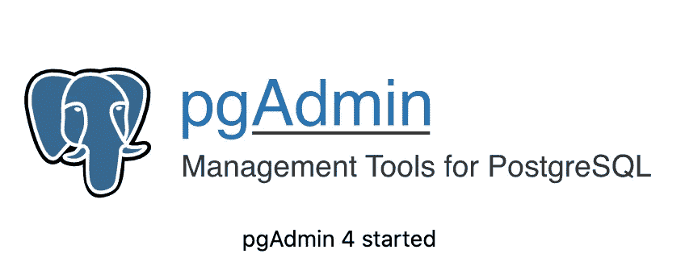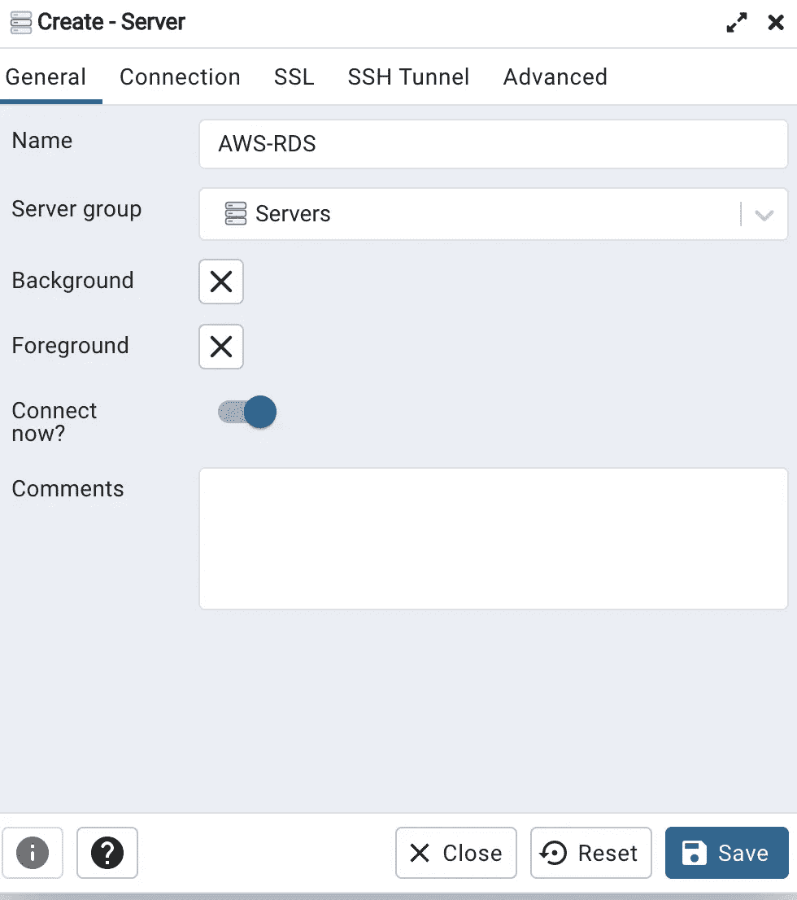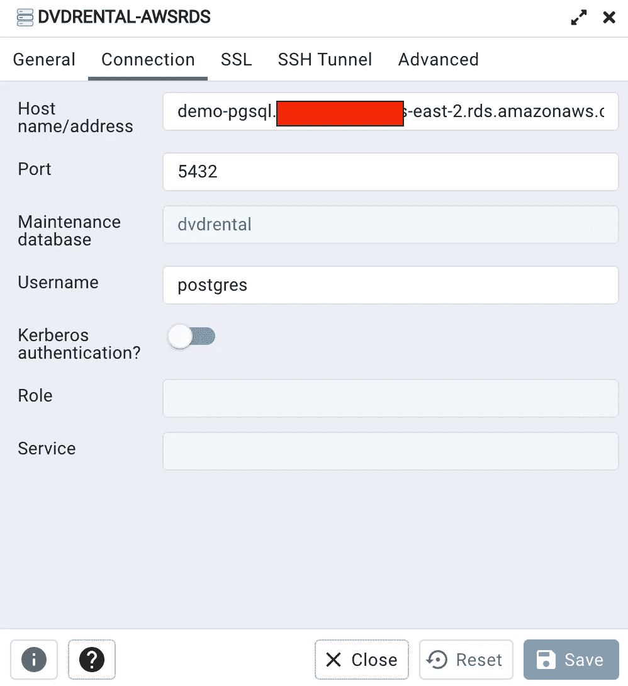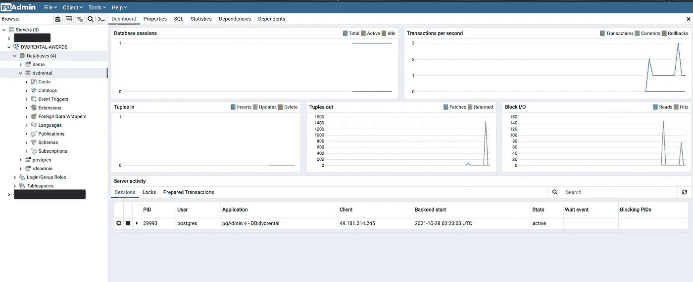

**第二步:**

使用 pgAdmin4 将 RDS 数据库备份到 tar 存档。如果您的数据库很大，最好的方法是创建 S3 作为文件系统，并使用 pg_dump 从可以访问 RDS 和 OCI PostgreSQL 实例的位置备份和恢复数据库。

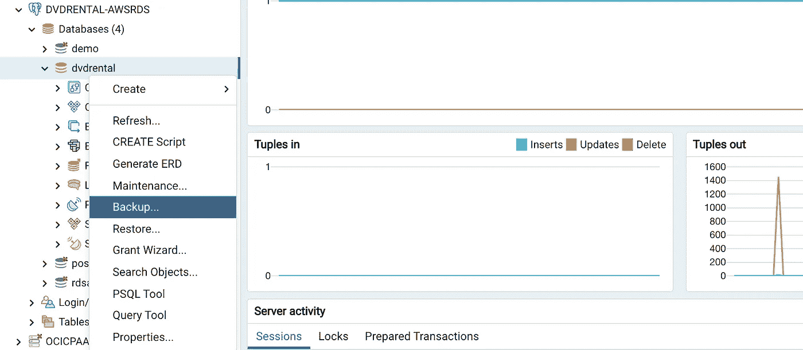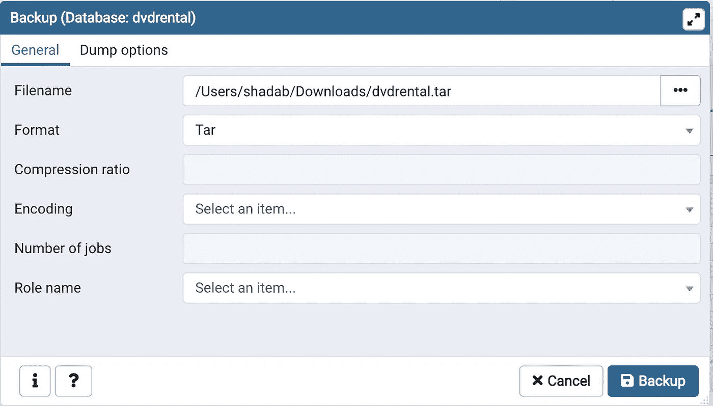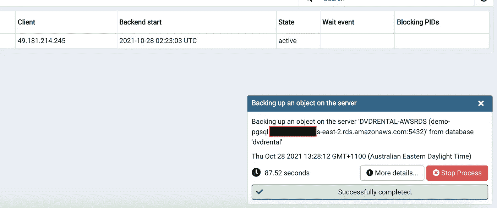

现在从 AWS RDS 完成了这些步骤，我们已经生成了整个数据库 DVDRental.tar 的备份文件。这种方法适用于迁移停机时间可以忍受的小型数据库，但如果您有一个更大的数据库，那么 pg_dump 将更适合使用 cdc 复制工具，如 PostgreSQL 的 Airbyte

**使用 pg_dump 的示例备份脚本**

```
#!/bin/bash
hostname=`hostname`
# Dump DBs
  date=`date +"%Y%m%d_%H%M%N"`
  backupdir='/home/opc'
  dbname='demo'
  filename="$backupdir/${hostname}_${dbname}_${date}"
 pg_dump -h <public/private dns> -U postgres --encoding utf8 -F c -f $filename.dump $dbnameexit 0
```

**第三步:**

使用 Github Repo[https://github.com/oracle-quickstart/oci-postgresql](https://github.com/oracle-quickstart/oci-postgresql)在 OCI 部署 PostgreSQL

单击“部署到 Oracle 云”并使用您的租赁和帐户详细信息登录

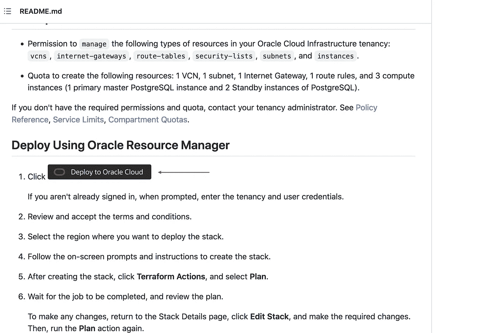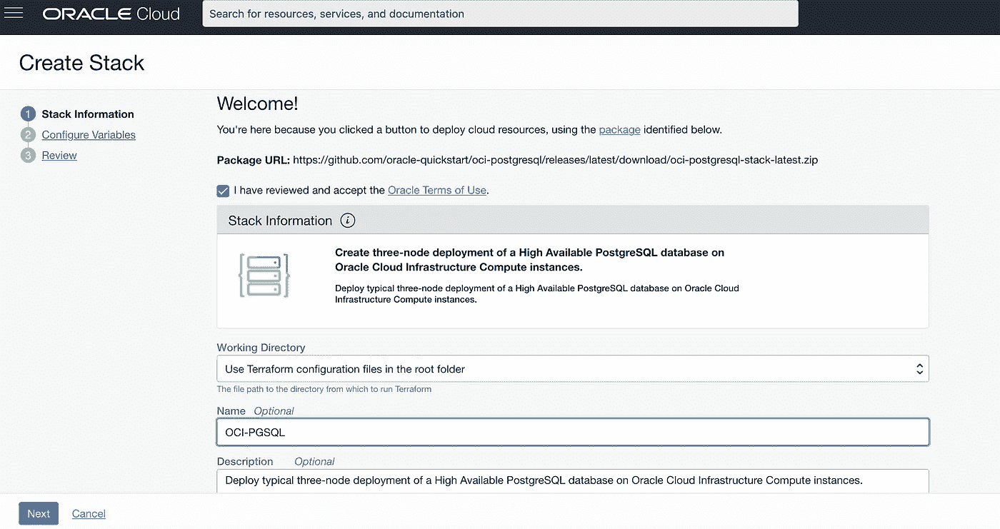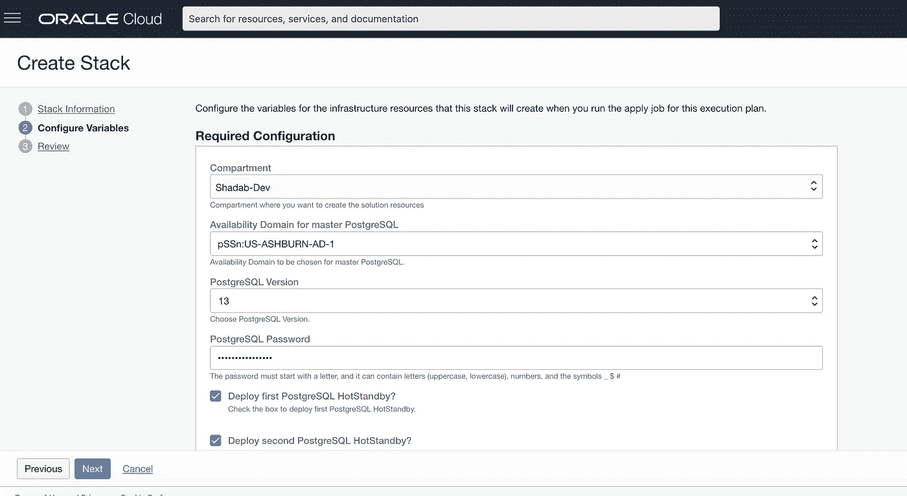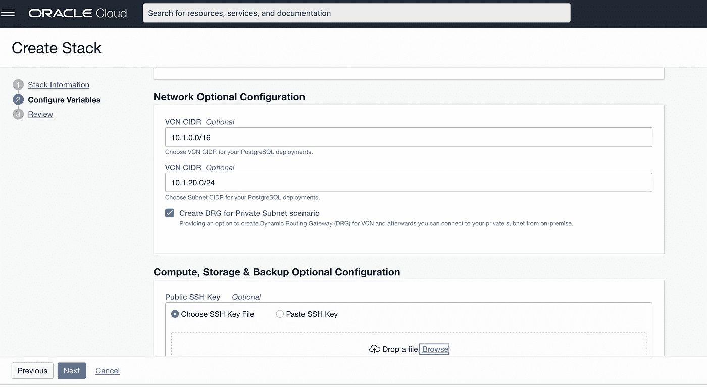

这将为 HA 在三个不同的容错域中提供一个 VCN +Bastion 主机服务+ PostgreSQL Master 和 2 个备用实例的堆栈

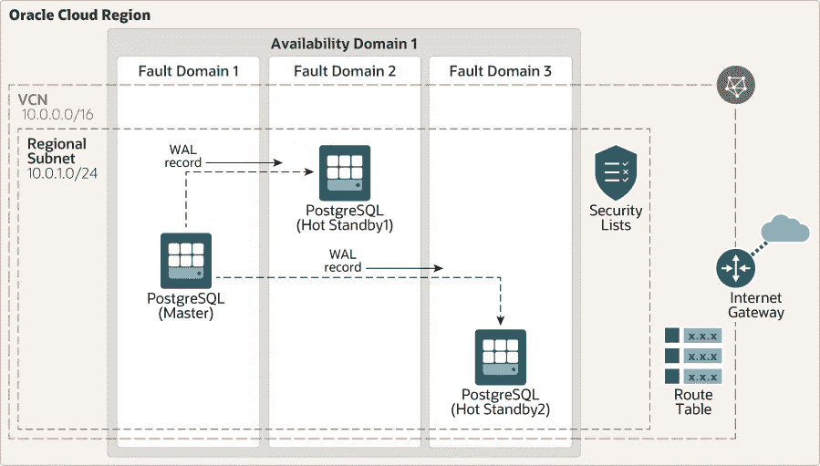

**第四步:**

为远程连接配置 OCI 上的 PostgreSQL 实例

通过作为 OCI 快速入门堆栈的一部分创建的堡垒主机服务登录到 PostgreSQL 实例

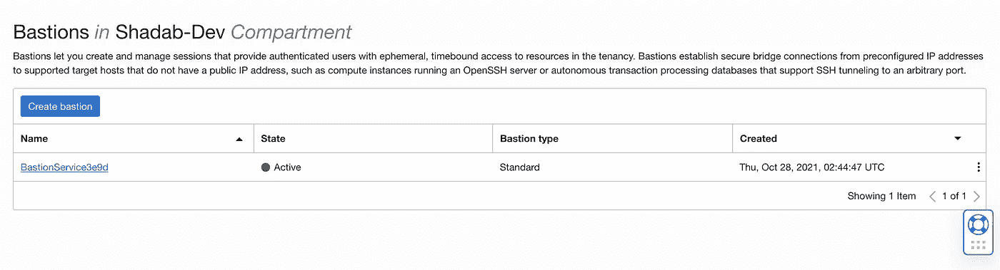

创建一个新的托管 SSH 会话，或者使用映射到您在配置堆栈时使用的公钥的私钥对中的现有会话。登录到 PostgreSQL 主实例

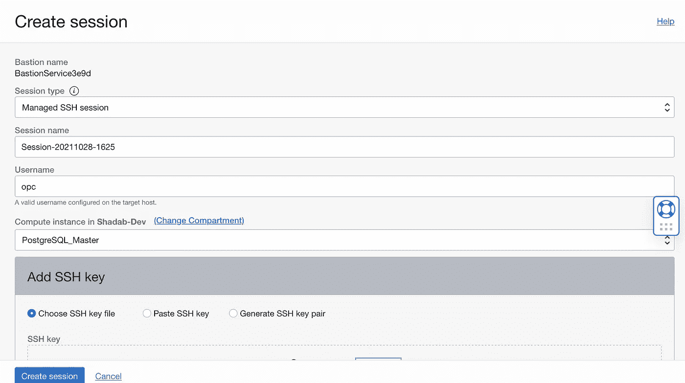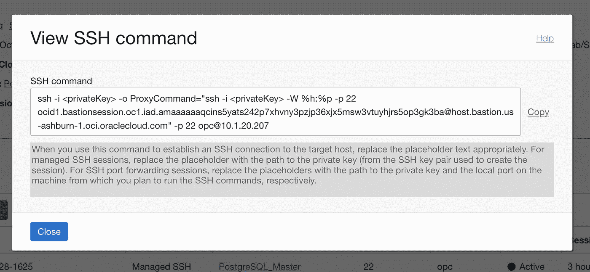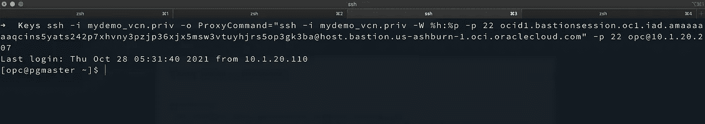

登录到实例并检查 PostgreSQL 服务

```
sudo systemctl restart postgresql-13.service
sudo systemctl list-units | grep postgres
```

在防火墙-cmd 中添加 tcp 端口 5432

```
sudo firewall-cmd --zone=public --permanent --add-port=5432/tcp
sudo firewall-cmd --reload
sudo firewall-cmd --list-ports
```

更改监听地址

```
sudo su postgrescdfind / -name “postgresql.conf”vi /data/pgsql/postgresql.conf
```

—添加此行，保存并退出

```
listen_addresses = ‘*’
```

检查服务器是否正在监听端口

```
netstat -tldpnActive Internet connections (only servers)
Proto Recv-Q Send-Q Local Address Foreign Address State PID/Program name
tcp 0 0 0.0.0.0:5432 0.0.0.0:* LISTEN
```

允许所有主机连接

```
find / -name “pg_hba.conf”vi /data/pgsql/pg_hba.conf
```

—在文件末尾添加这两行，保存并退出(确保每列之间有空格，否则会导致 PostgreSQL 服务无法运行)

```
host      all     all     0.0.0.0/0     md5
host      all     all     ::/0          md5
```

—使用 opc os 用户重新启动 Postgres 服务

```
sudo systemctl restart postgresql-13.service
sudo systemctl list-units | grep postgres
```

更改超级用户密码

```
sudo su postgres
cd
psql -h localhost
postgres=# ALTER USER postgres WITH PASSWORD ‘P@ssword31344$#’;
```

将端口 5432 作为入口规则添加到子网或 NSG 的安全列表中，现在您可以远程连接到 OCI PostgreSQL 实例

**第五步:**

从 pgAdmin4 连接到 OCI PostgreSQL 实例，并将 tar 备份文件恢复到新的 OCI PostgreSQL 实例

为 OCI 堡垒服务的端口 5432 创建端口转发会话

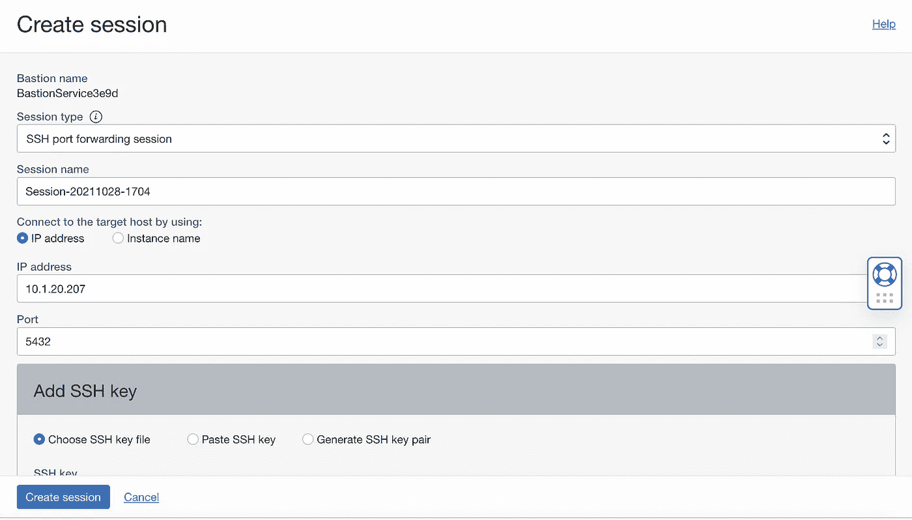

打开 SSH 隧道

```
ssh -i mydemo_vcn.priv -N -L 5432:10.1.20.207:5432 -p 22 [ocid1.bastionsession.oc1.iad.amaaaaaaqc***********pqya@host.bastion.us-ashburn-1.oci.oraclecloud.com](mailto:ocid1.bastionsession.oc1.iad.amaaaaaaqcins5ya37hkgsd2uhtjsxx2kelarznlkvtqhspt7i5i2hiipqya@host.bastion.us-ashburn-1.oci.oraclecloud.com)
```

登录到 pgAdmin4，并使用我们之前设置的用户名“postgres”和密码将主机名用作本地主机

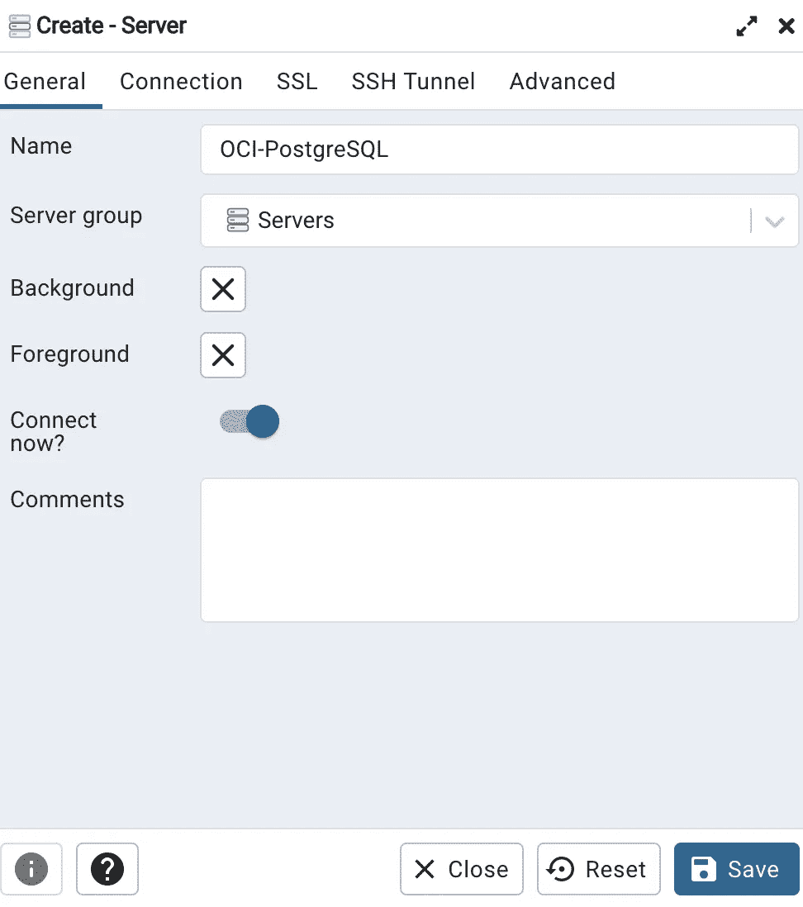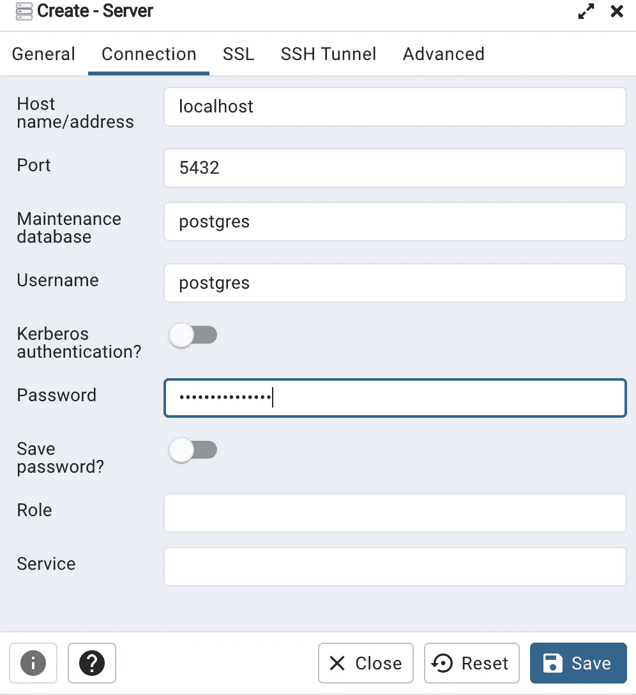

恢复。tar 文件，包含 RDS 中的示例数据库备份，首先创建一个占位符数据库

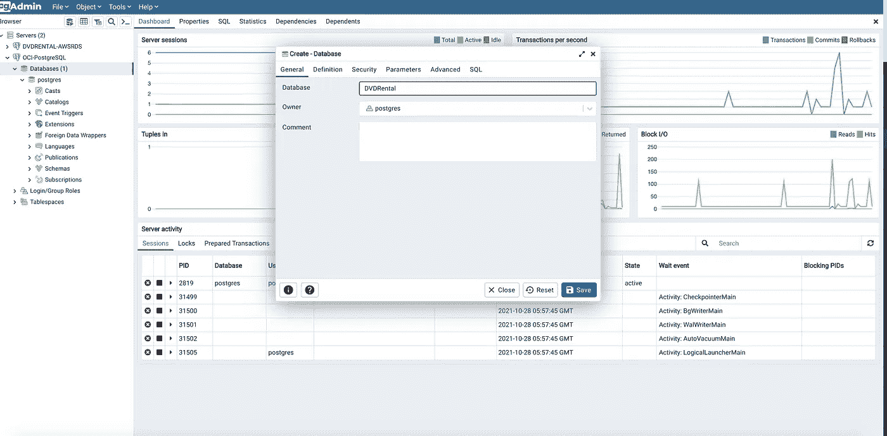

恢复文件。确保选择恢复选项>不保存权限= "是"

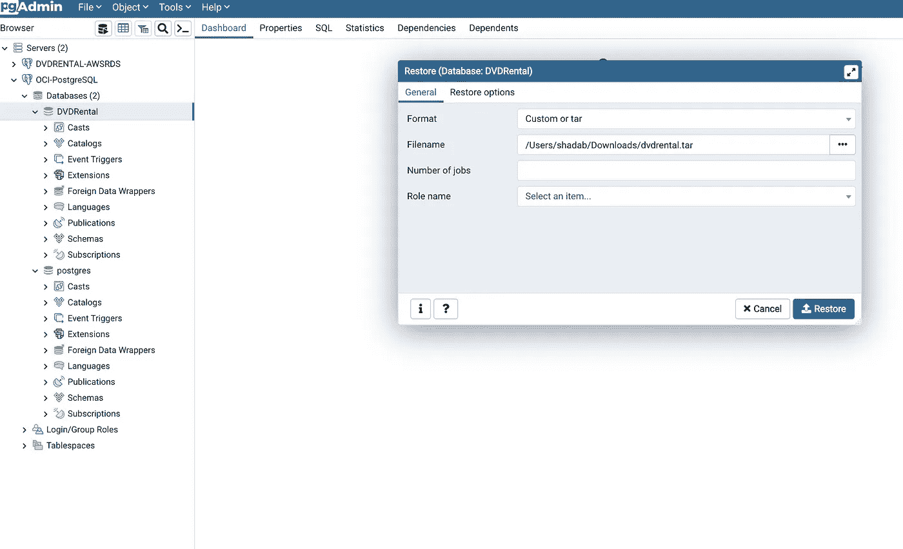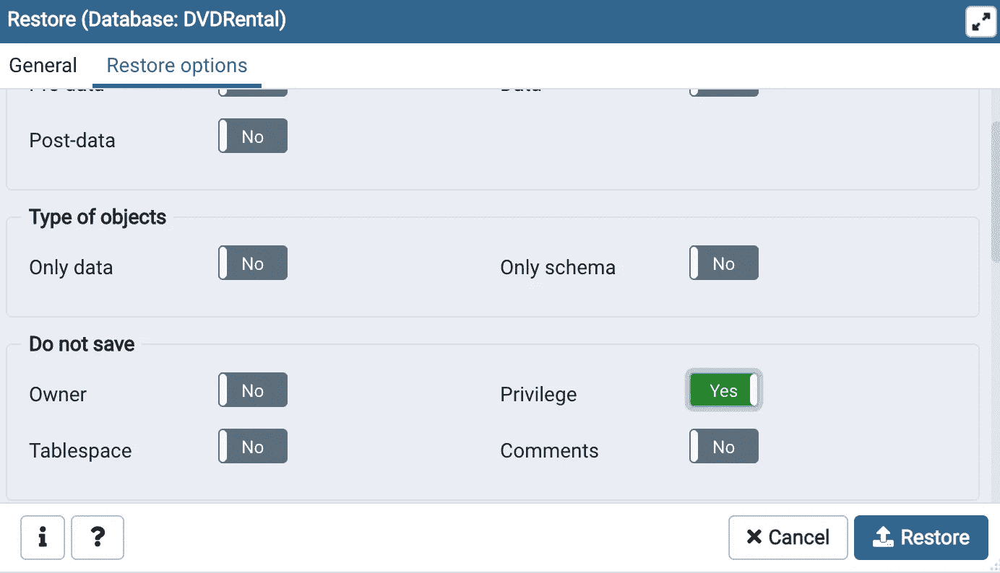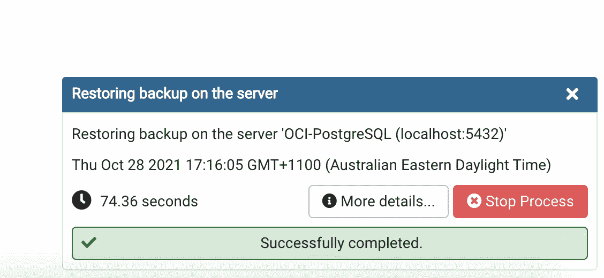

现在让我们在 OCI 的 DVDRental 数据库中检查对象

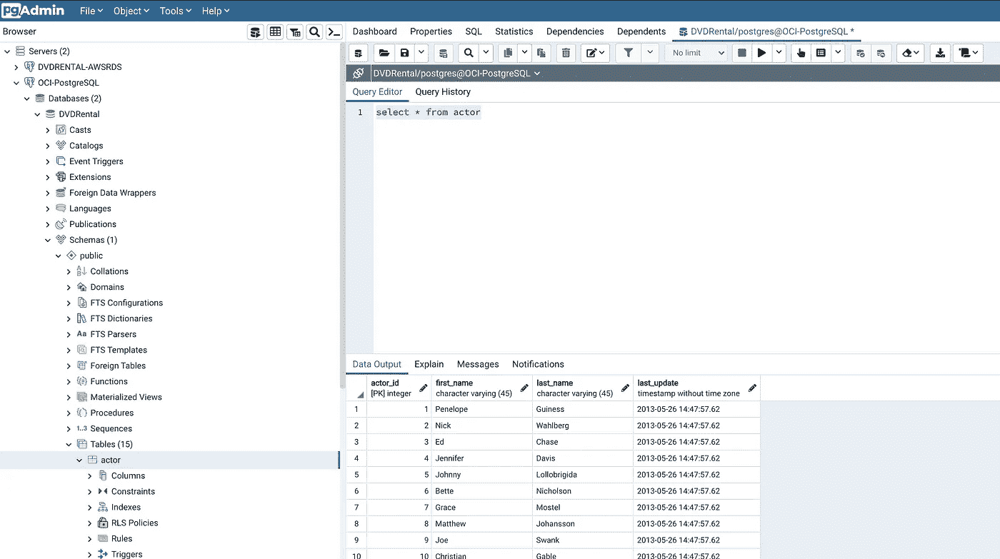

我们现在可以看到，所有对象都已经从 RDS 实例导入到 OCI PostgreSQL 数据库中。

如果您有一个大型数据库，那么您可以使用 pg_restore 而不是 GUI 进行恢复。

**使用 pg_restore 的示例恢复脚本**

```
#!/bin/bash
# Restore DB
dbname='demo'
filename='/home/opc/demo.dump'
  #pg_restore -U postgres -d $dbname -c < ./$1
  pg_restore -U postgres -d $dbname -c < $filename
exit 0
```

## **总结**

我们可以看到使用 OCI 资源管理器在 OCI 上构建一个完全生产级 PostgreSQL 服务器是多么容易。可以通过任何标准 PostgreSQL 工具将 AWS RDS PostgreSQL 迁移到 OCI PostgreSQL。这个想法是为了展示 PostgreSQL 的强大功能和灵活性，它能够在任何平台上运行，而不会局限于 AWS RDS 这样的完全托管的服务。

## **接下来会发生什么**

这是一系列关于 OCI 的 PostgreSQL 的文章。请继续关注此空间，了解更多信息:)即将推出..

1.  将 OCI PostgreSQL 实例备份到 Oracle 的对象存储中
2.  修补您的 OCI PostgreSQL 实例
3.  不要 Kubernetize 您的 PostgreSQL。不是一个帖子，只是一个非常重要的提示；)

## 参考

[1][https://docs . Oracle . com/en/solutions/deploy-PostgreSQL-db/index . html](https://docs.oracle.com/en/solutions/deploy-postgresql-db/index.html)

[2][https://github.com/oracle-quickstart/oci-postgresql/](https://github.com/oracle-quickstart/oci-postgresql/)

[3]https://www.pgadmin.org/download/

[4]https://www.postgresqltutorial.com/