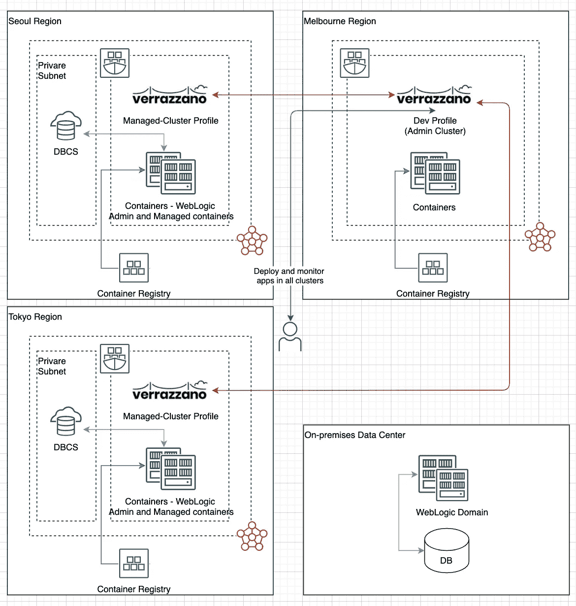
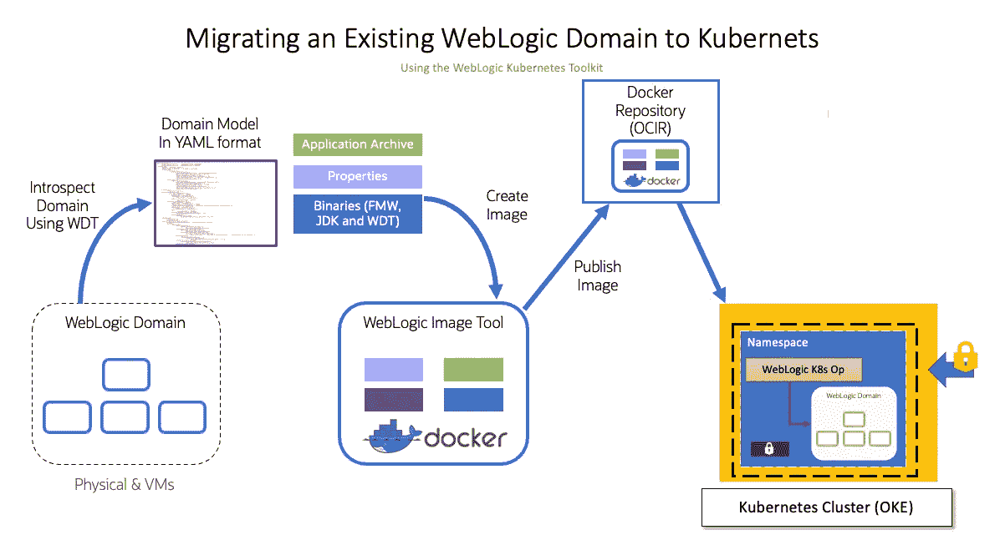
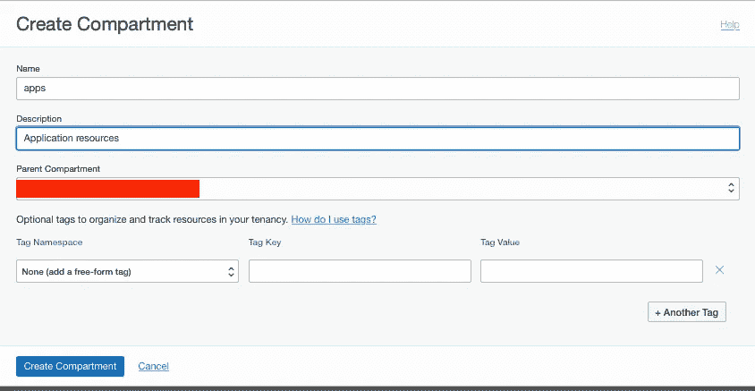
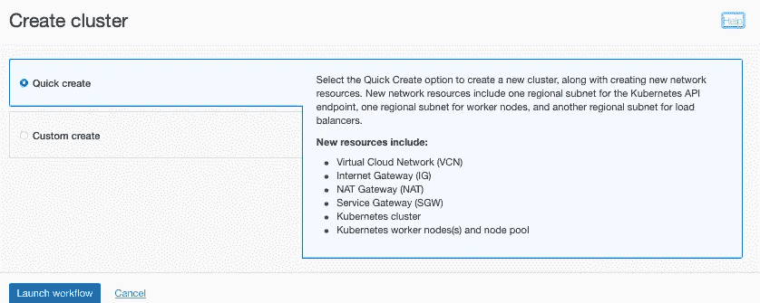
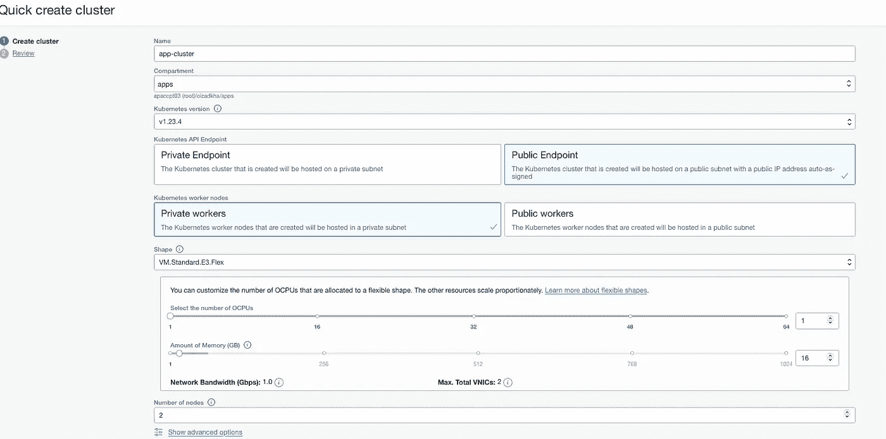
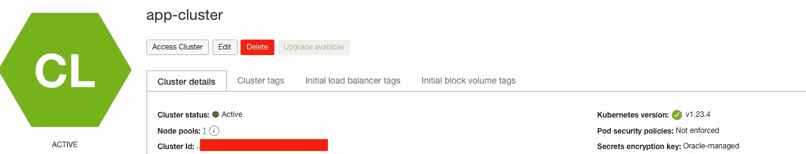
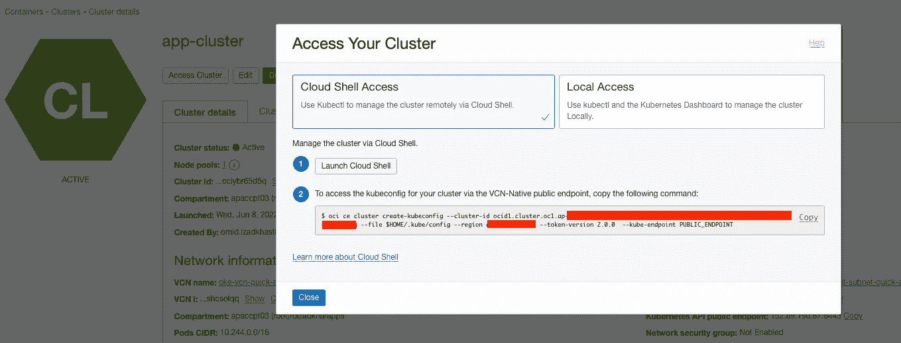
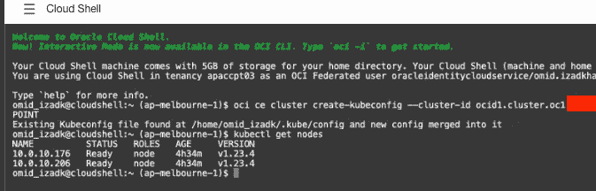
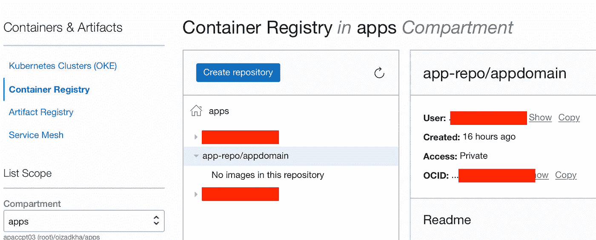
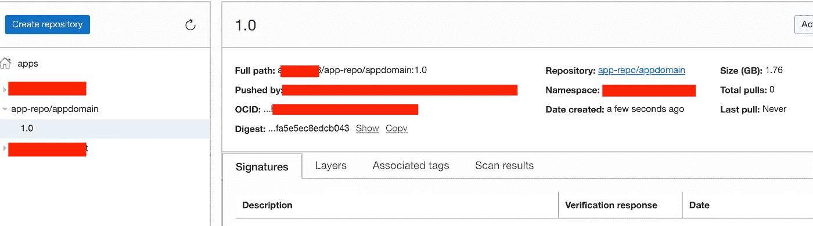

# 将 WebLogic 域迁移到 Verrazzano 多集群环境—第 1 部分

> 原文：<https://medium.com/oracledevs/migrate-weblogic-domain-to-verrazzano-multi-cluster-environment-part-1-edbcd9d174d2?source=collection_archive---------0----------------------->

在 WebLogic 环境中运行工作负载的现有客户面临的最大挑战之一是在不执行重大重新架构的情况下对遗留环境进行现代化改造。

在本文中，我将解释如何将现有的 WebLogic 域迁移到受管的 Kubernetes 集群(在我的例子中为 OKE ),在后续文章中，我将利用 Verrazzano 并将现有的 WebLogic 域迁移到多集群 Verrazzano 环境。

以下是高级目标体系结构:



让我们开始吧！

Oracle Kubernetes Toolkit 提供了一套全面的工具来帮助现有的 WebLogic 客户将其工作负载迁移到 Kubernetes 环境。

该工具包由以下产品组成:

1.  Oracle WebLogic 部署工具(WDT ),帮助客户将现有的域和配置提升并转移到映像和 Kubernetes。

2.Oracle WebLogic 映像工具，允许您自动构建、修补和更新 WebLogic Server Docker 映像，包括您自己定制的映像。

3.WebLogic Kubernetes 运算符，它扩展了 Kubernetes 以允许创建、配置和管理 WebLogic Server 域。

4.WebLogic Kubernetes Toolkit UI，便于向 Kubernetes 提供和部署 WebLogic 域和应用程序。

5.Oracle WebLogic Monitoring Exporter 将 WebLogic Server 指标导出到 Prometheus，可以在 Grafana 仪表板中监视和查看域和部署。

6.Oracle WebLogic Logging Exporter 提供了一个易于配置、健壮且可用于生产的解决方案，可通过 Elasticsearch 和 Kibana 访问 WLS 日志信息。

要将现有的 WebLogic 域迁移到 Kubernetes，您应该执行以下步骤:

1.  安装 Kubernetes 集群或使用一个受管理的 Kubernetes 环境，如 Oracle OKE、谷歌 GKS、AWS EKS 等。在本文中，我将使用 Oracle Kubernetes 引擎(OKE)。
2.  在 Kubernetes 集群中部署 Oracle WebLogic Operator。您可以跟随[这个链接](https://oracle.github.io/weblogic-kubernetes-operator/quickstart/install/)来学习如何在您的 Kubernetes 集群中安装 WebLogic operator(我将在本文后面解释)。
3.  使用 WebLogic 部署工具(WDT)从现有 WebLogic 域创建模型、属性和归档文件。模型是以 yaml 格式对 WebLogic Server 域配置的独立于版本的描述。属性文件是一个键/值文件，包含用户为域变量定义的值，如用户和密码、数据库连接字符串等。归档文件用于将二进制文件和其他文件资源部署到目标域(以 zip 格式)。我将在下面的部分解释这些文件。你可以在[这个链接](https://oracle.github.io/weblogic-deploy-tooling/)找到更多关于 WDT 以及如何使用它的信息。
4.  从 Oracle 网站下载 WebLogic 和 JDK 归档文件(您希望用于您的域的版本),并使用 WebLogic 映像工具创建 Docker 映像。WebLogic 映像工具接受 WebLogic 档案、JDK 档案、WDT 档案、域模型、域属性文件和域档案文件作为参数，并生成包含所有二进制文件(WebLogic、JDK 和 WDT)和域文件的 Docker 映像。这是 WebLogic Kubernetes 操作员使用的映像部署类型中的[模型。你可以通过](https://oracle.github.io/weblogic-kubernetes-operator/userguide/managing-domains/model-in-image/)[这个链接](https://oracle.github.io/weblogic-image-tool/)了解更多信息。

以下是将现有 WebLogic 域迁移到 Kubernetes 的高级流程图:



## 创建 OKE 集群

首先，您需要在您选择的 Oracle 云基础设施(OCI)地区创建您的 Kubernetes 集群。我不打算在这篇文章中涵盖所有步骤，你需要访问 OCI 租赁(你可以通过点击[这个链接](https://www.oracle.com/au/cloud/free/)创建你自己的租赁)。

登录到您的租户后，您应该创建一个隔离专区来提供 Kubernetes 集群(在我的例子中，我在 root 隔离专区下创建了一个应用隔离专区)。



然后，您应该在您的租户中配置一个 OKE 集群，您可以使用 OCI 控制台来配置集群，或者使用 terraform 脚本来配置集群。我们现在可以使用 OCI 控制台，在下一篇文章中，我将使用 terrafrom 来提供多集群环境。

导航到开发人员服务-> Kubernetes 集群(OKE ),在更改您的隔离专区后，选择“创建集群”。我建议选择“快速创建”，这样它将提供所有资源(VCN、子网、网关、防火墙规则、路由和 Kubernetes 资源)。您可以使用“Custom create ”,但是在配置 OKE 集群之前，您需要仔细遵循文档来创建所有资源。



我使用“公共端点”,这样我就可以从任何地方访问 OKE API 服务器(对于您的生产工作负载，我建议使用“私有端点”),并且只选择两个工作节点。



为您配置所有资源需要几分钟时间。



现在您可以使用云 shell 连接到 Kubernetes 集群。执行云外壳，并从 Kubernetes 集群复制和执行云外壳访问命令。



## 发现源 WebLogic 域

我在源(内部)环境中有一个非常简单的 WebLogic 域，在简单 WebLogic 群集中有一个受管服务器，在群集中部署了简单的 web 应用程序。

我可以使用以下命令来发现源环境(生成模型、属性和应用程序归档文件)。

```
***weblogic-deploy/bin/discoverDomain.sh -oracle_home $MW_HOME     -domain_home $DOMAIN_HOME -archive_file app-archive.zip     -model_file app-model.yaml -variable_file app.properties -target wko    -output_dir .***
```

该命令将生成三个输出:

*   领域模型

在此文件中，所有以@@PROP 开头的变量值将从属性文件中填充，所有以@@SECRET 开头的变量值将从 Kubernetes secrets 中填充(在运行时创建域的过程中)。

这意味着您应该在部署应用程序之前在 Kubernetes 中创建这些秘密。

*   域属性

*   在以下文件夹结构中压缩包含应用程序归档文件(ear、war 和 jar 文件)的文件:

```
wlsdeploy/applications
```

## 创建码头工人形象并在 OCIR 推广

我们将使用 imagetool 实用程序，通过域模型、属性和应用程序归档来创建 docker 映像。

此外，该实用程序需要融合中间件、jdk 和 WDT 二进制文件作为输入。

```
**imagetool/bin/imagetool.sh cache addInstaller --type wdt --version latest --path weblogic-deploy.zip --force****imagetool/bin/imagetool.sh cache addInstaller --type=jdk --version=8u291 --path jdk-8u291-linux-x64.tar.gz --force****imagetool/bin/imagetool.sh cache addInstaller --type=fmw --version=12.2.1.4 --path fmw_12.2.1.4.0_wls_quick_slim_Disk1_1of1.zip --force****imagetool/bin/imagetool.sh create --tag mel.ocir.io/apaccpt03/app-repo/appdomain:1.0 --version 12.2.1.4 --jdkVersion 8u202 --wdtModel app-model.yaml --wdtVariables app.properties --wdtArchive app-archive.zip --wdtDomainHome /u01/domains/appdomain --wdtModelOnly**
```

最后，在 OCIR 创建私有存储库(app-repo/appdomain ),并将映像推送到 OCIR。



```
**docker login <region name>.ocir.io
Username:** [**<tenancy namespace>/oracleidentitycloudservice/**](mailto:apaccpt03/oracleidentitycloudservice/omid.izadkhasti@oracle.com)**<user>
Password:
Login Succeeded**## Password is user auth token**docker push <region name>.ocir.io/**[**<tenancy namespace>**](mailto:apaccpt03/oracleidentitycloudservice/omid.izadkhasti@oracle.com)**/app-repo/appdomain:1.0**
```



the helm repo

## 在 Kubernetes 集群中安装 WebLogic 运算符

在这一步中，我将在我们的 k8s 集群中安装 WLS 操作符。首先，我需要连接到 cloud shell 并配置对集群的访问(如我之前所述)。

然后，我将为 WebLogic operator 创建一个名称空间。

```
omid_izadk@cloudshell:~ (ap-melbourne-1)$ **kubectl create namespace weblogic-operator-ns**
namespace/weblogic-operator-ns created
```

我使用 WL 操作员舵图来安装操作员，因此首先我需要使用以下命令添加舵库:

```
omid_izadk@cloudshell:~ (ap-melbourne-1)$ **helm repo add weblogic-operator** [**https://oracle.github.io/weblogic-kubernetes-operator/charts**](https://oracle.github.io/weblogic-kubernetes-operator/charts) **--force-update** 
"weblogic-operator" has been added to your repositories
```

我在这篇文章中使用了最新版本的操作符图像(3.4.1)

```
omid_izadk@cloudshell:~ (ap-melbourne-1)$ **helm show values weblogic-operator/weblogic-operator | grep image**
# image specifies the container image containing the operator.
image: "**ghcr.io/oracle/weblogic-kubernetes-operator:3.4.1**"
```

最后，使用以下命令在 weblogic-operator-ns 名称空间中安装 WL 运算符。

```
omid_izadk@cloudshell:~ (ap-melbourne-1)$ **helm install weblogic-operator \
>   weblogic-operator/weblogic-operator \
>   --namespace weblogic-operator-ns \
>   --set "enableClusterRoleBinding=true" \
>   --set "domainNamespaceSelectionStrategy=LabelSelector" \
>   --set "domainNamespaceLabelSelector=weblogic-operator\=enabled" \
>   --wait**
NAME: weblogic-operator
LAST DEPLOYED: Sun Jun 19 04:11:32 2022
NAMESPACE: weblogic-operator-ns
STATUS: deployed
REVISION: 1
TEST SUITE: None
```

我将使用以下命令来确认 operator 已经启动并正在运行。

```
omid_izadk@cloudshell:~ (ap-melbourne-1)$ kubectl **get all -n weblogic-operator-ns**
NAME                                    READY   STATUS    RESTARTS   AGE
**pod/weblogic-operator-9c5bd58f5-85gkf   1/1     Running   0          2m43s**NAME                                     TYPE        CLUSTER-IP      EXTERNAL-IP   PORT(S)    AGE
service/internal-weblogic-operator-svc   ClusterIP   10.96.130.244   <none>        8082/TCP   2m44sNAME                                READY   UP-TO-DATE   AVAILABLE   AGE
deployment.apps/weblogic-operator   1/1     1            1           2m46sNAME                                          DESIRED   CURRENT   READY   AGE
replicaset.apps/weblogic-operator-9c5bd58f5   1         1         1       2m46s
```

## 安装 NGINX 入口控制器

我将安装 NGINX 入口控制器，以便使用以下命令从公共互联网访问 WebLogic 托管服务器(如果您愿意，可以使用任何入口控制器代替 NGINX)。

```
#add nginx helm repository
omid_izadk@cloudshell:~ (ap-melbourne-1)$ **helm repo add ingress-nginx** [**https://kubernetes.github.io/ingress-nginx**](https://kubernetes.github.io/ingress-nginx) **--force-update**
"ingress-nginx" has been added to your repositories#Create namespace 
omid_izadk@cloudshell:~ (ap-melbourne-1)$ **kubectl create namespace nginx**
namespace/nginx created#install nginx helm chart
omid_izadk@cloudshell:~ (ap-melbourne-1)$ **helm install nginx-operator ingress-nginx/ingress-nginx --namespace nginx**
NAME: nginx-operator
LAST DEPLOYED: Sun Jun 19 04:23:01 2022
NAMESPACE: nginx
STATUS: deployed
REVISION: 1
TEST SUITE: None
```

## 创建和部署 WebLogic 域

这是创建域文件(yaml 格式)和在 k8s 中创建域的最后一步。WebLogic 操作员将获取域配置，并相应地创建管理服务器和受管服务器。

首先，我们需要创建 domain.yaml 文件，该文件使用我们在前面步骤中创建的图像。下面是 domain.yaml 文件。

在创建域之前，您需要为 OCIR 注册表用户名和密码、WebLogic 凭据和运行时加密密码创建名称空间和机密。

```
omid_izadk@cloudshell:wls-oke (ap-melbourne-1)$ **kubectl create namespace appdomain**
namespace/appdomain createdomid_izadk@cloudshell:wls-oke (ap-melbourne-1)$ **kubectl -n appdomain create secret generic weblogic-credentials --from-literal=username=weblogic --from-literal=password=Welcome123#**
secret/appdomain-weblogic-credentials createdomid_izadk@cloudshell:wls-oke (ap-melbourne-1)$ k**ubectl label secret appdomain-weblogic-credentials -n appdomain weblogic.domainUID=appdomain**
secret/appdomain-weblogic-credentials labeledomid_izadk@cloudshell:wls-oke (ap-melbourne-1)$ **kubectl -n appdomain create secret generic appdomain-runtime-encryption-secret --from-literal=password=Welcome123#**omid_izadk@cloudshell:wls-oke (ap-melbourne-1)$ **kubectl create secret docker-registry ocir-secret --docker-server=mel.ocir.io --**[**docker-username='<tenancy namespace>/oracleidentitycloudservice/omid.izadkhasti@oracle.com**](mailto:docker-username='apaccpt03/oracleidentitycloudservice/omid.izadkhasti@oracle.com)**' --docker-password='<User Auth Token>' --**[**docker-email='omid.izadkhasti@oracle.com**](mailto:docker-email='omid.izadkhasti@oracle.com)**' -n appdomain**
secret/ocir-secret created
```

因为我们使用来自 WebLogic 运算符的标签，所以应该使用以下命令标记域命名空间:

```
omid_izadk@cloudshell:wls-oke (ap-melbourne-1)$ **kubectl label ns appdomain weblogic-operator=enabled**
namespace/appdomain labeled
```

现在，我们可以使用以下命令创建域:

```
omid_izadk@cloudshell:wls-oke (ap-melbourne-1)$ **kubectl apply -f domain.yaml** 
domain.weblogic.oracle/appdomain configured
```

几分钟后，您将看到管理和托管服务器启动并运行。

```
omid_izadk@cloudshell:wls-oke (ap-melbourne-1)$ **kubectl get pods -n appdomain**
NAME                        READY   STATUS    RESTARTS   AGE
appdomain-adminserver       1/1     Running   0          7m51s
appdomain-managedserver-1   1/1     Running   0          7m8s
```

要访问应用程序(SimpleHTML 应用程序)，您可以创建以下内容:

appdomain-managedserver-1 是为托管服务器创建的 Kubernetes 服务名称，端口 7003 是服务监听地址。您可以使用以下命令找到服务名和监听地址:

```
mid_izadk@cloudshell:wls-oke (ap-melbourne-1)$ **kubectl get services -n appdomain**
NAME                           TYPE        CLUSTER-IP     EXTERNAL-IP   PORT(S)    AGE
appdomain-adminserver          ClusterIP   None           <none>        7001/TCP   24m
appdomain-cluster-appcluster   ClusterIP   10.96.197.58   <none>        7003/TCP   24m
**appdomain-managedserver-1      ClusterIP   None           <none>        7003/TCP   24m**
```

现在，您可以使用以下命令从公共互联网访问应用程序:

```
http://<<NGINX LB Public IP>>/SimpleHTML
```

您可以使用以下命令找到 NGINX 公共 IP 地址:

```
omid_izadk@cloudshell:wls-oke (ap-melbourne-1)$ **kubectl get services -n nginx**
NAME                                                TYPE           CLUSTER-IP      EXTERNAL-IP      PORT(S)                      AGE
nginx-operator-ingress-nginx-controller             LoadBalancer   10.xx.xx.xx    **<<public IP>> **  80:31893/TCP,443:30600/TCP   4h10m
nginx-operator-ingress-nginx-controller-admission   ClusterIP      10.xx.xx.xx   <none>           443/TCP                      4h10m
```

最后，您应该会看到以下屏幕(如果一切正常):


我希望您现在理解了 Kubernetes 中 WebLogic 应用程序的基本架构，以及如何将您的简单应用程序迁移到 k8s。不要担心，这只是一个开始，在接下来的文章中，我将解释如何拥有更复杂的域(即带有数据源的域)以及如何在 Kubernetes 中管理域的生命周期。

此外，我将解释如何在 Verrazzano 中安装和部署 WebLogic 域，以及如何在多集群环境中部署相同的域。

想讨论一下吗？当你在等待更多的时候，请加入我们的[公共休闲频道](https://bit.ly/devrel_slack)！