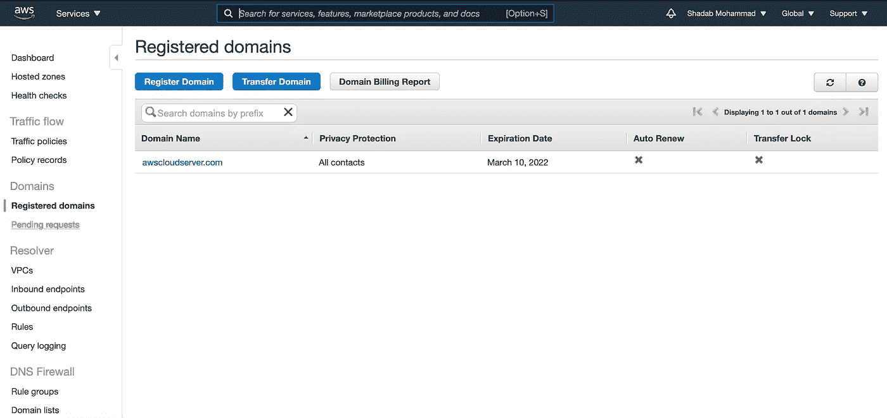

# 将您现有域的 DNS 管理从 Amazon Route 53 迁移到 Oracle 云基础架构

> 原文：<https://medium.com/oracledevs/migrate-your-existing-domains-dns-management-from-amazon-route-53-to-oracle-cloud-infrastructure-8788177d584a?source=collection_archive---------0----------------------->

在过去的几年里，我一直使用 Amazon Route53 作为我管理自定义域名的主要 DNS 服务。我使用那个自定义域运行我的大多数开发实例和 API 服务器，并使用 Route 53 管理 DNS。

去年，我得到了我的 [OCI 永久免费](https://www.oracle.com/au/cloud/free/)资源，并将我的大部分实例和数据库迁移到永久免费层，但我继续使用 AWS DNS 进行域名管理。我没有足够的勇气去碰它的 DNS 部分，破坏我的应用程序。虽然我运行的服务不是一个生产应用程序，但重新配置所有的 A 记录会很不方便。最重要的是，我一个月只能进行 10，000-12，000 次 DNS 查询，并向 AWS 支付 0.55 美元，这在 OCI 是免费的(前提是你保持在每月 100 万次查询的限制之下)。

所以我决定是时候把我的托管区域从 AWS Route 53 迁移到 OCI 公共 DNS 了。我认为这将是一个重大的任务，但它被证明是超级简单，只需要几个小时。该域名被频繁使用，并拥有我的 Oracle Apex 应用程序开发环境的虚拟 URL 但是短暂的停机并不是什么大问题。通过正确的 TTL 设置，切换可以是无缝的。

我正在记录我的旅程，以便让其他人更容易地将他们的 DNS 从 AWS Route53 迁移到 OCI。如果您在 OCI 上运行您的企业应用/数据库堆栈，那么最好从同一个地方管理您的 DNS，而不是另一个云提供商。

AWS Route53 to OCI DNS

**设置:**

*   要迁移的**域名:**[awscloudserver.com](http://awscloudserver.com)
*   **现有注册服务商&域名的 DNS 服务:**亚马逊网络服务路由 53
*   **新的 DNS 服务提供商:** Oracle 云基础设施

**开始前的一些要点:**

*   这不是域名注册的转让，而是域名的 Route 53 托管区域从 AWS 到 Oracle 的转让。该域仍在 AWS 上注册。即使你的域名是在 Crazydomains、GoDaddy 或其他域名提供商那里注册的，这个过程还是一样的。只要您可以更新那里的 NS 记录，您就可以将域名迁移到 OCI。
*   这是一个公共 DNS 的简单迁移，带有一些 A 记录作为 POC。但是对于生产域迁移，建议让您的网络团队参与进来。
*   在我的情况下，TTL(生存时间)设置已经很低，但如果你的 TTL 设置很高，请确保降低现有 DNS 服务提供商的 NS 记录上的 TTL 设置。也降低 OCI NS 唱片的 TTL 设置。记录的 TTL 设置确定您希望 DNS 解析程序缓存记录并保持使用缓存信息的时间。当 TTL 过期时，解析器将向特定域的 DNS 提供商发送另一个查询，以获取最新的名称解析。
*   自 2021 年 4 月 7 日起，OCI 不支持域名系统安全扩展( **DNSSEC** )。

**通过 6 个简单步骤将 DNS 迁移到 OCI 的工作流程**

DNS Migration Workflow

您可以按照以下步骤将 AWS Route 53 上的公共托管区域迁移到 OCI。这将适用于任何域名注册商，只要你的注册商允许你更新你的域名的 NS 服务器。

**第一步。在 AWS 中获取您的托管区域中所有记录的列表。**

53 号公路上的记录必须在 OCI 上重新创建/导入。AWS 允许您使用 AWS 命令行工具导出区域文件。

例:`aws route53 list-resource-record-sets --hosted-zone-id hosted-zone-id > path-to-output-file`

ref:[https://docs . AWS . Amazon . com/route 53/latest/developer guide/hosted-zones-migrating . html # hosted-zones-migrating-create-file](https://docs.aws.amazon.com/Route53/latest/DeveloperGuide/hosted-zones-migrating.html#hosted-zones-migrating-create-file)

由于我只有一些记录在我的托管区，我会手动将它们添加到 OCI。转到 AWS 控制台>托管区域>域名，获取记录列表。

**第二步。在 OCI 上创建一个区域名为“awscloudserver.com”的公共区域**

登录到您的 OCI 租赁，并从“DNS 管理”创建一个公共区域。您的用户应该拥有 DNS 所需的策略和权限。

这将为 DNS 创建 4 个 NS 记录和 1 个授权起始(SOA)记录。将 4 个 NS 记录复制到一个记事本文件中，因为我们稍后将使用它们来更改 AWS 中的 NS 服务器。

**第三步。更改 AWS 上的 NS 服务器**

转到 AWS 控制台>注册域>域名

添加或编辑名称服务器

将您之前在记事本中复制的 OCI NS 服务器添加到此处的名称服务器列表中，然后单击更新

ns2.p68.dns.oraclecloud.net
ns4.p68.dns.oraclecloud.net。
ns1.p68.dns.oraclecloud.net。
ns3.p68.dns.oraclecloud.net。

一旦您更新名称服务器的请求完成。完成后，您会收到一封电子邮件。

**第四步。** **将您的 53 号公路记录添加到 OCI 公共 DNS 区域记录中**

**要迁移的记录:**
记录名称记录类型值 TTL(秒)
oracleapex.awscloudserver.com A 168.138.109.140 30
ordsprimordial.awscloudserver.com A 140.238.196.118 300
ordssecondary.awscloudserver.com A 152.67.98.41 300

Add records to OCI Public Zone

*确保添加所有记录后发布更改*

**第五步。通过对该域的 NS 记录进行摘要，验证该域的 DNS 服务器是否已更改。**

**更新 Route53 域 NS 服务器前的 NS 记录**

$挖 oracleapex.awscloudserver.com

**将 Route53 域 NS 服务器更新到 OCI 后的 NS 记录**

$ dig[@ 8](http://twitter.com/8). 8 . 8 . 8+短 NS awscloudserver.com

*重要提示:根据您的域注册商的不同，NS 服务器的更新和传播可能需要几个小时到几天的时间。在 AWS 的情况下，它非常快，不超过几个小时。*

一旦域被解析为 Oracle DNS 服务器，您就可以从 Route 53 中删除托管区域。(确保在删除 AWS 托管区域之前删除所有记录)

**总结**

我可以轻松地将我的 DNS 服务从 AWS Route53 转移到 OCI 公共 DNS，而且非常无缝。与亚马逊 Route53 相比，OCI 更具成本效益，因为你不必为公共区域的每次托管付费。

**参考文献**

1.  甲骨文 DNS—[https://www.oracle.com/au/cloud/networking/dns/](https://www.oracle.com/au/cloud/networking/dns/)
2.  Oracle 云基础设施 DNS 定价—[https://www . Oracle . com/Cloud/networking/edge-services-Pricing . html](https://www.oracle.com/cloud/networking/edge-services-pricing.html)