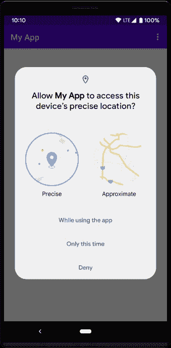
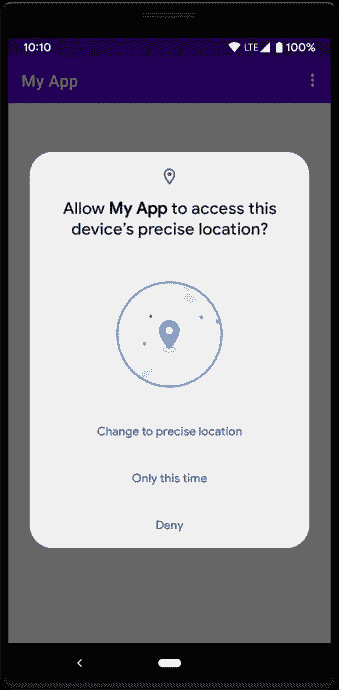
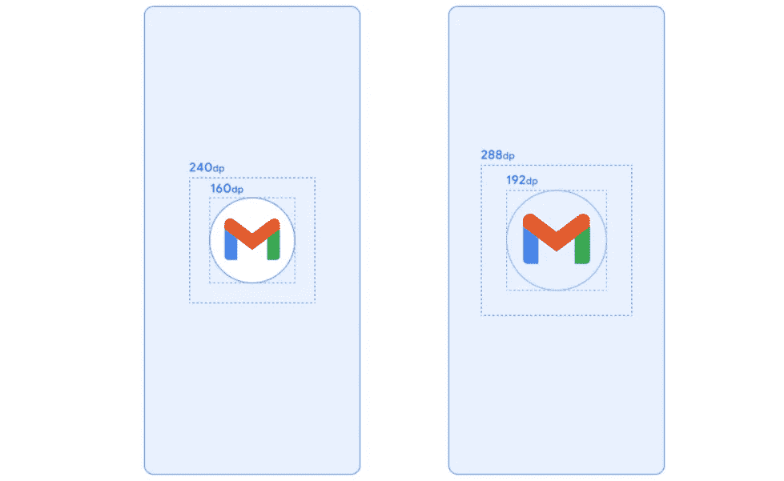

# 将 100 万用户应用迁移到 Android 12——挑战和解决方案

> 原文：<https://medium.com/walmartglobaltech/migrating-a-1m-users-app-to-android-12-challenges-solutions-cfc00b0e36b3?source=collection_archive---------0----------------------->


Image source: [https://en.wikipedia.org/wiki/Android_12#/media/File:Android_12_Developer_Preview_logo.svg](https://en.wikipedia.org/wiki/Android_12#/media/File:Android_12_Developer_Preview_logo.svg)

Android 12 于 2021 年 10 月 4 日推出，是 Android OS 的最新稳定版本。随着越来越多的人将手机升级到 Android 12 或购买支持 Android 12 的新手机，及时将 Android 应用迁移到 Android 12 是当务之急。

这个博客是一个全面的指南，使 Android 开发者能够升级他们的应用代码库，以支持 Android 12 设备。这篇博客将揭示 android 12 的新功能，将应用程序迁移到 android 12 的一步一步的过程，以及在将应用程序代码库升级到 android 12 时应对挑战。那么，我们开始吧。

**第一步:更新目标 SDK 版本，将 SDK 版本编译为 31**

```
compileSdkVersion 31
...
targetSdkVersion 31
```

**第二步:更安全的组件出口**

如果您尝试在完成步骤 1 后构建您的应用程序，您将遇到以下错误，
" *当相应的组件定义了意图过滤器时，针对 Android 12 及更高版本的应用程序需要为“android:exported”指定一个显式值。"*

这里开始你的 Android 12 的实际旅程:)
**规则 1** —如果你的应用程序针对 Android 12 或更高版本，并且包含使用意图过滤器的活动、服务或广播接收器，你**必须**为这些应用程序组件显式声明 **android:exported** 属性。

**规则 2** —如果 app 组件包含启动器类别，则设置 android:exported = "true "。在大多数情况下，将“android:exported”设置为 false。

简而言之，如果需要从我们的应用程序外部访问任何组件(通过操作系统或其他应用程序)，我们需要将 exported 设置为 true，否则需要将它们设置为 false(仅由我们的应用程序使用)。

```
<activity
    android:name=".app.main.view.LauncherActivity"
    android:configChanges="orientation|keyboardHidden|screenSize"
    android:label="@string/app_name"
    android:launchMode="singleTop"
    ...
    **android:exported="true"**>
    <intent-filter>
        <action android:name="android.intent.action.MAIN" />

        <category android:name="android.intent.category.LAUNCHER" />
    </intent-filter>
    ...</activity>
```

这是 Android 12 中引入的重大安全改进。
完成此步骤后，您应该能够在 Android 12 设备/仿真器上安装您的应用程序。

**步骤 3:待定意向可变性**

完成第 2 步后，您会看到您的应用程序成功安装，但是，它不会在 android 12 设备上启动。在 Android 12 设备上启动应用程序时，您可能会遇到以下崩溃，

```
Caused by: java.lang.IllegalArgumentException: <application id>: Targeting S+ (version 31 and above) requires that one of FLAG_IMMUTABLE or FLAG_MUTABLE be specified when creating a PendingIntent.
    Strongly consider using FLAG_IMMUTABLE, only use FLAG_MUTABLE if some functionality depends on the PendingIntent being mutable, e.g. if it needs to be used with inline replies or bubbles.
        at android.app.PendingIntent.checkFlags(PendingIntent.java:375)
        at android.app.PendingIntent.getActivityAsUser(PendingIntent.java:458)
        at android.app.PendingIntent.getActivity(PendingIntent.java:444)
        at android.app.PendingIntent.getActivity(PendingIntent.java:408)
...
```

以上意味着，如果你的应用以 Android 12 为目标，你必须指定你的应用创建的每个 PendingIntent 对象的可变性。这一要求也提高了你的应用程序的安全性。

```
var pendingIntent: PendingIntent
if (Build.VERSION.*SDK_INT* >= Build.VERSION_CODES.*S*) {
    pendingIntent = PendingIntent.getActivity(
        context, 0, intent,
        PendingIntent.*FLAG_UPDATE_CURRENT* or PendingIntent.*FLAG_IMMUTABLE* )
} else {
    pendingIntent = PendingIntent.getActivity(context, 0, intent, PendingIntent.*FLAG_UPDATE_CURRENT*)
}
```

建议使用 *FLAG_IMMUTABLE。*然而，这里指定的[的某些用例](https://developer.android.com/guide/components/intents-filters#CreateImmutablePendingIntents)可能需要你使用可变挂起意图，所以检查你的应用是否属于这些。完成这一步后，你应该可以看到你的应用在 Android 12 设备上成功启动了。

我想在这里分享的几个技巧如下，
**技巧 1:** 如果你的应用程序使用工作管理器(并且使用的版本不是最新的)，那么你仍然会遇到上面的崩溃。您应该使用最新版本的工作管理器(2.7.0 或更高版本),因为 2.7.0 已经修复了此崩溃。
请记住，最新版本的工作管理器(2.7.0 及以上)需要您在应用中使用最新版本的 Kotlin(1.6.0 或以上)。

**提示 2:** 您可能会从您的应用程序中使用的任何第三方库或 Android SDK 库中获得此崩溃。在这种情况下，请升级到具有崩溃修复程序的最新版本的库。

**第四步:精确报警许可**

为了鼓励应用程序节省系统资源，针对 Android 12 和更高版本并设置准确警报的应用程序必须能够访问“警报和提醒”功能。此功能出现在系统设置中的特殊应用程序访问屏幕上，要获得此访问权限，应用程序需要在清单中提及以下权限。

```
<uses-permission android:name="android.permission.SCHEDULE_EXACT_ALARM"/>
```

对于某些面向客户的功能，应该使用精确的警报。在此检查设置精确报警[的可接受用例。](https://developer.android.com/training/scheduling/alarms#exact-acceptable-use-cases)

**第五步:大概位置**

在针对 Android 12 的应用程序上，用户可以要求你的应用程序只检索大概的位置信息，即使你的应用程序请求 ACCESS_FINE_LOCATION 权限。

为了处理这种潜在的用户行为，不要单独请求 ACCESS_FINE_LOCATION 权限。相反，请在一个运行时请求中同时请求 ACCESS_FINE_LOCATION 权限和 ACCESS_COARSE_LOCATION 权限。

当您的应用程序请求 ACCESS_FINE_LOCATION 和 ACCESS_COARSE_LOCATION 时,“系统权限”对话框为用户提供了以下选项:

*   **精确**:这可以让你的 app 获得精确的位置信息。
*   **近似**:这让你的应用程序只能获得大概的位置信息。



System permissions dialog that appears when your app requests both `ACCESS_FINE_LOCATION` and `ACCESS_COARSE_LOCATION` in a single runtime request. Image source: [https://developer.android.com/](https://developer.android.com/)



Changing permission from approximate to precise. Image source: [https://developer.android.com/](https://developer.android.com/)

**第六步:前台服务启动限制**

针对 Android 12 或更高版本的应用程序不允许在后台运行时启动前台服务，除非出现少数例外情况。如果你的应用程序试图在后台运行时启动前台服务，就会出现异常(少数情况除外)。

考虑使用工作管理器来安排和开始工作，同时您的应用程序在后台运行。

**步骤 7:不安全意图启动**

在瞄准 Android 12 的同时，我们需要确保不使用不安全的意图启动。

这里需要遵循一些提示如下:

**提示 1 :** 检查是否过度使用 putExtras(Intent)或 putExtras(Bundle)调用。此外，要注意太大的包。可能的缓冲存储上限[只有 1MB](https://developer.android.com/reference/android/os/TransactionTooLargeException.html) 。

不要试图将整个位图传递给某个意图。在这种情况下，您将遇到 TransactionTooLargeException。

**提示 2 :** 在触发内部意图启动时，确保各个组件的“导出”标志设置为假。

技巧 3 : 避免使用嵌套意图。这意味着我们应该理解将一个意图作为额外的意图传递给另一个意图，另一方面，这调用 startActivity()。使用 PendingIntents，而不要使用嵌套的 intents。

要检查应用程序中的不安全启动，请在应用程序类的 onCreate()中配置 VmPolicy 时调用 detectUnsafeIntentLaunch()。

```
StrictMode.VmPolicy.Builder vmPolicyBuilder =
    **new** StrictMode.VmPolicy.Builder()
...
**if** (Build.VERSION.SDK_INT >= Build.VERSION_CODES.S) {
  vmPolicyBuilder.detectUnsafeIntentLaunch();
}
StrictMode.setVmPolicy(vmPolicyBuilder.build());
```

这段代码将列出控制台上所有不安全的启动。

**步骤 8: web 意向解析**
从 Android 12 (API 级别 31)开始，只有当您的应用程序被批准用于 Web 意向中包含的特定域时，Web 意向才会解析为您应用程序中的活动。如果您的应用程序未获得该域的批准，它将解析为用户的默认浏览器应用程序。

应用程序可以通过使用 Android 应用程序链接验证域来获得此批准。如果您的应用程序支持深层链接，那么要将它们转换为应用程序链接，并使您的应用程序成为所有 URL 的默认处理程序，请执行以下步骤:

1-在意图过滤器中添加“自动验证”属性

```
<intent-filter **android:autoVerify="true**">
    <action android:name="android.intent.action.VIEW" />

    <category android:name="android.intent.category.DEFAULT" />
    <category android:name="android.intent.category.BROWSABLE" />

    <data android:scheme="https" />
    <data android:scheme="http" /> *<!-- If your website is www.example.com, then host will be example.com-->* <data android:host="your site host name" />

    <data android:path="/" />

    <data android:pathPrefix="/product/" />
    ...
</intent-filter>
```

2-将您的 android 应用程序与您的网站相关联:创建一个数字资产链接文件，如这里展示的并上传到您的网站，每个人都可以在 https:// < yoursite > /上阅读。知名/assetlinks.json。

完成以上步骤后，每当用户点击一个 Android 应用程序链接时，如果你的应用程序安装在设备上，它会立即打开，不会出现歧义消除对话框。

**第九步:新安卓系统闪屏**

从 Android 12 开始，系统总是在所有应用的冷启动和热启动时应用新的默认闪屏。默认情况下，这个系统默认闪屏是使用你的应用程序的启动器图标元素和你的主题的窗口背景(如果它是单色的)构建的。



Splash screen Android 12(App icon dimensions highlighted). Image source: [https://developer.android.com/guide/topics/ui/splash-screen](https://developer.android.com/guide/topics/ui/splash-screen)

系统闪屏由您的应用程序图标组成，图标位于中心，图标背景位于具有窗口背景颜色的窗口内。

将在另一篇博客中讨论迁移闪屏。

**结论**

完成我们的 android 应用到 Android 12 的迁移，并在生产中发布，这是一次激动人心的学习经历。我们了解了引入的功能和 API，并在应用程序的各个领域利用了它们。通过这一举措，我们已经能够为我们的 Android 12 设备用户提供安全、个性化和轻松的体验。

在这篇博文的最后，我鼓励读者开始将他们的应用程序升级到 android 12，并记住 Google Play 的最后期限，这里是。

**参考文献**

1.  [https://developer.android.com/about/versions/12](https://developer.android.com/about/versions/12)
2.  [https://www.android.com/android-12/](https://www.android.com/android-12/)