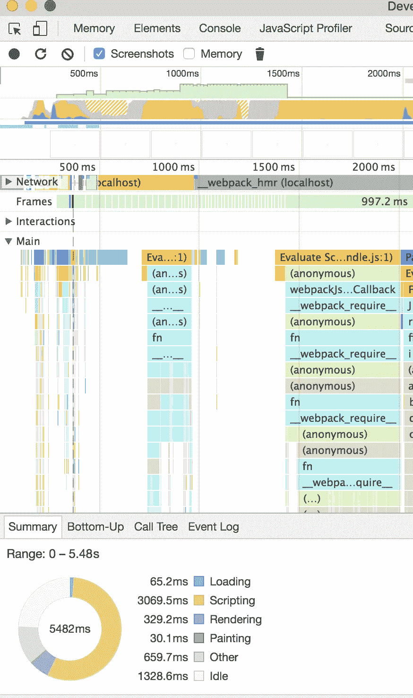

# 迁移 Angular 1.x 应用程序以做出反应——混合方式！

> 原文：<https://medium.com/walmartglobaltech/migrating-angular-1-x-apps-to-react-the-hybrid-way-3267ccf33755?source=collection_archive---------1----------------------->

在这个前端空间飞速发展的时代，当你完成研发、选择框架、构建应用并发布到生产环境时，它已经过时了，这很常见！与此同时，必须用全新的、明亮的和闪亮的概念验证来构建概念验证，看看它在您的用例中是否有意义或表现得更好。

对于那些正在寻找将大型生产 Angular 应用程序迁移到 React 的策略，但由于将指令重新写入 React 组件的痛苦和耗时过程而无法继续前进的人来说，这篇文章非常有用。在这篇文章中，我将讨论一种混合方法，这种方法可以用来用 React 组件迭代地构建新特性，并在您现有的 Angular 应用程序或未来的 React 应用程序中使用它们。其思想是构造独立的 React 组件，并通过局部而不是全局使用`ReactDOM.render`函数进行渲染。我采用这种方法将我们的 web 应用生态系统的前端从 Angular 1.x 逐步迁移到 React。我还将讨论它背后的动机，Chrome JS profiler 计算性能增益的实验，以及我为什么选择 react。

给大家介绍一下我自己的背景，我是电子商务部门的首席全栈工程师。我们是一个由 3-5 名全栈工程师组成的小团队，构建并支持主要基于 Node/Express/Angular 1.x 栈构建的 web 应用生态系统。我们使用 Webpack 2 作为我们的任务运行器，用 ES6 编写的代码通过 Babel 传输到 ES5。客户端是一个与节点层对话的 angular SPA。节点层通过 REST APIs 与 Couchbase DB 和其他后端系统集成，JSON 是数据交换格式。我们有大约 25 个前端可重复使用的角度自定义指令，在 3 个 web 应用程序之间共享。

现在，让我们来谈谈这种方法，它本质上使用了现有的 ng 控制器，并在其中嵌入了 react 视图。

# 混合动力的游戏

这种方法的先决条件是您使用的角度路由器具有解耦的控制器和依赖关系。

它独立于 ES6，可以用 ES5 语法编写。

目标是在不同的路由调用上独立地呈现 react 或 angular 视图。如果是一个 react 视图，它应该能够利用在`$rootScope`中定义的角度`$scope`变量或属性，并且应该能够调用在`$scope`中定义的事件处理程序

下面是我的示例角度控制器，它呈现了一个反应视图

这里，控制器函数`myController`实例化某些构造函数变量和函数，调用在`myAngularServiceforAjaxCalls`中定义的`getResults`函数。在成功回调中，`$scope`由服务响应填充。

当我们移到第 37 行时，我的自定义`render`函数调用`ReactDOM.render`函数，这意味着我们现在在 react 上下文中，可以使用自定义 react 组件。快速调用——你需要用一个定制的渲染函数封装`ReactDOM.render`,这样你只需在承诺完成后渲染你的 react 视图。

这里要注意的另一件事是我将`changePage`附加到`$scope.`上，这是因为我想停留在有角度的`$scope`上下文中。这也可以直接附加到您的函数上下文 aka `this`中。

我的纯 react 组件、`WMPageHeader`、`WMBreadcrumb`和`WMGrid`被添加为控制器依赖项，因此它们可以在视图中调用，props 可以用控制器范围的变量和对象填充。

下面是我的 react 组件的一个例子。正如您在这里看到的，没有任何角度依赖性，这意味着这些组件是 100% react 的，可以与任何其他 react 应用程序重用。这是这种方法的另一个优点。

现在，让我们来看看我们需要在主应用程序视图中进行的更改。在我的`index.hbs`中，我简单地为我的 react 视图添加了一个 id attr `render-container`。`data-ui-view`角度视图保持不变。

这就是了。我们都完了！现在，我可以反复进行重写工作，只转换我的新特征/视图中需要的那些角度指令。一旦我实现了 100%的转换，我就可以简单地抛弃我旧的角度指令，继续用 react 构建我的应用程序！

# 动机

当涉及到嵌套的作用域和观察器时，Angular 1.x 在性能方面臭名昭著，这不是一个隐藏的事实。当您在开源指令的基础上构建定制指令时，这个问题变得更加突出。想象一下，这些指令组成了一个包含多个 Ajax 请求的视图。

也就是说，如果我没有发现 React 的好处，角度性能对我来说是很正常的。

# 性能增益

作为一个实验，我决定采用应用程序最复杂的视图，并用 React 重新创建它。

以下是 Chrome JS Profiler 的观点:

Chrome JS Profiler results with Angular

Chrome JS Profiler results with React

正如你在上面看到的，脚本减少了 35.5%，渲染减少了 62.5%，绘画减少了 39%，视图渲染总共减少了 1.5 秒！

# 我为什么选择 React？

有明显的技术原因来尝试 React。它使得 DOM 节点的渲染/重新渲染快如闪电。更不用说它革命性的虚拟 DOM 概念和只在需要时通过树差异机制更新真实 DOM。

此外，电极是基于 React 和哈比神构建的本土网络应用平台，最好有电极就绪的 React 组件，以便将来用它编写任何网络应用。

推特:@ ankuronweb