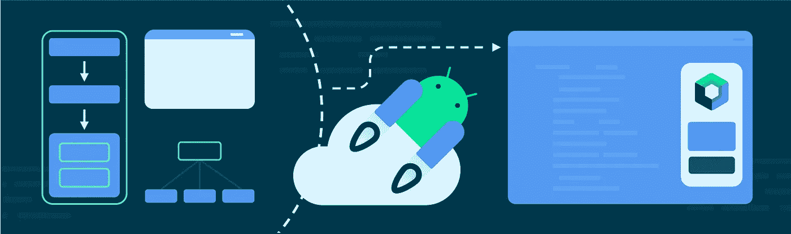
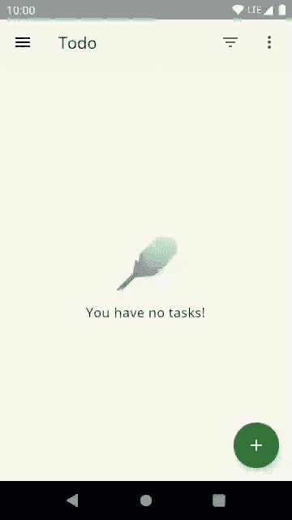
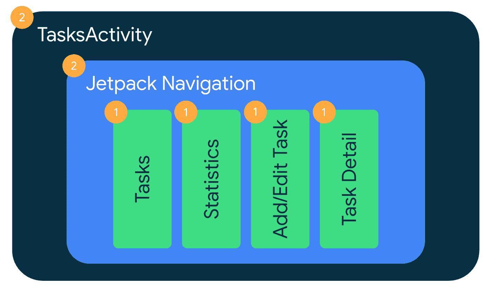

# 将架构蓝图迁移到 Jetpack Compose

> 原文：<https://medium.com/androiddevelopers/migrating-architecture-blueprints-to-jetpack-compose-8ffa6615ede3?source=collection_archive---------1----------------------->

作为我们更新[应用架构指南](http://goo.gle/mad-architecture-guide)工作的一部分，我们希望尝试不同的用户界面模式，看看什么最有效，找出备选方案之间的相似性和差异，并最终将这些经验作为最佳实践。

为了使我们的发现尽可能容易理解，我们需要一个有熟悉的商业案例并且不太复杂的样本。还有…谁不知道 *TODO* 应用？我们选择了[建筑蓝图](https://github.com/android/architecture-samples)！历史上，蓝图是建筑选择的实验场。这也非常适合！

*Architecture Blueprints app in action*

我们想要试验的模式显然受到当今可用的不同 API 的影响。镇上的新成员是 Jetpack Compose 的 State API！由于 Compose 可以无缝地与任何 [*单向数据流*模式](https://developer.android.com/jetpack/guide/ui-layer#udf)一起工作，我们将使用 Compose 来呈现 UI 以进行公平的比较。

**这篇博文讲述了团队如何将架构蓝图移植到 Jetpack Compose** 的故事。由于在我们的实验中, [LiveData](https://developer.android.com/topic/libraries/architecture/livedata) 也被认为是一种替代方案，我们保留了迁移时的样本。**在这次重构中，视图模型类和数据层保持不变。**

⚠️:这个基于 LiveData 的代码库中使用的架构没有完全遵循[最新架构最佳实践](http://goo.gle/mad-architecture-guide)。特别是，LiveData **不应该在[数据](https://developer.android.com/jetpack/guide/data-layer)或[域](https://developer.android.com/jetpack/guide/domain-layer)层中使用**，而应该使用流和协程。

现在上下文已经清楚了，让我们深入了解一下我们是如何处理 Jetpack Compose 的重构蓝图的。你可以在 [dev-compose 分支](https://github.com/android/architecture-samples/tree/dev-compose)上查看完整的代码。

# ✍️计划逐步迁移

在进行任何*实际的*编码工作之前，团队创建了一个迁移计划，以确保每个人都同意所提议的变更。最终目标是将 Blueprints 作为单活动应用程序，将屏幕作为可组合功能，并使用推荐的[组合导航](https://developer.android.com/jetpack/compose/navigation)库在屏幕之间移动。

幸运的是，Blueprints 已经是一个单活动应用程序，它使用 [Jetpack 导航](https://developer.android.com/guide/navigation)在用片段实现的不同屏幕之间移动。为了迁移到组合，我们遵循导航[互操作性指南](https://developer.android.com/jetpack/compose/navigation#interoperability)，该指南建议混合应用程序使用基于片段的导航组件，并使用片段来保存基于视图的屏幕、组合屏幕以及同时使用视图和组合的屏幕。不幸的是，不可能在同一个导航图中混合片段和组合目的地。

渐进迁移的目标是简化代码审查，并在整个迁移过程中维护一个可发布的产品。迁移计划包括三个步骤:

1.  迁移每个屏幕的*内容*进行合成。每个屏幕都可以单独迁移到 Compose，包括它们的 UI 测试。然后片段成为每个迁移屏幕的容器/主机。
2.  将应用程序迁移到 Navigation Compose——从项目中移除所有片段——并将活动 UI 逻辑迁移到根组件。端到端测试也在此时被迁移。
3.  移除视图系统依赖项。

这就是我们所做的！🧑‍💻快进⏩两周时间，我们迁移了*统计*屏幕( [PR](https://github.com/android/architecture-samples/pull/821) )、*添加/编辑任务*屏幕( [PR](https://github.com/android/architecture-samples/pull/823) )、*任务明细*屏幕( [PR](https://github.com/android/architecture-samples/pull/822) )，以及*任务*屏幕([PR](https://github.com/android/architecture-samples/pull/826))；并且我们合并了[最终的 PR](https://github.com/android/architecture-samples/pull/827) ，它迁移了导航和活动逻辑来组合，包括[移除未使用的视图系统依赖](https://github.com/android/architecture-samples/pull/827/commits/2810a37c479ef4b23b4cabf095c55df7b342235e)。

How we gradually migrated Blueprints to Compose

# 💡迁移亮点

在迁移过程中，我们遇到了一些值得强调的特定于 Compose 的问题:

## 🧪 UI 测试

一旦你开始向你的应用添加 Compose，断言 Compose UI 的测试需要使用 [Compose 测试 API](https://developer.android.com/jetpack/compose/testing)。

**对于屏幕级 UI 测试**，我们没有使用`[launchFragmentInContainer<FragmentType>](https://developer.android.com/guide/fragments/test#create)` API，而是使用了`[createAndroidComposeRule<ComponentActivity>](http://createandroidcomposerule)` API，它允许我们在测试中获取字符串资源。**这些测试在 Espresso 和 Robolectric** 中运行。因为 Compose 已经支持所有这些，所以不需要额外的修改。例如，您可以比较迁移到`[AddEditTaskScreenTest](https://github.com/manuelvicnt/architecture-samples/blob/8a203594541b25e5eec2daac63415c05884242ad/app/src/sharedTest/java/com/example/android/architecture/blueprints/todoapp/addedittask/AddEditTaskScreenTest.kt)`的`[AddEditTaskFragmentTest](https://github.com/android/architecture-samples/blob/653a563e9fe0874b4ae3fba539ce4b6518a2f796/app/src/sharedTest/java/com/example/android/architecture/blueprints/todoapp/addedittask/AddEditTaskFragmentTest.kt)`中的代码。注意，如果使用`ComponentActivity`，需要依赖`[androidx.compose.ui:ui-test-manifest](https://developer.android.com/jetpack/compose/testing#setup)`神器。

**对于端到端或者集成测试**，我们也没有发现任何问题！感谢 **Espresso 和 Compose 互操作性**，我们使用 Espresso 断言来检查视图，使用 Compose APIs 来检查 Compose UI。下面是`[AppNavigationTest](https://github.com/manuelvicnt/architecture-samples/blob/249a636ea9a3f16aab5c284e3245069ef56a557f/app/src/androidTestMock/java/com/example/android/architecture/blueprints/todoapp/tasks/AppNavigationTest.kt)`在迁移过程中如何看待一个点来进行编写。

## 🤙视图模型事件

蓝图中处理[视图模型事件](https://developer.android.com/jetpack/guide/ui-layer/events#handle-viewmodel-events)的方式确实有问题。Blueprints 实现了一个[事件包装器](https://github.com/android/architecture-samples/blob/8e1e0527a0d043b41da58925a39fb8e03d62829a/app/src/main/java/com/example/android/architecture/blueprints/todoapp/Event.kt)解决方案，将*命令*从 ViewModel 发送到 UI。然而，这在 Compose 中并不适用。我们最近的指南[建议](https://developer.android.com/jetpack/guide/ui-layer/events#handle-viewmodel-events)将那些“事件”建模为状态，这就是我们在迁移期间所做的。

查看*在屏幕上显示消息*事件用例，我们将 LiveData 的`Event<Int>`类型替换为`Int?`。这也模拟了没有消息显示给用户的场景。在这个特定的用例中，每当显示消息时，ViewModel 还需要来自 UI 的确认。在下面的代码中可以看到这两种实现之间的区别:

尽管乍一看这似乎需要更多的工作，但是**保证了**消息显示在屏幕上！

在 UI 代码中，确保事件只被处理一次的方法是调用`event.getContentIfNotHandled()`。这种方法在片段中工作*还好*但是在编写自然组合代码的时候**它完全中断了组合**！因为在撰写过程中随时都可能发生重新撰写，所以事件包装不是有效的解决方案。如果事件被处理并且函数被重组(在测试这种方法时经常发生)，那么 snackbar 将被取消，用户可能会错过消息。这是一个不可接受的 UX 问题！**事件包装解决方案不应用于撰写应用程序。**

请注意，您可以编写代码来避免在某些情况下重新编写部分函数，但是，事件包装解决方案限制了在这种情况下必须如何实现 UI。**不鼓励在 Compose 中使用事件包装解决方案**。

参见下面的代码片段，在(事件包装器)之前是*，在*(作为状态的事件)之后是*。因为在屏幕上显示消息是 [UI 逻辑](https://developer.android.com/jetpack/guide/ui-layer#logic-types)并且我们的屏幕组件变得越来越复杂，我们使用了[普通状态容器类](https://developer.android.com/jetpack/compose/state#types-of-state-and-logic)来管理这种复杂性(例如参见`[AddEditTaskState](https://github.com/manuelvicnt/architecture-samples/blob/88cf650fd1759486cce198878b5cf08e823012dc/app/src/main/java/com/example/android/architecture/blueprints/todoapp/addedittask/AddEditTaskState.kt)`)。*

## 👌如有疑问，请选择应用程序正确性

在重构时，迁移手头的所有东西来进行组合可能很有诱惑力。虽然这完全没问题，但你不应该牺牲应用程序的用户体验或正确性。进行渐进式迁移的全部意义在于，应用程序始终处于可交付状态。

我们在迁移一些屏幕进行合成时就遇到了这种情况。我们不想同时进行太多的迁移，在从事件包装器迁移之前，我们迁移了一些屏幕来组合*。我们没有在 Compose 中处理事件包装器并提供次优体验，而是在片段中处理这些消息，而屏幕的其余代码在 Compose 中处理。例如，参见迁移期间`[TasksFragment](https://github.com/manuelvicnt/architecture-samples/blob/249a636ea9a3f16aab5c284e3245069ef56a557f/app/src/main/java/com/example/android/architecture/blueprints/todoapp/tasks/TasksFragment.kt)` [的状态。](https://github.com/manuelvicnt/architecture-samples/blob/249a636ea9a3f16aab5c284e3245069ef56a557f/app/src/main/java/com/example/android/architecture/blueprints/todoapp/tasks/TasksFragment.kt)*

# 🧐挑战

并非一切都像看上去的那样顺利。🫤尽管将片段内容转换成组合很简单，但是从导航片段迁移到导航组合需要更多的时间和考虑。

有必要扩展和改进不同方面的指南，以便将来更容易迁移到 Compose。这项工作引发了对话，我们希望很快有新的指导！🎊

作为导航初学者✋和处理导航合成迁移的人，我面临以下挑战:

*   文档中没有代码显示如何用可选参数导航**！感谢 [Tivi 的导航图](https://github.com/chrisbanes/tivi/blob/main/app/src/main/java/app/tivi/AppNavigation.kt)，我找到了我的方法并解决了问题(在此跟随问题改进文档[)。](https://issuetracker.google.com/226103829)**
*   **从基于 XML 的导航图和 SafeArgs 迁移到 Kotlin DSL** 应该是一项简单、机械的任务。然而，考虑到我没有参与最初的实现，对我来说*并不那么容易。一些关于如何正确做这件事的指导会对我有所帮助(关注这个问题以改进文档[这里](https://issuetracker.google.com/226315955))。*
*   这不仅是一个挑战，这一点是一个陷阱！ [**导航 UI**](https://developer.android.com/guide/navigation/navigation-ui) **在导航方面已经为你做了一些工作**。因为这在 Compose 中不可用，所以您需要密切关注并手动完成。例如，当在抽屉的屏幕之间导航时，保持背面清洁需要特殊的`NavigationOptions`(参见此处的示例)。这是[已经包含在文档](https://developer.android.com/jetpack/compose/navigation#bottom-nav)中，但是你需要意识到你需要它！

# 🧑‍🏫结论

总的来说，从导航片段迁移到导航组合是一项有趣的任务！有趣的是，我们花了更多的时间等待同行评审，而不是迁移项目本身！创建迁移计划并让每个人都在同一页面上肯定有助于尽早设定期望，并提醒同行注意冗长的即将到来的评审。

我们希望您喜欢阅读我们迁移到 Compose 的方法，我们期待着分享更多关于我们将在架构蓝图中进行的实验和改进。

如果您有兴趣查看包含合成代码的蓝图，可以看看[开发-合成分支](https://github.com/android/architecture-samples/tree/dev-compose)。如果您想了解逐步迁移的 PRs，以下是列表:

*   *统计*画面([公关](https://github.com/android/architecture-samples/pull/821))、
*   *添加/编辑任务*屏幕( [PR](https://github.com/android/architecture-samples/pull/823) )，
*   *任务详情*屏幕( [PR](https://github.com/android/architecture-samples/pull/822) )，
*   *任务*屏幕( [PR](https://github.com/android/architecture-samples/pull/826) )，以及
*   [最终 PR](https://github.com/android/architecture-samples/pull/827) 迁移导航和活动逻辑进行组合，包括[移除未使用的视图系统依赖](https://github.com/android/architecture-samples/pull/827/commits/2810a37c479ef4b23b4cabf095c55df7b342235e)。

# 👋