# 从 LiveData 迁移到 Kotlin 流

> 原文：<https://medium.com/androiddevelopers/migrating-from-livedata-to-kotlins-flow-379292f419fb?source=collection_archive---------0----------------------->


**LiveData** 是我们在 2017 年就需要的东西。观察者模式让我们的生活变得更容易，但是像 RxJava 这样的选项在当时对于初学者来说太复杂了。架构组件团队创建了 **LiveData** :一个非常固执己见的可观察数据持有者类，为 Android 设计。它保持简单，以便于入门，建议将 RxJava 用于更复杂的反应流情况，利用两者之间的集成。

# DeadData？

LiveData 仍然是我们针对 Java 开发人员、初学者和简单情况的**解决方案**。对于其余的，一个好的选择是转移到**科特林流**。心流仍然有一个陡峭的学习曲线，但它们是由 Jetbrains 支持的 Kotlin 语言的一部分；Compose 即将到来，它非常适合反应式模型。

我们已经[讨论过使用](/androiddevelopers/lessons-learnt-using-coroutines-flow-4a6b285c0d06)流来连接除视图和视图模型之外的应用程序的不同部分。现在我们有了一种更安全的方法从 Android UIs 收集流，我们可以创建一个完整的迁移指南。

在这篇文章中，您将学习如何向视图展示流，如何收集它们，以及如何对其进行微调以满足特定的需求。

# 心流:简单的事情更难，复杂的事情更容易

LiveData 做了一件事，而且做得很好:它[公开数据，同时缓存最新值](/androiddevelopers/livedata-with-coroutines-and-flow-part-i-reactive-uis-b20f676d25d7)并了解 Android 的生命周期。后来我们了解到它也可以[启动协程](/androiddevelopers/livedata-with-coroutines-and-flow-part-ii-launching-coroutines-with-architecture-components-337909f37ae7)和[创建复杂的转换](/androiddevelopers/livedata-beyond-the-viewmodel-reactive-patterns-using-transformations-and-mediatorlivedata-fda520ba00b7#:~:text=The%20observable%20paradigm%20works%20really,take%20advantage%20of%20lifecycle%20awareness.&text=Observe%20changes%20in%20SharedPreferences,document%20or%20collection%20in%20Firestore)，但是这有点复杂。

让我们看看一些 LiveData 模式及其流等价物:

## #1:用可变数据容器暴露一次性操作的结果

这是一个经典的模式，您通过协程的结果改变了一个状态保持器:

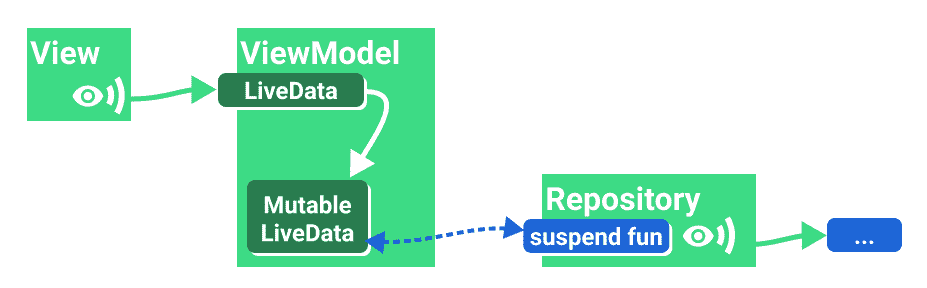

Expose the result of a one-shot operation with a Mutable data holder (LiveData)

为了对流做同样的事情，我们使用(可变的)StateFlow:

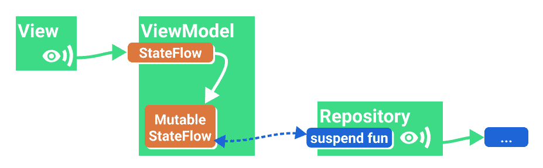

Expose the result of a one-shot operation with a Mutable data holder (StateFlow)

[**StateFlow**](https://developer.android.com/kotlin/flow/stateflow-and-sharedflow#stateflow) 是一种特殊的 [**SharedFlow**](https://developer.android.com/kotlin/flow/stateflow-and-sharedflow#sharedflow) (是一种特殊类型的流)，最接近 LiveData:

*   它总是有价值的。
*   它只有一个值。
*   它支持多个观察者(因此流是*共享的*)。
*   它总是重放订阅的最新值，与活动观察者的数量无关。

> 当向视图显示 UI 状态时，使用 **StateFlow** 。它是一个安全高效的观察器，用于保持 UI 状态。

## #2:暴露一次性操作的结果

这相当于前面的代码片段，公开了没有可变支持属性的协程调用的结果。

对于 LiveData，我们使用了`[liveData](https://developer.android.com/topic/libraries/architecture/coroutines#livedata)`协程构建器:

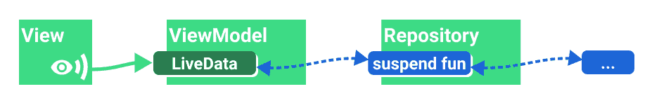

Expose the result of a one-shot operation (LiveData)

因为状态持有者总是有一个值，所以将我们的 UI 状态包装在某种支持诸如`Loading`、`Success`和`Error`等状态的**结果**类中是一个好主意。

流量当量有点复杂，因为您必须做一些*配置*:

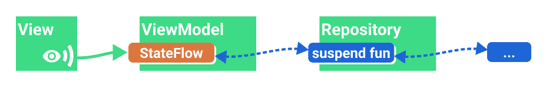

Expose the result of a one-shot operation (StateFlow)

`**stateIn**`是一个流操作符，它将一个流转换成**状态流**。现在让我们相信这些参数，因为我们需要更多的复杂性来解释它。

## #3:带参数的一次性数据加载

假设您想要加载一些依赖于用户 ID 的数据，并且您从一个公开流的`AuthManager`中获得该信息:

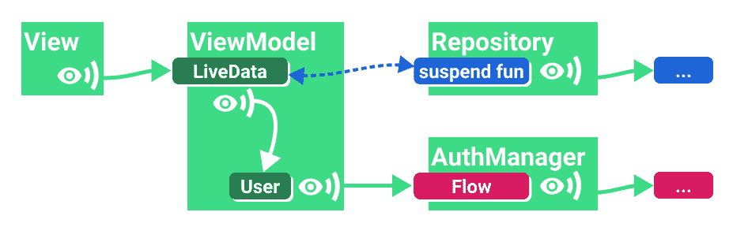

One-shot data load with parameters (LiveData)

使用 LiveData，您可以做类似的事情:

`switchMap`是一个转换，当`userId`改变时，其主体被执行，结果被订阅。

如果没有理由让`userId`成为 LiveData，一个更好的替代方法是将 streams 和 Flow 结合起来，最后将公开的结果转换成 LiveData。

对流执行此操作看起来非常相似:

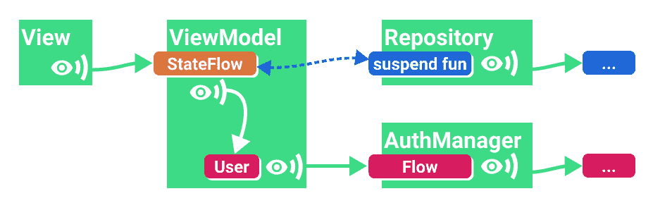

One-shot data load with parameters (StateFlow)

请注意，如果您需要更多的灵活性，您也可以显式使用`transformLatest`和`emit`项:

## #4:观察带参数的数据流

现在让我们让这个例子更具反应性。数据没有被获取，但是**观察到了**，所以我们将数据源中的变化自动传播到 UI。

继续我们的例子:我们没有在数据源上调用`fetchItem`,而是使用一个假设的返回流的`observeItem`操作符。

使用 LiveData，您可以将流转换为 LiveData 和`emitSource`所有更新:

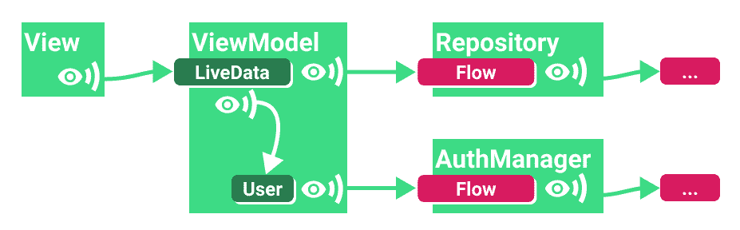

Observing a stream with parameters (LiveData)

或者，最好使用`[flatMapLatest](https://kotlin.github.io/kotlinx.coroutines/kotlinx-coroutines-core/kotlinx.coroutines.flow/flat-map-latest.html)`合并两个流，并且只将输出转换为 LiveData:

流实现类似，但它没有 LiveData 转换:

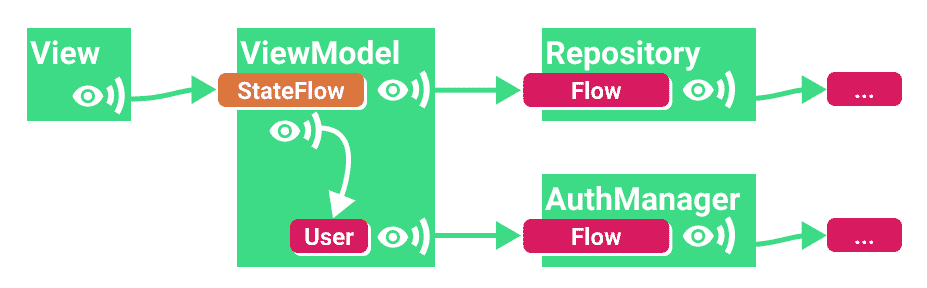

Observing a stream with parameters (StateFlow)

每当用户发生变化或者存储库中的用户数据发生变化时，公开的 StateFlow 都会收到更新。

## #5 组合多个来源:MediatorLiveData -> Flow.combine

MediatorLiveData 允许您观察一个或多个更新源(LiveData observables ),并在它们获得新数据时采取措施。通常，您会更新 MediatorLiveData 的值:

流量当量要简单得多:

您也可以使用[组合转换](https://kotlin.github.io/kotlinx.coroutines/kotlinx-coroutines-core/kotlinx.coroutines.flow/combine-transform.html)功能，或[压缩](https://kotlin.github.io/kotlinx.coroutines/kotlinx-coroutines-core/kotlinx.coroutines.flow/zip.html)。

# 配置公开的状态流(stateIn 操作符)

我们之前使用了`stateIn`将常规流转换为状态流，但是这需要一些配置。如果你现在不想深入细节，只需要复制粘贴，我推荐以下组合:

然而，如果你不确定那个看似随机的 5 秒`started` 参数，请继续阅读。

`stateIn`有 3 个参数(来自文档):

```
@param **scope** the coroutine scope in which sharing is started.@param **started** the strategy that controls when sharing is started and stopped.@param **initialValue** the initial value of the state flow.This value is also used when the state flow is reset using the [SharingStarted.WhileSubscribed] strategy with the `replayExpirationMillis` parameter.
```

`started`可以取 3 个值:

*   `Lazily`:第一个用户出现时开始，取消`scope`时停止。
*   `Eagerly`:立即启动，取消`scope`时停止
*   `WhileSubscribed`:**很复杂。**

对于单次操作，您可以使用`Lazily`或`Eagerly`。然而，如果你在观察其他的流，你应该使用`WhileSubscribed`来做一些小但重要的优化，如下所述。

# while 订阅策略

当没有收集器时，WhileSubscribed 取消 ***上游流*** 。使用`stateIn`创建的 StateFlow 向视图公开数据，但它也观察来自其他层或应用程序(上游)的流。让这些流保持活动状态可能会导致资源浪费，例如，如果它们继续从数据库连接、硬件传感器等其他来源读取数据。**当你的 app 去后台的时候，你要做一个好公民，阻止这些协程。**

`WhileSubscribed`需要两个参数:

```
public fun WhileSubscribed(
    stopTimeoutMillis: Long = 0,
    replayExpirationMillis: Long = Long.MAX_VALUE
)
```

## 停止超时

从其文档来看:

> `***stopTimeoutMillis***` *配置最后一个用户消失和上游流量停止之间的延迟(毫秒)。默认为零(立即停止)。*

这很有用，因为如果视图停止监听几分之一秒，您就不想取消上游流。这种情况时有发生，例如，当用户旋转设备时，视图会被快速连续地破坏和重新创建。

`liveData`协程构建器中的解决方案是[添加一个 5 秒的延迟](https://cs.android.com/androidx/platform/frameworks/support/+/androidx-main:lifecycle/lifecycle-livedata-ktx/src/main/java/androidx/lifecycle/CoroutineLiveData.kt;l=356),在此之后，如果没有用户出现，协程将被停止。`WhileSubscribed(5000)`确实如此:

这种方法检查所有的框:

*   当用户将你的应用程序发送到后台时，来自其他层的更新将在五秒钟后停止，以节省电池。
*   最新的值仍将被缓存，这样当用户返回时，视图将立即拥有一些数据。
*   订阅将重新启动，新值将进入，可用时刷新屏幕。

## 重播过期

如果你不希望用户在离开太久的时候看到陈旧的数据，并且你更喜欢显示一个加载屏幕，检查一下`WhileSubscribed`中的`replayExpirationMillis`参数。这在这种情况下非常方便，而且还节省了一些内存，因为缓存的值被恢复到了在`stateIn`中定义的初始值。回到应用程序不会很快，但你不会显示旧数据。

> `***replayExpirationMillis***` *—配置共享协程停止和重放缓存重置之间的延迟(以毫秒为单位)(这将使* `*shareIn*` *操作符的缓存为空，并将* `*stateIn*` *操作符的缓存值重置为原来的* `*initialValue*`】)。默认为 `*Long.MAX_VALUE*` *(永远保留重播缓存，从不重置缓冲)。使用零值将使缓存立即过期。*

# 从视图观察状态流

正如我们到目前为止所看到的，视图让视图模型中的状态流知道它们不再监听是非常重要的。然而，就像所有与生命周期相关的事情一样，事情并没有那么简单。

为了收集流，您需要一个协程。活动和片段提供了一堆协程构建器:

*   `**Activity.lifecycleScope.launch**`:立即启动协程，并在活动被销毁时取消它。
*   `**Fragment.lifecycleScope.launch**`:立即启动协程，当片段被销毁时取消。
*   `**Fragment.viewLifecycleOwner.lifecycleScope.launch**`:当片段的视图生命周期被破坏时，立即启动协程并取消它。如果要修改 UI，应该使用视图生命周期。

# 启动时开始，启动时恢复…

称为`launchWhenX`的`launch`的特殊版本将等待，直到`lifecycleOwner`处于 X 状态，并且当`lifecycleOwner`低于 X 状态时暂停协程。值得注意的是**他们不会取消协程，直到他们的生命周期所有者被销毁**。

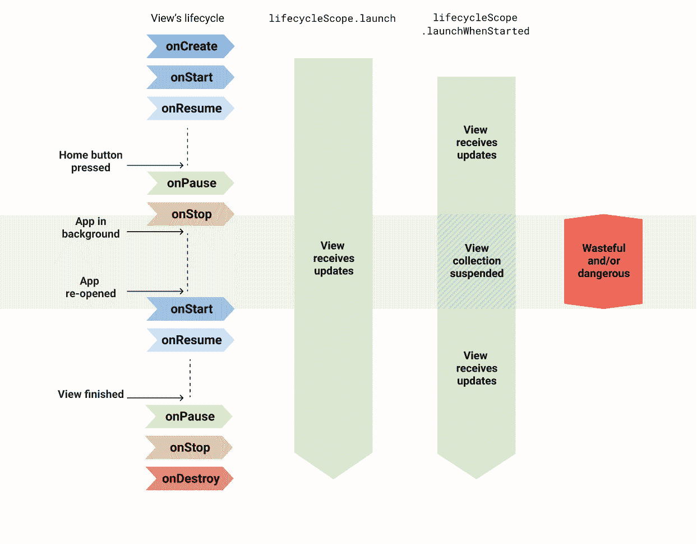

Collecting Flows with `launch/launchWhenX` is unsafe

应用程序在后台接收更新可能会导致崩溃，这可以通过在视图中暂停集合来解决。然而，当应用程序在后台时，上游流量保持活跃，这可能会浪费资源。

这意味着到目前为止我们为配置 StateFlow 所做的一切都是无用的；然而，镇上有一个新的 API。

# lifecycle.repeatOnLifecycle 来拯救

这个新的协程构建器(可从[life cycle-runtime-ktx 2 . 4 . 0-alpha 01](https://developer.android.com/jetpack/androidx/releases/lifecycle#2.4.0-alpha01)获得)做了我们需要的事情:它在特定的状态启动协程，当生命周期所有者低于该状态时，它停止协程。

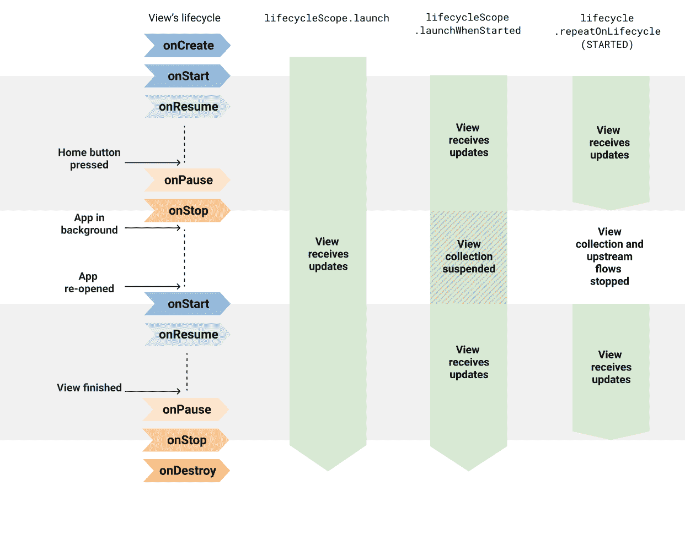

Different Flow collection methods

例如，在一个片段中:

这将在片段的视图为`STARTED`时开始收集，将持续到`RESUMED`，并在返回到`STOPPED`时停止。阅读[从 Android 用户界面收集流量的更安全的方法](/androiddevelopers/a-safer-way-to-collect-flows-from-android-uis-23080b1f8bda)中的相关内容。

**将** `***repeatOnLifecycle***` **API 与上面的 StateFlow 指南结合使用，可以在充分利用设备资源的同时获得最佳性能。**

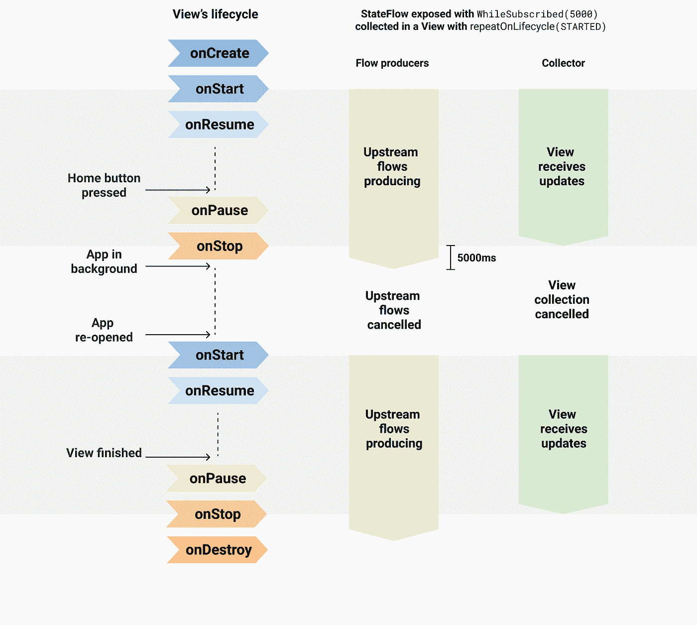

StateFlow exposed with WhileSubscribed(5000) and collected with repeatOnLifecycle(STARTED)

> 警告:最近添加到**数据绑定** 中的 [StateFlow 支持使用`launchWhenCreated`来收集更新，当它达到稳定时将开始使用`repeatOnLifecycle`来代替。](https://developer.android.com/topic/libraries/data-binding/observability#stateflow)
> 
> 对于**数据绑定**，您应该在任何地方使用流，并且简单地添加`asLiveData()`来将它们暴露给视图。当`lifecycle-runtime-ktx 2.4.0`稳定时，数据绑定将被更新。

# 摘要

从视图模型中公开数据并从视图中收集数据的最佳方式是:

*   ✔️暴露了一个`StateFlow`，使用了`WhileSubscribed`策略，超时了。[ [示例](https://gist.github.com/JoseAlcerreca/4eb0be817d8f94880dab279d1c27a4af)
*   ✔️用`repeatOnLifecycle`收集。[ [示例](https://gist.github.com/JoseAlcerreca/6e2620b5615425a516635744ba59892e)

任何其他组合将保持上游流动活跃，浪费资源:

*   ❌使用`WhileSubscribed`曝光，并在`lifecycleScope.launch` / `launchWhenX`内收集
*   ❌用`Lazily` / `Eagerly`曝光，用`repeatOnLifecycle`收集

当然，如果你不需要流的全部力量…就用 LiveData。:)

*感谢* [*曼努埃尔*](/@manuelvicnt)*[*沃伊泰克*](/@wkalicinski)*[*伊吉特*](/@yigit/) *，亚历克斯库克* [*【弗洛里纳*](/@florina.muntenescu) *和* [克里斯](https://chrisbanes.medium.com/) ！**