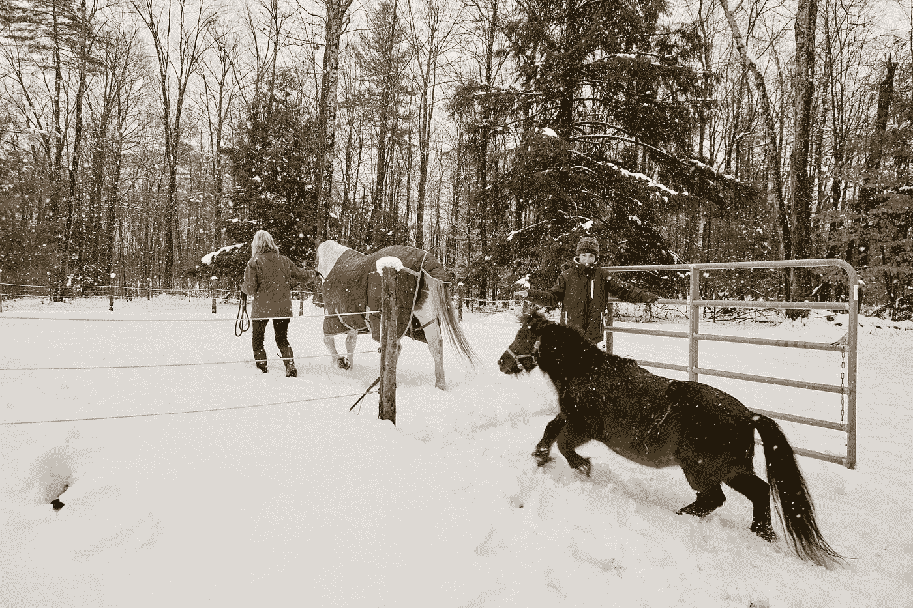
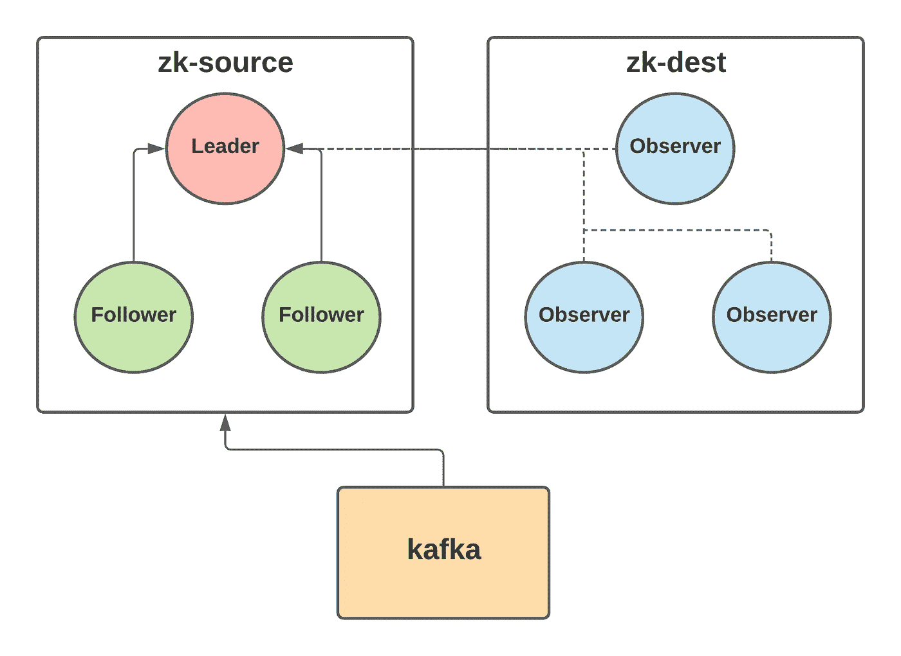
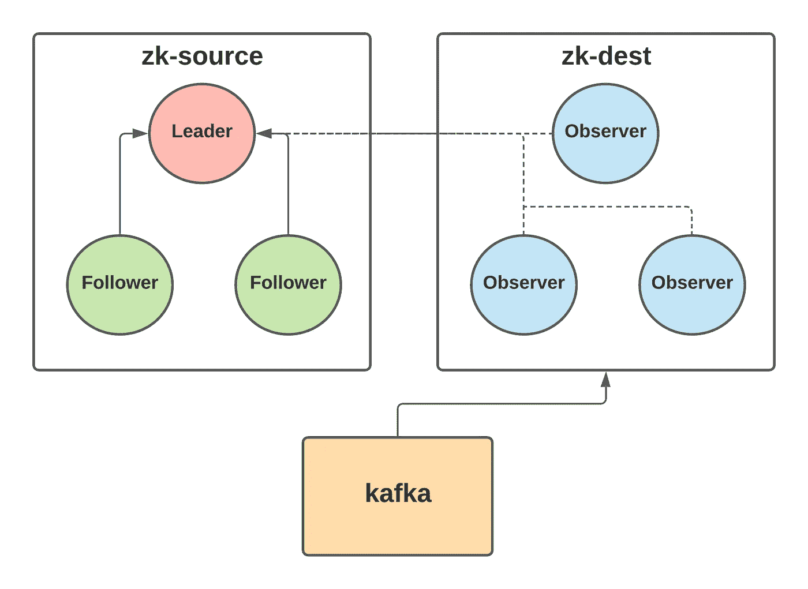
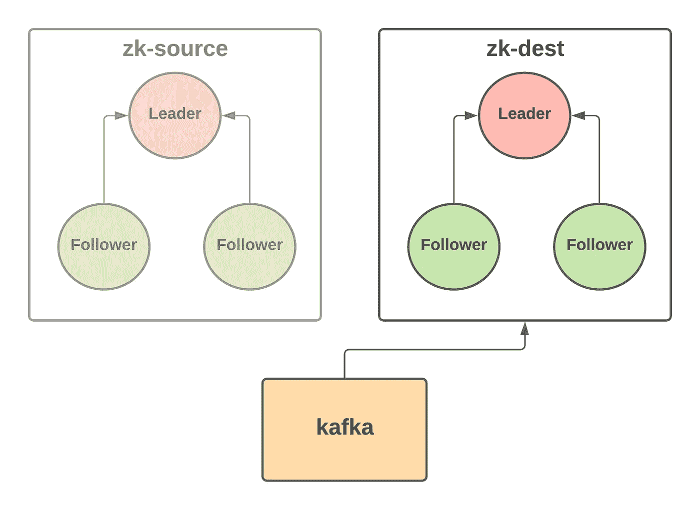

# 在 Zookeeper 集群之间透明地迁移 Kafka

> 原文：<https://medium.com/airbnb-engineering/migrating-kafka-transparently-between-zookeeper-clusters-e68a75062f65?source=collection_archive---------3----------------------->

了解如何在不影响用户的情况下将 Kafka 集群从一个 Zookeeper 集群迁移到另一个集群。

**By** : [莫](https://www.linkedin.com/in/edmund-mok)

# 介绍

Kafka 是一个开源的分布式事件流平台。它依赖于另一个开源分布式协调系统 Zookeeper 来存储集群元数据。在 Airbnb，Kafka 构成了我们数据基础设施的支柱，为事件记录和变更数据捕获等用例提供支持，帮助我们更好地了解我们的客人和主人，并做出改进我们产品的决策。

我们运行几个生产 Kafka 集群，其中最大的集群是我们最老的集群，由数百个代理组成，支持超过 1GB/s 的传入流量。在我们迁移之前，这个 Kafka 集群依赖于传统的 Zookeeper 设置，这是一个在许多不同的生产用例之间共享的多租户 Zookeeper 集群，这意味着集群上的任何事件都会影响所有依赖的服务，包括 Kafka。而且，这个动物园管理员集群也缺乏一个明确的主人。我们希望将 Kafka 从这个 Zookeeper 集群中迁移到一个独立的、专用的 Zookeeper 集群中，该集群拥有清晰的所有权，并与其他用例更好地隔离。

目标是透明地完成迁移，没有任何数据丢失、停机或对 Kafka 用户以及其他 Zookeeper 用户的影响。

最近发布的 Kafka 2.8.0 包括对 KIP-500 的更改，该社区提议删除 Kafka 对 Zookeeper 的依赖。由于 Kafka 2.8.0 中的这一功能尚未完成，也没有经过生产测试，所以在我们有信心在没有 Zookeeper 的情况下运行 Kafka 之前，还需要几个版本。因此，我们决定在 Zookeeper 集群之间迁移 Kafka。

我们的方法很大程度上受到了 Yelp 最初方法的启发，但是经过修改，在迁移中使用了 Zookeeper 观察者，以最小化对源 Zookeeper 集群的配置更改。我们还迁移了运行版本 2.3.1 的 Kafka 集群和运行版本 3.5.8 的 Zookeeper 集群。如果您也尝试迁移，请确保在您的设置上仔细测试，尤其是如果您运行的是不同的 Kafka 或 Zookeeper 版本！

# 高层战略

我们将使用 zk-source 来引用我们要从中迁移 Kafka 的原始 Zookeeper 集群，使用 zk-dest 来引用我们要将 Kafka 依赖项移动到的新目标 Zookeeper 集群。请注意，zk-dest 必须是不包含任何预先存在的数据的新集群。

我们的迁移计划包括以下几个阶段:

1.  首先，添加 zk-dest 主机作为 zk-source 集群的观察者
2.  接下来，将 Kafka 集群的 Zookeeper 连接从 zk-source 切换到 zk-dest
3.  最后，重新配置 zk-dest 观测器以形成它们自己的独立系综

# 阶段 1:添加 zk-dest 主机作为 zk-source 的观察者

*Phase 1: After adding zk-dest hosts as observers of zk-source, all zk-dest hosts will be connected to the leader of zk-source and begin replicating data from zk-source.*

在每个 zk-dest 主机的 Zookeeper 配置中，将所有 zk-source 服务器及其各自的角色(参与者或观察者)和所有 zk-dest 服务器作为观察者包含在服务器列表中。以这样的配置在 zk-dest 主机中启动 Zookeeper 将配置它们作为观察者加入 zk-source 集群，并开始复制集群中的所有 Zookeeper 数据。

在这里使用观察者的一个好处是，在 Zookeeper 中，观察者不参与未决提交的投票过程，只从领导者那里了解已提交的提议。因此，可以将观察器添加到源集群来复制现有数据，而不会影响仲裁。

使用观察者的另一个好处是我们不需要修改 zk-source 中的任何东西，比如 zk-source 主机中的配置文件。观察者可以加入 zk-source 集群，而无需出现在 zk-source 集群配置的服务器列表中。尽管知道这些观察者没有在原始配置中列出，但是领导者并没有拒绝它们。这对我们来说尤其重要，因为我们希望尽可能避免对源集群进行更改(或者更糟，不得不重启)。

# 阶段 2:将 Kafka 连接从 zk-source 切换到 zk-dest

*Phase 2: After switching Kafka’s Zookeeper connection over from zk-source to zk-dest, Kafka will still be operating on the original data in zk-source, but through zk-dest observers.*

这个阶段包括更新每个代理上的 Kafka 配置，以使用只指向 zk-dest 观察者的 Zookeeper 连接字符串，然后运行每个 Kafka 代理的滚动重启，以获得这个新配置。在切换之前，记得确认观察器正在正确地从 zk-source 集群复制数据。在这个阶段的最后，Kafka 集群将继续处理原始 zk-source 集群中的数据，但是现在是通过 zk-dest 观察器来处理。

# 阶段 3:重新配置 zk-dest 观测器以形成独立的集合

*Phase 3: After restarting zk-dest observers into a separate ensemble, zk-dest hosts will form an isolated cluster with a copy of the original data from zk-source but independent from the original cluster.*

这里，我们执行以下操作:

1.  通过在 zk-dest 主机中插入 iptables 规则来阻止 zk-source 和 zk-dest 之间的网络通信，以拒绝任何传入和传出到 zk-source 的 Zookeeper TCP 数据包
2.  检查 zk-dest 主机在 Kafka 子树中是否有最新的数据
3.  更新 zk-dest 配置，使服务器列表中仅包含 zk-dest 主机作为参与者

在第一次操作后，Kafka 将无法使用 Zookeeper，但在最后一次操作后，可用性将恢复，Kafka 最终将通过重试重新连接。最后，zk-dest 主机将获得新的配置，并形成一个仅由 zk-dest 主机组成的仲裁。Kafka 将处理 zk-source 数据的副本，但在 zk-dest 集群内。

我们首先阻塞网络通信，以防止从 Kafka 到 Zookeeper 的任何进一步写入，从而最小化在迁移时丢失从 zk-source 复制到 zk-dest 的更新的机会，这可能导致不一致的数据。这一步只是额外的预防措施，因为我们已经观察到 Kafka 对 Zookeeper 的交易率很低，主要用于主题创建和更新。

或者，我们可以关闭所有 zk-dest 主机，或者直接阻止从 Kafka brokers 到 Zookeeper 的流量。阻塞 zk-source 和 zk-dest 之间的流量的一个好处是，我们发现更新 iptables 规则比正常重启 Zookeeper 进程更快。如果我们希望将 zk-dest 恢复为原始集群的观察者，我们可以更快地恢复 Kafka 的 Zookeeper 可用性。它还有助于保留 zk-dest 集群中的 Zookeeper 会话，因为如果 zk-source leader 和 zk-dest 观察者之间的流量没有被阻塞，则 ZK-source leader 可以向它们传播会话到期。在后面的部分中，我们将详细解释为什么我们希望在迁移过程中保留这些会话。

即使在第一次操作后，Kafka 认为 Zookeeper 不可用，生产者和消费者仍然可以与 Kafka 集群交互，并且不会经历任何中断，只要所有代理都是健康的。

在第二个操作中，我们可以通过检查 zk-dest 中最新事务的 zxid([Zookeeper 事务 id](https://zookeeper.apache.org/doc/r3.2.2/zookeeperInternals.html#sc_guaranteesPropertiesDefinitions) )是否大于或等于 Kafka 子树中所有 ZNodes 的最大 czxid、mzxid 或 pzxid，来确认 Kafka 子树中的数据是最新的。这些 zxid 对应于:创建特定 ZNode 的变更、最后修改特定 ZNode 的变更以及最后修改特定 ZNode 的子节点的变更。如果这个条件成立，那么修改 zk-source 的 Kafka 子树的任何事务都将被捕获到 zk-dest 的事务日志中，我们确信 zk-dest 中的数据是最新的。

为了在迁移过程中快速执行这种检查，我们修改了 Zookeeper 附带的事务日志转储工具，只打印最新的事务，而不是整个日志。在我们的例子中，平均日志大约是 500MB。转储整个日志大约需要 20 秒，尽管我们只关心最近的事务。我们还发现，使用内存映射文件 I/O 而不是标准文件 I/O 进一步略微提高了性能。这些更改将从日志中提取最新事务的时间减少到了 1 秒左右。

由于迁移期间 Kafka 无法使用 Zookeeper，控制器将无法检测到在此期间关闭的任何代理。如果代理失败，控制器将不会为在失败的代理上有领导者副本的任何分区选举新的领导者。由于消费者和生产者只能读取和写入主副本，并且副本在故障代理上处于离线状态，因此消费者和生产者将无法使用这些分区。根据您的生成器重试策略，脱机领导者副本可能会导致新的传入消息被丢弃并永远丢失。因此，监控代理指标以了解是否有代理失败是很重要的。如果在迁移期间发生这种情况，我们可以继续迁移，并允许控制器在迁移结束时恢复与 zk-dest 的连接后处理故障，或者我们可以将 zk-dest 主机恢复为 zk-source 的观察者，并解除 zk-source 和 zk-dest 之间的网络通信，以使 Kafka 恢复 Zookeeper 可用性，并允许控制器处理故障。

# 迁移期间保留 Zookeeper 会话

Zookeeper 客户端(如 Kafka brokers)通过会话连接到 Zookeeper 集群。临时节点与这些会话相关联—例如在 Kafka 中，它们包括控制器和代理 ID 节点。当会话过期时，临时节点将被删除，会话通过客户端心跳保持活动状态。动物园管理员负责跟踪所有会话，并确定它们是否已过期。

理想情况下，我们希望在迁移过程中保留 Zookeeper 会话，因为 Kafka 依赖于这些会话和相关的临时节点。具体来说，我们希望在整个迁移过程中保留临时代理 ID ZNodes(在 path /brokers/ids 下)。在迁移过程中，Kafka 只能在短时间内无法使用 Zookeeper，但如果迁移时间足够长，Zookeeper 负责人可能会终止该会话。

Kafka 控制器通过监视短暂的代理节点并识别哪些代理离线来检查离线领导者副本。如果 Kafka 经纪人的 Zookeeper 会话过期，其短暂的经纪人 ID ZNode 将被删除。在迁移结束时，当 Zookeeper 再次可用时，如果代理没有足够快地重新连接到 Zookeeper，控制器将检测到丢失的代理 ZNode，并假设代理已经失败。控制器将尝试将主副本重新定位到其他代理以保持分区可用性，并在重新连接时再次回到原始代理。在此期间，Kafka 的消费者和生产者可能会经历中断，因为他们在持有领先复制品的经纪人之间切换。

对于我们的迁移，我们必须使用 zk-source 集群中现有的 40 秒会话超时，以避免对集群进行任何更改。由于领导者确定会话到期，通过阻止 zk-source 和 zk-dest 之间的流量，我们防止了任何现有会话在 zk-dest 中到期的可能性(尽管它们可能仍然在 zk-source 中到期),并避免了前述的竞争情况。

# 结论

迁移可能很难执行，特别是在 Kafka 和 Zookeeper 等复杂的分布式系统上试图确保不中断用户和不丢失数据时，但通过仔细的规划和测试，我们能够在不停机的情况下进行迁移。这种方法可以用于依赖 Zookeeper 的其他系统，而不仅仅是 Kafka——理想情况下，这种系统对 Zookeeper 的事务率很低，并且能够优雅地处理 Zookeeper 不可用的情况。我们再次感谢 Yelp 的原创博文，它启发并证明了这种迁移可以在不影响用户的情况下完成。

# 承认

非常感谢徐章、佟伟、赵、和郭墨成，他们密切合作并提供了宝贵的反馈，确保了迁移的成功。还要特别感谢 Abhishek Parmar、Chandramouli Rangarajan、Chiyoung Seo、Jingwei Lu、Liuyang Li、Tang 和在审核迁移策略时提供的帮助。最后，感谢布雷特·布考斯基和迪伦·赫德对这篇博文的审阅和改进。

查看这些相关角色:

[高级软件工程师，存储&数据库](https://careers.airbnb.com/positions/3045137/)

[高级职员软件工程师，后台数据平台](https://careers.airbnb.com/positions/1858035/)

[云基础设施软件工程师](https://careers.airbnb.com/positions/2410642/)

[高级/员工软件工程师，分析基础设施](https://careers.airbnb.com/positions/3477507/)

[员工软件工程师，服务平台](https://careers.airbnb.com/positions/3069302/)

*所有产品名称、标识和品牌均为其各自所有者的财产。本网站中使用的所有公司、产品和服务名称仅用于识别目的。使用这些名称、标志和品牌并不意味着认可。*