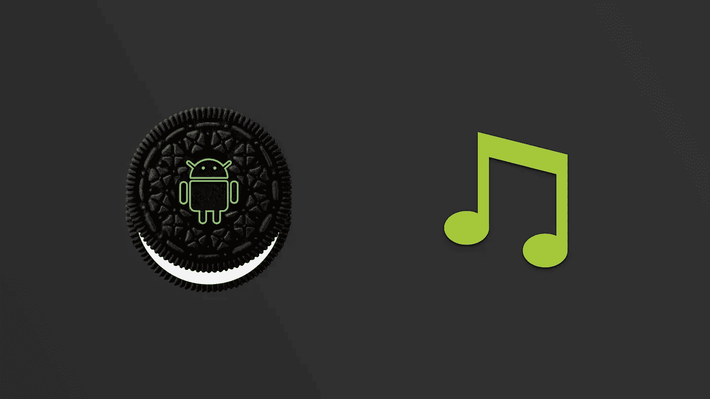
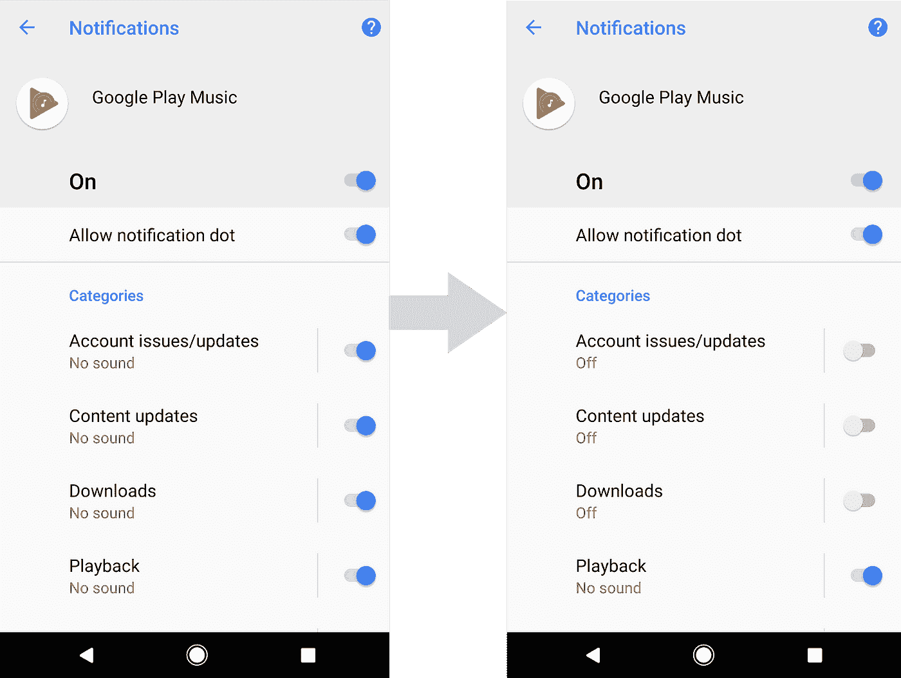

# 迁移 MediaStyle 通知以支持 Android O

> 原文：<https://medium.com/androiddevelopers/migrating-mediastyle-notifications-to-support-android-o-29c7edeca9b7?source=collection_archive---------1----------------------->

## 让媒体风格通知为您服务



# 介绍

如果您在 API 级别 25 或更低的平台上使用`MediaStyle`通知，本文将作为将这些通知迁移到 Android O 的迁移指南。`MediaStyle`通知通常由绑定和启动的服务使用，这些服务允许在后台播放音频。

Android O 中有几个必须考虑的主要差异。

1.  后台服务现在必须用`[startForegroundService(Intent)](https://developer.android.com/preview/features/background.html#services)`启动，然后必须在 5 秒内显示一个持续的通知。
2.  必须使用通知渠道来显示通知。

迁移到 O 需要几个简短的步骤，如下所示。

# 步骤 1-更改您的导入语句

确保将下列行添加到您的导入语句中:

```
import android.support.v4.app.NotificationCompat;
import android.support.v4.content.ContextCompat;
import android.support.v4.media.app.NotificationCompat.MediaStyle;
```

您可能有一个来自 v7 的 import 语句，但您不再需要:

```
import android.support.v7.app.NotificationCompat;
```

在你的`build.gradle`中，你现在只需要导入`media-compat`支持库。`media-compat`库是`MediaStyle`类所在的地方。`media-compat`库是`MediaStyle`类所在的地方。

```
implementation ‘com.android.support:support-media-compat:26.+’
```

`MediaStyle`在`android.support.v4.**media**`包中，因为它现在是`[media-compat](https://developer.android.com/topic/libraries/support-library/packages.html#v4-media-compat)`依赖的一部分。由于支持库模块中关注点的分离，它们不在`support-compat`库中。

# 步骤 2-对通道使用 NotificationCompat

为了在 O 中使用通知，您必须使用通知通道。v4 支持库现在有一个用于创建通知构建器的新构造函数:

```
NotificationCompat.Builder notificationBuilder =
        new NotificationCompat.Builder(mContext, CHANNEL_ID);
```

从支持库的 26.0.0 版起，旧的构造函数已被弃用，它将导致您的通知在定位到 API 26 时无法显示(因为当定位到 API 26 或更高版本时，所有通知都需要一个通道):

```
NotificationCompat.Builder notificationBuilder =
        new NotificationCompat.Builder(mContext);
```

为了更好地理解 Android O 中的频道，请在[developer.android.com](https://developer.android.com/preview/features/notification-channels.html)上阅读所有相关内容。Google Play Music 对您希望收到的通知进行了精细控制。例如，如果您只关心与“回放”相关的通知，您可以启用这些通知并禁用其余的通知。



`NotificationCompat`类不会为你创建频道。您仍然需要自己创建一个[通道](https://developer.android.com/preview/features/notification-channels.html#CreatingChannels)。这里有一个 Android O 的例子。

下面是用`NotificationCompat`创建一个`MediaStyle`通知的代码。

# 步骤 3-使用 ContextCompat 来启动 ForegroundService()

在 Android O 中，需要在后台运行的服务，如音乐播放服务，需要使用`Context.startForegroundService()`而不是`Context.startService()`来启动。为了做到这一点，如果你在 O 上，你可以使用自动为你做这件事的`ContextCompat`类，并且仍然在 N 和先前版本的 Android 上使用`startService(Intent)`。

就是这样！这是三个简单的步骤，让你迁移你的 Android O `MediaStyle`之前的通知，这些通知与后台服务相关联。

有关`MediaStyle`变更的更多信息，请阅读支持库的[变更日志](https://developer.android.com/topic/libraries/support-library/revisions.html#26-0-0)。

# Android 媒体资源

*   [了解媒体会话](/google-developers/understanding-mediasession-part-1-3-e4d2725f18e4)
*   [使用 MediaPlayer 构建简单的音频播放应用](/google-developers/building-a-simple-audio-app-in-android-part-1-3-c14d1a66e0f1)
*   [Android 媒体 API 指南—媒体应用概述](https://developer.android.com/guide/topics/media-apps/media-apps-overview.html)
*   [Android 媒体应用编程接口指南—使用媒体会话](https://developer.android.com/guide/topics/media-apps/working-with-a-media-session.html)