# 使用 Apache NiFi 将对象存储从 AWS 迁移到 OCI

> 原文：<https://medium.com/oracledevs/migrating-object-storage-from-aws-to-oci-using-apache-nifi-edf3310c899f?source=collection_archive---------4----------------------->

# **概述**

当考虑在云供应商之间将数据移动到对象存储的选项时， [RClone](https://rclone.org/) 可能是最广为人知的一种，通常用于将数据复制和同步到 Oracle 云基础架构(OCI)。然而，在本文中，我们将 Apache Nifi 作为数据移动的替代工具，它为配置和管理更复杂的数据流提供了一个 web UI。

第一次看 Apache Nifi，我将演示一个简单的配置，将数据从 AWS S3 存储桶拷贝克隆到 OCI 对象存储。

*注意:如果你还没有，你可以* [*注册一个甲骨文云自由层账户*](https://signup.cloud.oracle.com/?language=en&sourceType=:ow:de:te::::&intcmp=:ow:de:te::::) *！*

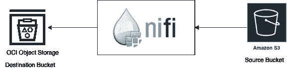

Migrate object storage from AWS to OCI

# **要求**

对于这个练习，我需要

1.  AWS 帐户和 OCI 云租赁。

2.Docker 或虚拟机或笔记本电脑来运行 NiFi 软件。

3.OCI 对象存储— s3 兼容模式，需要在租户的本地区域启用[。](https://docs.oracle.com/en-us/iaas/Content/Object/Tasks/designatingcompartments.htm#usingconsole)

4.一个在 OCI 的[访问密钥/秘密密钥](https://docs.oracle.com/en-us/iaas/Content/Identity/Tasks/managingcredentials.htm#To4)来访问 OCI 对象存储器。

5.需要在 OCI 租赁主页区域中创建 OCI 对象存储目标时段。

6.包含要迁移的对象的 AWS S3 存储桶。

# 为 NiFi 传输配置与 S3 兼容的 OCI 对象存储

Apache NiFi 没有本地的 OCI 对象存储处理器，所以我们需要使用 [S3 兼容 API](https://docs.oracle.com/en-us/iaas/Content/Object/Tasks/s3compatibleapi.htm#usingAPI) 来启用我们的 OCI 对象存储，以便为 S3 使用 NiFi 处理器。

1.在 [OCI 控制台](https://docs.oracle.com/en-us/iaas/Content/Identity/Tasks/managingcredentials.htm#Working2)中创建客户密钥。

*   客户密钥由访问密钥/密钥对组成(类似于 AWS S3 访问)。记得复制密钥；它将不会再次显示。

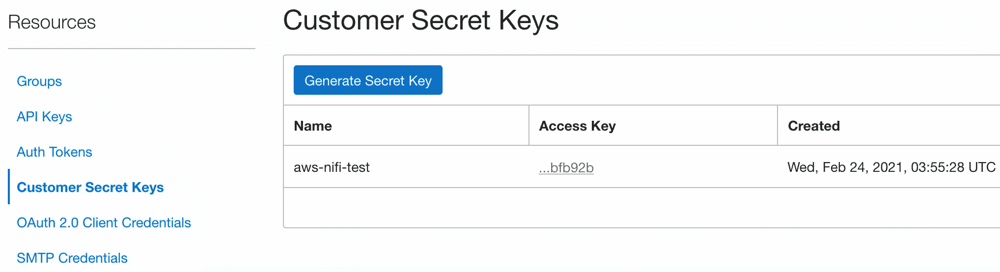

OCI Customer Secret Keys Generation

2.确定您的 OCI 租赁家庭地区

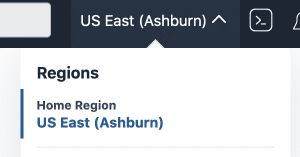

OCI Home Region

3.收集端点覆盖 URL，该 URL 将是[https://. compat . object storage..oraclecloud.com](https://.compat.objectstorage..oraclecloud.com)

对我来说，的确如此

```
https://<OCI-objectStorage-Namespace>.compat.objectstorage.us-ashburn-1.oraclecloud.com
```

*注意:对于一些旧的 OCI 租赁，名称空间名称字符串可能基于您的租赁名称，而不是由机器生成的。如果您的命名空间是基于您的租赁名称创建的，则您的命名空间使用所有小写字母(不管租赁名称中的大写字母)。不要在名称空间名称字符串中使用大写字母。*

# 安装 NiFi

Apache NiFi 安装指南位于[这里](https://nifi.apache.org/docs/nifi-docs/html/administration-guide.html#how-to-install-and-start-nifi)。

我用 brew 在 Mac 上安装了 NiFi，

`$ brew install nifi`

理想情况下，它应该安装在源 AWS 虚拟机或目标 OCI 虚拟机上，以提高吞吐量。

或者，如果您选择使用 docker 运行:

```
$ docker run —-name nifi -p 8080:8080 -d apache/nifi:latest
```

# **设置 Apache NiFi 软件**

安装后，在实际启动之前检查 Nifi 的状态。

```
$ nifi statusJava home: /usr/local/opt/openjdk@11/libexec/openjdk.jdk/Contents/HomeNiFi home: /usr/local/Cellar/nifi/1.13.0/libexecBootstrap Config File: /usr/local/Cellar/nifi/1.13.0/libexec/conf/bootstrap.conf2021–02–24 20:01:32,117 INFO [main] org.apache.nifi.bootstrap.Command Apache NiFi is currently running, listening to Bootstrap on port 55325, PID=26530
```

如果它没有运行，那么继续启动它。

`$nifi start`

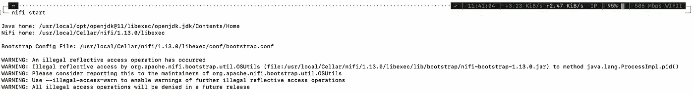

NiFi start

*注意:在我的案例中，警告是由 JDK 问题引起的。这不会改变功能。*

默认情况下，NiFi 监听端口 8080。

打开浏览器`[http://localhost:8080/nifi](http://localhost:8080/nifi)`打开浏览器`[http://localhost:8080/nifi](http://localhost:8080/nifi)`

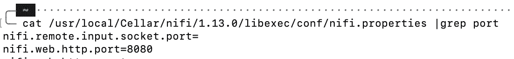

NiFi properties file

# **设置 Nifi 流程迁移数据**

现在，主要目标是将数据从 AWS S3 复制到 OCI 对象存储。

1.  添加 S3 桶并设置其属性。至少添加存储段名称、区域以及访问密钥和秘密密钥。

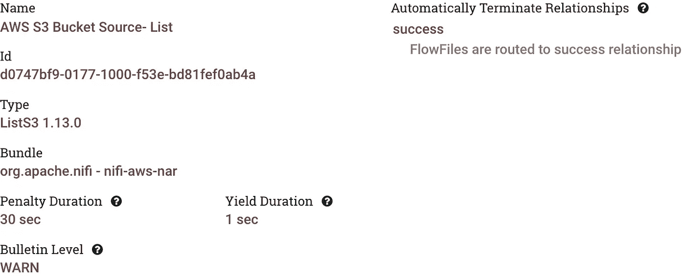

Select the ListS3 processor

**铲斗** —将是 AWS 中 S3 铲斗的名称。
**区域** —将是 S3 时段的 AWS 区域。

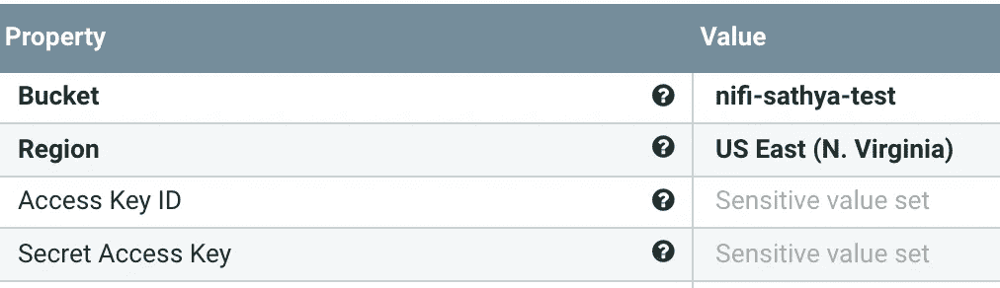

ListS3 processor properties

2.在成功流中，列出 S3 以获取 3 个对象处理器

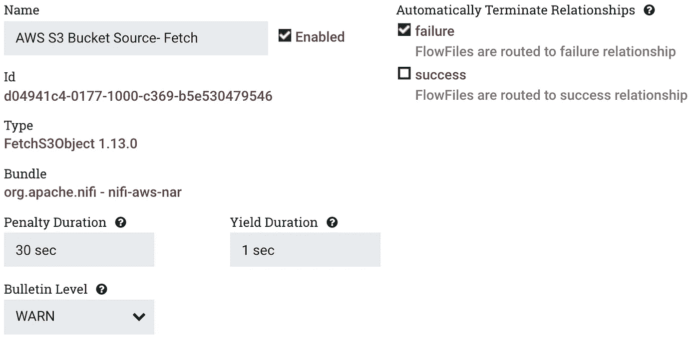

Select FetchS3Object processor

**对象键**将是需要获取的文件的名称。在这种情况下，我希望保留与 OCI 对象存储相同的名称和所有文件。

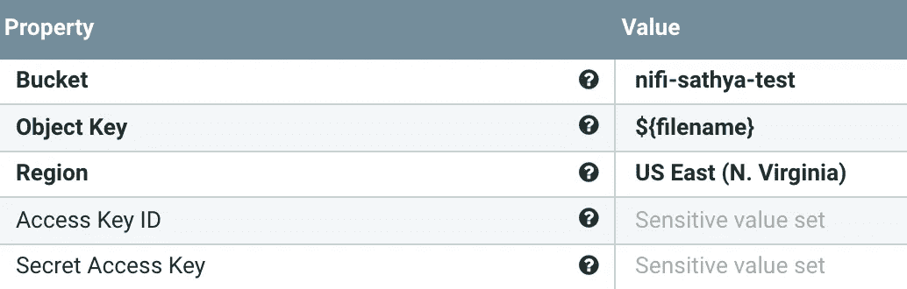

FetchS3 processor properties

3.将数据发送到 OCI 对象存储。

a.使用“为 NiFi 传输配置与 S3 兼容的 OCI 对象存储”一节中生成的 OCI 客户密钥

b.在用于 OCI 对象存储的 NiFi 处理器上，将区域设置为`us-east-1`。

*我们只能在 OCI 租赁家庭区域使用亚马逊 S3 兼容性 API&因此我们在家庭区域创建了 OCI 对象存储桶。*

c.端点覆盖 URL —从“为 NiFi 传输配置与 S3 兼容的 OCI 对象存储”中收集

d.签名人覆盖—选择[签名 V4](https://docs.aws.amazon.com/AmazonS3/latest/API/sig-v4-authenticating-requests.html)

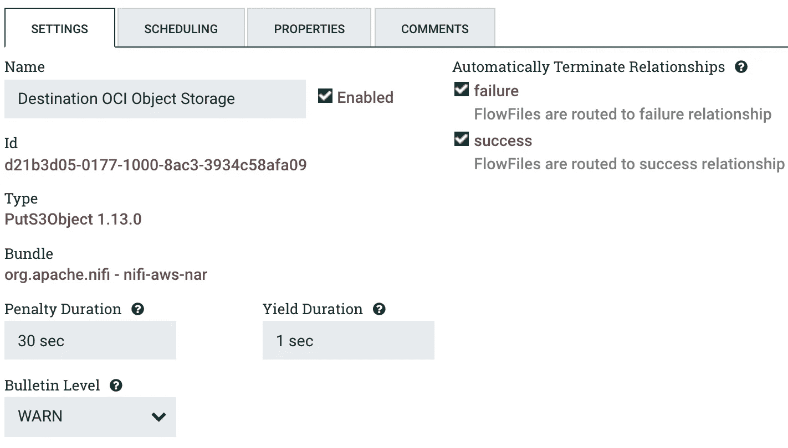

要将数据发送到 OCI，选择 puts 3 对象处理器

存储桶—将是 OCI 对象存储的名称

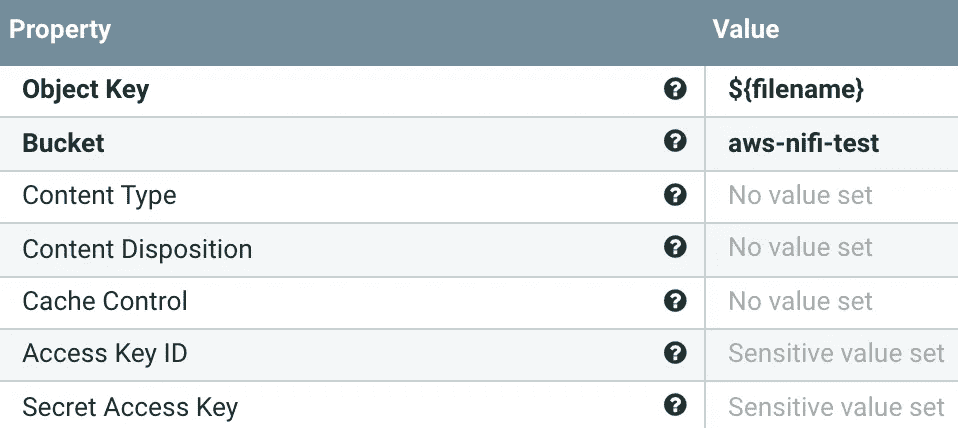

PutS3Object Processor properties — 1

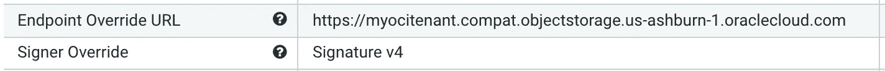

PutS3Object Processor properties — 2

一旦创建了流，它将类似于下面的内容:

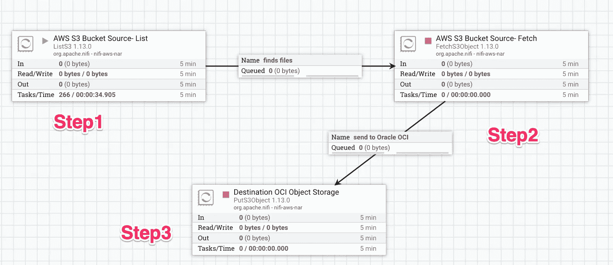

NiFi Flow template

# **执行&迁移对象存储**

1.  开始流动。

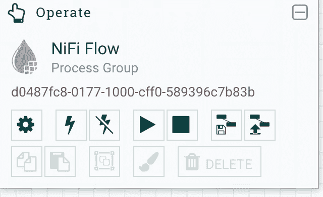

在**操作**上，点击**开始**图标，开始整个流程。或者，您可以启动单个处理器来首次验证流。

*注:如果配置不正确，请确保修复处理器中可能显示的任何未解决的警告。*

如果处理器中有任何错误，它将显示在处理器的右上角。

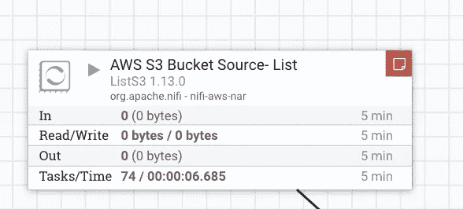

如果您在 OCI 对象存储处理器中遇到如下所示的 403 错误，那么您必须按照上述步骤确保 OCI 对象存储桶配置是正确的。

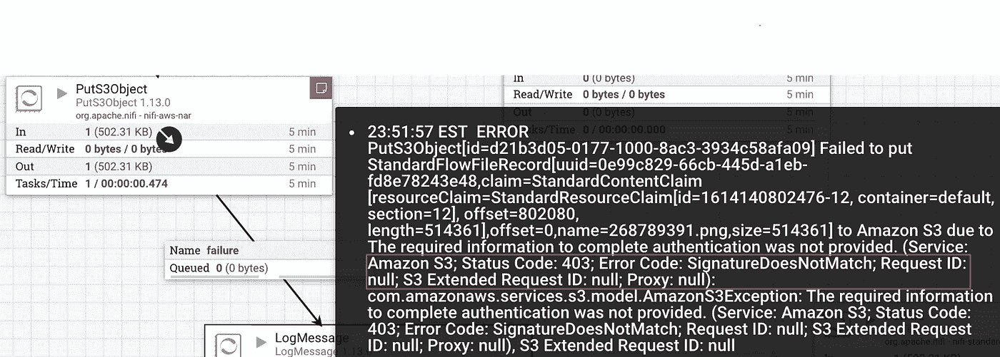

Error faced due to misconfiguration.

2.将文件添加到 AWS s3 存储桶

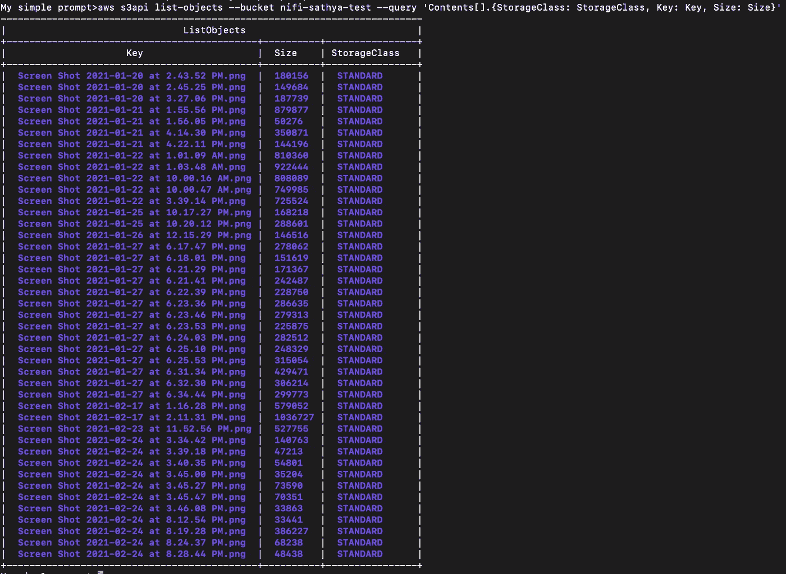

Source S3 Bucket

在我的例子中，我一次启动一个处理器，观察它将数据从一个处理器移动到另一个处理器的过程；观察每个处理器的输入和输出。或者，您也可以一次性启动整个工作流。

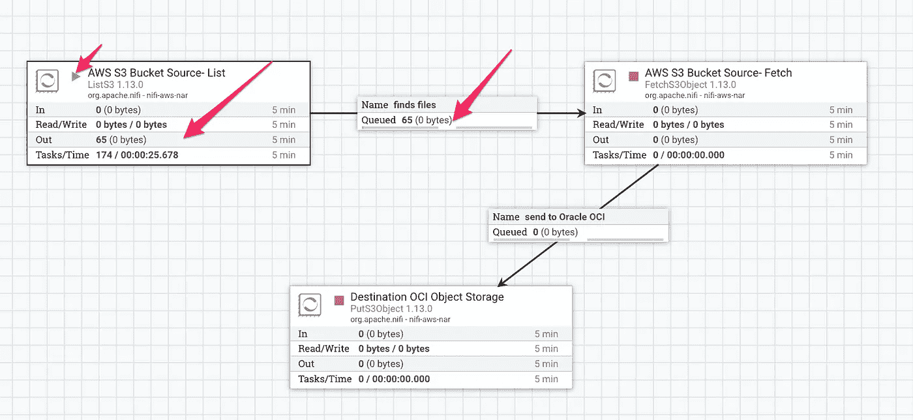

Started only the first processor to illustrate the step-by-step flow

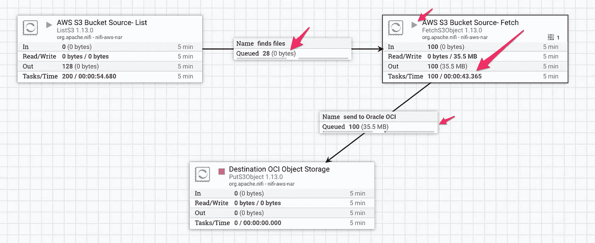

After Starting the second processor, the queue from first getting drained and placing in the next OCI queue.

最后，启动第三处理器发送到 OCI 对象存储器。

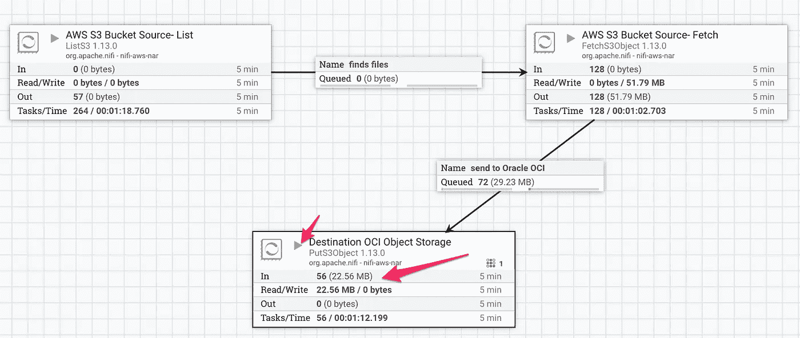

The files are now being sent to the OCI Object Storage.

接下来，在 OCI 对象存储上验证文件是否已复制。

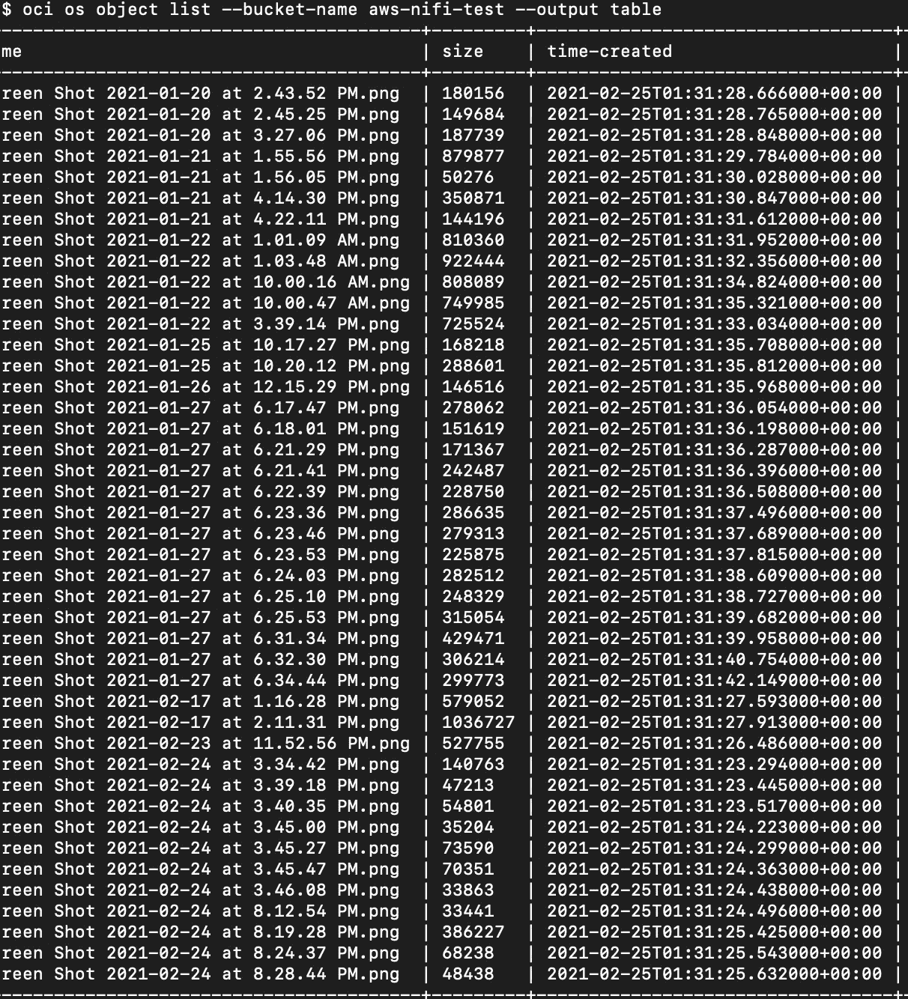

Oracle Cloud Infrastructure object list

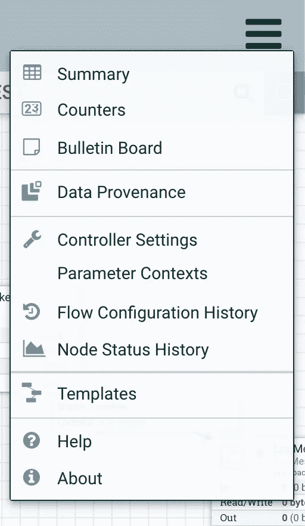

# 最后的想法

Apache NiFi 是一个方便的工具，可以通过多个流复制/操作数据，并优雅地转换数据。使用该工具，您可以发挥创造力，解决日常数据流挑战中的特定用例。它还支持从一个数据库中取出数据库行，并放到另一个数据库中。举几个例子，您可以查看 NiFi 的一些特性，例如数据来源、保存和导出为模板。

# 加入对话！

如果你对甲骨文开发人员在他们的自然栖息地发生的事情感到好奇，来[加入我们的公共休闲频道](https://join.slack.com/t/oracledevrel/shared_invite/zt-uffjmwh3-ksmv2ii9YxSkc6IpbokL1g?customTrackingParam=:ex:tb:::::RC_WWMK220210P00062:Medium_migratingObjectStorageAWS)！我们不介意成为你的鱼缸🐠