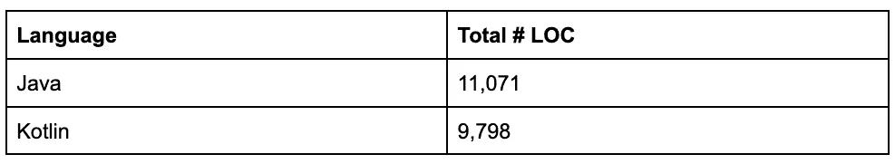
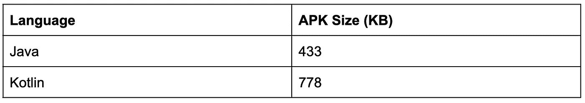
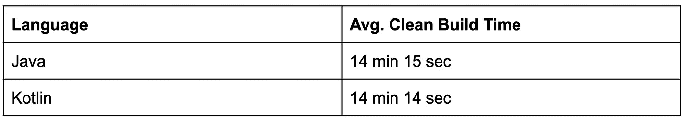

# 将 AOSP QuickSearchBox 应用程序迁移到科特林

> 原文：<https://medium.com/androiddevelopers/migrating-the-aosp-quicksearchbox-app-to-kotlin-1264346619ec?source=collection_archive---------0----------------------->

提交人: *Ryan O'Leary，Android 实习生*

# 概观

在过去的三年里， [Android 开源项目(AOSP)应用](https://android.googlesource.com/platform/packages/apps/)团队承担了将 AOSP 应用从 Java 转换成 Kotlin 的任务。这种追求是 Android 承诺的一部分，即通过 [**Kotlin-first**](https://developer.android.com/kotlin/first) 不断发展。Kotlin 是一种安全、实用、简洁的语言，具有许多语言特有的优势。有用的 Kotlin 语言特性包括:

*   **空安全**:除非明确指定，否则 Kotlin 类型不可为空。这对于开发人员避免难以跟踪的空指针异常非常有用。
*   **简洁** : Kotlin 允许开发人员减少样板代码的数量，与 Java 相比，用更少的代码行表达更多。
*   **Java 互操作性**:Kotlin 和 Java 编程语言之间的互操作性被证明对这个项目非常有帮助，因为移植可以逐步完成，并且对所有从事混合 Java 和 kot Lin 项目的开发人员都很有用。
*   **Jetpack 库和协程** : Kotlin 通过协程为轻量级结构化并发提供了语言内支持。此外，Android 开发内容是 Kotlin-first，并提供对有用的 Jetpack 库的访问。

AOSP 实习生在 2019 年转换了 AOSP [桌面时钟](/androiddevelopers/re-writing-the-aosp-deskclock-app-in-kotlin-76c836370cb) app，在 2020 年转换了[日历](/androiddevelopers/re-writing-the-aosp-calendar-app-in-kotlin-48ceb0e3a65c) app，在类似文章中详细介绍了迁移过程。今年，AOSP 团队开始全面转换 QuickSearchBox 应用程序，作为 2022 年夏季实习生项目的一部分。QuickSearchBox 应用程序于 2009 年通过 Android 1.6 版本推出，允许用户直接从主屏幕上搜索他们的设备和网络，根据下载的内容、联系人、应用程序和浏览器历史记录提供建议。在 6 周的时间里，QuickSearchBox 应用程序中超过 11，000 行 Java 代码被转换为 Kotlin，以展示 Android 开发中的最佳实践，并以 Kotlin 为先的理念提供 QuickSearchBox 应用程序的功能。

# 自动转换和错误修复

为了将 QuickSearchBox 应用迁移到 Kotlin，我们利用了 Android Studio 中包含的 [Kotlin 转换工具](https://developer.android.com/kotlin/add-kotlin#convert)。我们的流程遵循五个步骤:

1.  使用命令`cp ExampleFile.java ExampleFile.kt`将`.java`文件复制到同名的`.kt`文件中
2.  利用提供的转换工具将 Java 代码转换成 Kotlin
3.  将`.java`文件添加到`Android.bp`文件的`exclude_srcs`属性中，这样转换就可以增量进行，一次一个文件
4.  解决编译错误和由转换引入的任何其他错误
5.  运行并通过单元测试来检查基于 Kotlin 的实现的正确性，并运行手动测试来检查 Kotlin 和基于 Java 的遗留应用程序之间的功能对等性。

每个步骤的 git 历史都被维护，以向外部开发人员展示迁移过程，并且可以在 [AOSP QuickSearchBox](https://cs.android.com/android/_/android/platform/packages/apps/QuickSearchBox/+/master:src/com/android/quicksearchbox/) 的主分支中查看每个文件。由于在 Android Studio 的 Java-to-Kotlin 转换工具中发现了几个常见问题，这一过程中的错误修复步骤是必要的，这些问题出现在大多数迁移的 AOSP QuickSearchBox 文件中。

这些常见问题及其解决方案如下:

**常见问题:**在转换后的 Kotlin 文件中，所需的导入语句经常会被删除

**解决方案:**在需要的导入报表中手工转换

**常见问题:**`override`关键字通常不会添加到标记为`@Override`的方法和变量中

**解决方法:**手动加入`override`修改量

**常见问题:**遇到的一个更大的问题是 Kotlin 代码中可空变量到不可空变量的转换。这导致了各种各样的错误，从类型不匹配到 QuickSearchBox 代码的大部分没有被执行，因为依赖于空值检查的逻辑现在没有被使用。一次转换一个文件也意味着在未转换的 Java 文件中使用固有的可空类型会在 Kotlin 代码中试图赋值、覆盖或返回那些继承的变量时产生问题。

**解决方案:**在大多数情况下，为了实现期望的功能，这些属性实际上需要是可空的。这里的解决方案只是通过在类型声明中添加`?`来使用可空类型。这需要在适当的地方添加安全调用(`?.`)，并在必要的地方更改预期类型以避免不匹配错误。虽然这看起来与 Kotlin 的空安全性质相违背，但是有必要让一些属性保持为空，因为它们是异步设置的，并且所有不可为空的变量都是如此。

**常见问题:**以`get`和`set`开头的函数被转换器更改为带有显式定义的 getter/setter 的变量，但是许多用法没有改变，没有定义

**解决方案:**手动将对转换后的函数的调用改为变量名；例如`getSuggestions()`->-`suggestions`

**常见问题:**`getClass()`的用法未被 Kotlin 代码中的转换器更改。与 Java 不同，Kotlin 不支持在对象上调用`getClass()`来检索`Class`类型的令牌。

**解决方案:**利用 Kotlin 的类引用语法，将`getClass()`的用法改为`::class`来返回`KClass`令牌。

**常见问题:**quick search box 项目是在打开了`-Werror`标志的情况下构建的，一个常见的错误来源是在 Kotlin 类中使用了`[java.util.Collection](https://docs.oracle.com/javase/8/docs/api/java/util/Collection.html)`。将应用程序迁移到 Kotlin 时，建议开发人员利用为 Kotlin 构建的库，以最大化特定语言的优势。

**解决方案:**切换到使用所需类的 Kotlin 等价类。这样做的好处是增加了安全性，因为在必要时可以将类指定为可变的或不可变的。

即`java.util.Collection`->-`kotlin.collections.Collection`或`kotlin.collections.MutableCollection`

随着迁移的进行，QuickSearchBox 应用程序的 API 级别也更新到了最新版本。这涉及到用 Android 推荐的新版本替换几个被否决的函数调用。这方面的一个例子是在`SearchBaseUrlHelper`中弃用了`AsyncTask`。

`AsyncTask`在 API level 30 中被弃用， [Android 文档](https://developer.android.com/reference/android/os/AsyncTask)推荐使用`[java.util.concurrent](https://docs.oracle.com/javase/7/docs/api/java/util/concurrent/package-summary.html)`或 [Kotlin 并发实用程序](https://developer.android.com/topic/libraries/architecture/coroutines)。由于这个项目是为了展示在 Kotlin 中开发的好处，我们用 Kotlin 协程作用域和`async`块来异步发出网络请求，从而取代了`AsyncTask`的使用。虽然像 Java 一样，Kotlin 支持线程的创建，但协程是非阻塞和无堆栈的，允许使用更少的内存。

最后，开发人员应该注意的一个微妙的错误来源来自 Kotlin converter 特性，该特性将名称以`get`和`set`开头的方法更改为带有显式定义的 getters 和 setters 的变量。当这种变化发生时，转换器将把迁移的函数重新命名为相同名称的变量，除了没有前面的`get`或`set`。但是，转换器无法检查同名的现有用法，这可能会在转换后的代码中引入毁灭性的错误。在大量使用这些变量的大型文件中，这些错误难以捕捉。这见于文件`DelayingSuggestionsAdapter`，其中的行:

在 Kotlin 代码中被更改为:

这引入了一个微妙的运行时错误，对象会过早释放，在一个完全不同的文件中生成一个异常。虽然修复只是简单的一行代码更改，但是对于开发人员来说，跟踪由转换引起的所有不正确的用法可能非常耗时，并且理想情况下，转换器在创建新变量之前会利用更全面的代码检查。

# 技术性能分析

完成转换后，我们运行了一些基准测试，以分析 AOSP QuickSearchBox 应用程序在迁移到 Kotlin 时发生的变化。我们可以使用一些有趣的性能指标来比较功能完整的 QuickSearchBox 应用程序的 Java 和 Kotlin 版本，包括:

迁移完成后，我们看到总代码行数减少了大约 **11.5%** 。还值得注意的是，QuickSearchBox 应用程序的迁移侧重于在转换到 Kotlin 时保持应用程序的现有功能，而没有对代码结构进行大规模重构。如果我们从 Kotlin 开始重新编写整个 QuickSearchBox 应用程序，我们相信通过更好地利用 Kotlin 的简洁特性，有可能实现更大的规模缩减。

我们确实看到了 APK 大小的显著增加，但是这种增加可以归因于这个项目中新包含的`[kotlinx-coroutines](https://github.com/Kotlin/kotlinx.coroutines)`和`[androidx.core](https://developer.android.com/jetpack/androidx/releases/core)`库。添加`androidx.core`库是为了用推荐的替换来替换几个不赞成使用的函数调用，以便 QuickSearchBox 能够以最新的 API 级别为目标，并且无论 Kotlin 迁移如何都会发生。由于 QuickSearchBox APK 的整体大小仍然很小(总共不到一 MB)，我们认为这种增长是合理的。

从一开始，小应用程序的另一个后果是，相对代码大小的增加看起来相当大，然而，这种增加并不随着 APK 的大小而增加，并且无论应用程序有多大，在增加的 KB 方面基本保持不变。也就是说，对于一个大的应用程序来说，它将是百分之几。

最后，对于每种语言，代码的干净构建时间平均超过 10 次试验。这些测试以及之前的基准测试都是在一台拥有 96 个内核和 180 GB 内存的机器上进行的。我们实际上看到 Kotlin 版本的应用程序的总构建时间略有减少，这可能是由于# LOC 的减少，切换到几个更新的 API 调用，以及使用 Kotlin 的协同程序。

# 结论

总的来说，AOSP QuickSearchBox 应用程序的迁移花费了大约 6 周的时间，有一名实习生参与了这个项目。随着对 Git/Repo、Kotlin 和 Android Studio Kotlin 工具中常见错误的熟悉，转化率大大提高。到项目中期，转换文件、修复错误、格式化和维护 Git 历史的过程非常高效，每天迁移多达 10 个文件。最终，这个项目帮助证明了将应用程序转换为 Kotlin 的好处，从更简洁的语法到提供对有用的库和轻量级并发的访问，并可以作为其他寻求迁移自己的应用程序的开发人员的榜样。

*Java 是甲骨文和/或其附属公司的商标或注册商标。*