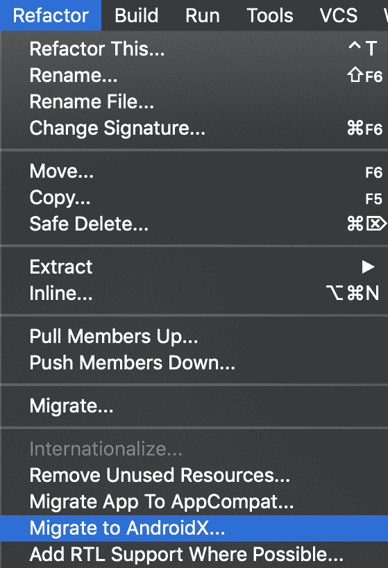

# 迁移到 AndroidX:提示、技巧和指南

> 原文：<https://medium.com/androiddevelopers/migrating-to-androidx-tip-tricks-and-guidance-88d5de238876?source=collection_archive---------0----------------------->


## 充分利用最新的喷气背包。

Jetpack 是一套库、工具和指南，帮助您更轻松地编写高质量的应用程序。Jetpack 通过最佳实践、限制样板代码和简化复杂任务，使编码变得更加容易。所有这些都是为了让您能够专注于您真正关心的代码。

AndroidX 是 Jetpack 中所有库的包名。可以将 AndroidX 视为用于开发、测试、版本化和发布 Jetpack 库的开源项目。

回到 I/O 2018，我们[宣布](https://android-developers.googleblog.com/2018/05/hello-world-androidx.html)支持库将被重构到 AndroidX 名称空间中，这随着支持库 28 和 AndroidX 1.0 的发布而完成。

# 为什么要迁移？

现在是从使用 Android 支持库迁移到 AndroidX 的时候了。这背后有四个原因:

1.  Android 支持库已经走到了生命的尽头。28.0 是 Android 支持名称空间的最后一个版本，不再维护该名称空间。因此，如果您想要以前已经进入支持库的 bug 修复或新特性，您需要迁移到 AndroidX。
2.  更好的包装管理。使用 AndroidX，您可以获得标准化和独立的版本，以及更好的标准化命名和更频繁的发布。
3.  其他库已经迁移到使用 AndroidX 名称空间库，包括 Google Play 服务、Firebase、Butterknife、Mockito 2 和 SQLDelight 等。
4.  所有新的 Jetpack 库都将在 AndroidX 命名空间中发布。因此，例如，为了利用 [Jetpack Compose](https://developer.android.com/jetpack/compose) 或 [CameraX](https://developer.android.com/camerax) ，您需要迁移到 AndroidX 名称空间。

# 准备迁移

在开始迁移到 AndroidX 之前，您应该:

*   备份您的项目。如果你使用的是[源码控制工具](https://source.android.com/setup/develop)，仍然建议你做一个备份，因为迁移会改变你项目中的许多文件。
*   创建一个新分支，在其上进行迁移更改。
*   如果可能的话，在迁移期间暂停或最小化开发(至少不要尝试重构或引入新特性)，因为这将有助于减少可能发生的合并冲突的数量。

# 移动

在整个迁移过程中，重点是解决错误、编译应用程序以及通过所有测试。

# 步骤 1:更新以支持库版本 28

不建议从旧版本的支持库(比如 26 或 27)直接迁移到 AndroidX:不仅需要解决名称空间的变化，还需要解决旧版本和 AndroidX 之间的 API 变化。

因此，建议您更新到版本 28，解决所有的 API 更改，并确保您的应用程序可以与版本 28 一起编译。

Support Library version 28 和 AndroidX 1.0 是二进制等价的，这意味着在这两个版本之间只有包名发生了变化:所有的 API 都是相同的。这意味着从 28 移植到 AndroidX 时，需要修复的东西应该很少。

# 步骤 2:启用 Jetifier

Jetifier 帮助迁移第三方依赖项以使用 AndroidX。Jetifier 将改变这些依赖项的字节码，使它们与使用 AndroidX 的项目兼容。然而，Jetifier 不会改变你的源代码或者迁移你生成的代码。

要在您的应用中启用 Jetifier，请将以下内容添加到您的`gradle.properties`文件中:

```
android.useAndroidX=trueandroid.enableJetifier=true
```

现在，当代码自动完成导入库时，您将导入该库的 AndroidX 版本，而不是旧的支持库版本。

# 第三步。更新依赖关系

在开始迁移之前，您应该将每个第三方库(如 Butterknife、Glide、Mockito 2 和 SqlDelight)更新到库的最新版本。不这样做可能会导致无法解释的编译错误。

如果你使用的是代码生成库，Jetifier 不会修改这些。因此，您需要检查代码生成库是否与 AndroidX 兼容。

如果您考虑跳过步骤 2 和 3，以下是您可能会遇到的一些错误:

*   您使用的第三方代码与 AndroidX 不兼容。在这种情况下，类似于下面的堆栈跟踪将向您显示它正在尝试拉入旧版本的支持库:

```
…Error : Program type already present: android.support.v4.app.INotificationSideChannel$Stub$Proxy |Reason: Program type already present: android.support.v4.app.INotificationSideChannel$Stub$Proxy…
```

*   如果您有一个部分迁移的项目，您可能会得到一个重复的类错误，它试图从支持库和 AndroidX 中获取相同的代码。堆栈跟踪将显示如下内容:

```
…Duplicate class android.support.v4.app.INotificationSideChannel found in modules classes.jar (androidx.core:core:1.0.0) and classes.jar (com.android.support:support-compat:28.0.0)…
```

# 步骤 4:更新你的源代码

您有 3 种选择来更新您的源代码以使用 AndroidX:

*   安卓工作室
*   手动更新
*   Bash 脚本

如果你使用 Android Studio 3.2 稳定版或更高版本，你可以使用**重构**菜单上的**迁移到 AndroidX** 选项来更新你的源代码。这是推荐的方法，因为 Android Studio 可以检查您的源代码，以便在重构时做出正确的决定。



如果您不使用 Android Studio 或采用更复杂的应用程序架构，迁移到 AndroidX 选项不包括这一点，您应该利用[类映射 csv 文件](https://developer.android.com/jetpack/androidx/migrate/class-mappings)来实现查找和替换 bash 脚本。这个脚本应该找到 android.support 类的所有源代码实例，然后用它们的 AndroidX 等价物替换它们。

更具体地说，脚本应该获取提供类映射的 CSV 文件，然后运行一个 grep 命令，后跟一个 sed 命令来替换包名。但是，由于这是一种强力迁移方法，这种基本的查找和替换可能无法充分或正确地完成迁移。

此外，更新也可以手动完成。

如果您决定采用手动方法，请访问迁移到 AndroidX 页面，在这里您可以找到一个[工件映射](https://developer.android.com/jetpack/androidx/migrate/artifact-mappings)，它详细描述了支持库包及其对应的类映射是 AndroidX。您也可以从该页面下载 CSV 文件。

就这样，您现在应该有一个编译和使用 AndroidX 的项目了。

# 那些讨厌的例外

虽然我们在这里讨论的工具和流程应该可以指导大多数应用程序顺利完成迁移，但我们发现，在某些情况下，您可能需要手动进行更改。

# 版本配置文件

您需要手动重新应用定义库版本的变量。举例来说，您的`build.gradle`文件在迁移前可能如下所示:

```
ext.versions = [ ‘drawer’ : ‘28.0.0’, ‘rview’ : ‘28.0.0’]implementation “com.android.support:drawerlayout:${versions.drawer}”implementation “com.android.support:recyclerview-v7:${versions.rview}”
```

然后，在运行迁移工具后，您会得到这样的结果:

```
ext.versions = [ ‘drawer’ : ‘28.0.0’, ‘rview’ : ‘28.0.0’]implementation “androidx.drawerlayout:drawerlayout:1.0.0”implementation “androidx.recyclerview:recyclerview:1.0.0”
```

DrawerLayout 和 RecyclerView 使用的是 AndroidX 包，但是版本号现在是内嵌的。此外，版本变量编号也没有改变。因此，您需要对此进行手动更新:

```
ext.versions = [ ‘drawer’ : ‘1.0.0’, ‘rview’ : ‘1.0.0’
]implementation “androidx.drawerlayout:drawerlayout:${versions.drawer}”implementation “androidx.recyclerview:recyclerview:${versions.rview}”
```

# ProGuard 和构建脚本

迁移工具不会自动更新 ProGuard 和任何相关的构建脚本。所以，如果你正在使用它们，并且其中有包名，你需要手动编辑它们。

# 获取最新的稳定版本

迁移工具引入了 AndroidX 库的最新版本。因此，您可能会得到一些库的 alpha 版本，而不是稳定版本。例如，迁移前的支持库版本可能是:

```
implementation ‘com.android.support:appcompat-v7:28.0.0’
```

迁移后，您将使用相应的 AndroidX 库的 alpha 版本:

```
implementation ‘androidx.appcompat:appcompat:1.1.0-alpha01’
```

因此，如果您更喜欢使用库的稳定版本，您将需要手动更新版本:

```
implementation ‘androidx.appcompat:appcompat:1.0.2’
```

# 更多帮助和资源

您可以在 developer.android.com[迁移到 AndroidX](https://developer.android.com/jetpack/androidx/migrate) 页面上找到关于此过程、工具以及您可能遇到的问题的更多信息。该页面包括 AndroidX 项目的概述、迁移指南、旧支持库到新的 stable 和 alpha AndroidX 版本的映射表以及编写迁移脚本所需的 CSV 文件。

在其他地方，也有一篇文章详细介绍了格子示例项目中[向 AndroidX 的迁移。](/androiddevelopers/cross-stitching-plaid-and-androidx-7603a192348e)

最后，还有一个[问题追踪器](https://issuetracker.google.com/issues?q=componentid:460323)，在那里你可以看到团队正在处理的迁移工具问题。当然，您可以使用页面左上角的按钮，在此报告您在迁移工具中发现的任何问题。

# 最后的想法

如果您还没有升级到 AndroidX，这是一个很好的时机，可以利用 Jetpack 库为您的应用程序提供的简化开发。通过遵循本文中的指导，您应该会发现，在大多数情况下，迁移是一件简单易行的事情。

你对安卓有什么想法吗？请在下面的评论中告诉我们，或者使用#AndroidStudio 发推文，我们将从@AndroidDev 回复，在那里我们定期分享关于如何在 Android 上取得成功的新闻和提示。