# 迁移到 Android 的材料组件

> 原文：<https://medium.com/androiddevelopers/migrating-to-material-components-for-android-ec6757795351?source=collection_archive---------0----------------------->

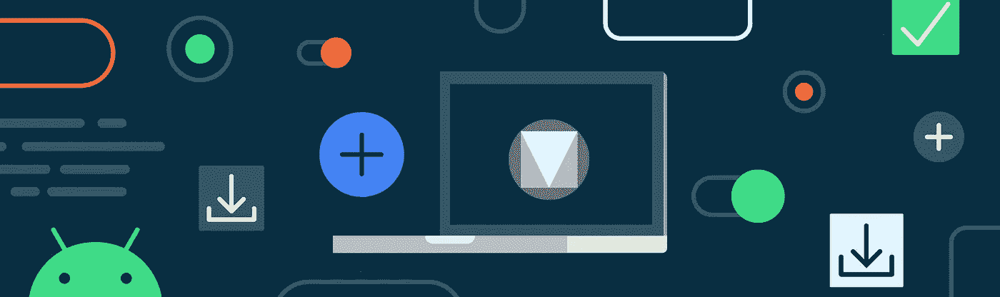

Illustration by [Molly Hensley](https://twitter.com/molly_hensley)

## 来自设计支持库👉MDC `1.0.0`👉MDC `1.1.0`及以后

*这篇文章也发布在* [*材质设计博客*](https://material.io/blog/migrate-android-material-components) *。*

我们最近[宣布了](/google-design/material-design-components-for-android-1-1-0-are-now-available-45e1d576037c) [材质设计组件](https://github.com/material-components/material-components-android)(MDC)`1.1.0`——这是一个库更新，为你的 Android 应用程序带来了[材质主题](https://material.io/design/material-theming/overview.html)，新的小部件，黑暗主题支持和其他令人兴奋的功能。

MDC 取代了设计支持库。本指南将向您展示如何迁移您的代码库，以便您可以利用新的属性、样式和小部件。如果你在 MDC `1.0.0`上，这也提供了必要的迁移到`1.1.0`的步骤。请务必查看我们相应的视频指南！

# 一个简化的主题示例

本指南使用一个简化的应用程序来演示迁移过程。它使用一个 AppCompat 主题、来自设计支持库的小部件(包括一个带有自定义背景的按钮)以及其他各种需要迁移的元素。我们将从使用传统 AppCompat 模板的应用程序主题开始:

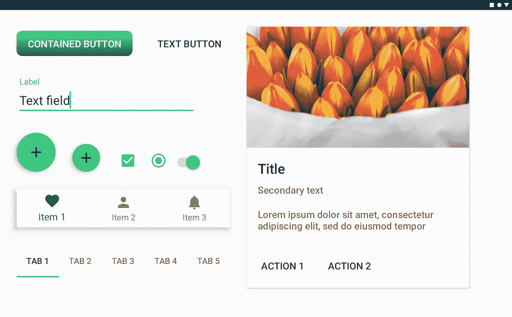

Example app using AppCompat and the Design Support Library

# 从支持库迁移到 Jetpack


在使用 MDC 之前，您需要从支持库迁移到 [Android Jetpack](https://developer.android.com/jetpack/) 。Jetpack 使用新的`androidx.*`名称空间，并将以前的支持库包拆分为单独维护的、语义版本化的库，提供了功能对等性和新的库。MDC 是用 AndroidX 库构建的，所以迁移是强制性的。

要迁移到 AndroidX，我们建议遵循[官方开发者文档](https://developer.android.com/jetpack/androidx/migrate)或观看来自 Android Dev Summit’19 的[“迁移到 AndroidX:时机成熟”演讲](https://www.youtube.com/watch?v=Hyt7LR5mXLc)。Android Studio 中的**Refactor>Migrate to AndroidX’**工具会将您的设计支持库依赖项重构到 MDC。

***注意:*** *版本为* `*1.0.0*` *的 Jetpack 和 MDC 构件都是二进制兼容的支持库* `*28.0.0*` *构件。如果您不是 28 版，我们建议您先升级到 28 版，然后再进行迁移。*

# 更新到 MDC `1.0.0`


如果您在 Jetpack 迁移期间使用了 Android Studio**‘重构>迁移到 Android x’**工具，那么您的设计支持库依赖项应该已经映射到 MDC `1.0.0`，您可以跳过这一部分。

否则，您将需要手动更新您的依赖关系:

您还需要将设计支持库类的任何用法的包名称空间(在 XML 布局和代码中)从`android.support.design.*`更改为`com.google.android.material.*`。为此，请看一下[类映射表](https://developer.android.com/jetpack/androidx/migrate/class-mappings#androidsupportdesign)。

# 改变你的主题

您需要确保您的应用程序主题继承自材料组件主题。这同样适用于您项目中可能有的任何附加主题和[主题覆盖图](/androiddevelopers/android-styling-themes-overlay-1ffd57745207)。

如果您以前使用的是 AppCompat 主题变体，那么 MDC-Android 主题变体将与它们一一对应。在大多数情况下，只需用`MaterialComponents`替换掉父节点的`AppCompat`部分。

请参见下面的完整主题和主题叠加映射表:

## 示例更新


Example app using MDC 1.0.0 and Theme.MaterialComponents.* theme

# 按钮变化

在将我们的依赖项更改为 MDC `1.0.0`并将我们的应用程序主题从`Theme.MaterialComponents.*`继承之后，我们可以观察到示例应用程序中按钮的一些意外变化。我们已经失去了我们的客户背景！他们现在大多使用绿色强调颜色，并在文本标签中使用更宽的字母间距。

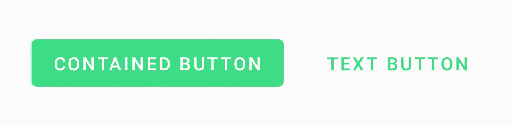

Buttons in MDC 1.0.0

为了理解为什么会发生这种情况，我们需要先来看看我们是如何在布局中添加这些按钮的(作为框架`<Button>` s):

这是怎么回事？🤔

## MDC 小部件和自动膨胀

像 AppCompat 一样，MDC 将在膨胀期用 MDC 等价物替换*一些*框架部件。这使得发布新的特性和错误修复成为可能，而不必将所有的声明换成新的类型。这是通过`[AppCompatViewInflater](https://developer.android.com/reference/androidx/appcompat/app/AppCompatViewInflater)`的扩展`[MaterialComponentsViewInflater](https://github.com/material-components/material-components-android/blob/master/lib/java/com/google/android/material/theme/MaterialComponentsViewInflater.java)`完成的。

请参见下面的完整小部件自动膨胀映射表:

***注:****MDC 中的* `*1.0.0*` *只有* `*Button*` *被替换了。上面的其他小部件是在库的后续版本中添加的。*

我们的示例应用之前用`<AppCompatButton>`替换了框架`<Button>`，因为我们有一个`Theme.AppCompat.*`主题。迁移到`Theme.MaterialComponents.*`主题后，它变成了`<MaterialButton>`，拥有更新的默认风格。

与`AppCompatButton`不同，`MaterialButton`直到 MDC-Android 的[发布](https://github.com/material-components/material-components-android/releases/tag/1.2.0-alpha06) `[1.2.0-alpha06](https://github.com/material-components/material-components-android/releases/tag/1.2.0-alpha06)` [才支持自定义背景。这将在下面的**“形状”**一节中详细介绍，并提供了解决方法。](https://github.com/material-components/material-components-android/releases/tag/1.2.0-alpha06)

我们将暂时保持原样。

# 更新到 MDC `1.1.0`

一个*批次*在`1.0.0` 和`1.1.0`之间的 MDC 中[发生了变化](https://github.com/material-components/material-components-android/releases/tag/1.1.0)！新功能包括:

*   完全的[材质主题](https://material.io/design/material-theming/overview.html#material-theming)支持颜色、字体和形状
*   [黑暗主题](https://developer.android.com/guide/topics/ui/look-and-feel/darktheme)支持
*   Android 10 [手势导航](https://developer.android.com/guide/navigation/gesturenav)插件
*   像[扩展 FAB](https://material.io/develop/android/components/extended-floating-action-button/) 、[日期选择器](https://material.io/develop/android/components/picker/)、[徽章](https://material.io/develop/android/components/badging/)和[切换按钮](https://material.io/develop/android/components/buttons/#toggle-button)这样的新部件
*   可访问性改进、错误修复等等

我们现在准备将我们的 MDC 依赖版本提升到`1.1.0`:

***注意:*** *有些 AndroidX 的依赖项，比如 AppCompat，此时可能也需要更新。虽然没有严格要求，但如果可能，我们建议更新到最新的* [*稳定版本*](https://developer.android.com/jetpack/androidx/versions/stable-channel) *。*

# 一些意想不到的变化和常见问题

MDC `1.1.0`更改了一些默认的小部件样式，以更好地符合材料设计指南。但是，升级后，您可能会注意到某些小部件颜色和其他属性发生了一些意想不到的变化。

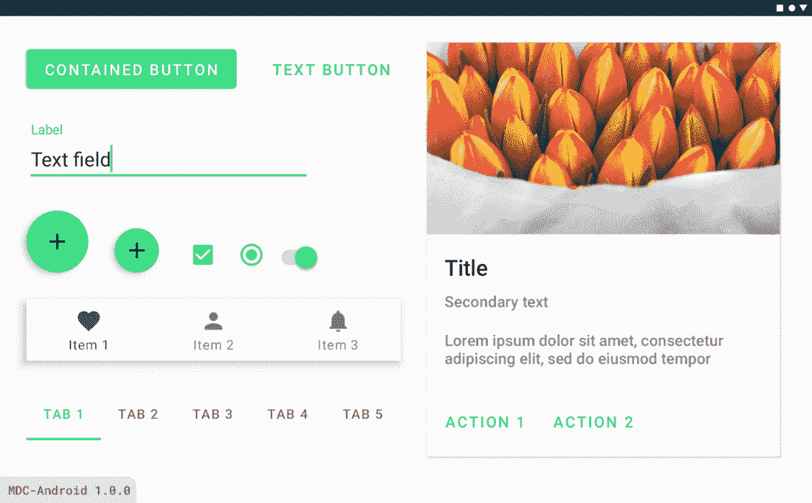

Example app using MDC 1.1.0

在我们上面的例子中，按钮又一次改变了，文本和图标的颜色也改变了，晶圆厂现在是蓝绿色，文本字段看起来完全不同。哦亲爱的！不要担心，您的主题可能缺少一些重要的 MDC 属性，同时也有一些您不再需要的 AppCompat 或 framework 属性。让我们通过一些常见的迁移场景来理解这些问题。

# 文本字段更改

在 MDC 中，文本字段的默认样式已经更改为一个新的改进版本，该版本得到了用户研究的支持。

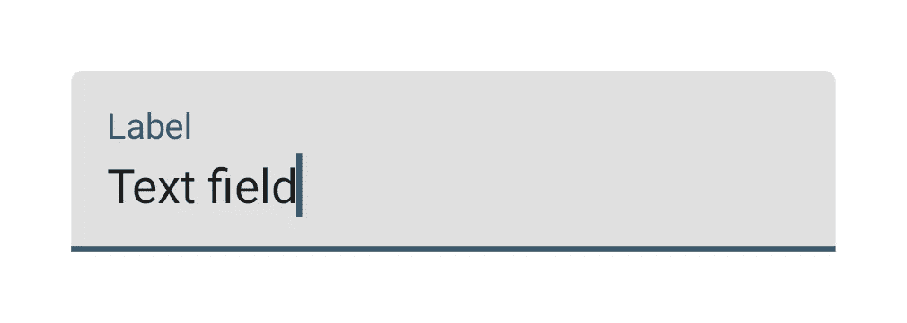

Text fields in MDC 1.1.0+

我们建议坚持使用这个版本，以提高可用性和可配置性。然而，我们意识到这可能不会立即适合您的品牌和设计系统。

要恢复到传统文本字段，请调整布局中的样式以使用设计支持库版本:

或者，您可以将它设为主题中所有文本字段的默认样式:

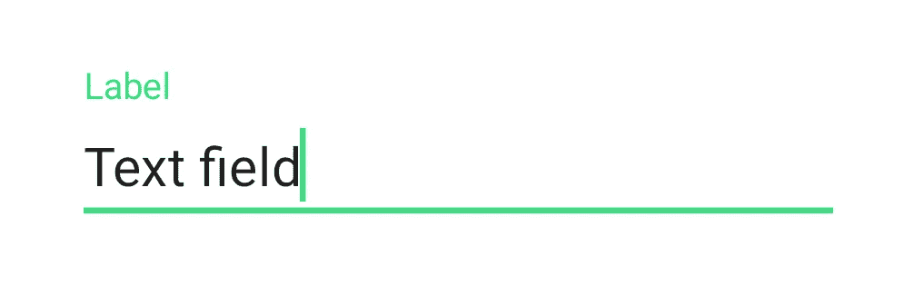

Legacy Design Support Library text field

# 偏好 MDC 样式和小部件

正如我们在上面看到的，以前在设计支持库中的小部件已经成为 MDC 的一部分。在大多数情况下，会有新的`Widget.MaterialComponents.*`样式取代`Widget.Design.*`样式，以及支持附加功能的新属性。虽然选择退出是可能的，但我们建议采用新的 MDC 风格。

对于*不是*设计支持库的一部分的组件，在某些情况下，现在有一个类的材料版本。我们在上面用`AppCompatButton`和`MaterialButton`看到了这一点。如果可能的话，我们建议使用 MDC 类而不是 AppCompat 或框架等效类。默认情况下，这些小部件使用更新的材质设计指南，并支持全套 MDC 属性，这些属性支持材质主题化和其他功能。

您应该考虑以下几种情况:

*   布局中直接使用的小部件应该改为 MDC 版本(参见上面的**“MDC 小部件和自动膨胀”**部分，了解哪些小部件可以作为框架标签保留)
*   任何样式、默认样式和默认样式属性都应该更改为 MDC 版本
*   任何以编程方式使用或作为定制类的父类的小部件都应该更改为 MDC 版本

请参见下面完整的小部件和样式映射表:

请务必查看 MDC 新增部件的完整列表 [Android 组件](https://material.io/develop/android/components)以及使用文档。

## 示例更新

***用 MDC 版本替换小部件***

在我们的示例中，我们需要更改布局中的一些小部件，以使用 MDC 版本:

# 颜色

## 新属性

MDC 调色板直接从[材料设计颜色系统](https://material.io/design/color/)中提取。

作为 MDC-Android、AppCompat 和框架之间共享历史的结果，颜色属性的结果集包括以下内容:

*   适当命名的框架中的现有属性(例如`android:colorBackground`)
*   来自 AppCompat 的已有属性被适当命名(例如`colorPrimary`和`colorError`)
*   MDC 引入的新属性(例如`colorSurface`、`colorOnPrimary`等)。)


MDC color attributes with baseline light theme values

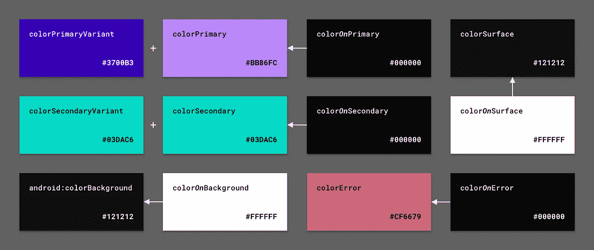

MDC color attributes with baseline dark theme values

MDC 小部件使用这些属性来给它们的背景、文本、图标等着色。了解哪些小部件使用哪些颜色需要检查[源代码](https://github.com/material-components/material-components-android)中的默认小部件样式。

还有一些来自 AppCompat 和框架的颜色仍然存在，但不再适用于这个新系统。主题尽最大努力为仍然依赖它们的小部件移植这些旧属性，例如。

```
<item name="colorAccent">?attr/colorSecondary</item>
```

但是，您应该考虑不推荐使用这些属性；要么使用更合适的 MDC 属性，要么逐步淘汰它们。

请参见下面的全色属性映射表:

## 示例更新

***更新为新的颜色属性***

在我们的示例中，我们需要更新应用程序主题来覆盖首选颜色属性:

***注意:*** *我们并没有覆盖所有的颜色属性，而是依靠默认的*`*colorSurface*`*`*colorError*`*等，这是完全可以接受的。我们也没有指定一个黑暗的主题调色板。**

****在适当的地方使用*** 颜色属性*

*我们还应该从使用`@color`切换到我们包含的按钮文本颜色的一个新的“on”颜色属性:*

*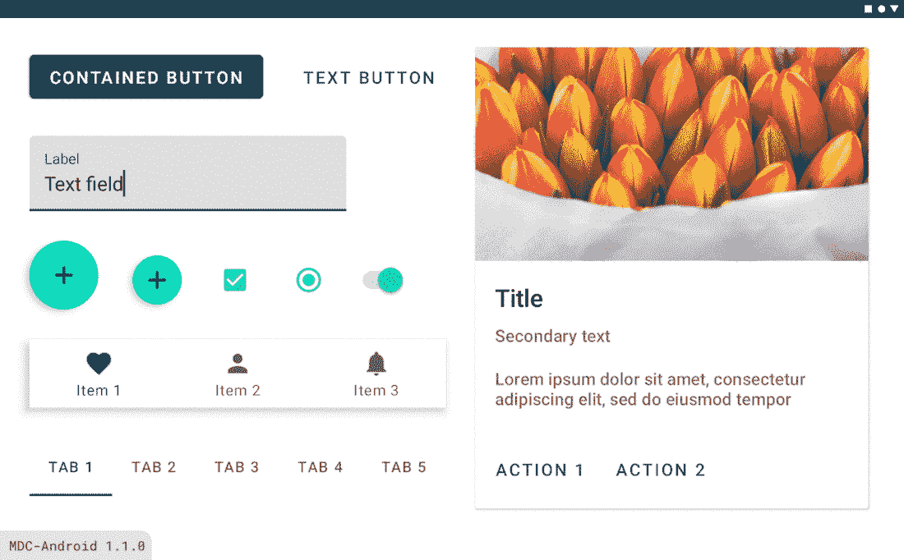*

*Example app with updated MDC color attributes (fixed FAB color)*

# *排印*

## *新的`TextAppearance`风格/属性*

*MDC 类型标尺直接从[材料设计类型系统](https://material.io/design/typography/)中提取。*

*引入了一组新的`TextAppearance.MaterialComponents.*`样式和相应的`textAppearance*`主题属性，它们取代了现有的 AppCompat / framework 样式。*

*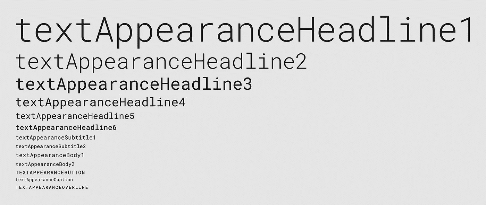*

*MDC type attributes*

*MDC 小部件使用这些属性来样式化文本。要知道哪些部件使用哪种类型的标尺，需要检查[源代码](https://github.com/material-components/material-components-android)中的默认部件样式。*

*请参见下面的完整类型样式和属性映射表:*

## *示例更新*

****更新为新类型属性****

*在我们的示例中，我们需要更新布局中卡片内的`TextView` s，以使用首选类型属性:*

****用字体系列*** 自定义字体刻度*

*我们还可以选择覆盖应用主题中的字体比例，使用自定义字体系列，通过 Android Studio 下载 [XML](https://developer.android.com/guide/topics/ui/look-and-feel/fonts-in-xml) 或[可下载的](https://developer.android.com/guide/topics/ui/look-and-feel/downloadable-fonts)字体:*

****注意:*** *对于这个例子，我们只覆盖了一些类型刻度。如果您正在使用自定义字体，我们建议您覆盖* [*所有字体比例*](https://github.com/material-components/material-components-android/blob/master/lib/java/com/google/android/material/typography/res/values/attrs.xml) *以保持品牌一致性。**

**

*Example app with updated MDC type attributes (updated font family)*

# *形状*

## *`ShapeAppearance`风格/属性*

*[材料设计形状系统](https://material.io/design/shape/)是一种对 MDC 部件的边角进行处理的方法，分为小型、中型和大型组件类别。*

*这采用了 Android `ShapeAppearance.*`风格的形式，带有相应的主题属性。它们包括一个`cornerFamily` — `rounded`或`cut` —和`cornerSize*`作为尺寸。*

*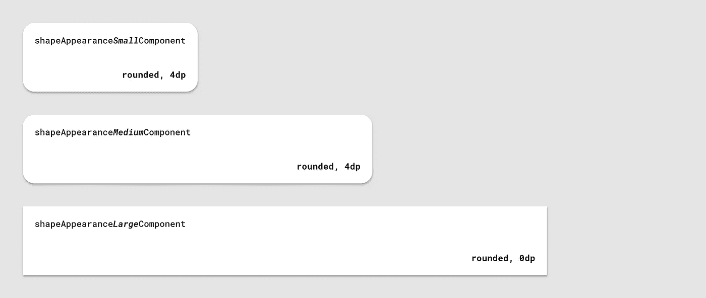*

*MDC shape attributes*

*MDC 小部件使用这些属性来设计它们的背景。要知道哪些小部件适用于哪些形状类别，需要检查[源代码](https://github.com/material-components/material-components-android)中的默认小部件样式。*

## *小部件背景*

*实现这个功能的类是`[MaterialShapeDrawable](https://github.com/material-components/material-components-android/blob/master/lib/java/com/google/android/material/shape/MaterialShapeDrawable.java)`。默认情况下，所有 MDC 小部件都使用这个 drawable 作为背景，您也可以考虑将它用于自定义视图。它处理形状主题，背面阴影渲染，黑暗主题海拔覆盖和更多。*

*因此，我们建议不要在 MDC 小部件上使用带有定制 XML drawables 的`android:background`，因为这将覆盖`MaterialShapeDrawable`。您可能会注意到，大多数 MDC 小部件的默认样式指定*

```
*<item name="android:background">@null</item>*
```

*为了避免这种情况。相反，更喜欢使用`shapeAppearance` / `shapeAppearanceOverlay`和`backgroundTint`属性来调整背景形状和颜色。*

*然而，也有例外:*

*   *如上所述，`MaterialButton` [忽略了](https://issuetracker.google.com/issues/127420890) `[android:background](https://issuetracker.google.com/issues/127420890)`直到[发布 MDC-Android](https://github.com/material-components/material-components-android/releases/tag/1.2.0-alpha06) 的 `[1.2.0-alpha06](https://github.com/material-components/material-components-android/releases/tag/1.2.0-alpha06)` [。如果您在使用早期版本的库时需要此功能，我们建议您在布局中明确使用`AppCompatButton`。](https://github.com/material-components/material-components-android/releases/tag/1.2.0-alpha06)*
*   *`MaterialShapeDrawable` [不支持渐变](https://issuetracker.google.com/issues/134526677)。如果你的品牌要求这样，使用`android:background`和`GradientDrawable`是你最好的选择。*

## *示例更新*

****删除不支持形状主题化的背景属性****

*在我们的示例中，我们可以删除一些现在由形状主题化处理的小部件属性:*

****用角族和尺寸*** 自定义形状*

*我们还可以选择在应用主题中覆盖形状样式，以表达我们的品牌:*

*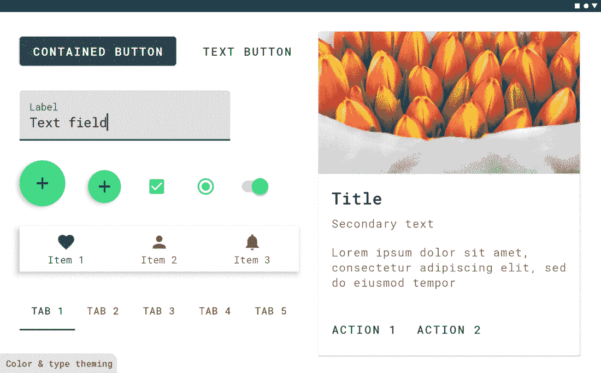*

*Example app with updated MDC shape attributes (updated corner radii)*

****恢复按钮自定义渐变背景****

*最后，下面是如何通过显式使用`AppCompatButton`(以及新的 MDC 按钮类型主题化属性)来恢复我们的按钮的自定义渐变背景:*

*如果你使用的是 MDC-Android `1.2.0-alpha-06`(或更高版本)，那么你可以依靠`MaterialButton`尊重`android:background`。请记住，您可能需要清除`backgroundTint`(在`Widget.MaterialComponents.Button`默认样式中设置为`colorPrimary`):*

**

*Button with restored custom gradient background*

# *下一步是什么？*

*我们已经成功地完成了从设计支持库到 MDC `1.0.0`并最终到 MDC `1.1.0`的迁移过程。我们已经移植了 AppCompat 的用法，并且使用了材料主题。*

*我们鼓励您尝试 MDC 中不属于设计支持库的新部件和特性。*

*MDC 的下一个特性版本——`1.2.0`——正在进行中，在撰写本文时已经发布了多个 alpha 版本。令人兴奋的新更新包括`[Slider](https://github.com/material-components/material-components-android/blob/master/lib/java/com/google/android/material/slider/Slider.java)`和`[ShapeableImageView](https://github.com/material-components/material-components-android/blob/master/lib/java/com/google/android/material/imageview/ShapeableImageView.java)`组件，以及第一个 Android 版本的[材料运动系统](https://material.io/design/motion/the-motion-system.html)！*

*一如既往，我们鼓励您在 GitHub 上提交[错误报告](https://github.com/material-components/material-components-android/issues/new?assignees=&labels=bug&template=bug_report.md&title=%5BComponent+name%5D+Short+description+of+issue)和[特性请求](https://github.com/material-components/material-components-android/issues/new?assignees=&labels=feature+request&template=feature_request.md&title=%5BComponent+name%5D+Short+description+of+request)。另外，请务必查看我们的 Android [配套示例应用](https://github.com/material-components/material-components-android-examples)和[构建材料主题](https://github.com/material-components/material-components-android-examples/tree/develop/MaterialThemeBuilder)。*

*我们非常鼓励迁移到 MDC `1.1.0`(或更高版本)。如果你已经成功完成了迁移，或者在迁移过程中遇到了困难，请在下面留下评论，或者通过 Twitter[@ material design](https://twitter.com/materialdesign)和 [@AndroidDev](https://twitter.com/AndroidDev) 联系我们。*