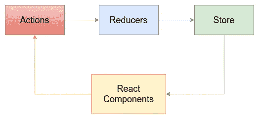

# 迁徙到前方更温暖的时代

> 原文：<https://medium.com/square-corner-blog/migrating-to-warmer-times-ahead-a5f6404fb09f?source=collection_archive---------5----------------------->

> 注意，我们已经行动了！如果您想继续了解 Square 的最新技术内容，请访问我们的新家[https://developer.squareup.com/blog](https://developer.squareup.com/blog)


[Caviar 的](https://www.trycaviar.com)消费者网络前端架构这些年来发生了很大变化。它被构建为一个大型的 [Rails](http://rubyonrails.org/) 应用程序，使用 [Slim](http://slim-lang.com/) 作为模板引擎，并添加了 [jQuery](https://jquery.com/) 和 [CoffeeScript](http://coffeescript.org/) 来处理客户端逻辑。它们是当时使用它们的人最熟悉的工具。

随着现代 web 框架和库的飞速发展，Caviar 的代码库和工程师的技能也在飞速发展。我们已经不再使用[链轮](https://github.com/rails/sprockets)来将我们的网络资产捆绑到令人惊叹的 [Webpack](https://webpack.js.org/) 和 [Yarn](https://yarnpkg.com/) 上，并且我们已经不再使用 CoffeeScript(感谢一个 Square 伙伴编写的救命的[脱咖啡因](https://github.com/decaffeinate/decaffeinate)工具！)转化为现代的 ES6+和[Babel](https://babeljs.io/)——同时保持功能性，这对于一个拥有小型工程团队的大型应用程序来说绝非易事。

最值得注意的是跟随趋势，将更多的逻辑转移到客户端前端，以利用不断增加的浏览器处理能力。早在 2015 年初，我们就在代码库中引入了[React](https://reactjs.org)——当时这还是一项相对较新的技术；如今，流行的开源 UI 库和现代 web 开发的核心方面之一。

React 最好也是最核心的部分之一就是它的灵活性。正如医生在其主页上所说:

> 一次学习，随处写作
> 
> 我们不对您的技术堆栈的其余部分做出假设，因此您可以在 React 中开发新功能，而无需重写现有代码。

这对我们来说太棒了——我们可以在 React 中增量地编写新的东西，利用一个高度活跃的社区，并将我们新的和闪亮的组件集成到我们带有便利包 [react-rails](https://github.com/reactjs/react-rails) 的超薄模板中。我们当时做的选择不会错吧？

# 问题是

过去几年没有改变的是我们对[fluxor](http://fluxxor.com/)的使用。这是一个简洁的小库，实现了 [Flux](https://facebook.github.io/flux/) 应用程序架构，用于处理通过应用程序其余部分的数据流。引用官方 Flux [docs](https://facebook.github.io/flux/docs/in-depth-overview.html#content) 关于该模式如何工作的话:

> Flux 避开 MVC，支持单向数据流。当用户与 React 视图交互时，视图通过中央调度程序将一个动作传播到保存应用程序数据和业务逻辑的各个存储，从而更新所有受影响的视图。这与 React 的声明式编程风格配合得特别好，它允许存储发送更新，而无需指定如何在状态之间转换视图。


Sourced from Fluxxor’s documentation page [here](http://fluxxor.com/what-is-flux.html)

它当时工作得很好，但是随着我们的应用程序变得越来越大，我们在客户端中有越来越多的状态，变得难以跟踪和保持正确——状态的变化使得在出错时调试变得非常困难，并且处理异步调用增加了整个其他级别的复杂性。随着时间的推移，Fluxxor 尤其不适合我们的情况:

*   我们的 Fluxxor 存储(复数)中的突变使得跟踪事情何时发生变化变得异常困难。
*   Fluxxor 要求使用 mixins，React 核心团队的一名开发人员认为这种模式是有害的。这意味着我们仍然依赖 React v15 和`React.createClass()`，这是一个在 React v16 中已经被弃用的 API。
*   自 2015 年 9 月[日](https://github.com/BinaryMuse/fluxxor/blob/master/build/fluxxor.js)以来，Fluxxor.js 库一直没有更新。

我们作为一个团队决定转向另一个流行的管理数据流的选项，即屡试不爽的 [Redux](https://redux.js.org/) 。我不会深究为什么人们会选择使用 Redux 而不是 Flux，但是在这里可以找到一个很好的论据。与 Fluxxor 相比，Redux 有许多明显的优势，包括:

*   一家店，仅此而已。这使得状态更容易跟踪，而不是将多个不同的存储绑定到不同的 flux 实例。
*   状态是不可变的——当我们的状态改变时，这对我们来说是显而易见的，因为每次任何事情改变时，必须返回一个新的状态对象。
*   Redux 得到了积极的维护，文档非常优秀，网上有大量关于 React 和 Redux 的文章= > Redux 生态系统非常简单[令人惊叹](https://redux.js.org/introduction/ecosystem)。被困在一个问题上？肯定有一个堆栈溢出帖子或 Github 问题与这种情况有关。



The Redux Architecture: [Source](https://www.safaribooksonline.com/library/view/javascript-by-example/9781788293969/1dfe8989-b67a-428f-bfcd-a667476f2149.xhtml)


How data flows in a React and Redux Application: [Source](https://www.safaribooksonline.com/library/view/javascript-by-example/9781788293969/1dfe8989-b67a-428f-bfcd-a667476f2149.xhtml)

# 迁移过程

现在，选择使用 Redux 后剩下的唯一工作就是实际使用这个库。


Base gif from [https://media.giphy.com/media/lQRwl2XKnHJWE/giphy.gif](https://media.giphy.com/media/lQRwl2XKnHJWE/giphy.gif)

一次性迁移整个鱼子酱前端是不可行的。代码库太大了——这将花费太长时间，而且会有太多地方出现错误。

为了谨慎起见，我们需要找到代码库的独立部分，我们可以在不影响其他部分的情况下重写这些部分。 [Caviar for Teams](https://www.trycaviar.com/for-companies) 是 Caviar 的一部分，与整个 Caviar 代码库相比，它的代码库相对较小，并且体验完全独立于常规的单一用餐者消费者流。

为了开始我们的迁移过程，我们需要准确理解 Flux 在哪里被使用，以及它是如何与我们的应用程序联系在一起的。值得注意的是，我们知道我们必须改变和重构代码库的以下部分:

*   Flux 存储:为应用程序域维护数据的对象。
*   磁通异或。Flux 类:允许我们访问存储和动作的对象，并管理调度程序。
*   从焊剂存储中接收状态的组件和容器。

对我们来说，从 Flux 到 Redux 的粗略和精确转换开始实验是有意义的——事实证明，从 [Flux 到 Redux](https://redux.js.org/recipes/migrating-to-redux) 的映射过程相对简单。我们的 Flux 动作可以映射到一个等价的 Redux 动作，我们的 Flux 存储可以映射到 Redux reducers，最后，我们的 React 组件可以重写为使用 Redux。

我们准备好开始迁移了。


Photo by [William Stitt](https://unsplash.com/@willpower?utm_source=medium&utm_medium=referral) on [Unsplash](https://unsplash.com?utm_source=medium&utm_medium=referral)

# 行动

Redux 和 Flux 中的动作只是指

> …代表改变状态的意图。

> 动作是将数据放入存储的唯一方式。

> …表示在 Flux 应用程序中执行一些数据操作的意图…

> 更新商店的唯一方法是向他们发送操作。

下面给出了一个在我们的 Flux 类中如何创建同步和异步动作的例子。

我们的 React 组件包含一个对 SampleFlux 类的引用，并调用`flux.actions.syncAction(...)`和`flux.actions.asyncAction(...)`来触发更新 Flux 存储的调用(下面组件部分中的示例)。

将同步 Flux 动作映射到 Redux 动作非常简单；Flux 中的函数`syncAction`用动作类型和商店的有效负载数据调用`this.dispatch`，而 Redux 中的`syncAction`只是返回一个包含类型和有效负载的对象。

为了将异步动作映射到我们的 Redux 动作，我们使用了一个名为 [redux-thunk](https://github.com/gaearon/redux-thunk) 的助手库来帮助将我们的异步动作创建器映射到一个可以像同步动作创建器一样被调用的版本中。我们还可以重用我们现有的用于进行 HTTP 调用的服务。

这些动作被绑定到 Redux 的`[bindActionCreators](https://redux.js.org/api-reference/bindactioncreators#somecomponent.js)()`函数提供的 dispatch 函数，并通过 React-Redux 的`[connect()](https://github.com/reactjs/react-redux/blob/master/docs/api.md#connectmapstatetoprops-mapdispatchtoprops-mergeprops-options)`作为道具传递给组件。通过这样做，只需调用`this.props.syncAction(…)`和`this.props.asyncAction(…)`来触发 Redux 存储中的更新，就可以从 React 组件中分派动作(下面组件部分中的示例)。

# 还原剂

Reducers 是函数式编程世界中的纯函数。

> *缩减器*(也称为*缩减功能*)是接受累加值并返回新累加值的功能。它们用于将值集合缩减为单个值。
> 
> 在 Redux 中，累加的值是状态对象，被累加的值是动作。给定以前的状态和一个动作，Reducers 计算新的状态…

> 还原器是 Redux 中最重要的概念。

将 Flux stores 中的数据直接从突变转换为 Redux reducers 并保持不变性肯定比转换动作复杂得多。然而，我们的 Flux 存储中的许多逻辑可以在我们的 reducer 中重用，从纯函数的角度考虑状态更新立即使推理变得更容易——我们确切地知道 reducer 进出了什么，因为它们没有副作用！

在我们的 Flux 存储中，我们初始化我们的状态，并将我们监听的每个动作类型绑定到一个相关的处理函数。在我们的处理函数中，我们改变了状态，并发出一个 change 事件，用新的状态更新我们的组件。

现在，在 Redux 中，当 reducer 监听并接收具有某种动作类型的动作时，它将根据该动作类型执行一个 switch 语句，并在正确的 case 语句中执行一些逻辑。根据状态是否改变，缩减器或者返回一个带有更新值的新创建的状态副本，或者返回现有状态以指示没有改变。

根据存储的复杂程度，我们可以通过 reducer 组合来分解映射的 reducer，以保持逻辑的可读性和清晰性，或者将状态完全分离成两个或更多个 reducer，并使用 Redux 的`combineReducers`将较小的 reducer 组合成一个较大的 reducer。这就是我们将通量储备改为减速器的方法。

Flux store 和 Redux reducer 之间的显著差异包括:

*   考虑与在 Flux 架构下直接改变状态相比，如何在 Redux 架构下将状态视为不可变的。这意味着如果状态已经通过`Object.assign()`或扩展操作符`…`更新，则总是返回一个新的状态。
*   在 Flux 中显式发出变更事件的样板文件现在已经不存在了`this.emit('change')`！Redux 为我们处理发布，所以代码更短，重复性更少。

在这一点上，我们还添加了[选择器](https://github.com/reactjs/reselect)来返回状态的特定部分，并对可以记忆的状态执行计算，以提高性能。

# 成分

最后但同样重要的是，我们必须重构我们的容器和组件，以从 Redux 而不是 Flux 接收状态。在我们的组件通过 mixins 直接从 Flux stores 接收状态并到处使用`this.state`之前，我们的组件现在将通过 Redux 的`connect()`传递的 props 接收 Redux 状态并使用`this.props` 来代替。

因此，以下组件与通量相关联—

变成了以下连接到 Redux 的组件—

我们完事了。将 Flux 映射到 Redux 的第一步在我们更新组件后结束，它们已经成功渲染并通过了我们的测试(您应该有很多测试！).


Photo by [Massimo Sartirana](https://unsplash.com/@sarti46?utm_source=medium&utm_medium=referral) on [Unsplash](https://unsplash.com?utm_source=medium&utm_medium=referral)

# 外卖食品

不变性是如此难以实施！状态对象变得越深，需要做的复制就越多，以确保对需要改变的数据的引用被更新。我遇到了许多奇怪和错误，我的选择器没有更新，组件没有重新呈现，因为状态被意外地改变了，reducers 没有返回新的状态对象。

我将 [Immutable.js](https://facebook.github.io/immutable-js/) 引入到我编写的归约器和选择器中。它保证了我所期望的不变性(哇哦！)，但我注意到一些问题:

*   Immutable 的 API 对原生 JavaScript 不太友好。尽管可以用点符号访问常规 JS 对象的属性，但不可变需要使用特殊的 getter ( `.get(), .getIn()`)和 setter ( `.set(), .setIn(), .merge(), .update()`)函数。地图对象。而对于 JS 对象，人们可以在缩减器中的 case 语句的末尾做如下事情，

```
[ACTION_TYPE]: (state) => {
  return {
    ...state,
    someNestedObject: {
      someKey: true,
    },
  };
}
```

在不可变中，我们必须做一些事情，比如:

```
[ACTION_TYPE]: (state) => {
  return state.setIn(['someNestedObject, 'someKey'], true);
}
```

这会变得很棘手。虽然我过去使用过不可变的，现在也很适应，但不是所有的队友都这样，因此有一个必须考虑的陡峭的学习曲线。

*   不可变引入了大量的范围蔓延。它不仅影响你的 reducers 和选择器中的几乎所有东西，为了获得库的性能优势，你还应该把不可变的数据结构传递到你的组件中。这是一项艰巨的任务，因为我们的组件期望常规的 JS 对象和数组，而不是不可变的映射和列表(get/set 的 API 完全不同)。这将需要很长时间来重构我们所有的组件，坦白地说，我们没有足够的资源来做这件事。

为了解决这个问题，我们考虑在选择器的末尾使用`.toJS()`,这样我们就可以将常规的 JS 对象和数组传递给我们连接的组件，这样我们就不必修改现有组件中的逻辑。然而，任何对`.toJS()`的使用都会对您的应用程序造成性能上的影响，并且首先会消除不可变提供的许多性能优势。

尽管在我们的整个应用程序中引入 Immutable.js 会消除一些关于数据可变性的问题，并给我们的组件带来性能上的好处(浅相等检查比深相等检查更快！)，我们最终决定暂时隐藏不可变的，并在将来的另一次访问中重新访问这个库。关于这个非常确切的主题(不可变的. js 或不可变的. js)的一个很好的文章和链接集合可以在[这里](https://redux.js.org/recipes/using-immutable.js-with-redux)找到。

# 未来的步骤

既然我们的应用程序正在 Redux 上工作，是时候开始考虑清理我们的前端架构和设计了。我们需要弄清楚在 Redux 中存储什么状态(比如全局应用程序状态)，以及将什么状态移动到各个组件(本地化/UI 状态)。这意味着要重新设计我们的状态对象，因此我们决定在迁移之后再做这件事。我们还需要开始将大量计算从 React 组件中移出，并将它们存储在选择器中，以获得进一步的性能提升。

将来，我们肯定会考虑添加 Immutable.js 来处理不可变 Redux 状态的保证。其他东西还包括持久性( [redux-persist](https://github.com/rt2zz/redux-persist) )、路由( [react-router](https://reacttraining.com/react-router/) )，以及升级到 React 16.3 以利用新的东西和性能提升(如纤程和新的生命周期方法以及异步渲染，我非常兴奋地使用)！

# 摘要

在这篇博文发表时，Caviar for Teams 企业体验已经完全脱离了 Flux，转而支持 Redux，现在处于一个特性标志之下。在不久的将来，[trycaviar.com](https://www.trycaviar.com)的其余部分将慢慢从 Flux 迁移到 Redux，并有望让我们创造和保持用餐者期待和信任我们的愉快体验。

感谢[尼尔森·克雷斯波](https://medium.com/u/b8137d8ad34e?source=post_page-----a5f6404fb09f--------------------------------)、[项瑾·邹](https://medium.com/u/c3c6c4d10206?source=post_page-----a5f6404fb09f--------------------------------)、[凯斯·朱](https://medium.com/u/53020358d869?source=post_page-----a5f6404fb09f--------------------------------)、梅德琳·昂、[沈婷·陈](https://medium.com/u/d5b7f179363e?source=post_page-----a5f6404fb09f--------------------------------)以及鱼子酱团队的其他成员。