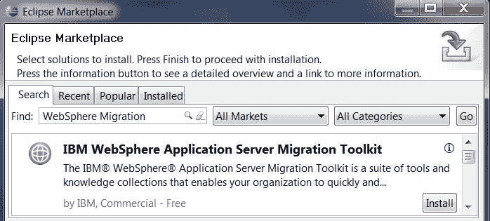
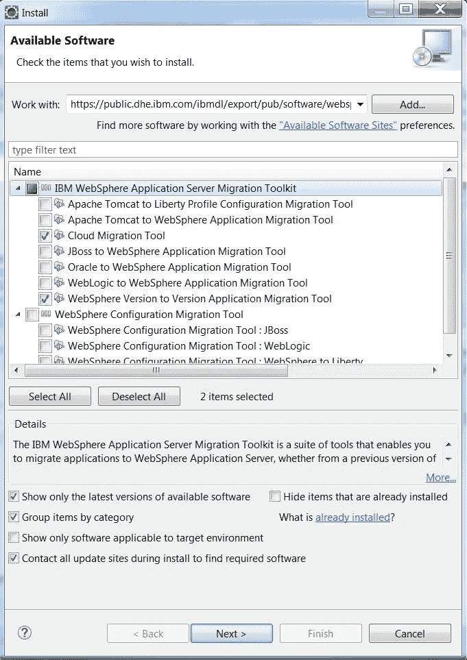
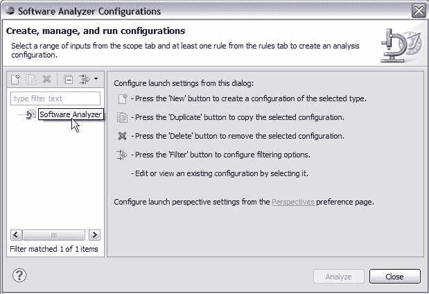
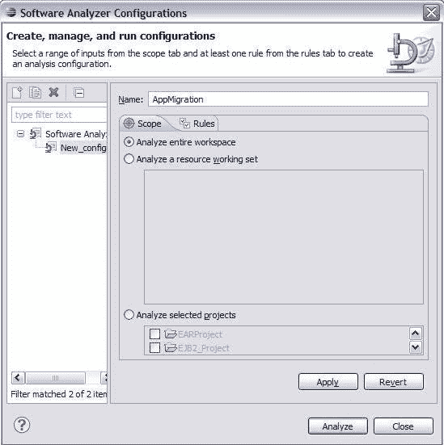
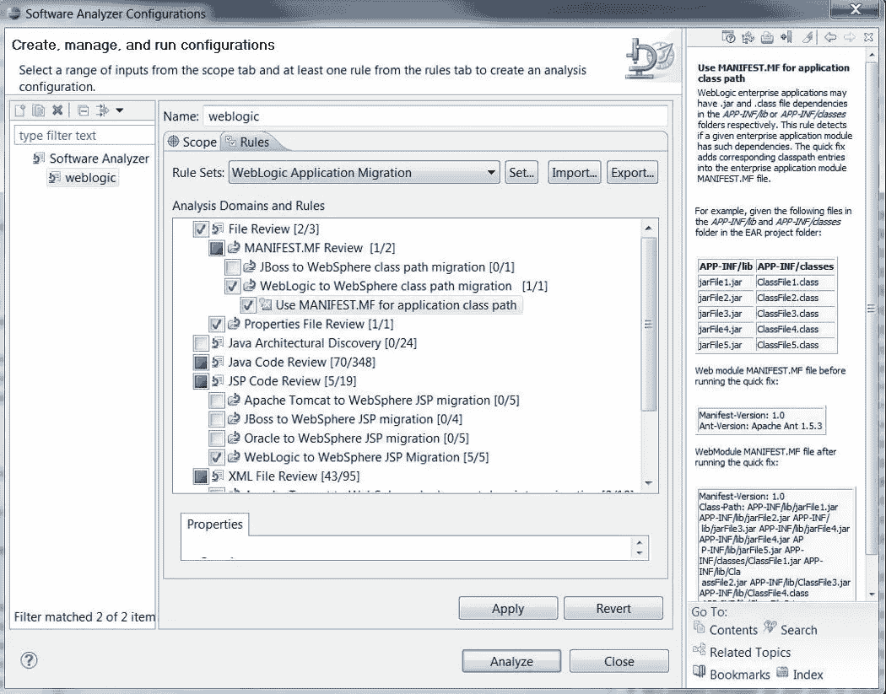
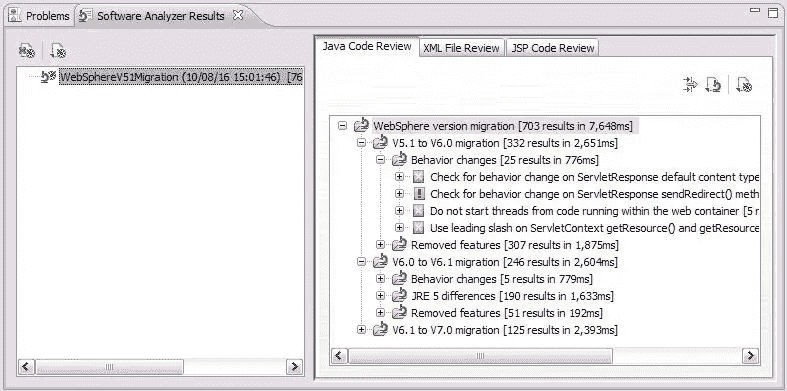
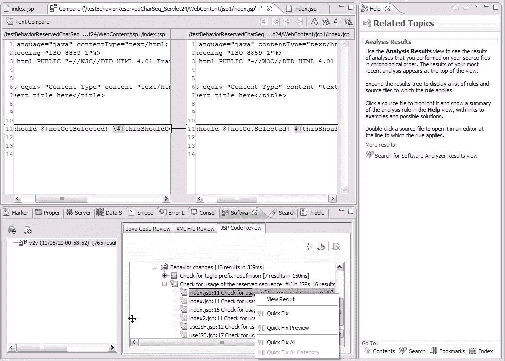
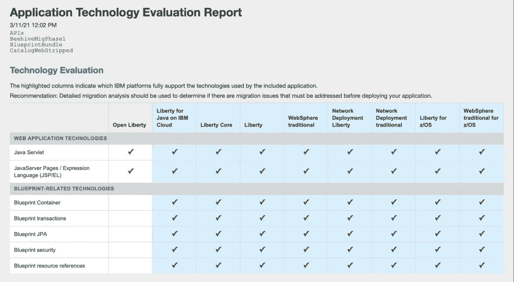

# 从 IBM WebSphere 传统服务器到 WebSphere Liberty 服务器的迁移

> 原文：<https://medium.com/globant/migration-from-ibm-websphere-traditional-server-to-websphere-liberty-server-9ffd7bf997d4?source=collection_archive---------2----------------------->

大家好！！我在这里总结一下我的经验，以及我在如何将 35-40 分钟的部署时间缩短到几分钟的过程中所学到的东西。

# 迁移需求

您一定想知道为什么首先需要迁移。为了澄清这个想法，我将从我在 WAS 8.5.5 应用服务器上的奋斗开始。我是一名后端开发人员，每天与应用服务器打交道。所以在我们的项目中，我们有一个巨大的具有许多特性和功能的整体遗留应用程序。在本地部署应用程序并测试更改大约需要 35-40 分钟。是啊！！！您没听错，仅部署一个后端组件就需要 35 到 40 分钟。然后，我决定寻找更好的应用服务器，它们是轻量级的、健壮的，最重要的是，启动时间更快。

# 为什么是自由？

让我们简单地理解一下作为应用服务器的 IBM WebSphere liberty 的优势:

1.  **内核架构** —内核架构意味着运行时启动非常小且快速，然后根据需要增长。通常，Liberty 服务器需要大约 50MB 的内存，启动时间不到 3 秒，这使得它成为启动时间更快的应用服务器。
2.  **功能管理器** —应用服务器功能被实现为功能。特征管理器根据需求加载特征。请参考下面的链接，了解有关各种可用功能的详细信息 [Liberty 功能— IBM](https://www.ibm.com/docs/en/was-liberty/core?topic=management-liberty-features)
3.  **WebSphere Liberty Repository**—特性根据需要直接从 IBM 下载。
4.  **动态更新** —只要 server.xml 中包含任何新特性，特性管理器就会加载它，而无需实际重启服务器，使其成为动态的。
5.  **安装简单** —要安装运行时，只需解压一个归档文件。
6.  **简单部署** —放入应用程序/将应用程序包含在 server.xml 中，服务器运行它。
7.  **配置简单** —根据需求需要的所有特性都可以添加到 server.xml 中，这样就很容易处理了。

# 迁移步骤

IBM WebSphere Application Server Migration Toolkit 提供了一组丰富的工具，可以帮助您在 WebSphere Application Server 版本之间将应用程序从第三方应用服务器迁移到 WebSphere Application Server Liberty。

## 安装迁移工具

迁移工具是 Eclipse 特性，您可以将其安装到现有的 [Eclipse](http://www.eclipse.org/) 或 Rational 集成开发环境(IDE)中。*使用 Java/Jakarta EE 应用程序需要 Eclipse IDE for Enterprise Java Developers*。

您可以直接从 [Eclipse Marketplace](https://www.ibm.com/links?url=http%3A%2F%2Fmarketplace.eclipse.org%2Fcontent%2Fibm-websphere-application-server-migration-toolkit) 安装迁移工具包的所有特性。以下步骤描述了安装步骤:

*   访问迁移工具软件。您可以直接从 Eclipse Marketplace 安装该工具。

1.  去**帮助> Eclipse Marketplace** 。
2.  搜索 WebSphere 迁移。
3.  在 IBM WebSphere Application Server Migration Toolkit 下，单击 **Install** 。

Accessing the migration tool software from Eclipse Marketplace

*   展开**IBM WebSphere Application Server Migration Toolkit**，选择版本到版本应用服务器迁移所需的工具。确保**在安装过程中联系所有更新站点以找到所需软件**被选中，并点击**下一步**。

Installing Migration tool through Eclipse Marketplace

*   在安装详情窗口中，点击下一步的**。**
*   阅读“查看许可”窗口中的条款，并接受任何许可协议。点击**完成**。“安装软件”窗口显示安装进度。
*   当显示软件更新窗口时，点击**是**重启 IDE。

## 为分析配置应用程序迁移工具

安装了应用程序迁移工具后，您可以使用新的分析选项来配置和运行分析。您可以配置该工具来定义一组要运行的规则，并定义工作空间内的分析范围。范围可以是一个项目、一个工作集或者整个工作区。定义范围后，您可以保存分析配置以供以后使用或修改。

要配置分析，请完成以下步骤:

*   打开分析配置选项。您可以在 Eclipse 中的以下位置访问配置选项:

1.  在主 Eclipse 菜单栏中，进入**运行** > **分析**。
2.  在**启动**工具栏中，点击**软件分析器图标**并选择**软件分析器配置**。
3.  在 Explorer 视图中，右键单击您的项目并选择**软件分析器** > **软件分析器配置**。如果您没有看到软件分析器选项，请参见[软件分析器选项未显示](https://www.ibm.com/docs/en/SSRQNQ/troubleshooting/optionsNotShown.html#optionsNotShown)。
    您可以使用窗口中的图标添加或删除分析配置。

Creating a Software Analyzer Configuration

*   在配置列表中，选择**软件分析器**。然后，点击**新建。**窗口右侧变为显示基本配置界面。

Setting up the Configuration

*   在“软件分析器配置”窗口中，输入配置的名称，如 AppMigration。
*   在**范围**选项卡上，选择**分析整个工作区**扫描工作区中的所有项目。您可以通过使用其他选项来分析工作集或项目选择，从而限制分析的范围。
*   在**规则**选项卡上，使用**规则集**列表选择要执行的分析类型。您也可以选择要运行的单个规则。

Selecting Rules

*   要保存规则配置，点击**应用**。

## 分析用于迁移的代码

运行分析并显示结果。在软件分析仪配置窗口中点击**分析**开始分析。结果显示在软件分析结果视图中。

Java Code Review Results View

结果视图的内容根据您运行的规则而有所不同。应用程序迁移工具生成的结果显示在以下选项卡之一中:

*   文件审查
*   Java 代码审查
*   JSP 代码审查
*   XML 文件审查

如果面板中未显示任何结果，则扫描时未发现任何问题。

右键单击单个结果以显示可用的选项，例如查看出现问题的源代码或使用提供的修复程序来纠正问题。

Result options with Quick Fix Preview and Help

基于审查，用户可以查看结果，并且快速修复可用于单独的审查部分。

## 应用程序源迁移工具包中的应用程序技术评估报告

安装任何迁移工具后，您都可以生成一个报告，帮助评估您的应用程序所使用的 Java 技术。该报告对应用程序中的编程模型以及支持这些编程模型的 WebSphere 产品进行了高级回顾。

要生成报告，请执行以下操作:

1.  点击**运行** > **生成应用技术评估报告**。
2.  选择要评估的项目。
3.  选择您想要比较的 WebSphere 产品。
4.  点击**确定**。

Application Technology Evaluation Report

报告中的行因应用程序而异。

# 结论

迁移完成后，服务器启动时间从 **40 分钟**减少到大约 **5 分钟**，这是一个巨大的差异。从开发人员的角度来看，它节省了大量时间，并逐渐提高了应用程序的性能。