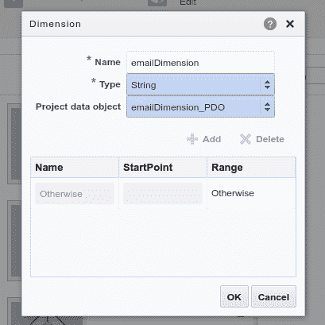

# 从 Oracle BPM 迁移到 Oracle 自主集成云—简化云中的流程自动化

> 原文：<https://medium.com/oracledevs/migration-from-oracle-bpm-to-oracle-autonomous-integration-cloud-streamlining-process-automation-210525081e7c?source=collection_archive---------0----------------------->

在我的上一篇博文[将您的 Oracle BPM 资产迁移到 Oracle Process Cloud Service(PCS)](https://andreboaventurablog.wordpress.com/2016/10/10/migrating-your-bpm-assets-into-pcs/)中，我描述并演示了如何通过利用转换框架来迁移建模资产(本质上是 BPMN 模型)，您可以在[我在 GitHub](https://github.com/aboavent/Oracle-BPM-migration-to-the-Cloud/tree/master) 的存储库中找到该转换框架。

如上面的博客文章所述，主要用例是展示使用 Oracle BPM Composer 进行建模的客户【仅限 *如何简化从 Oracle BPM 到 PC 的迁移过程。此外，如前所述，我见过许多客户仅出于文档目的使用 BPM，但在另一端，您可能会问自己，有许多其他人已经在 Oracle BPM 上开发了许多项目和流程，不仅出于文档目的，而且实际上是为了流程自动化，显然希望将它们迁移到各自的 Oracle BPM 云版本(即 PCS)， 考虑到采用云的所有众所周知的优势，例如更低的成本、更高的敏捷性、更好的响应能力和更好的资源利用率，以及其他技术和业务驱动因素。

因此，考虑到流程自动化，从 Oracle BPM 到 PC 的资产迁移变得更加严重，但好消息是这真的是可能的。

由于我的帖子的主要目的是与我在该领域工作过的客户分享我所看到的经验，你会发现下面的技巧显然无法避免这一规则。此练习来自一个特定客户的挑战，该客户在生产中基于 Oracle BPM 运行所有流程以实现流程自动化，因此这意味着它也可以应用于许多其他客户，因为鉴于大量客户依赖 Oracle BPM 实现流程自动化，并且同时希望将他们的流程也带到云中，因此对此类迁移的需求不断增加。观看下面的视频，快速了解 Oracle BPM 的云计算之路。

在开始介绍之后，我想您可能会想到几个月前推出的新套件，名为 Oracle Integration Cloud(又名 OIC ),它结合了 PC、ICS 和其他已知的 Oracle 云服务，用于集成，如 Integration Insight、Visual Builder Cloud Services 等。因此，我想到的问题是:这个迁移框架是否也适用于 OIC？

好消息是，对于 OIC 来说，答案也是 ***YES*** 。虽然我将在本文中解释一些注意事项，但是由于 OIC 只支持 PCS 中引入的新的 Web 表单技术(不是基于 Frevvo 的旧技术), BPM 中现有的表单技术(ADF 或基本 Web 表单)在 OIC 中无法工作，但是即使如此，通过我的迁移脚本，您应该能够导入其他工件，如流程、指示器、集成等。同样，在这篇文章中，你会了解到目前所有可用的选择。

然而，在深入探讨这种迁移技术的细节之前，让我简单介绍一下新的 Oracle 云集成平台 OIC。

Oracle Integration Cloud (OIC)将应用程序集成、流程自动化、可视化应用程序构建和集成分析的所有功能整合到一个统一的云服务中。它现在带来了实时和基于批处理的集成、结构化和非结构化流程、案例管理、流分析和集成洞察力，允许客户在一个统一的平台上满足其所有端到端集成需求，以便所有用户现在都可以构建和交付实现真正的数字化业务转型所需的功能。

通过每小时 OCPUs 的单一指标简化了计费(不再需要连接或用户计数！！).从 OIC 的流程中本地发现和调用集成流，反之亦然。客户可以根据自己的计划配置和安排修补，并且可以扩展数据库以适应其业务的保留策略。

集成云运行时可以扩展，以满足最苛刻的客户量。此外，客户现在可以选择使用以下替代方案来实现内部应用程序连接:[连接代理](https://youtu.be/gFptbtFnLBI)、 [API 平台](https://www.youtube.com/watch?v=nkVXlcqSUIU)、 [VPN](https://www.youtube.com/watch?v=UviLVBbrj8I) 或 [Oracle OCI 快速连接。](https://www.youtube.com/watch?v=F9I-urztpTM)

# OIC 的主要特点

**SaaS 和本地集成:**通过 50 多个本地应用适配器或技术适配器，快速无缝连接到数千个 SaaS 或本地应用。支持服务编排和丰富的实时和批处理集成模式。

OIC Integration(formerly ICS)

**流程自动化:**借助一个简单、可视化、低代码的平台，为员工、客户和合作伙伴提供随时随地在任何设备上工作所需的服务，从而简化日常任务，为您的企业带来敏捷性。支持动态案例管理

OIC Process (formerly PCS)

**可视化应用程序设计:**使用可视化开发环境，从您舒适的浏览器中快速创建和托管引人入胜的业务应用程序。

**Integration Insight:** 该服务为您提供所需的信息——开箱即用，具有强大的仪表盘，无需编码、配置或修改。借助能够深入洞察您的业务的解决方案，快速启动和运行。

Integration Insight(Also available in both SOA on-prem as an option & SOA Cloud Service SKU as Integration Analytics)

**流分析:**异常检测的流处理，对快速数据做出反应。通过 Apache Spark 和 Kafka 实现超级可伸缩性。

# 挑战

现在，您已经知道，利用我将在本文中解释的迁移框架，可以实现从 Oracle BPM 到 PCS 或 OIC 的迁移，并且也有机会简要介绍了 Oracle 云中名为 OIC 的新集成平台，现在，让我们看看为了实现这种迁移，我们需要克服的一些挑战。

回到我之前关于 BPM 迁移的帖子，在那里我强调了 Oracle BPM 和 PCS 支持的 BPMN 符号之间的一些差异，您会注意到，随着流程自动化的出现，范围更大了，因为我们应该考虑运行流程本身时 BPMN 符号的行为方式。

此外，我们还有其他扩展，如人工任务、脚本任务、Web 表单、数据对象、业务指示器等，所以问题的根本还很远，所以让我们以偏概全。

# 这次迁移的范围

如前所述，本博客的目标是向您提供我在该领域的真实客户中看到的经验和真实案例。因此，由于显而易见的原因，我不能在本文中分享客户流程信息，但我可以使用通用示例，涵盖我在客户迁移过程中发现的所有发现，以充分展示如何平稳地从 Oracle BPM 迁移到 PCS。

为了便于理解，让我们使用下面的 Oracle BPM 项目(Oracle Travel Approval)作为示例来演示实际迁移。

**Oracle BPM Travel Approval Sample Process**

> ***注 1:*** *这篇博文利用了一个 Oracle BPM 项目示例，其中的表单是在 Web 表单(也称为 Frevvo 表单)中实现的。如果您的 Oracle BPM 项目具有使用 Oracle ADF 技术实现的表单，您仍然应该能够将 Oracle BPM 项目正确地导入到 Oracle PCS 中，但是在另一端，您将被迫从头重写所有表单，以使您的应用程序完全迁移，并在云上运行，因为 ADF 在 PCS 或 OIC 中都不支持。*
> 
> ***注 2:*** *推荐用于 PC 的表单技术(现在是 Oracle 集成云的一部分)是新的 Web 表单技术。前一个是 frevvo 的遗产，在 PCS 中称为* ***基本表单*** *，在 OIC 中不再受支持，因此请建议将您的表单迁移到 Web 表单，以便能够升级到 OIC，这是最新的 Oracle 云集成平台，如本文前面的简介部分所述。*

在上面的流程示例中，我们可以找到一些活动或扩展的示例，这些活动或扩展必须由转换框架小心处理，以便 BPM 项目可以顺利地导入和部署到 PC 上。它们如下:

1.  **人工任务**
2.  **脚本任务**
3.  **项目数据对象**
4.  **业务指标**
5.  **发起方任务**

# 1.人工任务

以下是目前在 Oracle BPM 中可用的一些属性(也许您可以在您的 Oracle BPM 项目中找到更多)，但在 Oracle PCS 中不受支持。

*   隐藏创建者
*   排除星期六和星期日

因此，如果您不将它们从任务定义文件中删除，当您尝试在 PC 上部署应用程序项目时，将会出现以下错误:

> *…错误为[2]:元素'****hide creator****'不是预期的。在第一行第一列。exception.fix:确保任务定义符合任务定义 XML 架构定义。。—请联系管理员了解更多信息……*
> 
> *错误为[2]:元素'****excludeSaturdayAndSunday****'不是预期的。在第一行第一列。exception.fix:确保任务定义符合任务定义 XML 架构定义。。—请联系管理员了解更多信息。*

# 2.编写任务脚本

无论您是否正在创建 Oracle BPM 应用程序，很可能您已经玩过脚本任务。通常，脚本任务是 Oracle BPM 中一个非常强大的组件，它使用户能够通过数据关联传递数据对象。尽管用户可以使用脚本任务来实现 Groovy 脚本，但是大多数实现只使用脚本任务进行数据关联。

此外，正如你可能必须知道的，正如我在以前的帖子中指出的，脚本任务在 PC 中是不可用的。那么，如果组件面板中没有这个活动，那么如何将 Oracle BPM 流程导入到 PCS 中，从而导致编译错误呢？别担心，我已经为你做了这项工作，所以你不必弄脏你的手去修理这种东西。

背后的魔法是将每个脚本任务转换成 PC 支持的东西，这样就可以顺利地迁移流程应用程序。我发现解决这个问题的方法是将所有 bpmn 文件中的所有脚本任务转换为服务任务活动，然后让这些服务任务调用任何允许我们保持脚本任务在 Oracle BPM 中行为的服务。一个简单的解决方法是调用内部 PCS REST API(在我的转换脚本中，我使用了 [getProcessDefinitions](https://docs.oracle.com/en/cloud/paas/process-cloud/cprra/op-process-definitions-get.html) ，但也可以是任何其他 API ),以便能够运行与 Oracle BPM 中使用的相同的数据转换。正如你可能已经意识到的那样，这只适用于个人电脑。至于 OIC，签名略有不同(过程定义)。请点击查看 Oracle 自主集成云服务[的 REST APIs。](https://docs.oracle.com/en/cloud/paas/integration-cloud/rest-api/op-ic-api-process-v1-process-definitions-get.html)

此外，在运行转换脚本时还有一种替代方法，即通过将参数***disableScriptTasks***传递给对话框架，在从 **scriptTask** 活动转换时禁用所有服务任务活动。

因此，在将应用程序项目导入 OIC/PCS 之后，所有这些服务任务都需要手动设置为指向任何有效的现有服务 URL，以便最终正确验证和部署流程。

如果你想了解更多它是如何在幕后完成的，请查看我的 [linux bash 脚本](https://github.com/aboavent/Oracle-BPM-migration-to-the-Cloud/blob/BPM-automated-processes-migration-to-the-cloud/bpm_cloud_migration.sh)中的以下函数:

*   函数 addPCSRESTConnectionToProjectDefinition()
*   函数 addPCSRESTConnectionToScriptTask()
*   函数 disableScriptTasks()

> 脚本任务的迁移只针对那些没有实现的测试。如果您利用脚本任务来运行 Groovy 脚本，那么这些步骤需要手动转换，因为您不能在 OIPCS 中运行 Groovy 脚本。

# 3.数据对象

与 Oracle BPM 不同，Oracle OIC/PCS 不再有项目数据对象与流程数据对象的概念。只有数据对象在过程的范围内工作，与项目数据对象相反，它们不能在不同的过程中共享。

BPM Process and Project Data Objects

OIC/PCS Data Objects

也就是说，我们首先需要找出项目数据对象在 BPM 项目中的存储位置，然后将它们移动到流程中的正确位置，以便由 Oracle OIC/PCS 流程验证引擎进行正确验证。

因此，仔细查看项目文件，您会注意到项目数据对象存储在 **projectInfo.xml** (在 SOA 文件夹下)，也就是根文件夹下。特别是在我的例子中，它将被称为 BpmProject，因为它总是存储在包含流程项目名称的文件夹下。更多详情见下图:

**This is a sample Oracle BPM Project export(.exp) file structure**

通过深入到 projectInfo.xml，您会发现以下内容:

**Project Data Objects section**

类似地，如果您转到流程文件(在我的例子中是 Process.bpmn)，您会发现下面的部分:

**Process.bpmn file dataObjects section**

因此，为了使它与 OIC/PCS 兼容，所有的项目数据对象必须在一个过程文件中(用。bpmn 扩展)。在我的例子中，通过一个名为 Process.bpmn 的简单流程，我将把 projectInfo.xml 中的所有项目数据对象添加到这个文件中，因此在这项工作结束时，Process.bpmn 应该如下所示:

Final Process.bpmn file after migration. It includes all Project Data Objects from the original Oracle BPM project, but now as process data objects.

> *请注意，在添加到目标流程文件* ***之前，我必须在 projectInfo.xml 文件中找到* ***ns3*** *的所有引用，并替换为****bpmn****。*** *同样地，我不得不为所有的****ns7****引用和 replace by****bpmn ext 做同样的事情。***
> 
> *此外，你必须弄清楚你应该在哪个 bpmn 文件中添加那些以前的项目数据对象，给定它们在过程中被引用的方式。*

# 4.经营指标

Oracle BPM 和 Oracle OIC/PCS 中最强大的功能之一是流程分析的概念。流程分析使您能够获得项目中流程的性能和工作负载指标。您可以使用这些指标对您的过程做出决策。

流程分析师可以监控标准的预定义指标和流程特定的用户定义指标。流程开发人员可以使用业务指标来定义特定于流程的指标。在 Oracle BPM 中，业务指标可以绑定到项目数据对象。绑定后，BPMN 服务引擎在运行 BPMN 流程时将业务指标值发布到流程分析存储。然而，如上所述，在 OIC/PCS 中没有项目数据对象的概念。请查看下面的图片，了解它们之间的区别:

Oracle OIC/PCS Indicators

Oracle BPM Business Indicators

正如您可能已经注意到的，BPM 和 OIC/PCS 之间在业务指标方面有一点点不同，但是如前所述，我的转换脚本通过将仅受 Oracle BPM 支持的项目数据对象转换为流程数据对象，然后将这些数据对象映射到 PCS 中它们各自的流程数据对象，为您完成了繁重的工作。

# 5.发起者任务

发起者任务是 Oracle BPM 中许多人工任务交互模式中的一种。它用于从定义的人工任务用户交互界面触发 BPM 流程流。当您使用启动器任务启动 BPM 流程时，该流程总是以 none start 事件启动。none start 事件不会触发该流程；然而，人工任务发起者将启动流程。定义流程参与者的是与泳道相关联的角色，而流程参与者/被分配者是发起者任务被分配到的人。

如果您的 Oracle BPM 流程有发起者任务，这将被转换为 Oracle OIC/PCS 中的批准任务，但是要在 PCS 或 OIC 中保持 Oracle BPM 中使用的发起者任务的原始行为，即从定义的人工任务用户界面触发 BPM 流程流的能力(即:发起者任务允许通过 BPM workspace 或任何其他 UI 创建 BPM 流程实例)，这应该被更改为表单开始活动，将表单分配给该活动，或者使用提交任务。

我更喜欢使用表单开始活动，因为它通过删除人工任务并将 web 表单直接分配给表单开始活动简化了流程。虽然我还没有将它作为一个特性添加到我的迁移脚本中，但是您可以简单地按照我在下面的快速视频中展示的步骤，在运行 BPM 迁移并从 Oracle BPM 导入迁移的工件之后立即执行这些步骤。exp 文件)导入到 Oracle OIC/PCS 中，类似于下一节“开始向云迁移”中将要介绍的内容。

# 开始向云迁移

到目前为止，我们已经讨论了所有主题，这些主题对于更深入地理解迁移过程至关重要，现在终于到了期待已久的时刻，也就是说，您可以亲自动手，最终看到迁移的实际操作。让我们开始工作吧！！

## Oracle BPM -> Oracle 自主集成云(OIC)

请观看下面的视频，了解如何将流程从 Oracle BPM 直接迁移到 OIC。TravelApplication 是一个基于 Oracle BPM 的示例应用程序，利用 Webforms(frevvo)作为表单技术。由于它在 OIC 中不受支持，请注意，视频中的一个步骤是删除 ***表单*** 文件夹，以允许该应用程序在 OIC 中正确导入。然后，如前所述，这些表单需要从头开始创建，但至少所有其他工件，如流程、业务类型、集成、指示器等都已成功导入 OIC。

## Oracle BPM -> Oracle 流程云服务(PCS)

这是一个与上图类似的视频，但这次您可以看到从 Oracle BPM 到 PC 的端到端迁移，突出显示了以下步骤:

1.  从 Oracle BPM 导出流程
2.  使用我的框架进行迁移
3.  导入到电脑中
4.  应用程序验证
5.  测试和部署
6.  从流程工作区运行流程

# 现在是时候看看实际的迁移了

在下面的视频中，您将看到使用迁移框架将 Oracle BPM 流程迁移到 PC、ICS 和 Integration Analytics 的真实迁移过程。请注意，尽管这个过程是为 OIC 的前一版本(PCS & ICS)完成的，但下面分享的大部分程序和技术对 OIC 也是有效的。

# 第 1 部分 BPM 到 OIC/PCS 的迁移

这是生成要导入到 PCS 中的第一个 BPM 项目的第一步。它将带您浏览原始的 Oracle BPM 应用程序(BPM Composer 和 Studio ),并展示如何利用这个 [github 存储库](https://github.com/aboavent/Oracle-BPM-migration-to-the-Cloud/tree/BPM-automated-processes-migration-to-the-cloud)提供的 BPM 云迁移框架，在 Oracle OIC/PCS 上创建第一个可迁移项目。

> *尽管您可以在本视频中找到对电脑的引用，但同样的技术也适用于 OIC。*

# 第 2 部分 OIC(以前的 ICS) —集成层

此步骤演示了如何安装和设置 OIC/ICS 连接代理，以供需要访问客户 Oracle 数据库表的集成使用。此外，它还展示了如何在 OIC/ICS 中从头构建一个集成来访问客户数据库表，然后将它们作为 REST 服务提供给 Oracle OIC/PCS 使用。

> *尽管您可以在本视频中找到对 ICS 的引用，但同样的技术也适用于 OIC。*

# 第 3 部分— PCS 和 ICS 集成

该视频演示了如何利用 OIC/ICS 中创建的服务来替换 SOA 组合中使用 Oracle DB adapter 创建的原始流程中的服务。此外，它还展示了如何将这些 OIC/ICS 服务链接到 OIC/PCS 服务调用活动，以及如何映射入站和出站数据。此外，它还展示了第一个可在 PC 上测试和运行的可部署版本。

> *虽然你可以在这段视频中找到这两款电脑的参考资料，但同样的技术也适用于 OIC。*

# 第 4 部分—集成分析

本视频将指导您如何创建包含里程碑、业务指标(衡量标准和维度)的业务洞察模型，将它们分配给各自的里程碑，并最终展示这些里程碑 API 以供 Oracle OIC/PCS 使用。

# 第 5 部分— OIC/PCS 业务洞察集成

该视频展示了如何在 OIC/PCS 中启用和链接 Business Insight，以及如何部署最终版本以便在运行时使用和测试。

> *虽然你可以在这个视频中找到对个人电脑的引用，但同样的技术也适用于 OIC。*

# 成功迁移后的 PCS/ICS/Integration Analytics(现 OIC)端到端演示

这个视频将带您浏览前面描述的所有产品，但是是从运行时的角度来看的。它开始显示通过 Web 表单启动的流程实例，然后是移动应用程序的批准，以及与内容体验云的集成。此外，它还指导您使用 Integration Analytics 上创建的所有默认和自定义仪表板，以及如何在 OIC/ICS 中监控集成和跟踪流程集成实例。这是一个全面、无缝集成的演示，重点介绍了 Oracle PaaS 服务如何为拥有相同或相似使用案例的客户带来更多价值和优势。

> *虽然你可以在下面的视频中找到两个 IC&PC 的参考，但同样的技术也适用于 OIC。*

# 需要知道的事情

以下是考虑到当前 BPM 产品的所有可用迁移路径的摘要:Oracle BPM、PCS 和 OIC(最新版本)，以及它们各自的警告/注释，具体取决于您的流程自动化所使用的表单技术。

**甲骨文 BPM- >甲骨文 PCS**

*   Web forms :由于 PC 支持基于 frevvo web forms 的旧 Web forms 技术，迁移将会很顺利。
*   **ADF:** 虽然您可以迁移流程和所有其他资产，但是您应该重写表单。建议通过利用新的 Web 表单技术来实现。

**BPM- > OIC**

*   不管您的 Oracle BPM 项目目前使用的是何种表单技术，如果您需要直接迁移到 OIC，就必须从头开始创建表单。
*   Oracle 正在开发一个表单迁移工具。当可用时，它将允许您将基于 frevvo 的旧 web 表单迁移到最新的 web 表单技术。因此，一个合理的方法(仅当您使用 frevvo web 表单时适用)是从 BPM->PCS 迁移以保持表单原样，然后通过利用预计今年可用的新 web 表单迁移从 PCS->OIC 迁移。

**PCS- > OIC**

*   透明迁移，因为表格是在新的表格技术中制作的，也可在电脑中使用，否则需要重写表格或等到上面提到的迁移框架可以使用，这将允许迁移使用旧表格技术(frevvo)构建的电脑的表格，以正确迁移到 OIC。

# 结论

希望本文为您提供了一些关于如何从 Oracle BPM 迁移到我们的云托管版本 OIC 的指导，并且还指出了一些当前可用的选项，具体取决于 Oracle BPM 实施过程中采用的技术种类。下面您将看到端到端迁移关键步骤的一些亮点。

# 放弃

虽然本文中描述的过程是在将一些客户从 Oracle BPM 迁移到 Oracle OIC/PCS 的过程中多次成功实施的结果，但请注意，这不受 Oracle 支持，必须自行决定是否使用。

> 如果这篇文章有助于您理解从 Oracle BPM 到 Oracle 自主集成云服务的迁移过程，请点击这里。请留下你的评论和反馈。这对帮助我继续写关于这类内容的新文章非常重要。